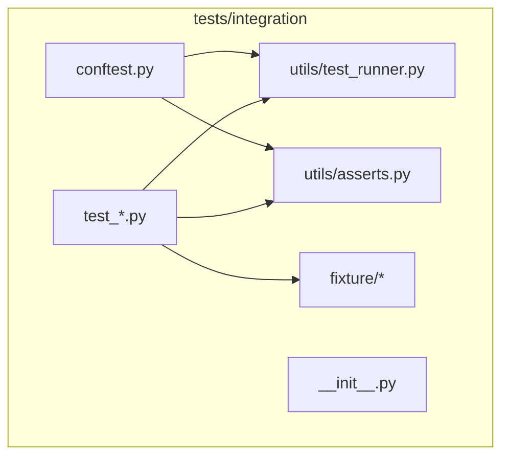
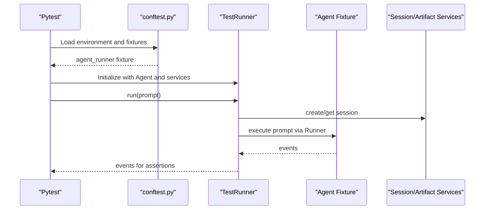
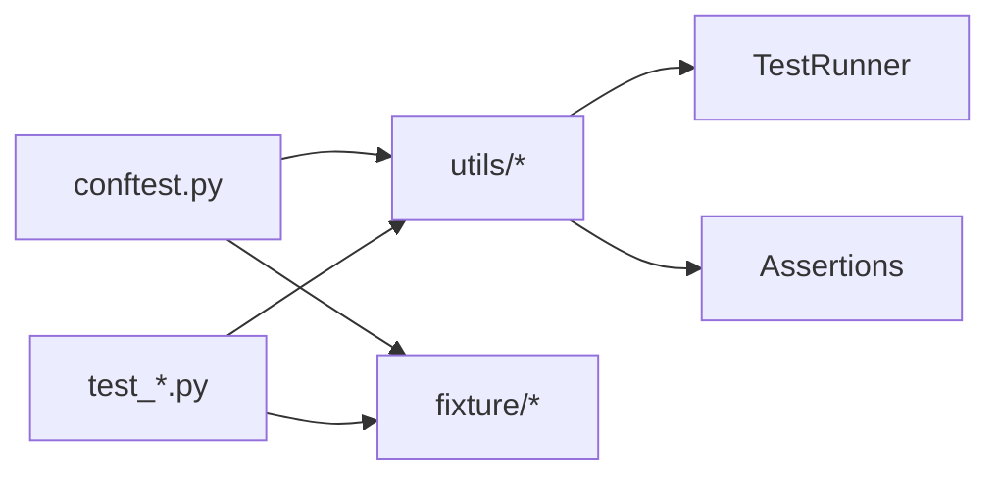

# Integration Testing

<cite>
**Referenced Files in This Document**
- [conftest.py](file://tests/integration/conftest.py)
- [__init__.py](file://tests/integration/__init__.py)
- [test_runner.py](file://tests/integration/utils/test_runner.py)
- [asserts.py](file://tests/integration/utils/asserts.py)
- [test_single_agent.py](file://tests/integration/test_single_agent.py)
- [test_multi_agent.py](file://tests/integration/test_multi_agent.py)
- [test_multi_turn.py](file://tests/integration/test_multi_turn.py)
- [test_tools.py](file://tests/integration/test_tools.py)
- [test_callback.py](file://tests/integration/test_callback.py)
- [test_context_variable.py](file://tests/integration/test_context_variable.py)
- [.env.example](file://tests/integration/.env.example)
- [hello_world_agent/agent.py](file://tests/integration/fixture/hello_world_agent/agent.py)
- [tool_agent/agent.py](file://tests/integration/fixture/tool_agent/agent.py)
- [home_automation_agent/agent.py](file://tests/integration/fixture/home_automation_agent/agent.py)
- [trip_planner_agent/agent.py](file://tests/integration/fixture/trip_planner_agent/agent.py)
</cite>

## Table of Contents
1. [Introduction](#introduction)
2. [Project Structure](#project-structure)
3. [Core Components](#core-components)
4. [Architecture Overview](#architecture-overview)
5. [Detailed Component Analysis](#detailed-component-analysis)
6. [Dependency Analysis](#dependency-analysis)
7. [Performance Considerations](#performance-considerations)
8. [Troubleshooting Guide](#troubleshooting-guide)
9. [Conclusion](#conclusion)
10. [Appendices](#appendices)

## Introduction
This document describes the integration testing suite for the ADK framework. It explains how the test suite validates end-to-end functionality across multiple components, including agents, tools, sessions, artifacts, and external services. It documents the test fixture system, environment setup, configuration management, and testing approaches for multi-agent systems, complex agent flows, tool integrations, and external service interactions. Practical examples illustrate agent orchestration, session persistence, memory management, and tool execution in realistic scenarios. Strategies for authentication flows, error propagation, and failure recovery are covered, along with test data preparation, environment isolation, and cleanup procedures. Finally, it outlines the integration test execution workflow, debugging techniques, and performance considerations for complex test scenarios.

## Project Structure
The integration tests reside under tests/integration and are organized into:
- conftest.py: Global fixtures and environment configuration for integration tests.
- utils/: Shared utilities for running agents and assertions.
- fixture/: Lightweight agent fixtures used by tests.
- Individual test modules: Feature-specific integration tests.

**Diagram sources**
- [conftest.py](file://tests/integration/conftest.py#L1-L120)
- [__init__.py](file://tests/integration/__init__.py#L1-L19)
- [test_runner.py](file://tests/integration/utils/test_runner.py#L1-L98)
- [asserts.py](file://tests/integration/utils/asserts.py#L1-L76)

**Section sources**
- [conftest.py](file://tests/integration/conftest.py#L1-L120)
- [__init__.py](file://tests/integration/__init__.py#L1-L19)

## Core Components
- TestRunner: A lightweight harness that creates a Runner with configurable artifact and session services, manages a test session, and executes prompts to produce events for assertions.
- Assertion helpers: Utilities to assert agent identity, messages, conversation order, and transfer paths.
- Fixtures: Minimal agent modules under tests/integration/fixture that expose a root_agent for testing.
- Environment configuration: Pytest hooks and fixtures to load environment variables, parameterize LLM backends, and inject agent runners into tests.

Key responsibilities:
- Isolation: Uses in-memory artifact and session services by default to avoid external dependencies during tests.
- Determinism: Creates a fixed app name and user id to anchor session creation and retrieval.
- Flexibility: Supports loading agents by module name or by passing an Agent instance directly.

**Section sources**
- [test_runner.py](file://tests/integration/utils/test_runner.py#L29-L98)
- [asserts.py](file://tests/integration/utils/asserts.py#L20-L76)
- [conftest.py](file://tests/integration/conftest.py#L61-L92)

## Architecture Overview
The integration test execution flow connects pytest fixtures, the TestRunner, and agent fixtures to run prompts against agents and validate outputs.

**Diagram sources**
- [conftest.py](file://tests/integration/conftest.py#L61-L92)
- [test_runner.py](file://tests/integration/utils/test_runner.py#L58-L82)

## Detailed Component Analysis

### Test Environment Setup and Configuration Management
- Environment loading: Loads .env for integration tests and warns if required variables are missing. Validates presence of API key and Vertex project/location.
- Backend parameterization: Automatically parametrizes tests to run against GOOGLE_AI or VERTEX backends based on TEST_BACKEND environment variable or explicit marks.
- Fixture injection: Provides agent_runner fixture that accepts either an Agent instance or an agent_name string to dynamically import and run fixtures.

Practical guidance:
- Copy .env.example to .env and set TEST_BACKEND and credentials.
- Use explicit marks to override backend selection for specific tests.

**Section sources**
- [conftest.py](file://tests/integration/conftest.py#L32-L56)
- [conftest.py](file://tests/integration/conftest.py#L94-L120)
- [conftest.py](file://tests/integration/conftest.py#L61-L92)
- [.env.example](file://tests/integration/.env.example#L1-L11)

### Test Runner and Session Management
- Session lifecycle: Creates a session with fixed app_name and user_id, stores current session id, and exposes methods to run prompts and fetch events.
- Artifact and session services: Defaults to in-memory services to keep tests isolated and fast.
- Agent resolution: Determines the current agent name based on the active session and agent graph.

Operational notes:
- New sessions can be created per scenario using new_session.
- Events are retrieved from the current session for assertions.

**Section sources**
- [test_runner.py](file://tests/integration/utils/test_runner.py#L35-L57)
- [test_runner.py](file://tests/integration/utils/test_runner.py#L58-L82)
- [test_runner.py](file://tests/integration/utils/test_runner.py#L87-L98)

### Assertion Utilities
- Current agent assertion: Ensures the active agent name matches expectations.
- Agent message assertion: Finds the last message from a named agent and compares expected text.
- Ordered conversation assertion: Validates a sequence of agent messages in reverse chronological order.
- Transfer path assertion: Validates a reverse-ordered chain of tool function calls representing agent transfers.

Usage patterns:
- Combine ordered assertions with message assertions to validate conversational flows.
- Use transfer path assertions to verify routing decisions in multi-agent setups.

**Section sources**
- [asserts.py](file://tests/integration/utils/asserts.py#L25-L27)
- [asserts.py](file://tests/integration/utils/asserts.py#L29-L35)
- [asserts.py](file://tests/integration/utils/asserts.py#L38-L55)
- [asserts.py](file://tests/integration/utils/asserts.py#L57-L76)

### Single-Agent Evaluation Tests
- Evaluates agent modules using AgentEvaluator with dataset files and a configurable number of runs.
- Demonstrates async evaluation for single and multi-turn scenarios.

Execution notes:
- Modules are referenced by dotted paths pointing to fixture packages.
- Datasets are JSON files under fixture directories.

**Section sources**
- [test_single_agent.py](file://tests/integration/test_single_agent.py#L19-L46)
- [test_multi_turn.py](file://tests/integration/test_multi_turn.py#L19-L47)

### Multi-Agent Evaluation Tests
- Validates multi-turn conversations and sub-agent orchestration using a trip planner fixture composed of multiple specialized agents.
- Uses AgentEvaluator to run datasets and measure agent behavior across turns.

**Section sources**
- [test_multi_agent.py](file://tests/integration/test_multi_agent.py#L19-L28)
- [trip_planner_agent/agent.py](file://tests/integration/fixture/trip_planner_agent/agent.py#L101-L111)

### Tool Integration Tests
- Exercises a broad set of tools including function tools, agent tools, retrieval tools, and third-party tools (Langchain/CrewAI).
- Validates success paths, error propagation, and edge cases such as invalid RAG corpora and non-existent resources.
- Includes tests for repetitive tool calls and schema-based input/output handling.

Testing approach:
- Parametrize agent_runner with specific agent fixtures.
- Build prompts that trigger targeted tool invocations.
- Assert model responses contain expected substrings or that exceptions are raised as intended.

**Section sources**
- [test_tools.py](file://tests/integration/test_tools.py#L26-L131)
- [test_tools.py](file://tests/integration/test_tools.py#L138-L155)
- [test_tools.py](file://tests/integration/test_tools.py#L162-L178)
- [test_tools.py](file://tests/integration/test_tools.py#L185-L220)
- [test_tools.py](file://tests/integration/test_tools.py#L227-L248)
- [tool_agent/agent.py](file://tests/integration/fixture/tool_agent/agent.py#L183-L219)

### Callback and Context Variable Tests
- Callback tests validate pre/post model invocation callbacks and event simplification for assertions.
- Context variable tests validate missing context keys and update flows.

**Section sources**
- [test_callback.py](file://tests/integration/test_callback.py#L23-L71)
- [test_context_variable.py](file://tests/integration/test_context_variable.py#L26-L68)

### Fixture System and Example Agents
- Hello World Agent: Demonstrates tool orchestration, safety settings, and parallel function calls.
- Home Automation Agent: Simulates device control and scheduling with in-memory databases and conversions.
- Trip Planner Agent: Composed sub-agents for identification, gathering, and planning.

These fixtures serve as minimal, deterministic targets for integration tests.

**Section sources**
- [hello_world_agent/agent.py](file://tests/integration/fixture/hello_world_agent/agent.py#L62-L96)
- [home_automation_agent/agent.py](file://tests/integration/fixture/home_automation_agent/agent.py#L286-L305)
- [trip_planner_agent/agent.py](file://tests/integration/fixture/trip_planner_agent/agent.py#L101-L111)

## Dependency Analysis
The integration test suite exhibits clear separation of concerns:
- conftest.py orchestrates environment and fixtures.
- utils provide reusable abstractions (TestRunner, assertions).
- test_* modules depend on fixtures and utilities.
- Fixtures are standalone modules exporting a root_agent.

**Diagram sources**
- [conftest.py](file://tests/integration/conftest.py#L61-L92)
- [test_runner.py](file://tests/integration/utils/test_runner.py#L29-L98)
- [asserts.py](file://tests/integration/utils/asserts.py#L25-L76)

**Section sources**
- [conftest.py](file://tests/integration/conftest.py#L61-L92)
- [test_runner.py](file://tests/integration/utils/test_runner.py#L29-L98)
- [asserts.py](file://tests/integration/utils/asserts.py#L25-L76)

## Performance Considerations
- Prefer in-memory artifact and session services to reduce I/O overhead.
- Limit dataset sizes and num_runs for iterative development; increase for production validation.
- Parameterize backends selectively to avoid redundant runs when only one backend is under test.
- Use targeted fixtures and focused prompts to minimize LLM latency and token usage.

## Troubleshooting Guide
Common issues and resolutions:
- Missing environment variables: Ensure .env is present and populated; the loader warns if GOOGLE_API_KEY, GOOGLE_CLOUD_PROJECT, or GOOGLE_CLOUD_LOCATION are missing.
- Backend mismatch: Set TEST_BACKEND to GOOGLE_AI_ONLY, VERTEX_ONLY, or BOTH; tests can also be marked explicitly to override defaults.
- Tool failures: Some tool tests are currently skipped or expected to fail due to external service constraints; review skip reasons and adjust environment accordingly.
- Assertion mismatches: Use ordered assertions and message checks to pinpoint discrepancies in conversational flows.

Debugging techniques:
- Inspect events returned by TestRunner.run to understand agent behavior.
- Simplify prompts to isolate failing tool calls.
- Temporarily disable backend parameterization to focus on a single backend.

**Section sources**
- [conftest.py](file://tests/integration/conftest.py#L32-L56)
- [conftest.py](file://tests/integration/conftest.py#L94-L120)
- [test_tools.py](file://tests/integration/test_tools.py#L19-L20)
- [test_tools.py](file://tests/integration/test_tools.py#L84-L84)

## Conclusion
The ADK integration test suite provides a robust foundation for validating end-to-end agent behavior across multiple components. Its fixture-driven design, environment-aware configuration, and reusable utilities enable scalable testing of single and multi-agent workflows, tool integrations, and external service interactions. By following the outlined strategies for environment setup, test data preparation, isolation, and debugging, teams can maintain reliable and efficient integration tests.

## Appendices

### Integration Test Execution Workflow
- Prepare environment: Copy .env.example to .env and set TEST_BACKEND and credentials.
- Run tests: Use pytest to execute test modules under tests/integration.
- Observe results: Assertions validate agent behavior, tool execution, and session state.

**Section sources**
- [.env.example](file://tests/integration/.env.example#L1-L11)
- [test_single_agent.py](file://tests/integration/test_single_agent.py#L19-L46)
- [test_multi_agent.py](file://tests/integration/test_multi_agent.py#L19-L28)

### Practical Examples Index
- Agent orchestration: Trip planner multi-agent evaluation.
- Session persistence: TestRunner-managed sessions and event retrieval.
- Memory management: In-memory artifact and session services.
- Tool execution: Function tools, agent tools, retrieval tools, and third-party tools.
- Authentication flows: OAuth-related fixtures and environment variables.
- Error propagation and recovery: Expected exceptions and skip markers.

**Section sources**
- [trip_planner_agent/agent.py](file://tests/integration/fixture/trip_planner_agent/agent.py#L101-L111)
- [test_runner.py](file://tests/integration/utils/test_runner.py#L35-L57)
- [test_tools.py](file://tests/integration/test_tools.py#L138-L155)
- [test_tools.py](file://tests/integration/test_tools.py#L205-L220)
- [conftest.py](file://tests/integration/conftest.py#L40-L54)