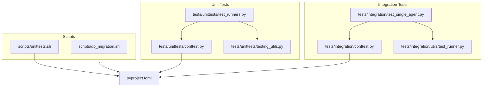
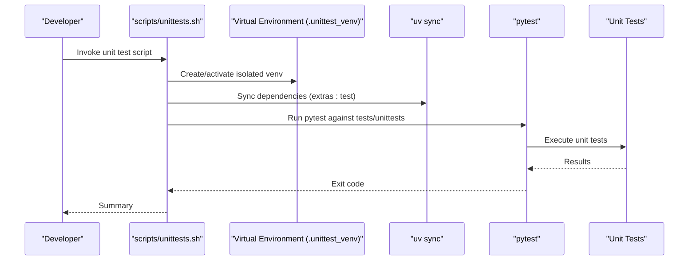
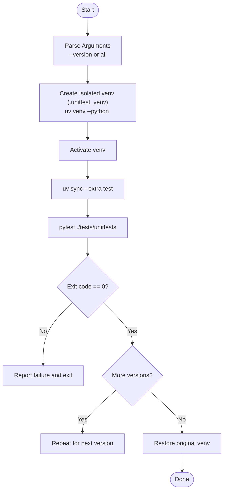
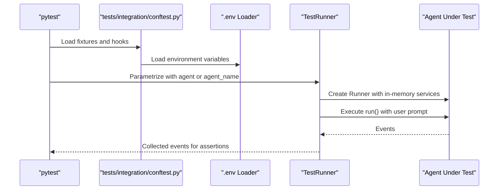
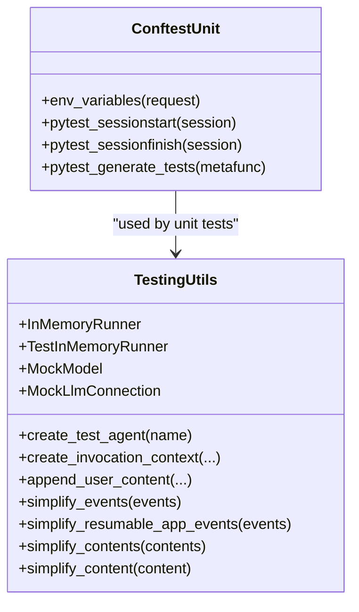
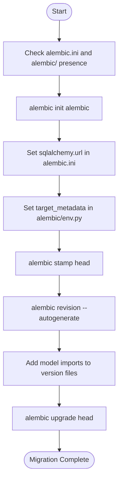
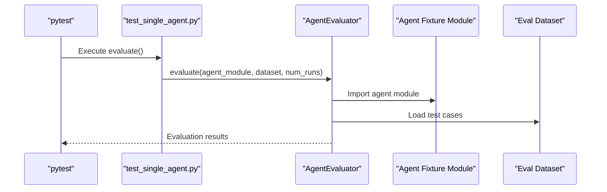
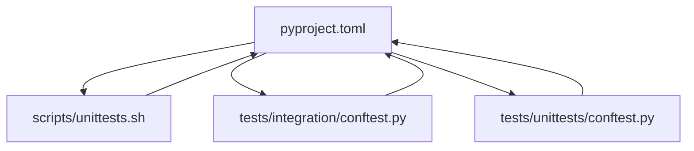

# Test Execution and CI/CD

<cite>
**Referenced Files in This Document**
- [unittests.sh](file://scripts/unittests.sh)
- [db_migration.sh](file://scripts/db_migration.sh)
- [pyproject.toml](file://pyproject.toml)
- [conftest.py (unit tests)](file://tests/unittests/conftest.py)
- [conftest.py (integration tests)](file://tests/integration/conftest.py)
- [testing_utils.py](file://tests/unittests/testing_utils.py)
- [test_runner.py (integration utils)](file://tests/integration/utils/test_runner.py)
- [test_runners.py](file://tests/unittests/test_runners.py)
- [test_single_agent.py](file://tests/integration/test_single_agent.py)
</cite>

## Table of Contents
1. [Introduction](#introduction)
2. [Project Structure](#project-structure)
3. [Core Components](#core-components)
4. [Architecture Overview](#architecture-overview)
5. [Detailed Component Analysis](#detailed-component-analysis)
6. [Dependency Analysis](#dependency-analysis)
7. [Performance Considerations](#performance-considerations)
8. [Troubleshooting Guide](#troubleshooting-guide)
9. [Conclusion](#conclusion)
10. [Appendices](#appendices)

## Introduction
This document explains how the ADK framework executes tests and integrates with continuous integration. It covers automated testing workflows, test execution scripts, CI pipeline configuration, environment setup, dependency management, and test result reporting. It also details unit test execution, database migration testing, integration test orchestration, and practical examples for running tests locally, in CI/CD pipelines, and in development environments. Additional topics include test coverage measurement, performance testing, regression testing strategies, test parallelization, resource management, test environment provisioning, CI/CD integration, automated test deployment, quality gates, troubleshooting, and performance optimization.

## Project Structure
The repository organizes tests into two primary categories:
- Unit tests: Located under tests/unittests, with shared fixtures and utilities.
- Integration tests: Located under tests/integration, with environment-specific fixtures and an agent runner utility.

Key automation and configuration assets:
- scripts/unittests.sh: Bash script to run unit tests across multiple Python versions using isolated virtual environments.
- scripts/db_migration.sh: Bash script to upgrade legacy session databases to the current schema using Alembic.
- pyproject.toml: Central configuration for dependencies, optional test extras, and pytest settings.

**Diagram sources**
- [unittests.sh](file://scripts/unittests.sh#L1-L119)
- [db_migration.sh](file://scripts/db_migration.sh#L1-L144)
- [pyproject.toml](file://pyproject.toml#L215-L228)
- [conftest.py (unit tests)](file://tests/unittests/conftest.py#L1-L104)
- [conftest.py (integration tests)](file://tests/integration/conftest.py#L1-L120)
- [testing_utils.py](file://tests/unittests/testing_utils.py#L1-L420)
- [test_runner.py (integration utils)](file://tests/integration/utils/test_runner.py#L1-L98)
- [test_runners.py](file://tests/unittests/test_runners.py#L1-L800)
- [test_single_agent.py](file://tests/integration/test_single_agent.py#L1-L46)

**Section sources**
- [unittests.sh](file://scripts/unittests.sh#L1-L119)
- [db_migration.sh](file://scripts/db_migration.sh#L1-L144)
- [pyproject.toml](file://pyproject.toml#L215-L228)

## Core Components
- Unit test execution script: scripts/unittests.sh orchestrates environment isolation, dependency synchronization, and pytest invocation across multiple Python versions.
- Integration test fixtures: tests/integration/conftest.py loads environment variables from a .env file and parametrizes tests for different LLM backends.
- Unit test fixtures: tests/unittests/conftest.py sets environment variables globally for unit tests and parametrizes tests across different backend configurations.
- Integration test runner: tests/integration/utils/test_runner.py provides a simple interface to run agents and collect events for assertions.
- Shared unit test utilities: tests/unittests/testing_utils.py offers helpers to construct agents, invocation contexts, and mock LLMs for deterministic testing.
- Evaluation integration tests: tests/integration/test_single_agent.py demonstrates agent evaluation via AgentEvaluator.

**Section sources**
- [unittests.sh](file://scripts/unittests.sh#L1-L119)
- [conftest.py (unit tests)](file://tests/unittests/conftest.py#L1-L104)
- [conftest.py (integration tests)](file://tests/integration/conftest.py#L1-L120)
- [test_runner.py (integration utils)](file://tests/integration/utils/test_runner.py#L1-L98)
- [testing_utils.py](file://tests/unittests/testing_utils.py#L1-L420)
- [test_single_agent.py](file://tests/integration/test_single_agent.py#L1-L46)

## Architecture Overview
The testing architecture separates concerns between unit and integration tests, with environment fixtures and utilities enabling deterministic and reproducible runs. The unit test script creates isolated virtual environments per Python version, ensuring consistent dependency resolution and avoiding conflicts. Integration tests rely on environment variables and optional .env configuration to target different LLM backends.

**Diagram sources**
- [unittests.sh](file://scripts/unittests.sh#L75-L111)
- [pyproject.toml](file://pyproject.toml#L121-L142)

## Detailed Component Analysis

### Unit Test Execution Script
The unit test script automates running tests across multiple Python versions with isolated virtual environments. It validates arguments, cleans up temporary environments, and reports failures per version. It uses uv to create and manage virtual environments and synchronize dependencies from the test extras.

**Diagram sources**
- [unittests.sh](file://scripts/unittests.sh#L27-L119)
- [pyproject.toml](file://pyproject.toml#L121-L142)

**Section sources**
- [unittests.sh](file://scripts/unittests.sh#L1-L119)
- [pyproject.toml](file://pyproject.toml#L121-L142)

### Integration Test Orchestration
Integration tests use a centralized conftest to load environment variables from a .env file and parametrize tests for different LLM backends. The TestRunner utility simplifies running agents and retrieving events for assertions.

**Diagram sources**
- [conftest.py (integration tests)](file://tests/integration/conftest.py#L32-L120)
- [test_runner.py (integration utils)](file://tests/integration/utils/test_runner.py#L29-L98)

**Section sources**
- [conftest.py (integration tests)](file://tests/integration/conftest.py#L1-L120)
- [test_runner.py (integration utils)](file://tests/integration/utils/test_runner.py#L1-L98)

### Unit Test Fixtures and Utilities
Unit test fixtures set environment variables globally and parametrize tests across backend configurations. Utilities provide helpers to create agents, invocation contexts, and mock LLMs for deterministic testing.

**Diagram sources**
- [conftest.py (unit tests)](file://tests/unittests/conftest.py#L1-L104)
- [testing_utils.py](file://tests/unittests/testing_utils.py#L1-L420)

**Section sources**
- [conftest.py (unit tests)](file://tests/unittests/conftest.py#L1-L104)
- [testing_utils.py](file://tests/unittests/testing_utils.py#L1-L420)

### Database Migration Testing
The database migration script initializes Alembic, configures the SQLAlchemy URL and target metadata, stamps the head, autogenerates revisions, adds model imports to version files, and upgrades to the latest revision. It is intended for upgrading legacy session databases to the current schema.

**Diagram sources**
- [db_migration.sh](file://scripts/db_migration.sh#L42-L144)

**Section sources**
- [db_migration.sh](file://scripts/db_migration.sh#L1-L144)

### Integration Test Evaluation Workflow
Integration tests demonstrate agent evaluation using AgentEvaluator with synchronous and asynchronous agent modules and JSON datasets.

**Diagram sources**
- [test_single_agent.py](file://tests/integration/test_single_agent.py#L19-L46)

**Section sources**
- [test_single_agent.py](file://tests/integration/test_single_agent.py#L1-L46)

## Dependency Analysis
The testing stack relies on pytest, optional extras, and environment configuration. The unit test script uses uv to manage virtual environments and synchronize dependencies from the test extras. Integration tests depend on environment variables and optional .env configuration.

**Diagram sources**
- [pyproject.toml](file://pyproject.toml#L121-L142)
- [unittests.sh](file://scripts/unittests.sh#L97-L98)
- [conftest.py (integration tests)](file://tests/integration/conftest.py#L32-L56)
- [conftest.py (unit tests)](file://tests/unittests/conftest.py#L22-L27)

**Section sources**
- [pyproject.toml](file://pyproject.toml#L121-L142)
- [unittests.sh](file://scripts/unittests.sh#L97-L98)
- [conftest.py (integration tests)](file://tests/integration/conftest.py#L32-L56)
- [conftest.py (unit tests)](file://tests/unittests/conftest.py#L22-L27)

## Performance Considerations
- Parallelization: The test extras include pytest-xdist, enabling parallel test execution to reduce total runtime. Configure workers via pytest options or CI matrix jobs.
- Resource isolation: The unit test script creates isolated virtual environments per Python version to prevent dependency conflicts and improve determinism.
- Deterministic mocks: Unit test utilities provide mock LLMs and in-memory services to avoid external I/O and stabilize performance during repeated runs.
- Backend parametrization: Integration tests can run against multiple backends; use environment variables to limit scope in CI for faster feedback.

[No sources needed since this section provides general guidance]

## Troubleshooting Guide
Common issues and resolutions:
- Missing environment variables for integration tests:
  - Ensure a .env file exists and defines required variables (e.g., API keys and cloud project/location). The integration conftest warns when variables are missing.
- Python version mismatch:
  - The unit test script validates supported versions and fails early if an invalid version is supplied. Use supported versions listed in the script.
- Alembic initialization conflicts:
  - The migration script checks for existing alembic files and aborts if present. Remove alembic.ini and alembic/ before running the script.
- Dependency conflicts in unit tests:
  - The unit test script clears and recreates the isolated venv per version. Re-run the script to refresh dependencies.
- Integration test backend selection:
  - Control backend parametrization via TEST_BACKEND environment variable. Acceptable values include GOOGLE_AI_ONLY, VERTEX_ONLY, and BOTH.

**Section sources**
- [conftest.py (integration tests)](file://tests/integration/conftest.py#L32-L56)
- [unittests.sh](file://scripts/unittests.sh#L27-L49)
- [db_migration.sh](file://scripts/db_migration.sh#L42-L47)

## Conclusion
The ADK framework provides robust testing infrastructure with isolated unit test execution, environment-aware integration tests, and database migration utilities. By leveraging the provided scripts and fixtures, teams can reliably execute tests locally, in CI/CD pipelines, and in development environments while maintaining deterministic behavior and efficient resource utilization.

[No sources needed since this section summarizes without analyzing specific files]

## Appendices

### Practical Examples

- Running unit tests locally:
  - Execute the unit test script to run tests across all supported Python versions with isolated environments.
  - Example invocation: scripts/unittests.sh
  - Limit to a specific version: scripts/unittests.sh --version 3.12

- Running integration tests locally:
  - Prepare a .env file with required environment variables.
  - Execute pytest against tests/integration to run parametrized integration tests.

- Running integration tests in CI/CD:
  - Configure CI to install dependencies from the test extras and run pytest with xdist for parallelization.
  - Use environment variables to select backend(s) for integration tests.

- Database migration:
  - Use the migration script to upgrade legacy session databases to the current schema.
  - Provide the SQLAlchemy URL and model import path as arguments.

**Section sources**
- [unittests.sh](file://scripts/unittests.sh#L17-L19)
- [db_migration.sh](file://scripts/db_migration.sh#L7-L11)
- [pyproject.toml](file://pyproject.toml#L121-L142)

### Test Coverage Measurement
- Recommended approach: Integrate pytest-cov to measure coverage during unit and integration test runs. Configure coverage thresholds and reporting in CI pipelines to enforce quality gates.

[No sources needed since this section provides general guidance]

### Performance Testing and Regression Testing Strategies
- Performance testing:
  - Use pytest markers to categorize tests and run subsets for performance-sensitive areas.
  - Employ deterministic mocks and in-memory services to minimize variability.
- Regression testing:
  - Maintain a dedicated regression test suite and run it on pull requests targeting stability.
  - Use evaluation datasets and AgentEvaluator to validate agent behavior over time.

[No sources needed since this section provides general guidance]

### Test Parallelization, Resource Management, and Provisioning
- Parallelization:
  - Enable pytest-xdist via the test extras to distribute tests across CPU cores.
- Resource management:
  - Use isolated virtual environments per Python version to avoid cross-contamination.
  - Prefer in-memory services and mocks to reduce external resource usage.
- Provisioning:
  - For integration tests requiring external resources, provision containers or services via docker-compose or similar orchestration tools.

[No sources needed since this section provides general guidance]

### CI/CD Integration, Automated Deployment, and Quality Gates
- CI/CD integration:
  - Configure CI to run unit tests across multiple Python versions using the unit test script.
  - Run integration tests with backend selection controlled by environment variables.
- Automated deployment:
  - Use CI to publish packages after successful test runs and coverage thresholds.
- Quality gates:
  - Enforce minimum coverage, pass/fail thresholds, and backend-specific test matrices as required.

[No sources needed since this section provides general guidance]