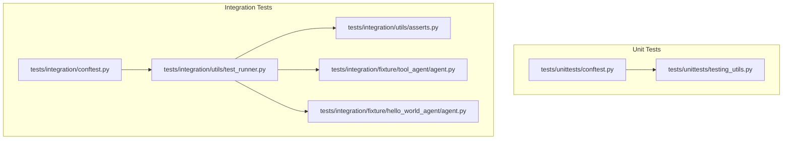
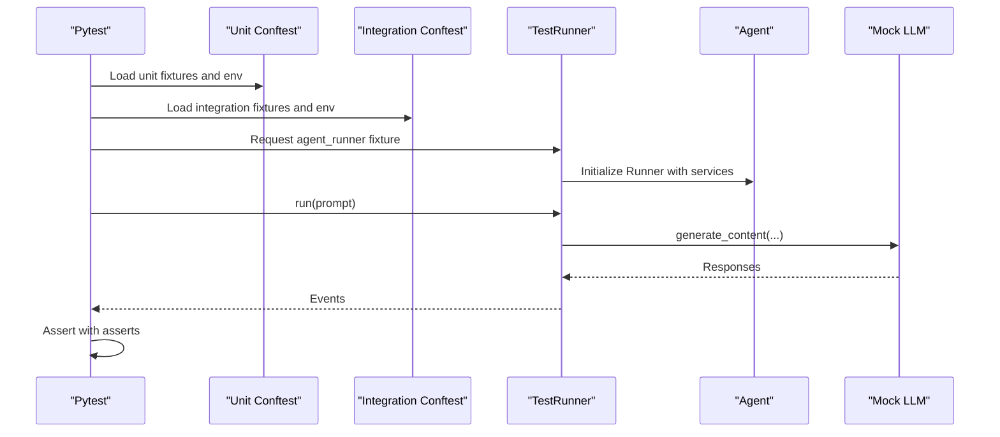
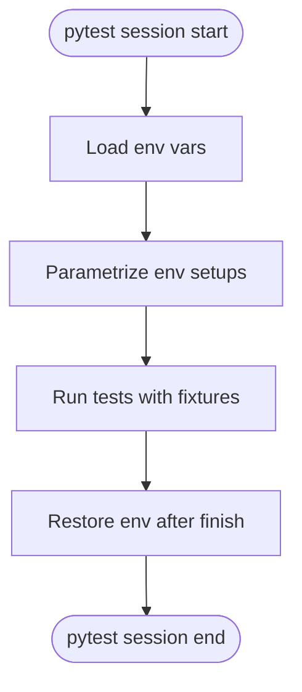
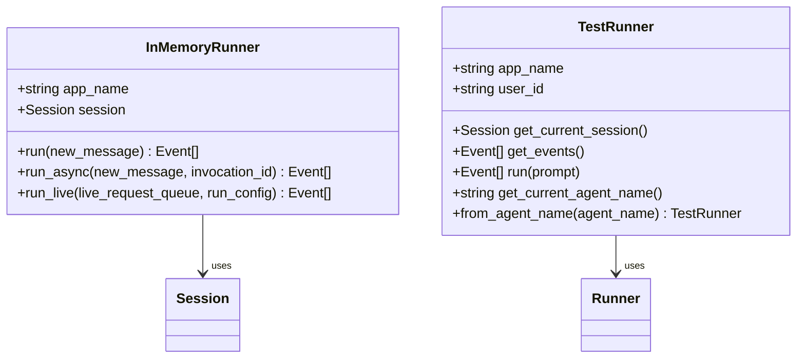
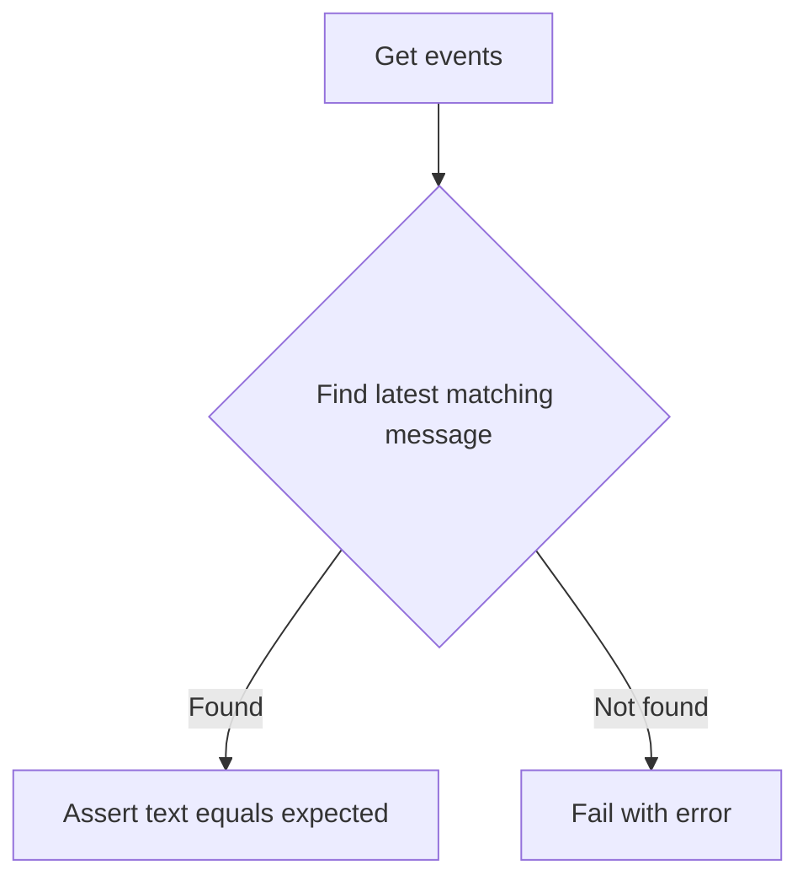
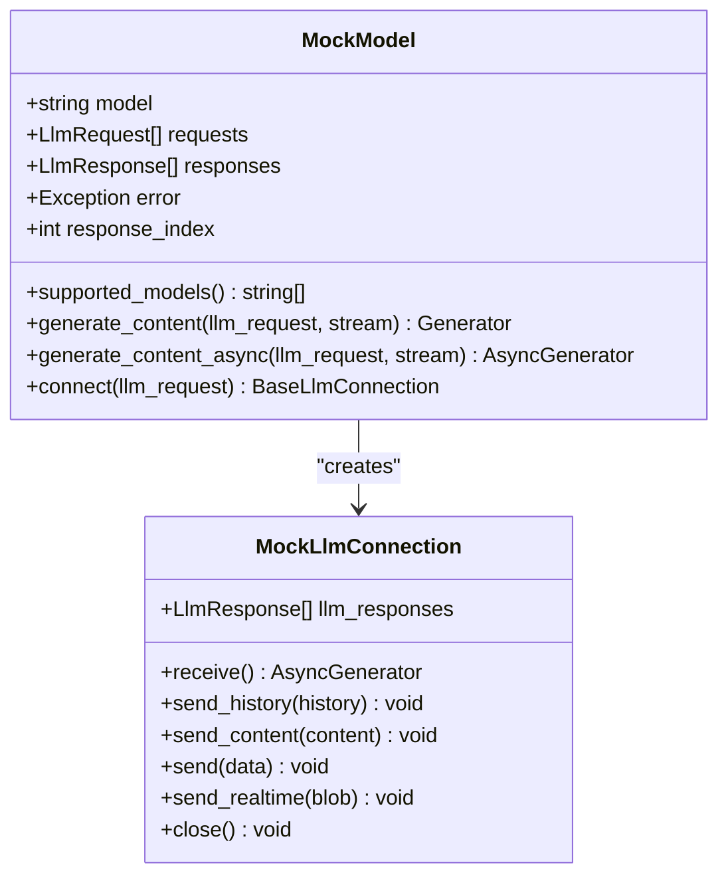
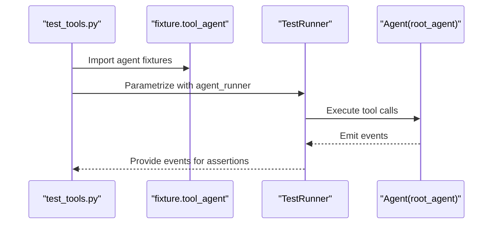
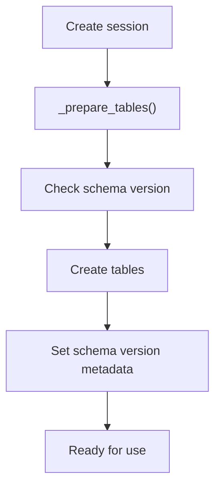
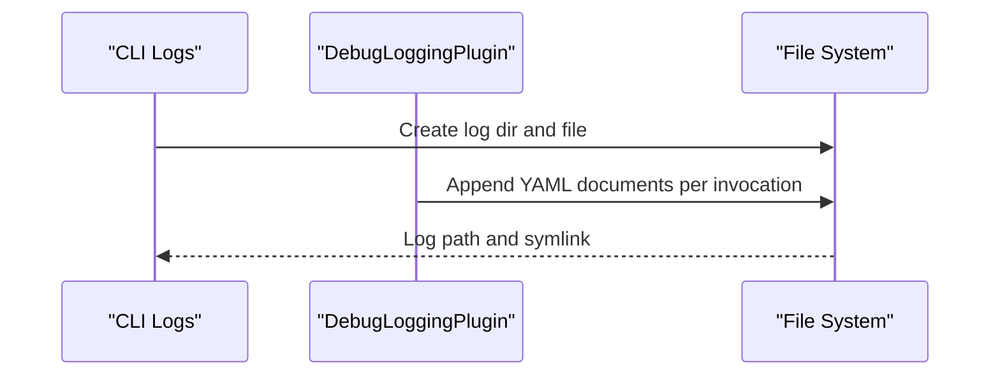
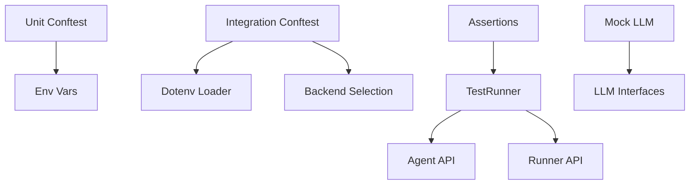

# Test Utilities and Helpers

<cite>
**Referenced Files in This Document**
- [conftest.py](file://tests/unittests/conftest.py)
- [conftest.py](file://tests/integration/conftest.py)
- [testing_utils.py](file://tests/unittests/testing_utils.py)
- [test_runner.py](file://tests/integration/utils/test_runner.py)
- [asserts.py](file://tests/integration/utils/asserts.py)
- [test_tools.py](file://tests/integration/test_tools.py)
- [agent.py](file://tests/integration/fixture/tool_agent/agent.py)
- [agent.py](file://tests/integration/fixture/hello_world_agent/agent.py)
- [test_session_service.py](file://tests/unittests/sessions/test_session_service.py)
- [database_session_service.py](file://src/google/adk/sessions/database_session_service.py)
- [logs.py](file://src/google/adk/cli/utils/logs.py)
- [test_debug_logging_plugin.py](file://tests/unittests/plugins/test_debug_logging_plugin.py)
- [_generate_markdown_utils.py](file://src/google/adk/cli/conformance/_generate_markdown_utils.py)
</cite>

## Table of Contents
1. [Introduction](#introduction)
2. [Project Structure](#project-structure)
3. [Core Components](#core-components)
4. [Architecture Overview](#architecture-overview)
5. [Detailed Component Analysis](#detailed-component-analysis)
6. [Dependency Analysis](#dependency-analysis)
7. [Performance Considerations](#performance-considerations)
8. [Troubleshooting Guide](#troubleshooting-guide)
9. [Conclusion](#conclusion)
10. [Appendices](#appendices)

## Introduction
This document describes the comprehensive test utilities and helper functions in the ADK framework. It covers:
- Test runner helpers for agents and tools
- Assertion utilities for integration tests
- Mock factories for LLMs and external dependencies
- Test configuration system and fixture management
- Environment setup utilities for unit and integration tests
- Testing patterns for agents, tools, and complex workflows
- Practical examples for agent testing, tool validation, and integration testing
- Mocking strategies for external dependencies, test database setup, and cleanup
- Reporting, logging, and debugging utilities
- Best practices for test organization, reusable components, and maintenance

## Project Structure
The testing infrastructure is organized into:
- Unit tests with pytest fixtures and utilities
- Integration tests with fixtures, runners, and assertions
- Shared utilities for mocking, simplification, and session management

**Diagram sources**
- [conftest.py](file://tests/unittests/conftest.py#L1-L104)
- [testing_utils.py](file://tests/unittests/testing_utils.py#L1-L420)
- [conftest.py](file://tests/integration/conftest.py#L1-L120)
- [test_runner.py](file://tests/integration/utils/test_runner.py#L1-L98)
- [asserts.py](file://tests/integration/utils/asserts.py#L1-L76)
- [agent.py](file://tests/integration/fixture/tool_agent/agent.py#L1-L219)
- [agent.py](file://tests/integration/fixture/hello_world_agent/agent.py#L1-L96)

**Section sources**
- [conftest.py](file://tests/unittests/conftest.py#L1-L104)
- [conftest.py](file://tests/integration/conftest.py#L1-L120)

## Core Components
- Test configuration and environment fixtures:
  - Unit tests: environment variable setup and automatic parameterization across environments
  - Integration tests: agent runner fixture, backend selection, and environment loading
- Test runner helpers:
  - In-memory runner for synchronous and asynchronous runs
  - Integration TestRunner for end-to-end agent interactions
- Assertion utilities:
  - Assertions for agent messages, current agent, and transfer paths
- Mock factories:
  - Mock LLM model and connection for deterministic testing
  - Simplification utilities for content and events
- Test data generators:
  - Test fixtures for tools and agents
- Logging and reporting:
  - CLI logging utilities and conformance report generation

**Section sources**
- [conftest.py](file://tests/unittests/conftest.py#L22-L56)
- [conftest.py](file://tests/integration/conftest.py#L32-L56)
- [testing_utils.py](file://tests/unittests/testing_utils.py#L47-L105)
- [testing_utils.py](file://tests/unittests/testing_utils.py#L182-L212)
- [testing_utils.py](file://tests/unittests/testing_utils.py#L214-L316)
- [testing_utils.py](file://tests/unittests/testing_utils.py#L318-L420)
- [test_runner.py](file://tests/integration/utils/test_runner.py#L29-L98)
- [asserts.py](file://tests/integration/utils/asserts.py#L20-L76)
- [agent.py](file://tests/integration/fixture/tool_agent/agent.py#L29-L219)
- [agent.py](file://tests/integration/fixture/hello_world_agent/agent.py#L22-L96)
- [logs.py](file://src/google/adk/cli/utils/logs.py#L83-L105)
- [_generate_markdown_utils.py](file://src/google/adk/cli/conformance/_generate_markdown_utils.py#L39-L78)

## Architecture Overview
The testing architecture separates concerns across layers:
- Environment and fixtures: configure backend and environment per test session
- Runners: encapsulate agent execution and session lifecycle
- Assertions: validate agent behavior and transitions
- Mocks: isolate external systems and enable deterministic tests
- Reporting: produce structured logs and conformance reports

**Diagram sources**
- [conftest.py](file://tests/unittests/conftest.py#L63-L85)
- [conftest.py](file://tests/integration/conftest.py#L61-L92)
- [test_runner.py](file://tests/integration/utils/test_runner.py#L58-L75)
- [testing_utils.py](file://tests/unittests/testing_utils.py#L318-L390)
- [asserts.py](file://tests/integration/utils/asserts.py#L25-L55)

## Detailed Component Analysis

### Test Configuration System and Fixtures
- Unit test environment:
  - Centralized environment setup with automatic restoration
  - Parameterization across multiple backend configurations
- Integration test environment:
  - Automatic backend selection and environment loading from .env
  - Agent runner fixture supporting both agent instances and agent names

**Diagram sources**
- [conftest.py](file://tests/unittests/conftest.py#L63-L85)
- [conftest.py](file://tests/unittests/conftest.py#L88-L96)
- [conftest.py](file://tests/integration/conftest.py#L94-L112)

**Section sources**
- [conftest.py](file://tests/unittests/conftest.py#L22-L56)
- [conftest.py](file://tests/unittests/conftest.py#L63-L85)
- [conftest.py](file://tests/unittests/conftest.py#L88-L104)
- [conftest.py](file://tests/integration/conftest.py#L32-L56)
- [conftest.py](file://tests/integration/conftest.py#L61-L92)
- [conftest.py](file://tests/integration/conftest.py#L94-L120)

### Test Runner Helpers
- In-memory runner (unit tests):
  - Synchronous and asynchronous run methods
  - Live request queue support
  - Simplified session creation and event collection
- Integration TestRunner:
  - Creates sessions and executes prompts
  - Retrieves current agent name and events
  - Loads agents by name from fixtures

**Diagram sources**
- [testing_utils.py](file://tests/unittests/testing_utils.py#L214-L316)
- [test_runner.py](file://tests/integration/utils/test_runner.py#L29-L98)

**Section sources**
- [testing_utils.py](file://tests/unittests/testing_utils.py#L214-L316)
- [test_runner.py](file://tests/integration/utils/test_runner.py#L29-L98)

### Assertion Utilities
- Assertions for integration tests:
  - Current agent validation
  - Agent message validation
  - Conversation order validation
  - Transfer path validation for agent handoffs

**Diagram sources**
- [asserts.py](file://tests/integration/utils/asserts.py#L25-L55)

**Section sources**
- [asserts.py](file://tests/integration/utils/asserts.py#L20-L76)

### Mock Factories and Test Data Generators
- Mock LLM model and connection:
  - Deterministic responses and request tracking
  - Support for sync and async generations
  - Connection lifecycle management
- Simplification utilities:
  - Content simplification for assertions
  - Event simplification for resumability comparisons
- Test fixtures:
  - Tool agent with diverse functions and retrievals
  - Hello world agent with tool usage patterns

**Diagram sources**
- [testing_utils.py](file://tests/unittests/testing_utils.py#L318-L420)

**Section sources**
- [testing_utils.py](file://tests/unittests/testing_utils.py#L318-L420)
- [agent.py](file://tests/integration/fixture/tool_agent/agent.py#L29-L219)
- [agent.py](file://tests/integration/fixture/hello_world_agent/agent.py#L22-L96)

### Testing Patterns for Agents, Tools, and Workflows
- Parameterized test scenarios:
  - Backend selection (GOOGLE_AI vs VERTEX)
  - Environment setups (WIP features, API keys)
- Agent tool validation:
  - Single and multiple function calls
  - Error propagation and handling
  - Agent tool composition and schema enforcement
- Workflow validation:
  - Tool retrieval and RAG flows
  - Multi-turn conversations and state persistence

**Diagram sources**
- [test_tools.py](file://tests/integration/test_tools.py#L26-L160)
- [agent.py](file://tests/integration/fixture/tool_agent/agent.py#L183-L219)
- [test_runner.py](file://tests/integration/utils/test_runner.py#L58-L75)

**Section sources**
- [test_tools.py](file://tests/integration/test_tools.py#L26-L200)
- [agent.py](file://tests/integration/fixture/tool_agent/agent.py#L29-L219)

### Environment Setup Utilities
- Unit tests:
  - Centralized environment variables and restoration
  - Automatic parameterization across setups
- Integration tests:
  - .env loading with warnings for missing variables
  - Backend selection via environment variable

**Section sources**
- [conftest.py](file://tests/unittests/conftest.py#L22-L56)
- [conftest.py](file://tests/unittests/conftest.py#L63-L85)
- [conftest.py](file://tests/integration/conftest.py#L32-L56)
- [conftest.py](file://tests/integration/conftest.py#L75-L92)

### Mocking Strategies for External Dependencies
- LLM mocking:
  - MockModel generates predefined responses
  - Tracks requests and supports error injection
- Tool mocking:
  - Agent simulator strategies for tool spec-based mocking
  - Stateful parameter management and environment data integration

**Section sources**
- [testing_utils.py](file://tests/unittests/testing_utils.py#L318-L420)
- [test_agent_simulator_engine.py](file://tests/unittests/tools/agent_simulator/test_agent_simulator_engine.py#L162-L196)
- [tool_spec_mock_strategy.py](file://src/google/adk/tools/agent_simulator/strategies/tool_spec_mock_strategy.py#L35-L65)

### Test Database Setup and Cleanup
- Database session service:
  - Lazy table preparation with schema version checks
  - Rollback-on-exception sessions for cleanup
  - Locking to prevent race conditions during setup
- Unit test verification:
  - Spy sessions to validate rollback behavior on failures
  - Recovery after failures and health checks

**Diagram sources**
- [database_session_service.py](file://src/google/adk/sessions/database_session_service.py#L255-L303)

**Section sources**
- [database_session_service.py](file://src/google/adk/sessions/database_session_service.py#L255-L303)
- [test_session_service.py](file://tests/unittests/sessions/test_session_service.py#L1044-L1084)

### Reporting, Logging, and Debugging Utilities
- Logging:
  - CLI logging setup to file with timestamped filenames
  - Configurable log level and formatter
- Debug logging plugin:
  - Captures invocation, tool, and event entries
  - Writes YAML documents per invocation with optional session state
- Conformance reporting:
  - Generates Markdown reports summarizing test results

**Diagram sources**
- [logs.py](file://src/google/adk/cli/utils/logs.py#L83-L105)
- [test_debug_logging_plugin.py](file://tests/unittests/plugins/test_debug_logging_plugin.py#L87-L110)
- [_generate_markdown_utils.py](file://src/google/adk/cli/conformance/_generate_markdown_utils.py#L39-L78)

**Section sources**
- [logs.py](file://src/google/adk/cli/utils/logs.py#L83-L105)
- [test_debug_logging_plugin.py](file://tests/unittests/plugins/test_debug_logging_plugin.py#L112-L441)
- [_generate_markdown_utils.py](file://src/google/adk/cli/conformance/_generate_markdown_utils.py#L39-L78)

## Dependency Analysis
Key dependencies among test utilities:
- Unit conftest depends on environment variables and pytest hooks
- Integration conftest depends on dotenv loading and backend selection
- Test runners depend on agent and runner APIs
- Assertions depend on TestRunner and event structures
- Mock factories depend on LLM interfaces and content types

**Diagram sources**
- [conftest.py](file://tests/unittests/conftest.py#L22-L56)
- [conftest.py](file://tests/integration/conftest.py#L32-L56)
- [test_runner.py](file://tests/integration/utils/test_runner.py#L29-L98)
- [asserts.py](file://tests/integration/utils/asserts.py#L25-L55)
- [testing_utils.py](file://tests/unittests/testing_utils.py#L318-L390)

**Section sources**
- [conftest.py](file://tests/unittests/conftest.py#L22-L56)
- [conftest.py](file://tests/integration/conftest.py#L32-L56)
- [test_runner.py](file://tests/integration/utils/test_runner.py#L29-L98)
- [asserts.py](file://tests/integration/utils/asserts.py#L25-L55)
- [testing_utils.py](file://tests/unittests/testing_utils.py#L318-L390)

## Performance Considerations
- Prefer in-memory services for unit tests to avoid network overhead
- Use deterministic mocks to reduce flakiness and speed up tests
- Limit session creation and reuse runners where possible
- Avoid excessive file I/O in tests; use logging utilities for diagnostics

## Troubleshooting Guide
- Missing environment variables:
  - Integration tests warn when GOOGLE_API_KEY or cloud project/location are missing
- Backend selection issues:
  - Ensure TEST_BACKEND is set correctly (GOOGLE_AI_ONLY, VERTEX_ONLY, BOTH)
- Session setup failures:
  - Verify database schema version and table creation logic
  - Confirm rollback behavior on exceptions
- Debugging invocations:
  - Use DebugLoggingPlugin to capture detailed traces in YAML format

**Section sources**
- [conftest.py](file://tests/integration/conftest.py#L32-L56)
- [conftest.py](file://tests/integration/conftest.py#L94-L112)
- [database_session_service.py](file://src/google/adk/sessions/database_session_service.py#L255-L303)
- [test_session_service.py](file://tests/unittests/sessions/test_session_service.py#L1044-L1084)
- [test_debug_logging_plugin.py](file://tests/unittests/plugins/test_debug_logging_plugin.py#L379-L441)

## Conclusion
The ADK testing utilities provide a robust foundation for unit and integration testing:
- Flexible environment fixtures and parameterization
- Comprehensive runner helpers and assertions
- Strong mocking capabilities for LLMs and external dependencies
- Structured logging and reporting for observability
Adopting these utilities ensures reliable, maintainable, and efficient tests across agents, tools, and complex workflows.

## Appendices
- Best practices:
  - Keep fixtures minimal and focused
  - Use deterministic mocks and controlled randomness
  - Separate unit and integration tests by scope
  - Maintain clear separation between setup, execution, and assertions
  - Use logging and debug plugins for post-mortem analysis