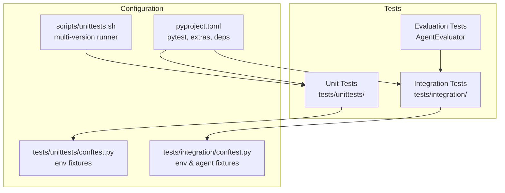
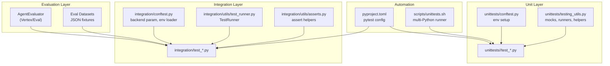
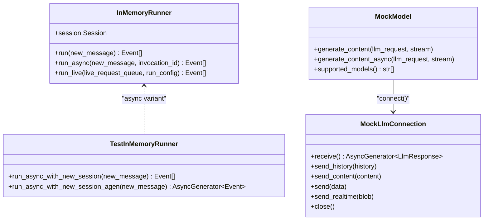
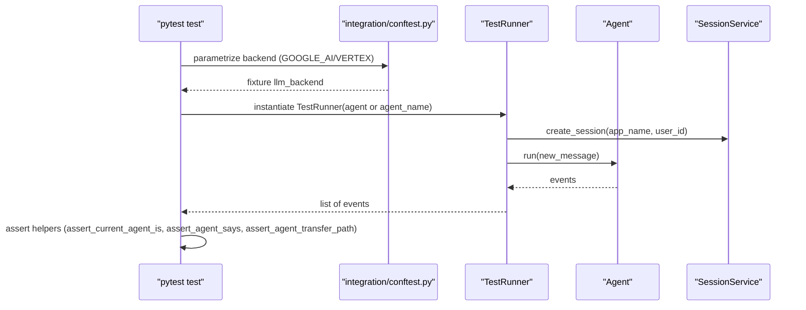
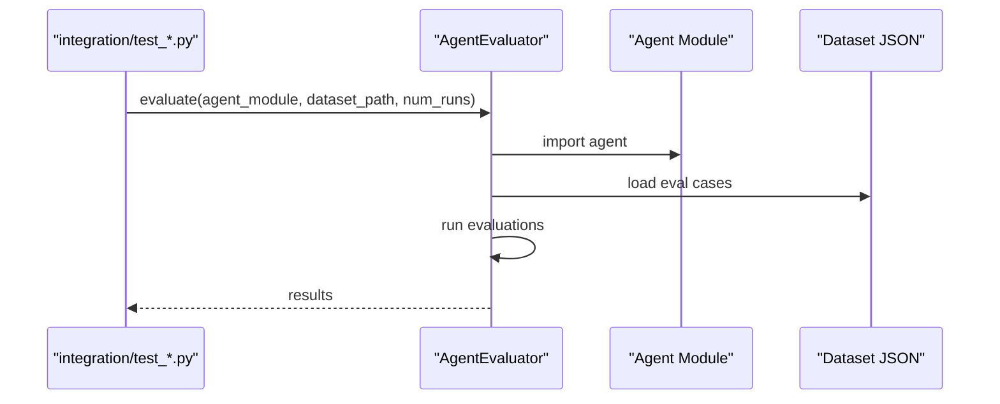
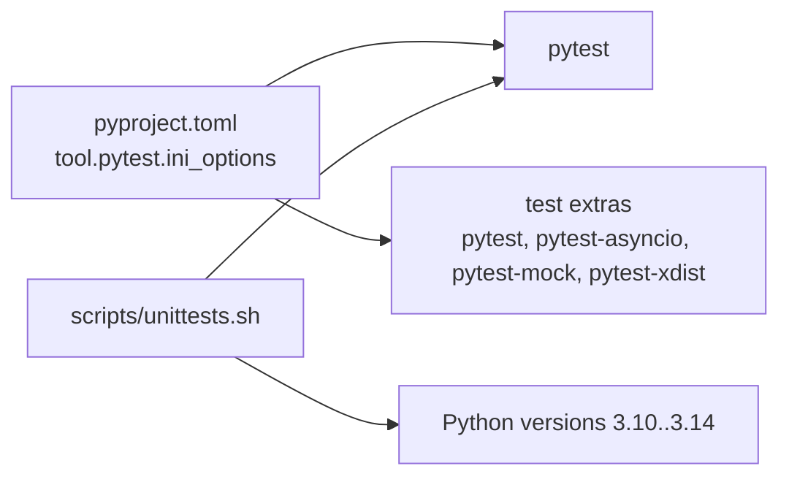

# Testing and Quality Assurance

<cite>
**Referenced Files in This Document**
- [pyproject.toml](file://pyproject.toml)
- [CONTRIBUTING.md](file://CONTRIBUTING.md)
- [scripts/unittests.sh](file://scripts/unittests.sh)
- [tests/unittests/conftest.py](file://tests/unittests/conftest.py)
- [tests/unittests/testing_utils.py](file://tests/unittests/testing_utils.py)
- [tests/unittests/tools/test_function_tool.py](file://tests/unittests/tools/test_function_tool.py)
- [tests/integration/conftest.py](file://tests/integration/conftest.py)
- [tests/integration/utils/test_runner.py](file://tests/integration/utils/test_runner.py)
- [tests/integration/utils/asserts.py](file://tests/integration/utils/asserts.py)
- [tests/integration/test_single_agent.py](file://tests/integration/test_single_agent.py)
- [src/google/adk/evaluation/__init__.py](file://src/google/adk/evaluation/__init__.py)
</cite>

## Table of Contents
1. [Introduction](#introduction)
2. [Project Structure](#project-structure)
3. [Core Components](#core-components)
4. [Architecture Overview](#architecture-overview)
5. [Detailed Component Analysis](#detailed-component-analysis)
6. [Dependency Analysis](#dependency-analysis)
7. [Performance Considerations](#performance-considerations)
8. [Troubleshooting Guide](#troubleshooting-guide)
9. [Conclusion](#conclusion)
10. [Appendices](#appendices)

## Introduction
This document describes the testing and quality assurance framework for the Agent Development Kit (ADK). It explains the testing architecture across unit, integration, and evaluation categories, details test utilities and helpers for agent and tool testing, outlines continuous integration and automated workflows, and covers configuration, mocking strategies, and test data management. Practical examples demonstrate how to write effective tests for agents and tools, and guidance is provided for performance, load, and regression testing approaches, along with best practices for organization, maintenance, and reporting.

## Project Structure
The repository organizes tests by category:
- Unit tests: Comprehensive coverage of core modules under tests/unittests/. They are designed to be fast, isolated, and free of external dependencies by using mocks and fixtures.
- Integration tests: Validate end-to-end flows using real agents and services under tests/integration/. These tests rely on environment configuration and fixtures.
- Evaluation tests: Use the AgentEvaluator to run evaluation datasets against agents, often as part of integration tests.

Key configuration and automation:
- pytest configuration and extras are defined in pyproject.toml.
- A dedicated script automates unit test execution across multiple Python versions.
- Environment setup and fixtures are centralized in per-category conftest.py files.

**Diagram sources**
- [pyproject.toml](file://pyproject.toml#L215-L228)
- [scripts/unittests.sh](file://scripts/unittests.sh#L1-L119)
- [tests/unittests/conftest.py](file://tests/unittests/conftest.py#L1-L104)
- [tests/integration/conftest.py](file://tests/integration/conftest.py#L1-L120)

**Section sources**
- [pyproject.toml](file://pyproject.toml#L215-L228)
- [CONTRIBUTING.md](file://CONTRIBUTING.md#L79-L124)
- [scripts/unittests.sh](file://scripts/unittests.sh#L1-L119)

## Core Components
- Unit test configuration and fixtures:
  - Environment fixtures automatically set and restore environment variables for different backends.
  - Utilities provide lightweight in-memory services and helpers to construct agents, invocation contexts, and runners for deterministic testing.
- Integration test configuration and fixtures:
  - Environment loading from .env and backend parameterization enable testing against multiple LLM backends.
  - A TestRunner simplifies running agents and retrieving events for assertions.
  - Assertion helpers validate agent behavior, conversation order, and transfer paths.
- Evaluation framework:
  - AgentEvaluator integrates with evaluation datasets and can be invoked from integration tests.

Practical utilities:
- In-memory services for artifacts, sessions, and memory.
- Mock model and connection for deterministic LLM behavior.
- Helpers to simplify content comparison and event extraction.

**Section sources**
- [tests/unittests/conftest.py](file://tests/unittests/conftest.py#L22-L57)
- [tests/unittests/testing_utils.py](file://tests/unittests/testing_utils.py#L47-L105)
- [tests/unittests/testing_utils.py](file://tests/unittests/testing_utils.py#L318-L420)
- [tests/integration/conftest.py](file://tests/integration/conftest.py#L32-L56)
- [tests/integration/conftest.py](file://tests/integration/conftest.py#L61-L72)
- [tests/integration/utils/test_runner.py](file://tests/integration/utils/test_runner.py#L29-L98)
- [tests/integration/utils/asserts.py](file://tests/integration/utils/asserts.py#L25-L76)
- [src/google/adk/evaluation/__init__.py](file://src/google/adk/evaluation/__init__.py#L21-L31)

## Architecture Overview
The testing architecture separates concerns across categories while sharing common utilities and configuration:

**Diagram sources**
- [tests/unittests/conftest.py](file://tests/unittests/conftest.py#L41-L57)
- [tests/unittests/testing_utils.py](file://tests/unittests/testing_utils.py#L182-L316)
- [tests/integration/conftest.py](file://tests/integration/conftest.py#L61-L92)
- [tests/integration/utils/test_runner.py](file://tests/integration/utils/test_runner.py#L29-L98)
- [tests/integration/utils/asserts.py](file://tests/integration/utils/asserts.py#L25-L76)
- [pyproject.toml](file://pyproject.toml#L215-L228)
- [scripts/unittests.sh](file://scripts/unittests.sh#L84-L111)

## Detailed Component Analysis

### Unit Test Framework and Utilities
- Environment fixtures:
  - Centralized environment setup and teardown for unit tests, including backend toggles and fake credentials.
- Test utilities:
  - Lightweight in-memory services for artifacts, sessions, and memory.
  - Helper to create invocation contexts and simplify content/event comparisons.
  - Deterministic mock model and connection for LLM behavior.
  - Tailored runners for synchronous and asynchronous runs.

**Diagram sources**
- [tests/unittests/testing_utils.py](file://tests/unittests/testing_utils.py#L214-L316)
- [tests/unittests/testing_utils.py](file://tests/unittests/testing_utils.py#L318-L420)

**Section sources**
- [tests/unittests/conftest.py](file://tests/unittests/conftest.py#L22-L57)
- [tests/unittests/testing_utils.py](file://tests/unittests/testing_utils.py#L47-L105)
- [tests/unittests/testing_utils.py](file://tests/unittests/testing_utils.py#L182-L316)
- [tests/unittests/testing_utils.py](file://tests/unittests/testing_utils.py#L318-L420)

### Integration Test Framework and Assertions
- Backend parameterization:
  - Automatic selection of GOOGLE_GENAI_USE_VERTEXAI enables testing against multiple backends.
- Agent fixtures:
  - TestRunner encapsulates agent execution and session management for deterministic assertions.
- Assertion helpers:
  - Verify current agent, agent messages, conversation order, and transfer paths.

**Diagram sources**
- [tests/integration/conftest.py](file://tests/integration/conftest.py#L61-L92)
- [tests/integration/utils/test_runner.py](file://tests/integration/utils/test_runner.py#L29-L98)
- [tests/integration/utils/asserts.py](file://tests/integration/utils/asserts.py#L25-L76)

**Section sources**
- [tests/integration/conftest.py](file://tests/integration/conftest.py#L32-L56)
- [tests/integration/conftest.py](file://tests/integration/conftest.py#L61-L92)
- [tests/integration/utils/test_runner.py](file://tests/integration/utils/test_runner.py#L29-L98)
- [tests/integration/utils/asserts.py](file://tests/integration/utils/asserts.py#L25-L76)

### Evaluation Tests and AgentEvaluator
- Evaluation integration:
  - Integration tests invoke AgentEvaluator with agent modules and dataset files.
  - AgentEvaluator availability depends on evaluation extras being installed.

**Diagram sources**
- [tests/integration/test_single_agent.py](file://tests/integration/test_single_agent.py#L19-L45)
- [src/google/adk/evaluation/__init__.py](file://src/google/adk/evaluation/__init__.py#L21-L31)

**Section sources**
- [tests/integration/test_single_agent.py](file://tests/integration/test_single_agent.py#L19-L45)
- [src/google/adk/evaluation/__init__.py](file://src/google/adk/evaluation/__init__.py#L21-L31)

### Practical Examples: Writing Effective Tests for Agents and Tools
- Agent tool tests:
  - Example demonstrates parameter validation, optional arguments, unexpected argument filtering, and confirmation flows.
  - Uses fixtures to supply ToolContext and InvocationContext mocks.
- Guidance:
  - Prefer deterministic mocks for LLM behavior.
  - Use assertion helpers to validate conversation flow and agent transitions.
  - Parameterize tests across backends and environments to catch environment-specific issues.

**Section sources**
- [tests/unittests/tools/test_function_tool.py](file://tests/unittests/tools/test_function_tool.py#L113-L127)
- [tests/unittests/tools/test_function_tool.py](file://tests/unittests/tools/test_function_tool.py#L326-L371)
- [tests/unittests/tools/test_function_tool.py](file://tests/unittests/tools/test_function_tool.py#L421-L444)

## Dependency Analysis
- Test dependencies and extras:
  - pytest, pytest-asyncio, pytest-mock, pytest-xdist are declared under test extras.
  - Additional optional extras (eval, a2a) support evaluation and advanced tooling.
- Python version support:
  - The project targets Python 3.10+; the unit test script runs across multiple versions.
- Automation and configuration:
  - pyproject.toml configures pytest defaults and testpaths.
  - scripts/unittests.sh orchestrates environment isolation and multi-version execution.

**Diagram sources**
- [pyproject.toml](file://pyproject.toml#L215-L228)
- [pyproject.toml](file://pyproject.toml#L121-L142)
- [scripts/unittests.sh](file://scripts/unittests.sh#L28-L49)

**Section sources**
- [pyproject.toml](file://pyproject.toml#L121-L142)
- [pyproject.toml](file://pyproject.toml#L215-L228)
- [scripts/unittests.sh](file://scripts/unittests.sh#L28-L49)

## Performance Considerations
- Unit tests:
  - Use in-memory services and deterministic mocks to minimize latency and resource contention.
  - Keep tests single-purpose and fast; avoid network calls.
- Integration tests:
  - Parameterize across backends to detect performance regressions early.
  - Limit dataset sizes for CI runs; reserve larger datasets for nightly or dedicated jobs.
- Evaluation tests:
  - Control num_runs and dataset scope to balance accuracy and runtime.
  - Cache or reuse evaluation results where appropriate to reduce repeated work.

[No sources needed since this section provides general guidance]

## Troubleshooting Guide
- Environment issues:
  - Unit tests rely on environment fixtures; ensure environment variables are set before running tests.
  - Integration tests require a .env file with required keys; warnings are emitted if keys are missing.
- Backend parameterization:
  - Verify TEST_BACKEND environment variable and llm_backend fixture behavior.
- Assertion failures:
  - Use assertion helpers to pinpoint agent name mismatches, conversation order issues, or incorrect transfer paths.
- Multi-version execution:
  - scripts/unittests.sh manages virtual environment creation and cleanup; check exit codes for failing versions.

**Section sources**
- [tests/unittests/conftest.py](file://tests/unittests/conftest.py#L63-L85)
- [tests/integration/conftest.py](file://tests/integration/conftest.py#L32-L56)
- [tests/integration/conftest.py](file://tests/integration/conftest.py#L94-L112)
- [tests/integration/utils/asserts.py](file://tests/integration/utils/asserts.py#L25-L76)
- [scripts/unittests.sh](file://scripts/unittests.sh#L52-L70)

## Conclusion
The ADK testing framework provides a robust, layered approach to quality assurance:
- Unit tests isolate logic with deterministic mocks and fixtures.
- Integration tests validate end-to-end flows across backends and environments.
- Evaluation tests integrate with AgentEvaluator to assess agent performance against datasets.
Automation via pytest and scripts/unittests.sh ensures repeatable, multi-version test runs. By following the best practices outlined here—organizing tests by category, leveraging shared utilities, and applying targeted mocking and assertions—you can maintain high-quality, reliable tests for agents and tools.

[No sources needed since this section summarizes without analyzing specific files]

## Appendices

### Continuous Integration and Automated Workflows
- Unit tests:
  - Run with pytest; optionally use scripts/unittests.sh to automate environment setup and multi-version execution.
- Integration tests:
  - Require environment configuration (.env) and backend parameterization.
- Evaluation tests:
  - Depend on evaluation extras; ensure extras are installed when running evaluation workflows.

**Section sources**
- [CONTRIBUTING.md](file://CONTRIBUTING.md#L177-L202)
- [scripts/unittests.sh](file://scripts/unittests.sh#L84-L111)
- [pyproject.toml](file://pyproject.toml#L110-L119)

### Test Categories and Coverage Guidance
- Unit tests:
  - Focus on individual modules, edge cases, and error conditions.
  - Keep external dependencies at bay using mocks and in-memory services.
- Integration tests:
  - Validate cross-module behavior and end-to-end flows.
  - Parameterize across backends and environments.
- Evaluation tests:
  - Assess agent behavior against structured datasets.
  - Use AgentEvaluator to produce measurable metrics.

**Section sources**
- [CONTRIBUTING.md](file://CONTRIBUTING.md#L84-L101)
- [tests/integration/test_single_agent.py](file://tests/integration/test_single_agent.py#L19-L45)

### Test Configuration, Mocking Strategies, and Test Data Management
- Configuration:
  - pytest defaults and testpaths are defined in pyproject.toml.
  - Environment fixtures in unit and integration tests centralize setup and teardown.
- Mocking:
  - Use in-memory services and deterministic mocks for LLM behavior.
  - Leverage pytest-mock for patching and stubbing.
- Test data:
  - Store evaluation datasets as JSON fixtures under tests/integration/fixture/<agent>/.
  - Use dataset paths in evaluation tests to drive AgentEvaluator.

**Section sources**
- [pyproject.toml](file://pyproject.toml#L215-L228)
- [tests/unittests/conftest.py](file://tests/unittests/conftest.py#L22-L57)
- [tests/integration/conftest.py](file://tests/integration/conftest.py#L32-L56)
- [tests/integration/test_single_agent.py](file://tests/integration/test_single_agent.py#L20-L25)