# Unit Testing

<cite>
**Referenced Files in This Document**
- [conftest.py](file://tests/unittests/conftest.py)
- [testing_utils.py](file://tests/unittests/testing_utils.py)
- [test_function_tool.py](file://tests/unittests/tools/test_function_tool.py)
- [test_models.py](file://tests/unittests/models/test_models.py)
- [test_plugin_manager.py](file://tests/unittests/plugins/test_plugin_manager.py)
- [test_in_memory_memory_service.py](file://tests/unittests/memory/test_in_memory_memory_service.py)
- [test_artifact_service.py](file://tests/unittests/artifacts/test_artifact_service.py)
- [test_built_in_code_executor.py](file://tests/unittests/code_executors/test_built_in_code_executor.py)
- [test_google_cloud.py](file://tests/unittests/telemetry/test_google_cloud.py)
- [test_yaml_utils.py](file://tests/unittests/utils/test_yaml_utils.py)
</cite>

## Table of Contents
1. [Introduction](#introduction)
2. [Project Structure](#project-structure)
3. [Core Components](#core-components)
4. [Architecture Overview](#architecture-overview)
5. [Detailed Component Analysis](#detailed-component-analysis)
6. [Dependency Analysis](#dependency-analysis)
7. [Performance Considerations](#performance-considerations)
8. [Troubleshooting Guide](#troubleshooting-guide)
9. [Conclusion](#conclusion)
10. [Appendices](#appendices)

## Introduction
This document describes the comprehensive unit test suite for the ADK framework. It explains the test organization, naming conventions, assertion patterns, configuration setup, fixtures, and helper utilities. It also covers testing strategies for asynchronous operations, error conditions, edge cases, and performance-critical code paths, along with test data management, environment setup, and CI integration.

## Project Structure
The unit tests are organized by domain under tests/unittests, mirroring the source structure under src/google/adk. Each major component (agents, tools, models, plugins, sessions, memory, artifacts, authentication, CLI, code executors, evaluation, flows, integrations, platform utilities, runners, skills, streaming, telemetry, and utilities) has dedicated folders and files. Shared configuration and helpers reside in tests/unittests/conftest.py and tests/unittests/testing_utils.py.

```mermaid
graph TB
subgraph "Unit Tests (tests/unittests)"
TAgents["agents/*"]
TTools["tools/*"]
TModels["models/*"]
TPlugins["plugins/*"]
TSessions["sessions/*"]
TMemory["memory/*"]
TArtifacts["artifacts/*"]
TAuth["auth/*"]
TCLI["cli/*"]
TExec["code_executors/*"]
TEval["evaluation/*"]
TFlows["flows/*"]
TInteg["integrations/*"]
TPlatform["platform/*"]
TRunners["runners/*"]
TSkills["skills/*"]
TStreaming["streaming/*"]
TTelemetry["telemetry/*"]
TUtils["utils/*"]
end
subgraph "Shared"
Cfg["conftest.py"]
Helpers["testing_utils.py"]
end
Cfg --> TAgents
Cfg --> TTools
Cfg --> TModels
Cfg --> TPlugins
Cfg --> TSessions
Cfg --> TMemory
Cfg --> TArtifacts
Cfg --> TAuth
Cfg --> TCLI
Cfg --> TExec
Cfg --> TEval
Cfg --> TFlows
Cfg --> TInteg
Cfg --> TPlatform
Cfg --> TRunners
Cfg --> TSkills
Cfg --> TStreaming
Cfg --> TTelemetry
Cfg --> TUtils
Helpers --> TAgents
Helpers --> TTools
Helpers --> TModels
Helpers --> TPlugins
Helpers --> TSessions
Helpers --> TMemory
Helpers --> TArtifacts
Helpers --> TAuth
Helpers --> TCLI
Helpers --> TExec
Helpers --> TEval
Helpers --> TFlows
Helpers --> TInteg
Helpers --> TPlatform
Helpers --> TRunners
Helpers --> TSkills
Helpers --> TStreaming
Helpers --> TTelemetry
Helpers --> TUtils
```

**Diagram sources**
- [conftest.py](file://tests/unittests/conftest.py#L1-L104)
- [testing_utils.py](file://tests/unittests/testing_utils.py#L1-L420)

**Section sources**
- [conftest.py](file://tests/unittests/conftest.py#L1-L104)
- [testing_utils.py](file://tests/unittests/testing_utils.py#L1-L420)

## Core Components
- Environment fixtures and parametrization: Centralized environment setup and teardown via pytest hooks and fixtures, ensuring consistent test runs across different configurations.
- Shared test utilities: Reusable helpers for creating agents, invocation contexts, runners, and mock LLMs; simplification utilities for asserting event and content equality.
- Domain-specific test suites: Focused tests per component with targeted assertions, parameterized scenarios, and isolated fixtures.

Key shared utilities include:
- Test agent creation and invocation context builders
- In-memory artifact/session/memory services for deterministic behavior
- Mock LLM and connection for deterministic generation
- Simplified content/event comparison helpers

**Section sources**
- [conftest.py](file://tests/unittests/conftest.py#L22-L56)
- [conftest.py](file://tests/unittests/conftest.py#L63-L85)
- [conftest.py](file://tests/unittests/conftest.py#L88-L103)
- [testing_utils.py](file://tests/unittests/testing_utils.py#L47-L105)
- [testing_utils.py](file://tests/unittests/testing_utils.py#L182-L316)
- [testing_utils.py](file://tests/unittests/testing_utils.py#L318-L420)

## Architecture Overview
The unit test architecture emphasizes isolation and determinism:
- Environment parametrization ensures tests run against multiple setups (e.g., GOOGLE_GENAI_USE_VERTEXAI toggles).
- Fixtures encapsulate resource creation and cleanup (e.g., artifact, session, memory services).
- Helpers provide deterministic mocks for LLMs and streaming to avoid flakiness.
- Assertions focus on normalized content/event structures to reduce brittle comparisons.

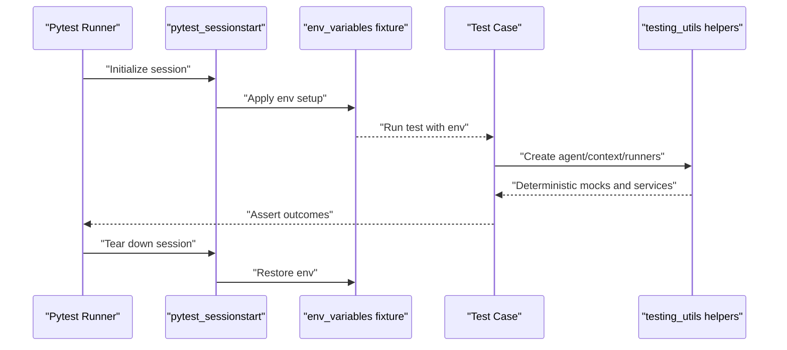

**Diagram sources**
- [conftest.py](file://tests/unittests/conftest.py#L63-L85)
- [conftest.py](file://tests/unittests/conftest.py#L41-L56)
- [testing_utils.py](file://tests/unittests/testing_utils.py#L47-L105)

## Detailed Component Analysis

### Tools: FunctionTool
Testing focuses on argument parsing, context injection, confirmation gating, and error propagation.

- Parameter filtering and missing args: Validates that only expected parameters are passed and missing mandatory parameters produce structured error payloads.
- Context parameter detection: Confirms detection of Context or ToolContext parameters by type or name.
- Confirmation flow: Exercises require_confirmation behavior and user approvals/rejections.
- Async/sync compatibility: Ensures both sync and async callables are handled consistently.

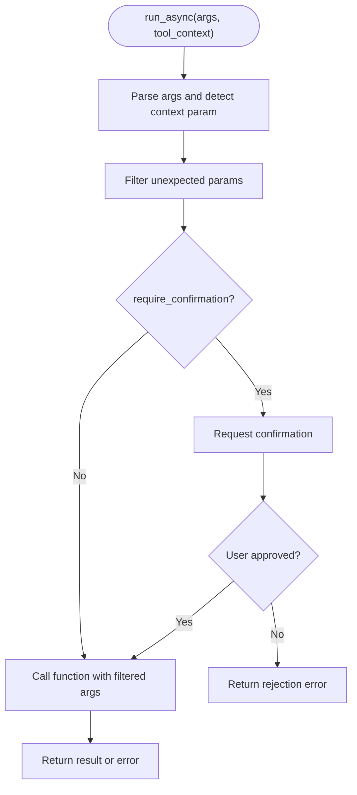

**Diagram sources**
- [test_function_tool.py](file://tests/unittests/tools/test_function_tool.py#L113-L294)
- [test_function_tool.py](file://tests/unittests/tools/test_function_tool.py#L374-L418)

**Section sources**
- [test_function_tool.py](file://tests/unittests/tools/test_function_tool.py#L113-L294)
- [test_function_tool.py](file://tests/unittests/tools/test_function_tool.py#L374-L418)

### Models: LLM Registry Resolution
Tests validate model family resolution and helpful error messages for missing providers.

- Model name families: Gemini, Claude, and LiteLLM variants resolve to correct classes.
- Error handling: Non-existent models raise descriptive errors; provider-specific hints guide installation.

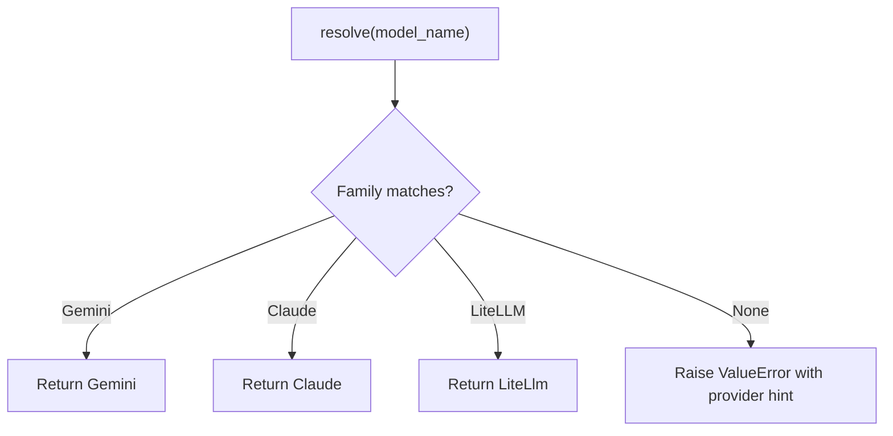

**Diagram sources**
- [test_models.py](file://tests/unittests/models/test_models.py#L22-L78)
- [test_models.py](file://tests/unittests/models/test_models.py#L75-L115)

**Section sources**
- [test_models.py](file://tests/unittests/models/test_models.py#L22-L78)
- [test_models.py](file://tests/unittests/models/test_models.py#L75-L115)

### Plugins: PluginManager
Ensures early-exit semantics, ordered execution, exception wrapping, and lifecycle management.

- Early exit: First plugin returning a value prevents subsequent plugins from executing.
- Ordered execution: Without early exits, all plugins are invoked in registration order.
- Exception handling: Exceptions are wrapped in a descriptive RuntimeError with chaining.
- Lifecycle: close() invokes each plugin’s close with timeout and error reporting.

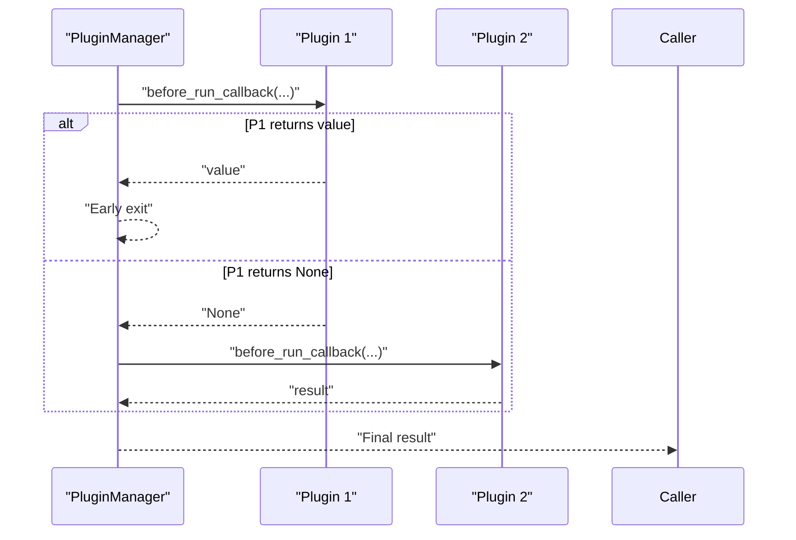

**Diagram sources**
- [test_plugin_manager.py](file://tests/unittests/plugins/test_plugin_manager.py#L135-L158)
- [test_plugin_manager.py](file://tests/unittests/plugins/test_plugin_manager.py#L161-L179)

**Section sources**
- [test_plugin_manager.py](file://tests/unittests/plugins/test_plugin_manager.py#L113-L133)
- [test_plugin_manager.py](file://tests/unittests/plugins/test_plugin_manager.py#L135-L158)
- [test_plugin_manager.py](file://tests/unittests/plugins/test_plugin_manager.py#L161-L179)
- [test_plugin_manager.py](file://tests/unittests/plugins/test_plugin_manager.py#L182-L203)
- [test_plugin_manager.py](file://tests/unittests/plugins/test_plugin_manager.py#L205-L271)
- [test_plugin_manager.py](file://tests/unittests/plugins/test_plugin_manager.py#L274-L320)

### Memory: InMemoryMemoryService
Validates ingestion, deduplication, scoping, and search behavior.

- Event ingestion: Filters events without content; appends without replacing; deduplicates by ID.
- Search: Case-insensitive keyword search scoped by user.
- Edge cases: Empty sessions, no-content events, cross-user isolation.

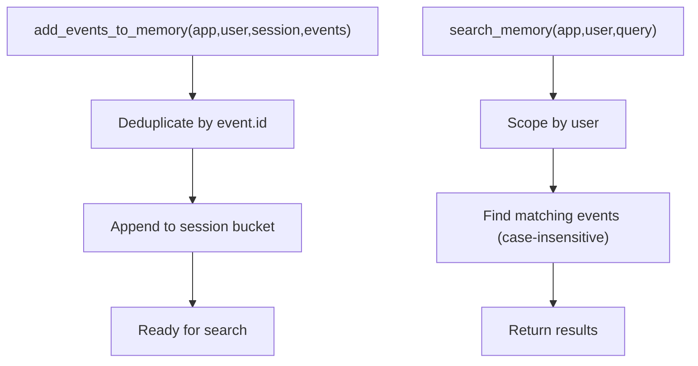

**Diagram sources**
- [test_in_memory_memory_service.py](file://tests/unittests/memory/test_in_memory_memory_service.py#L174-L200)
- [test_in_memory_memory_service.py](file://tests/unittests/memory/test_in_memory_memory_service.py#L244-L290)

**Section sources**
- [test_in_memory_memory_service.py](file://tests/unittests/memory/test_in_memory_memory_service.py#L105-L119)
- [test_in_memory_memory_service.py](file://tests/unittests/memory/test_in_memory_memory_service.py#L174-L200)
- [test_in_memory_memory_service.py](file://tests/unittests/memory/test_in_memory_memory_service.py#L244-L330)

### Artifacts: ArtifactService
Tests artifact loading, saving, and metadata handling across service implementations.

- Parametrized service types: InMemory, File, and GCS-backed services.
- Mock GCS client and bucket for non-networked tests.
- Deterministic timestamps and metadata handling.

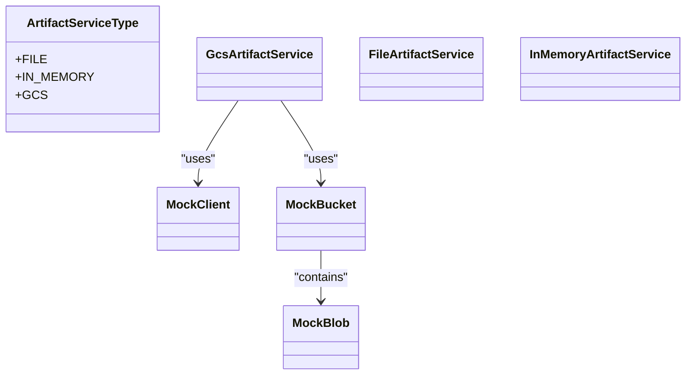

**Diagram sources**
- [test_artifact_service.py](file://tests/unittests/artifacts/test_artifact_service.py#L46-L50)
- [test_artifact_service.py](file://tests/unittests/artifacts/test_artifact_service.py#L143-L169)

**Section sources**
- [test_artifact_service.py](file://tests/unittests/artifacts/test_artifact_service.py#L188-L200)
- [test_artifact_service.py](file://tests/unittests/artifacts/test_artifact_service.py#L167-L169)

### Code Executors: BuiltInCodeExecutor
Validates LLM request processing for Gemini 2 models and error handling for unsupported models.

- Gemini 2 model support: Injects code execution tool into GenerateContentConfig when missing or empty.
- Non-Gemini 2 models: Raises ValueError unless model-id check is disabled via environment variable.
- Config preservation: Existing tools are preserved and combined appropriately.

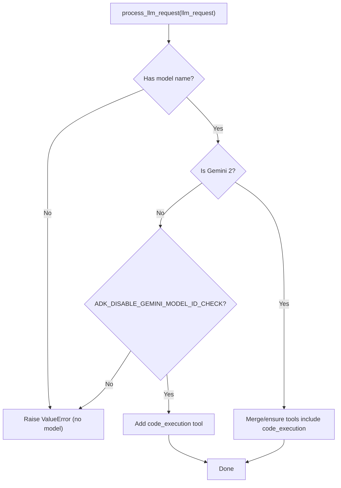

**Diagram sources**
- [test_built_in_code_executor.py](file://tests/unittests/code_executors/test_built_in_code_executor.py#L26-L97)
- [test_built_in_code_executor.py](file://tests/unittests/code_executors/test_built_in_code_executor.py#L100-L125)

**Section sources**
- [test_built_in_code_executor.py](file://tests/unittests/code_executors/test_built_in_code_executor.py#L26-L97)
- [test_built_in_code_executor.py](file://tests/unittests/code_executors/test_built_in_code_executor.py#L100-L125)

### Telemetry: Google Cloud Exporters
Validates OTel exporter selection and resource attribute precedence.

- Exporter selection: Enables/disables tracing, metrics, and logging processors based on flags.
- Resource attributes: Respects project ID from environment vs. argument.

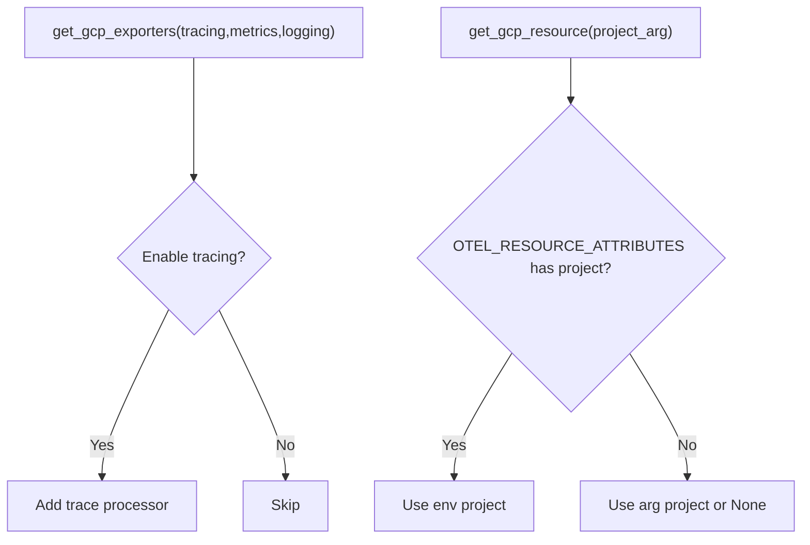

**Diagram sources**
- [test_google_cloud.py](file://tests/unittests/telemetry/test_google_cloud.py#L27-L60)
- [test_google_cloud.py](file://tests/unittests/telemetry/test_google_cloud.py#L65-L91)

**Section sources**
- [test_google_cloud.py](file://tests/unittests/telemetry/test_google_cloud.py#L27-L60)
- [test_google_cloud.py](file://tests/unittests/telemetry/test_google_cloud.py#L65-L91)

### Utilities: YAML Utils
Ensures proper serialization of Pydantic models to YAML with correct formatting.

- Multiline strings: Pipe style formatting for readability.
- Lists: Proper indentation and empty list formatting.
- Non-ASCII: Preservation of Unicode characters.

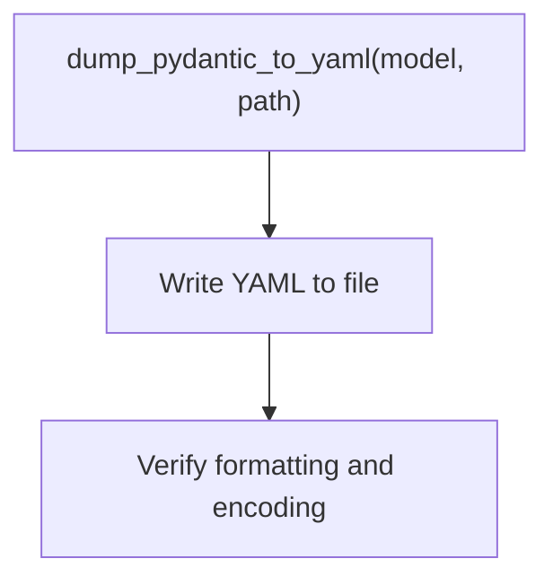

**Diagram sources**
- [test_yaml_utils.py](file://tests/unittests/utils/test_yaml_utils.py#L36-L53)
- [test_yaml_utils.py](file://tests/unittests/utils/test_yaml_utils.py#L56-L80)
- [test_yaml_utils.py](file://tests/unittests/utils/test_yaml_utils.py#L83-L104)
- [test_yaml_utils.py](file://tests/unittests/utils/test_yaml_utils.py#L107-L125)
- [test_yaml_utils.py](file://tests/unittests/utils/test_yaml_utils.py#L128-L154)

**Section sources**
- [test_yaml_utils.py](file://tests/unittests/utils/test_yaml_utils.py#L36-L53)
- [test_yaml_utils.py](file://tests/unittests/utils/test_yaml_utils.py#L56-L80)
- [test_yaml_utils.py](file://tests/unittests/utils/test_yaml_utils.py#L83-L104)
- [test_yaml_utils.py](file://tests/unittests/utils/test_yaml_utils.py#L107-L125)
- [test_yaml_utils.py](file://tests/unittests/utils/test_yaml_utils.py#L128-L154)

## Dependency Analysis
- Environment fixtures depend on pytest hooks to set and restore environment variables globally and per-test.
- Shared helpers depend on core ADK classes (agents, sessions, memory, artifacts, models) to construct deterministic test scenarios.
- Component tests depend on each other’s helpers to minimize duplication and maintain consistency.

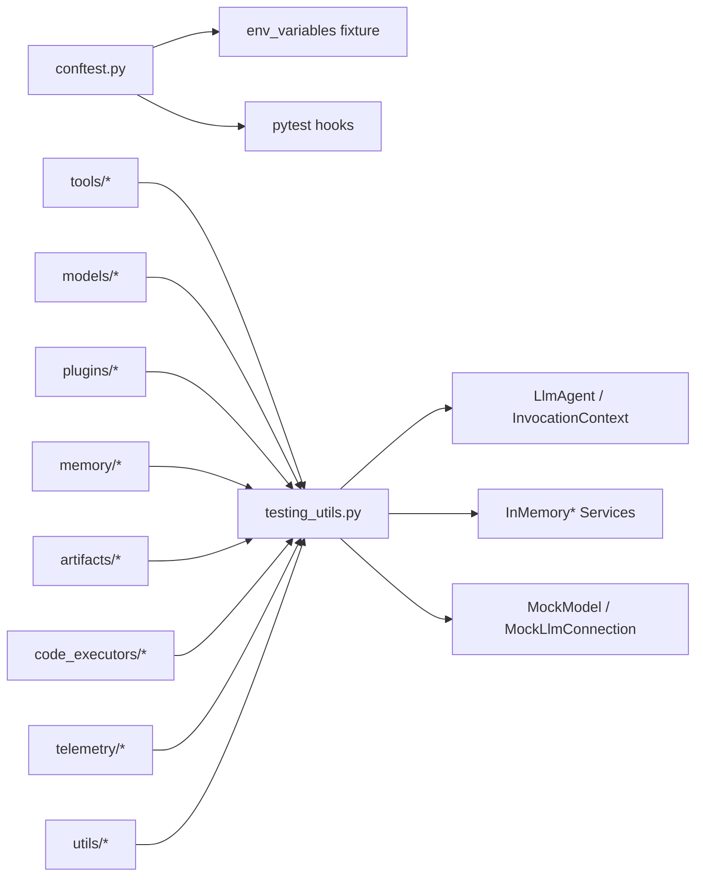

**Diagram sources**
- [conftest.py](file://tests/unittests/conftest.py#L41-L56)
- [conftest.py](file://tests/unittests/conftest.py#L63-L85)
- [testing_utils.py](file://tests/unittests/testing_utils.py#L47-L105)
- [testing_utils.py](file://tests/unittests/testing_utils.py#L182-L316)
- [testing_utils.py](file://tests/unittests/testing_utils.py#L318-L420)

**Section sources**
- [conftest.py](file://tests/unittests/conftest.py#L41-L56)
- [conftest.py](file://tests/unittests/conftest.py#L63-L85)
- [testing_utils.py](file://tests/unittests/testing_utils.py#L47-L105)
- [testing_utils.py](file://tests/unittests/testing_utils.py#L182-L316)
- [testing_utils.py](file://tests/unittests/testing_utils.py#L318-L420)

## Performance Considerations
- Deterministic mocks: Using MockModel and MockLlmConnection avoids network latency and ensures repeatable timings.
- Async yields: Mock connections intentionally yield control to allow persistence side-effects before responses, balancing determinism with realistic scheduling.
- Minimal IO: InMemory services and file-based artifact service with tmp_path reduce I/O overhead.

[No sources needed since this section provides general guidance]

## Troubleshooting Guide
Common issues and resolutions:
- Environment-dependent failures: Use the env_variables fixture parametrization to switch between GOOGLE_GENAI_USE_VERTEXAI modes.
- Missing provider packages: LLM registry tests surface helpful error messages indicating required packages and installation commands.
- Plugin exceptions: PluginManager wraps plugin errors in RuntimeError with chained causes for better diagnostics.
- GCS-related tests: Mocked client and bucket eliminate flakiness; ensure patches are applied around construction.

**Section sources**
- [conftest.py](file://tests/unittests/conftest.py#L22-L38)
- [test_models.py](file://tests/unittests/models/test_models.py#L81-L115)
- [test_plugin_manager.py](file://tests/unittests/plugins/test_plugin_manager.py#L182-L203)
- [test_artifact_service.py](file://tests/unittests/artifacts/test_artifact_service.py#L167-L169)

## Conclusion
The ADK unit test suite is systematically organized, uses shared fixtures and helpers for consistency, and applies robust patterns for async, error, and edge-case coverage. Environment parametrization and deterministic mocks ensure reliable, fast, and portable tests across domains.

[No sources needed since this section summarizes without analyzing specific files]

## Appendices

### Test Organization and Naming Conventions
- Folder structure mirrors src/google/adk: tests/unittests/<module>/...
- Test files: test_<component>.py or test_<specific_behavior>.py
- Fixtures: Lowercase with suffix _fixture; prefixed with test_ for module-level fixtures
- Parametrization: Use @pytest.mark.parametrize for multiple scenarios
- Async tests: Decorated with @pytest.mark.asyncio

[No sources needed since this section provides general guidance]

### Assertion Patterns
- Equality on normalized content: simplify_content and simplify_events normalize parts and strip function ids for stable comparisons.
- Structured error payloads: Validate error keys and messages for tool invocation failures.
- Enumerated behaviors: Use parametrize to cover multiple branches (e.g., early exit, ordered execution, exception wrapping).

[No sources needed since this section provides general guidance]

### Test Configuration Setup
- Global environment: pytest_sessionstart sets initial env; pytest_sessionfinish restores it.
- Per-test env switching: env_variables fixture parametrizes tests across GOOGLE_GENAI_USE_VERTEXAI modes.
- Monkeypatching: Used for environment variables and external library mocking (e.g., GCS client).

**Section sources**
- [conftest.py](file://tests/unittests/conftest.py#L63-L85)
- [conftest.py](file://tests/unittests/conftest.py#L88-L103)

### Fixtures and Helper Utilities
- Shared helpers: create_test_agent, create_invocation_context, InMemoryRunner/TestInMemoryRunner, MockModel/MockLlmConnection, simplify_* utilities.
- Artifact service factory: Parametrized factory for InMemory/File/GCS services with mocked GCS client.

**Section sources**
- [testing_utils.py](file://tests/unittests/testing_utils.py#L47-L105)
- [testing_utils.py](file://tests/unittests/testing_utils.py#L182-L316)
- [testing_utils.py](file://tests/unittests/testing_utils.py#L318-L420)
- [test_artifact_service.py](file://tests/unittests/artifacts/test_artifact_service.py#L172-L185)

### Practical Examples
- Tools: Exercise FunctionTool with various signatures, context injection, and confirmation gating.
- Models: Validate LLM registry resolution and error messaging for missing providers.
- Plugins: Demonstrate early exit, ordered execution, and exception wrapping.
- Memory: Verify ingestion, deduplication, and user-scoped search.
- Artifacts: Parametrize across service implementations and mock GCS.
- Code executors: Ensure Gemini 2 code execution tool injection and non-Gemini 2 guardrails.
- Telemetry: Enable/disable exporters and validate resource attributes.
- Utilities: Serialize Pydantic models to YAML with correct formatting.

**Section sources**
- [test_function_tool.py](file://tests/unittests/tools/test_function_tool.py#L113-L294)
- [test_models.py](file://tests/unittests/models/test_models.py#L22-L78)
- [test_plugin_manager.py](file://tests/unittests/plugins/test_plugin_manager.py#L135-L158)
- [test_in_memory_memory_service.py](file://tests/unittests/memory/test_in_memory_memory_service.py#L244-L330)
- [test_artifact_service.py](file://tests/unittests/artifacts/test_artifact_service.py#L188-L200)
- [test_built_in_code_executor.py](file://tests/unittests/code_executors/test_built_in_code_executor.py#L26-L97)
- [test_google_cloud.py](file://tests/unittests/telemetry/test_google_cloud.py#L27-L60)
- [test_yaml_utils.py](file://tests/unittests/utils/test_yaml_utils.py#L36-L53)

### Mocking Strategies for External Dependencies
- Environment variables: Use env_variables fixture and monkeypatch for provider toggles.
- External clients: Patch google.cloud.storage.Client for GCS artifact service tests.
- Authentication: Mock google.auth.default for telemetry resource initialization.

**Section sources**
- [conftest.py](file://tests/unittests/conftest.py#L41-L56)
- [test_artifact_service.py](file://tests/unittests/artifacts/test_artifact_service.py#L167-L169)
- [test_google_cloud.py](file://tests/unittests/telemetry/test_google_cloud.py#L38-L44)

### Test Isolation Techniques
- Per-test env restoration: pytest hooks manage global env state.
- In-memory services: Eliminate cross-test interference for artifacts, sessions, and memory.
- Deterministic timestamps: Fixed datetime for artifact service tests.

**Section sources**
- [conftest.py](file://tests/unittests/conftest.py#L63-L85)
- [test_artifact_service.py](file://tests/unittests/artifacts/test_artifact_service.py#L42-L43)

### Testing Async Operations, Errors, and Edge Cases
- Async patterns: Use @pytest.mark.asyncio and async fixtures/helpers; collect async generators into lists for assertions.
- Error conditions: Validate ValueError and RuntimeError with descriptive messages.
- Edge cases: Empty sessions, missing content, duplicate event IDs, and cross-user scoping.

**Section sources**
- [test_in_memory_memory_service.py](file://tests/unittests/memory/test_in_memory_memory_service.py#L204-L228)
- [test_plugin_manager.py](file://tests/unittests/plugins/test_plugin_manager.py#L182-L203)
- [test_models.py](file://tests/unittests/models/test_models.py#L75-L115)

### Test Data Management and CI Integration
- Temporary directories: Use tmp_path fixtures for file-based artifact service tests.
- CI readiness: Environment parametrization and mocked external dependencies ensure tests run without credentials or network.

[No sources needed since this section provides general guidance]