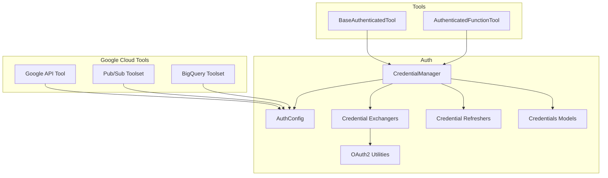
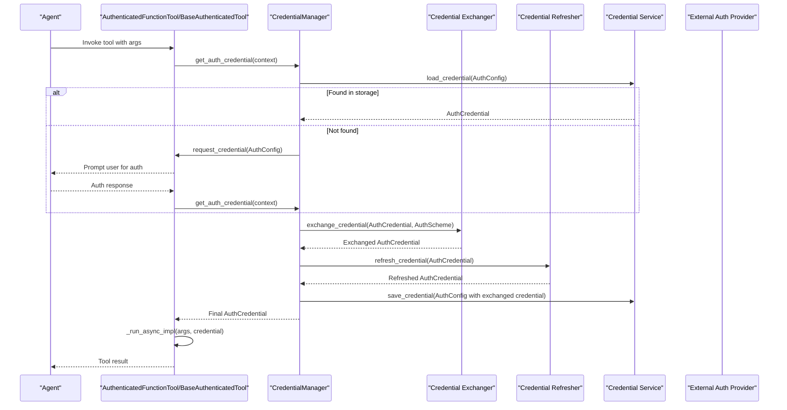
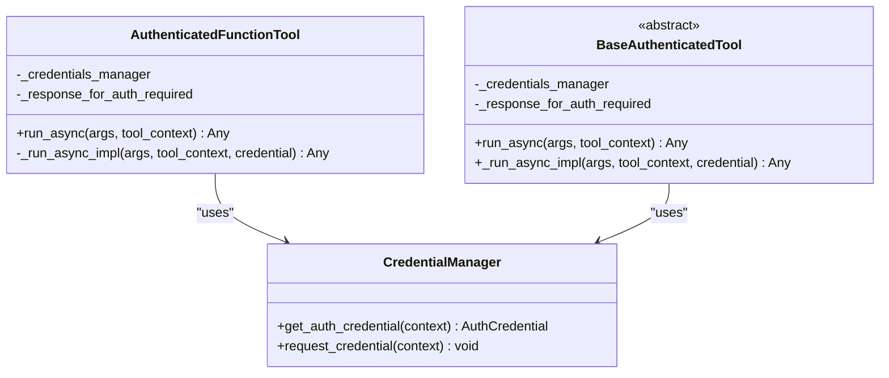
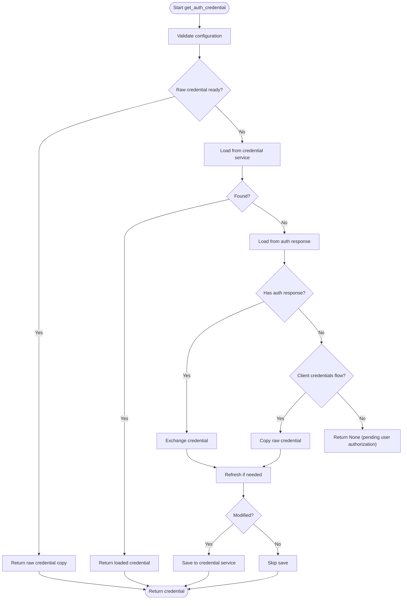
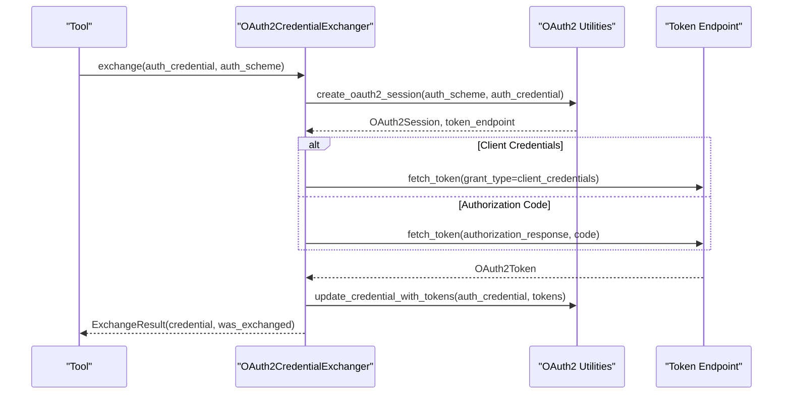
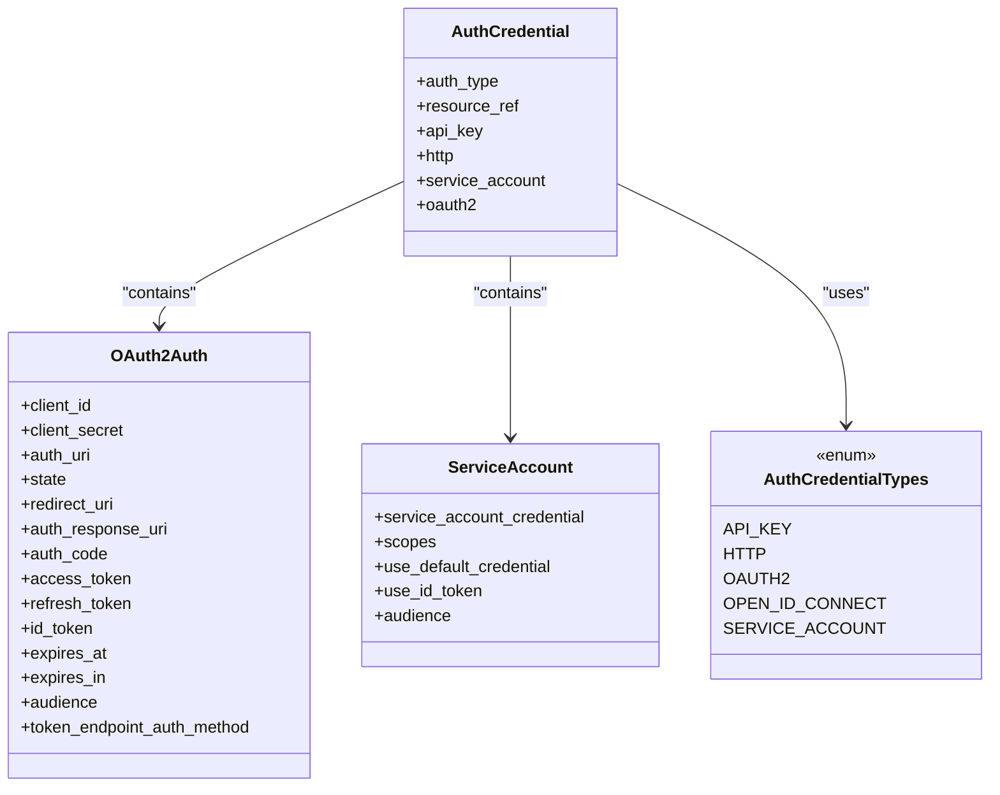
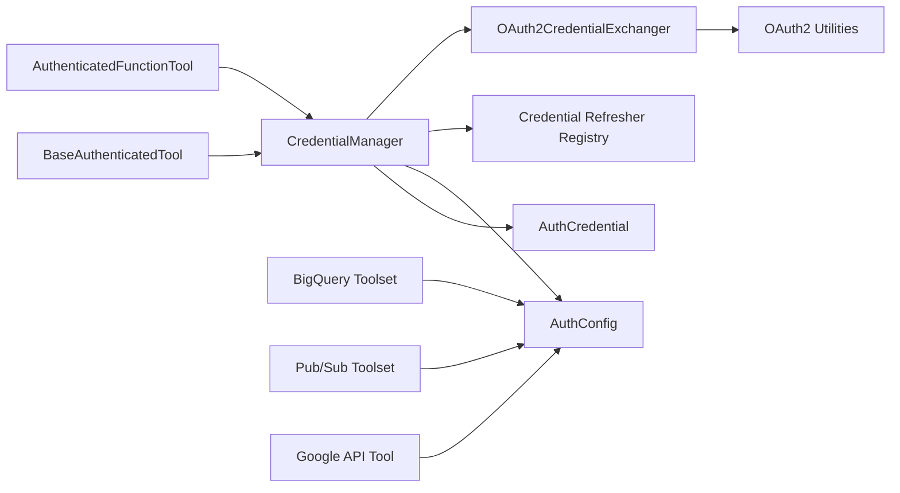

# Authentication and Integration

<cite>
**Referenced Files in This Document**
- [authenticated_function_tool.py](file://src/google/adk/tools/authenticated_function_tool.py)
- [base_authenticated_tool.py](file://src/google/adk/tools/base_authenticated_tool.py)
- [auth_tool.py](file://src/google/adk/auth/auth_tool.py)
- [credential_manager.py](file://src/google/adk/auth/credential_manager.py)
- [auth_credential.py](file://src/google/adk/auth/auth_credential.py)
- [oauth2_credential_util.py](file://src/google/adk/auth/oauth2_credential_util.py)
- [oauth2_credential_exchanger.py](file://src/google/adk/auth/exchanger/oauth2_credential_exchanger.py)
- [base_credential_exchanger.py](file://src/google/adk/auth/exchanger/base_credential_exchanger.py)
- [bigquery/__init__.py](file://src/google/adk/tools/bigquery/__init__.py)
- [pubsub/__init__.py](file://src/google/adk/tools/pubsub/__init__.py)
- [google_api_tool.py](file://src/google/adk/tools/google_api_tool/google_api_tool.py)
- [google_api_toolset.py](file://src/google/adk/tools/google_api_tool/google_api_toolset.py)
- [README.md](file://contributing/samples/oauth2_client_credentials/README.md)
</cite>

## Table of Contents
1. [Introduction](#introduction)
2. [Project Structure](#project-structure)
3. [Core Components](#core-components)
4. [Architecture Overview](#architecture-overview)
5. [Detailed Component Analysis](#detailed-component-analysis)
6. [Dependency Analysis](#dependency-analysis)
7. [Performance Considerations](#performance-considerations)
8. [Troubleshooting Guide](#troubleshooting-guide)
9. [Conclusion](#conclusion)
10. [Appendices](#appendices)

## Introduction
This document explains authentication and integration patterns in the Agent Development Kit (ADK), focusing on how tools authenticate and securely manage credentials. It covers OAuth2, service accounts, and API key management, and documents the AuthenticatedFunctionTool and BaseAuthenticatedTool classes, their configuration options, and usage patterns. It also explains credential management, token refresh mechanisms, secure storage, and integration with Google Cloud services and external APIs. Practical examples show how to authenticate tools for BigQuery, Pub/Sub, and other Google services, along with security considerations, credential rotation, access control patterns, configuration inheritance, environment handling, and deployment considerations.

## Project Structure
The authentication and integration capabilities are implemented across several modules:
- Tools: AuthenticatedFunctionTool and BaseAuthenticatedTool orchestrate authentication before invoking tool logic.
- Auth: Credential management, schemes, credentials, OAuth2 utilities, and exchangers implement the end-to-end credential lifecycle.
- Google Cloud toolsets: BigQuery, Pub/Sub, and Google API tool integrations demonstrate practical usage.

**Diagram sources**
- [authenticated_function_tool.py](file://src/google/adk/tools/authenticated_function_tool.py#L38-L108)
- [base_authenticated_tool.py](file://src/google/adk/tools/base_authenticated_tool.py#L37-L109)
- [credential_manager.py](file://src/google/adk/auth/credential_manager.py#L41-L387)
- [auth_tool.py](file://src/google/adk/auth/auth_tool.py#L51-L146)
- [oauth2_credential_util.py](file://src/google/adk/auth/oauth2_credential_util.py#L34-L120)
- [oauth2_credential_exchanger.py](file://src/google/adk/auth/exchanger/oauth2_credential_exchanger.py#L47-L212)
- [auth_credential.py](file://src/google/adk/auth/auth_credential.py#L214-L280)
- [bigquery/__init__.py](file://src/google/adk/tools/bigquery/__init__.py#L15-L37)
- [pubsub/__init__.py](file://src/google/adk/tools/pubsub/__init__.py#L15-L31)
- [google_api_tool.py](file://src/google/adk/tools/google_api_tool/google_api_tool.py)

**Section sources**
- [authenticated_function_tool.py](file://src/google/adk/tools/authenticated_function_tool.py#L38-L108)
- [base_authenticated_tool.py](file://src/google/adk/tools/base_authenticated_tool.py#L37-L109)
- [credential_manager.py](file://src/google/adk/auth/credential_manager.py#L41-L387)
- [auth_tool.py](file://src/google/adk/auth/auth_tool.py#L51-L146)
- [auth_credential.py](file://src/google/adk/auth/auth_credential.py#L214-L280)
- [oauth2_credential_util.py](file://src/google/adk/auth/oauth2_credential_util.py#L34-L120)
- [oauth2_credential_exchanger.py](file://src/google/adk/auth/exchanger/oauth2_credential_exchanger.py#L47-L212)
- [bigquery/__init__.py](file://src/google/adk/tools/bigquery/__init__.py#L15-L37)
- [pubsub/__init__.py](file://src/google/adk/tools/pubsub/__init__.py#L15-L31)

## Core Components
- AuthenticatedFunctionTool: Wraps a function and injects a prepared credential into the function call when present. Handles user authorization prompts and optional custom responses when credentials are missing or insufficient.
- BaseAuthenticatedTool: Abstract base class for authenticated tools that encapsulates the same credential acquisition and authorization flow, delegating actual work to an abstract _run_async_impl method.
- AuthConfig: Encapsulates the authentication scheme and credential inputs, including raw and exchanged credentials, and a stable credential key for storage.
- CredentialManager: Orchestrates credential lifecycle: validation, loading from storage or auth response, exchange (e.g., service account to access token), refresh, and saving.
- OAuth2 utilities and exchangers: Provide OAuth2 session creation, token exchange for client credentials and authorization code flows, and token updates.
- Credentials models: Define supported credential types (API key, HTTP, OAuth2/OIDC, service account) and their attributes.

**Section sources**
- [authenticated_function_tool.py](file://src/google/adk/tools/authenticated_function_tool.py#L38-L108)
- [base_authenticated_tool.py](file://src/google/adk/tools/base_authenticated_tool.py#L37-L109)
- [auth_tool.py](file://src/google/adk/auth/auth_tool.py#L51-L146)
- [credential_manager.py](file://src/google/adk/auth/credential_manager.py#L41-L387)
- [auth_credential.py](file://src/google/adk/auth/auth_credential.py#L190-L280)
- [oauth2_credential_util.py](file://src/google/adk/auth/oauth2_credential_util.py#L34-L120)
- [oauth2_credential_exchanger.py](file://src/google/adk/auth/exchanger/oauth2_credential_exchanger.py#L47-L212)

## Architecture Overview
The authentication pipeline integrates tools, credential management, and external providers:

**Diagram sources**
- [authenticated_function_tool.py](file://src/google/adk/tools/authenticated_function_tool.py#L80-L108)
- [base_authenticated_tool.py](file://src/google/adk/tools/base_authenticated_tool.py#L82-L109)
- [credential_manager.py](file://src/google/adk/auth/credential_manager.py#L135-L183)
- [oauth2_credential_exchanger.py](file://src/google/adk/auth/exchanger/oauth2_credential_exchanger.py#L50-L102)

## Detailed Component Analysis

### AuthenticatedFunctionTool and BaseAuthenticatedTool
Both classes implement a common pattern:
- On invocation, they attempt to obtain a prepared credential from CredentialManager.
- If unavailable, they request user authorization and return a configurable pending response.
- If a credential is available, they optionally inject a "credential" parameter into the underlying function/tool implementation and execute it.

Key configuration options:
- auth_config: Defines the authentication scheme and credential inputs.
- response_for_auth_required: Customizable response when authorization is pending.

Usage patterns:
- Function tools: Use AuthenticatedFunctionTool to wrap a callable that accepts an optional "credential" parameter.
- Class tools: Extend BaseAuthenticatedTool and implement _run_async_impl to perform authenticated operations.

**Diagram sources**
- [authenticated_function_tool.py](file://src/google/adk/tools/authenticated_function_tool.py#L38-L108)
- [base_authenticated_tool.py](file://src/google/adk/tools/base_authenticated_tool.py#L37-L109)
- [credential_manager.py](file://src/google/adk/auth/credential_manager.py#L135-L183)

**Section sources**
- [authenticated_function_tool.py](file://src/google/adk/tools/authenticated_function_tool.py#L38-L108)
- [base_authenticated_tool.py](file://src/google/adk/tools/base_authenticated_tool.py#L37-L109)

### Credential Management and Lifecycle
CredentialManager coordinates the full lifecycle:
- Validation: Ensures required fields for the chosen scheme and credential types are present.
- Loading: Attempts to load credentials from a credential service and from an auth response in the invocation context.
- Exchange: Converts raw credentials (e.g., service account JSON) into usable tokens via registered exchangers.
- Refresh: Checks expiration and refreshes tokens when needed.
- Saving: Persists updated credentials back to the credential service.

**Diagram sources**
- [credential_manager.py](file://src/google/adk/auth/credential_manager.py#L135-L183)
- [credential_manager.py](file://src/google/adk/auth/credential_manager.py#L214-L251)
- [credential_manager.py](file://src/google/adk/auth/credential_manager.py#L301-L310)

**Section sources**
- [credential_manager.py](file://src/google/adk/auth/credential_manager.py#L41-L387)

### OAuth2 Credential Exchange and Utilities
OAuth2CredentialExchanger supports:
- Client credentials flow: Uses client_id and client_secret to fetch an access token from the token endpoint.
- Authorization code flow: Exchanges an authorization response URI/code for tokens.

OAuth2 utilities:
- create_oauth2_session: Builds an Authlib OAuth2Session from scheme and credential, extracting token endpoints and scopes.
- update_credential_with_tokens: Updates credential fields (access/refresh/id tokens, expiry) after exchange.

**Diagram sources**
- [oauth2_credential_exchanger.py](file://src/google/adk/auth/exchanger/oauth2_credential_exchanger.py#L130-L212)
- [oauth2_credential_util.py](file://src/google/adk/auth/oauth2_credential_util.py#L34-L120)

**Section sources**
- [oauth2_credential_exchanger.py](file://src/google/adk/auth/exchanger/oauth2_credential_exchanger.py#L47-L212)
- [oauth2_credential_util.py](file://src/google/adk/auth/oauth2_credential_util.py#L34-L120)

### Credentials Models and Schemes
Supported credential types and structures:
- API Key: Simple key-based authentication.
- HTTP: Username/password or bearer token credentials.
- OAuth2/OIDC: Client credentials, authorization URIs, tokens, scopes, audiences.
- Service Account: Google service account configuration with scopes and optional ID token audience.

AuthConfig manages:
- auth_scheme: The authentication scheme (OAuth2/OIDC/HTTP/API Key/etc.).
- raw_auth_credential: Initial credential input.
- exchanged_auth_credential: Updated credential after exchange.
- credential_key: Stable key for storing/loading credentials.

**Diagram sources**
- [auth_credential.py](file://src/google/adk/auth/auth_credential.py#L190-L280)

**Section sources**
- [auth_credential.py](file://src/google/adk/auth/auth_credential.py#L190-L280)
- [auth_tool.py](file://src/google/adk/auth/auth_tool.py#L51-L146)

### Google Cloud Integrations
- BigQuery: Provides a curated toolset and credentials configuration for BigQuery operations.
- Pub/Sub: Offers a specialized toolset and credentials configuration for publishing and subscribing.
- Google API Tool: Auto-generated tool wrappers for Google APIs, leveraging authentication configuration.

These integrations rely on the same authentication infrastructure to obtain and manage credentials.

**Section sources**
- [bigquery/__init__.py](file://src/google/adk/tools/bigquery/__init__.py#L15-L37)
- [pubsub/__init__.py](file://src/google/adk/tools/pubsub/__init__.py#L15-L31)
- [google_api_tool.py](file://src/google/adk/tools/google_api_tool/google_api_tool.py)
- [google_api_toolset.py](file://src/google/adk/tools/google_api_tool/google_api_toolset.py)

### Practical Examples and Patterns
- OAuth2 Client Credentials Weather Agent: Demonstrates configuring OAuth2 client credentials, using AuthenticatedFunctionTool for transparent token management, and making authenticated requests to a weather API. See the sample overview and architecture.
- BigQuery, Pub/Sub, and Cloud Storage: Tools in these domains integrate with Google Cloud services using the same credential lifecycle managed by CredentialManager and OAuth2 utilities.

**Section sources**
- [README.md](file://contributing/samples/oauth2_client_credentials/README.md#L1-L39)

## Dependency Analysis
The authentication system exhibits clear separation of concerns:
- Tools depend on CredentialManager for credential preparation.
- CredentialManager depends on exchangers and refreshers for transformations.
- Exchangers and utilities depend on AuthConfig and AuthCredential models.
- Google Cloud toolsets depend on AuthConfig to configure authentication.

**Diagram sources**
- [authenticated_function_tool.py](file://src/google/adk/tools/authenticated_function_tool.py#L38-L108)
- [base_authenticated_tool.py](file://src/google/adk/tools/base_authenticated_tool.py#L37-L109)
- [credential_manager.py](file://src/google/adk/auth/credential_manager.py#L41-L113)
- [oauth2_credential_exchanger.py](file://src/google/adk/auth/exchanger/oauth2_credential_exchanger.py#L47-L102)
- [oauth2_credential_util.py](file://src/google/adk/auth/oauth2_credential_util.py#L34-L120)
- [auth_tool.py](file://src/google/adk/auth/auth_tool.py#L51-L146)
- [auth_credential.py](file://src/google/adk/auth/auth_credential.py#L214-L280)
- [bigquery/__init__.py](file://src/google/adk/tools/bigquery/__init__.py#L30-L36)
- [pubsub/__init__.py](file://src/google/adk/tools/pubsub/__init__.py#L26-L30)
- [google_api_tool.py](file://src/google/adk/tools/google_api_tool/google_api_tool.py)

**Section sources**
- [credential_manager.py](file://src/google/adk/auth/credential_manager.py#L84-L113)
- [oauth2_credential_exchanger.py](file://src/google/adk/auth/exchanger/oauth2_credential_exchanger.py#L47-L102)
- [oauth2_credential_util.py](file://src/google/adk/auth/oauth2_credential_util.py#L34-L120)
- [auth_tool.py](file://src/google/adk/auth/auth_tool.py#L51-L146)
- [auth_credential.py](file://src/google/adk/auth/auth_credential.py#L214-L280)

## Performance Considerations
- Minimize repeated exchanges: Reuse exchanged credentials when possible and leverage refreshers to avoid unnecessary re-exchange.
- Asynchronous operations: CredentialManager’s operations are asynchronous; ensure tool contexts propagate callbacks efficiently.
- Session reuse: OAuth2 utilities create sessions per exchange; avoid excessive recreation to reduce overhead.
- Storage latency: Credential service operations can add latency; consider caching short-lived credentials when safe.

## Troubleshooting Guide
Common issues and resolutions:
- Missing raw_auth_credential for OAuth2/OIDC: CredentialManager validation raises an error if required fields are absent. Provide client_id/client_secret and appropriate scopes.
- Missing token endpoints or authorization URLs: Use OAuth2 auto-discovery to populate scheme metadata from an issuer URL.
- Exchange failures: OAuth2CredentialExchanger logs warnings and returns the original credential if authlib is unavailable or exchange fails. Verify network connectivity and endpoint configurations.
- Authorization pending: When no credential is available, tools return a configurable pending response. Ensure the client invokes request_credential and supplies the auth response.
- Service account to access token: Confirm scopes and audience settings when using service accounts for Google Cloud services.

**Section sources**
- [credential_manager.py](file://src/google/adk/auth/credential_manager.py#L266-L298)
- [credential_manager.py](file://src/google/adk/auth/credential_manager.py#L311-L344)
- [oauth2_credential_exchanger.py](file://src/google/adk/auth/exchanger/oauth2_credential_exchanger.py#L76-L84)
- [oauth2_credential_exchanger.py](file://src/google/adk/auth/exchanger/oauth2_credential_exchanger.py#L145-L163)
- [oauth2_credential_exchanger.py](file://src/google/adk/auth/exchanger/oauth2_credential_exchanger.py#L188-L211)

## Conclusion
ADK’s authentication framework provides a robust, extensible mechanism for managing credentials across diverse providers and schemes. AuthenticatedFunctionTool and BaseAuthenticatedTool integrate seamlessly with CredentialManager to handle credential acquisition, exchange, refresh, and secure storage. The system supports OAuth2 client credentials and authorization code flows, service accounts, API keys, and HTTP authentication, enabling secure integration with Google Cloud services and external APIs. By following the patterns documented here—configuration inheritance, environment handling, and deployment considerations—you can reliably authenticate tools in production environments.

## Appendices

### Security Considerations
- Prefer short-lived access tokens and refresh tokens; rotate credentials regularly.
- Store sensitive data using the credential service abstraction; avoid hardcoding secrets.
- Use least-privilege scopes and restrict audiences for ID tokens.
- Validate and sanitize inputs for OAuth2 flows; maintain state integrity.

### Credential Rotation and Access Control
- Implement periodic refresh checks and automated rotation for long-running services.
- Enforce access control at the tool level by validating credential ownership and intended audience.
- Use credential_key to group related credentials and apply policy-based access controls.

### Environment Variable Handling and Deployment
- Configure OAuth2 client_id and client_secret via environment variables or secret managers.
- For service accounts, supply JSON key material through environment variables or mounted secrets.
- Deploy tools behind gateways or proxies that enforce rate limits and request validation.