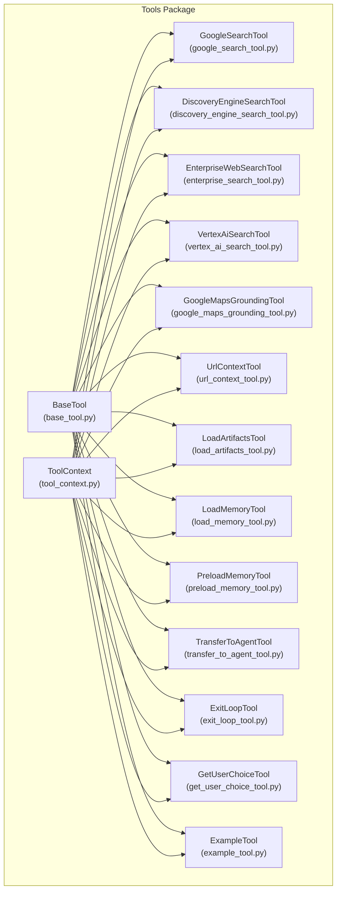
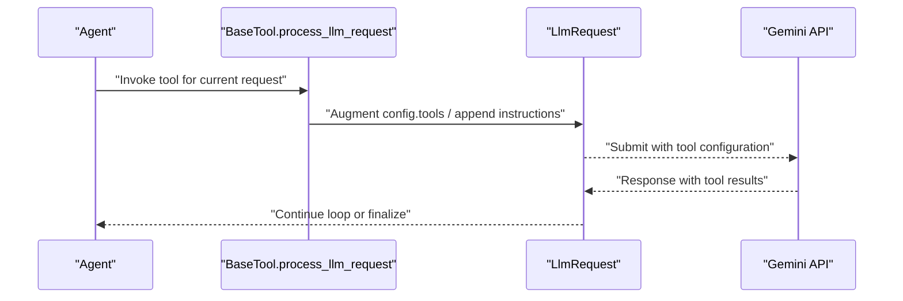
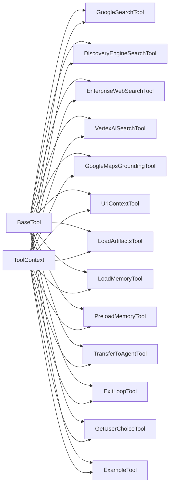

# Built-in Tools

<cite>
**Referenced Files in This Document**
- [google_search_tool.py](file://src/google/adk/tools/google_search_tool.py)
- [discovery_engine_search_tool.py](file://src/google/adk/tools/discovery_engine_search_tool.py)
- [enterprise_search_tool.py](file://src/google/adk/tools/enterprise_search_tool.py)
- [vertex_ai_search_tool.py](file://src/google/adk/tools/vertex_ai_search_tool.py)
- [google_maps_grounding_tool.py](file://src/google/adk/tools/google_maps_grounding_tool.py)
- [url_context_tool.py](file://src/google/adk/tools/url_context_tool.py)
- [load_artifacts_tool.py](file://src/google/adk/tools/load_artifacts_tool.py)
- [load_memory_tool.py](file://src/google/adk/tools/load_memory_tool.py)
- [preload_memory_tool.py](file://src/google/adk/tools/preload_memory_tool.py)
- [transfer_to_agent_tool.py](file://src/google/adk/tools/transfer_to_agent_tool.py)
- [exit_loop_tool.py](file://src/google/adk/tools/exit_loop_tool.py)
- [get_user_choice_tool.py](file://src/google/adk/tools/get_user_choice_tool.py)
- [example_tool.py](file://src/google/adk/tools/example_tool.py)
- [base_tool.py](file://src/google/adk/tools/base_tool.py)
- [tool_context.py](file://src/google/adk/tools/tool_context.py)
</cite>

## Table of Contents
1. [Introduction](#introduction)
2. [Project Structure](#project-structure)
3. [Core Components](#core-components)
4. [Architecture Overview](#architecture-overview)
5. [Detailed Component Analysis](#detailed-component-analysis)
6. [Dependency Analysis](#dependency-analysis)
7. [Performance Considerations](#performance-considerations)
8. [Troubleshooting Guide](#troubleshooting-guide)
9. [Conclusion](#conclusion)

## Introduction
This document describes ADK’s built-in tools collection. These tools integrate with Gemini models and external Google services to enable search, grounding, context loading, memory retrieval, agent handoff, and loop control. Each tool is documented with purpose, configuration, parameters, return values, usage patterns, authentication, rate-limiting considerations, and performance characteristics. Practical examples show how to configure and use each tool in agent workflows.

## Project Structure
The built-in tools are implemented as classes under the tools package. They share a common base class and rely on a unified tool context for access to artifacts, memory, and actions.

**Diagram sources**
- [base_tool.py](file://src/google/adk/tools/base_tool.py#L47-L213)
- [tool_context.py](file://src/google/adk/tools/tool_context.py#L1-L31)
- [google_search_tool.py](file://src/google/adk/tools/google_search_tool.py#L32-L93)
- [discovery_engine_search_tool.py](file://src/google/adk/tools/discovery_engine_search_tool.py#L29-L144)
- [enterprise_search_tool.py](file://src/google/adk/tools/enterprise_search_tool.py#L32-L79)
- [vertex_ai_search_tool.py](file://src/google/adk/tools/vertex_ai_search_tool.py#L37-L197)
- [google_maps_grounding_tool.py](file://src/google/adk/tools/google_maps_grounding_tool.py#L32-L71)
- [url_context_tool.py](file://src/google/adk/tools/url_context_tool.py#L32-L66)
- [load_artifacts_tool.py](file://src/google/adk/tools/load_artifacts_tool.py#L124-L256)
- [load_memory_tool.py](file://src/google/adk/tools/load_memory_tool.py#L53-L108)
- [preload_memory_tool.py](file://src/google/adk/tools/preload_memory_tool.py#L32-L93)
- [transfer_to_agent_tool.py](file://src/google/adk/tools/transfer_to_agent_tool.py#L43-L90)
- [exit_loop_tool.py](file://src/google/adk/tools/exit_loop_tool.py#L20-L27)
- [get_user_choice_tool.py](file://src/google/adk/tools/get_user_choice_tool.py#L23-L32)
- [example_tool.py](file://src/google/adk/tools/example_tool.py#L37-L104)

**Section sources**
- [base_tool.py](file://src/google/adk/tools/base_tool.py#L47-L213)
- [tool_context.py](file://src/google/adk/tools/tool_context.py#L1-L31)

## Core Components
- BaseTool: Defines the interface for all tools, including function declarations, asynchronous execution hooks, and LLM request processing.
- ToolContext: Unified context abstraction that exposes artifact operations, memory operations, and action signaling (e.g., agent transfer, escalation).

Key capabilities:
- Function declaration generation for tools exposed to the model.
- Asynchronous execution for client-side tools.
- Request-time augmentation of LLM requests with retrieval tools or instructions.

**Section sources**
- [base_tool.py](file://src/google/adk/tools/base_tool.py#L47-L213)
- [tool_context.py](file://src/google/adk/tools/tool_context.py#L1-L31)

## Architecture Overview
Built-in tools are integrated into the LLM request pipeline. Model-specific tools modify the request’s tool configuration, while function-based tools declare callable functions for the model.

**Diagram sources**
- [base_tool.py](file://src/google/adk/tools/base_tool.py#L115-L130)
- [google_search_tool.py](file://src/google/adk/tools/google_search_tool.py#L61-L90)
- [vertex_ai_search_tool.py](file://src/google/adk/tools/vertex_ai_search_tool.py#L138-L197)

## Detailed Component Analysis

### Google Search
Purpose
- Enables Google Search retrieval for Gemini 2.x models. Operates internally within the model; no client-side execution.

Configuration and parameters
- bypass_multi_tools_limit: Boolean to allow coexistence with other tools in the same request.
- model: Optional override for the model used in the request.

Behavior
- Adds a Google Search tool configuration to the LLM request based on model family.
- Raises an error if used with unsupported models or conflicting tool sets.

Usage pattern
- Instantiate and include in the agent’s toolset. The tool modifies the LLM request automatically.

Authentication and rate limits
- Authentication is handled by the underlying model invocation.
- Rate limits are governed by the model provider.

Performance characteristics
- No client-side latency; relies on model-side execution.

**Section sources**
- [google_search_tool.py](file://src/google/adk/tools/google_search_tool.py#L32-L93)

### Discovery Engine Search
Purpose
- Searches Vertex AI Search Discovery Engine data stores via the Discovery Engine Search API.

Configuration and parameters
- data_store_id: Resource identifier for the data store.
- data_store_specs: Optional list of data store specifications (requires search_engine_id).
- search_engine_id: Resource identifier for the search engine.
- filter: Optional filter expression.
- max_results: Optional maximum number of results.

Behavior
- Builds a SearchRequest and invokes the Discovery Engine client.
- Converts results to a standardized structure with title, url, and content.
- Returns an error status on API failures.

Usage pattern
- Provide either data_store_id or search_engine_id. Optionally set filter and max_results.

Authentication and rate limits
- Uses default credentials; quota_project_id is propagated if present.
- Rate limits governed by the Discovery Engine service.

Performance characteristics
- Network-bound; latency depends on API response time and result size.

**Section sources**
- [discovery_engine_search_tool.py](file://src/google/adk/tools/discovery_engine_search_tool.py#L29-L144)

### Enterprise Web Search
Purpose
- Provides enterprise-compliant web grounding for Gemini 2+ models.

Configuration and parameters
- None (built-in tool).

Behavior
- Adds an Enterprise Web Search tool configuration to the LLM request.
- Enforces model compatibility and tool conflicts for Gemini 1.x.

Usage pattern
- Include in the agent’s toolset for enterprise-safe web grounding.

Authentication and rate limits
- Managed by the model provider.

Performance characteristics
- Model-side execution; minimal client overhead.

**Section sources**
- [enterprise_search_tool.py](file://src/google/adk/tools/enterprise_search_tool.py#L32-L79)

### Vertex AI Search
Purpose
- Integrates Vertex AI Search retrieval into the LLM request.

Configuration and parameters
- data_store_id: Data store resource identifier.
- data_store_specs: Optional data store specifications (requires engine).
- search_engine_id: Search engine resource identifier.
- filter: Optional filter expression.
- max_results: Optional maximum number of results.
- bypass_multi_tools_limit: Allow coexistence with other tools.

Behavior
- Validates configuration and builds a VertexAISearch configuration.
- Appends a retrieval tool configuration to the LLM request.
- Supports dynamic customization via subclassing and overriding _build_vertex_ai_search_config.

Usage pattern
- Configure data store or engine, optionally set filter/max_results.
- For dynamic filters/state-driven queries, subclass and override the builder.

Authentication and rate limits
- Uses default credentials; quota_project_id propagation supported.
- Rate limits governed by Vertex AI Search.

Performance characteristics
- Model-side tool addition; client-side logging overhead negligible.

**Section sources**
- [vertex_ai_search_tool.py](file://src/google/adk/tools/vertex_ai_search_tool.py#L37-L197)

### Google Maps Grounding
Purpose
- Grounds query results with Google Maps for Gemini 2+ models.

Configuration and parameters
- None (built-in tool).

Behavior
- Adds a Google Maps grounding tool configuration to the LLM request.
- Restricts usage to Gemini 2+ models.

Usage pattern
- Include in the agent’s toolset for location-aware grounding.

Authentication and rate limits
- Managed by the model provider.

Performance characteristics
- Model-side execution.

**Section sources**
- [google_maps_grounding_tool.py](file://src/google/adk/tools/google_maps_grounding_tool.py#L32-L71)

### URL Context
Purpose
- Retrieves content from URLs and informs the model’s response for Gemini 2+ models.

Configuration and parameters
- None (built-in tool).

Behavior
- Adds a URL Context tool configuration to the LLM request.
- Restricts usage to Gemini 2+ models.

Usage pattern
- Include in the agent’s toolset to enable URL-based context retrieval.

Authentication and rate limits
- Managed by the model provider.

Performance characteristics
- Model-side execution.

**Section sources**
- [url_context_tool.py](file://src/google/adk/tools/url_context_tool.py#L32-L66)

### Load Artifacts
Purpose
- Loads artifacts into the session for the current request and safely converts unsupported inline content to text.

Configuration and parameters
- None (tool-defined via function declaration).

Behavior
- Declares a function with an artifact_names array parameter.
- On model invocation, appends instructions and conditionally attaches artifact content as text parts.

Usage pattern
- Call the declared function with artifact names when the model requests specific artifacts.

Authentication and rate limits
- Access controlled by session and artifact storage backend.

Performance characteristics
- Content conversion cost depends on artifact size and type.

**Section sources**
- [load_artifacts_tool.py](file://src/google/adk/tools/load_artifacts_tool.py#L124-L256)

### Load Memory
Purpose
- Loads memory entries for the current user based on a query.

Configuration and parameters
- None (tool-defined via function declaration).

Behavior
- Declares a function with a query parameter.
- Augments the LLM request with instructions indicating memory availability.

Usage pattern
- Call the declared function with a query when the model needs memory-backed context.

Authentication and rate limits
- Depends on memory service backend.

Performance characteristics
- Network-bound; latency depends on memory service response.

**Section sources**
- [load_memory_tool.py](file://src/google/adk/tools/load_memory_tool.py#L53-L108)

### Preload Memory
Purpose
- Automatically preloads memory for the current user based on the initial user query.

Configuration and parameters
- None (internal tool).

Behavior
- Executes before the LLM request and appends a synthesized memory summary as instructions.

Usage pattern
- Included automatically; no direct model invocation.

Authentication and rate limits
- Depends on memory service backend.

Performance characteristics
- Reduces subsequent retrieval latency by providing context upfront.

**Section sources**
- [preload_memory_tool.py](file://src/google/adk/tools/preload_memory_tool.py#L32-L93)

### Transfer to Agent
Purpose
- Transfers control to another agent when the current agent cannot adequately respond.

Configuration and parameters
- agent_names: List of valid agent names.

Behavior
- Declares a function with an enum-constrained agent_name parameter.
- Sets a transfer action in the tool context.

Usage pattern
- Use TransferToAgentTool in the agent’s toolset with a curated list of agent names.

Authentication and rate limits
- Not applicable.

Performance characteristics
- Immediate effect on agent routing.

**Section sources**
- [transfer_to_agent_tool.py](file://src/google/adk/tools/transfer_to_agent_tool.py#L43-L90)

### Exit Loop
Purpose
- Escalates and exits the loop without summarization.

Configuration and parameters
- None (function-based tool).

Behavior
- Sets escalate and skip_summarization flags in the tool context.

Usage pattern
- Call when instructed to exit the loop.

Authentication and rate limits
- Not applicable.

Performance characteristics
- Immediate termination of loop processing.

**Section sources**
- [exit_loop_tool.py](file://src/google/adk/tools/exit_loop_tool.py#L20-L27)

### Get User Choice
Purpose
- Presents options to the user and waits for a choice.

Configuration and parameters
- options: List of string options.

Behavior
- Marks the request to skip summarization until a choice is made.

Usage pattern
- Use LongRunningFunctionTool wrapper to expose this function to the model.

Authentication and rate limits
- Not applicable.

Performance characteristics
- Blocks until user input is received.

**Section sources**
- [get_user_choice_tool.py](file://src/google/adk/tools/get_user_choice_tool.py#L23-L32)

### Example
Purpose
- Adds few-shot examples to the LLM request instructions.

Configuration and parameters
- examples: Either a list of examples or a fully-qualified provider name.

Behavior
- Validates configuration and appends example instructions to the LLM request.

Usage pattern
- Provide examples directly or via a registered provider.

Authentication and rate limits
- Not applicable.

Performance characteristics
- Instruction-only change; no network calls.

**Section sources**
- [example_tool.py](file://src/google/adk/tools/example_tool.py#L37-L104)

## Dependency Analysis
The tools depend on:
- BaseTool for shared behavior and function declaration.
- ToolContext for artifact, memory, and action access.
- Model utilities for model-family checks.
- External SDKs for Discovery Engine and Vertex AI Search.

**Diagram sources**
- [base_tool.py](file://src/google/adk/tools/base_tool.py#L47-L213)
- [tool_context.py](file://src/google/adk/tools/tool_context.py#L1-L31)
- [google_search_tool.py](file://src/google/adk/tools/google_search_tool.py#L32-L93)
- [discovery_engine_search_tool.py](file://src/google/adk/tools/discovery_engine_search_tool.py#L29-L144)
- [enterprise_search_tool.py](file://src/google/adk/tools/enterprise_search_tool.py#L32-L79)
- [vertex_ai_search_tool.py](file://src/google/adk/tools/vertex_ai_search_tool.py#L37-L197)
- [google_maps_grounding_tool.py](file://src/google/adk/tools/google_maps_grounding_tool.py#L32-L71)
- [url_context_tool.py](file://src/google/adk/tools/url_context_tool.py#L32-L66)
- [load_artifacts_tool.py](file://src/google/adk/tools/load_artifacts_tool.py#L124-L256)
- [load_memory_tool.py](file://src/google/adk/tools/load_memory_tool.py#L53-L108)
- [preload_memory_tool.py](file://src/google/adk/tools/preload_memory_tool.py#L32-L93)
- [transfer_to_agent_tool.py](file://src/google/adk/tools/transfer_to_agent_tool.py#L43-L90)
- [exit_loop_tool.py](file://src/google/adk/tools/exit_loop_tool.py#L20-L27)
- [get_user_choice_tool.py](file://src/google/adk/tools/get_user_choice_tool.py#L23-L32)
- [example_tool.py](file://src/google/adk/tools/example_tool.py#L37-L104)

**Section sources**
- [base_tool.py](file://src/google/adk/tools/base_tool.py#L47-L213)
- [tool_context.py](file://src/google/adk/tools/tool_context.py#L1-L31)

## Performance Considerations
- Model-built-in tools (Google Search, Enterprise Web Search, Google Maps Grounding, URL Context) incur no client-side latency; they rely on model-side execution.
- Discovery Engine and Vertex AI Search tools are network-bound; performance depends on API latency and result volume.
- Load Artifacts performs content conversion; binary or large inline content increases processing time.
- Preload Memory reduces downstream retrieval latency by injecting context upfront.
- Transfer and Exit tools are immediate; they influence control flow rather than compute time.

## Troubleshooting Guide
Common issues and resolutions
- Unsupported model: Several tools raise errors for incompatible models. Verify model compatibility before enabling tools.
- Tool conflicts in Gemini 1.x: Certain tools cannot be combined with others in Gemini 1.x. Adjust tool selection accordingly.
- Discovery Engine configuration: Ensure either data_store_id or search_engine_id is provided and that data_store_specs is only used with engines.
- Vertex AI Search filters: Incorrect filter syntax can cause retrieval failures. Validate expressions and scopes.
- Artifact loading: If artifacts are missing, the tool logs warnings and skips them. Confirm artifact names and prefixes.
- Memory loading: Failures during memory search are logged and ignored to avoid blocking the agent. Verify memory service connectivity.

**Section sources**
- [google_search_tool.py](file://src/google/adk/tools/google_search_tool.py#L74-L89)
- [enterprise_search_tool.py](file://src/google/adk/tools/enterprise_search_tool.py#L62-L75)
- [vertex_ai_search_tool.py](file://src/google/adk/tools/vertex_ai_search_tool.py#L149-L196)
- [google_maps_grounding_tool.py](file://src/google/adk/tools/google_maps_grounding_tool.py#L56-L67)
- [url_context_tool.py](file://src/google/adk/tools/url_context_tool.py#L53-L62)
- [discovery_engine_search_tool.py](file://src/google/adk/tools/discovery_engine_search_tool.py#L56-L65)
- [load_artifacts_tool.py](file://src/google/adk/tools/load_artifacts_tool.py#L227-L229)
- [preload_memory_tool.py](file://src/google/adk/tools/preload_memory_tool.py#L64-L66)

## Conclusion
ADK’s built-in tools provide a cohesive set of capabilities spanning retrieval, grounding, context loading, memory access, agent handoff, and loop control. By leveraging model-specific tools and external APIs, agents can deliver robust, context-rich responses. Choose tools aligned with your model and service configurations, and follow the usage patterns and troubleshooting guidance to ensure reliable performance.