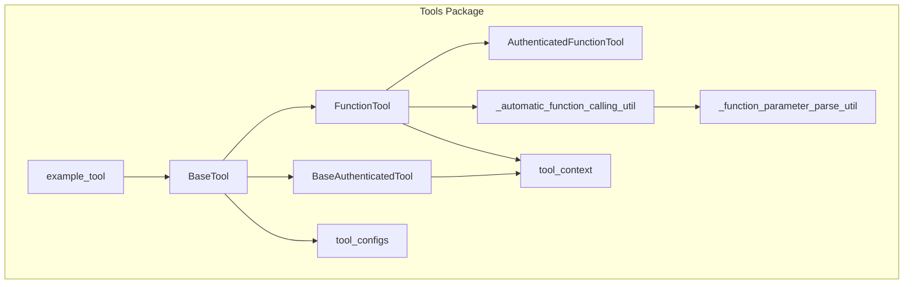
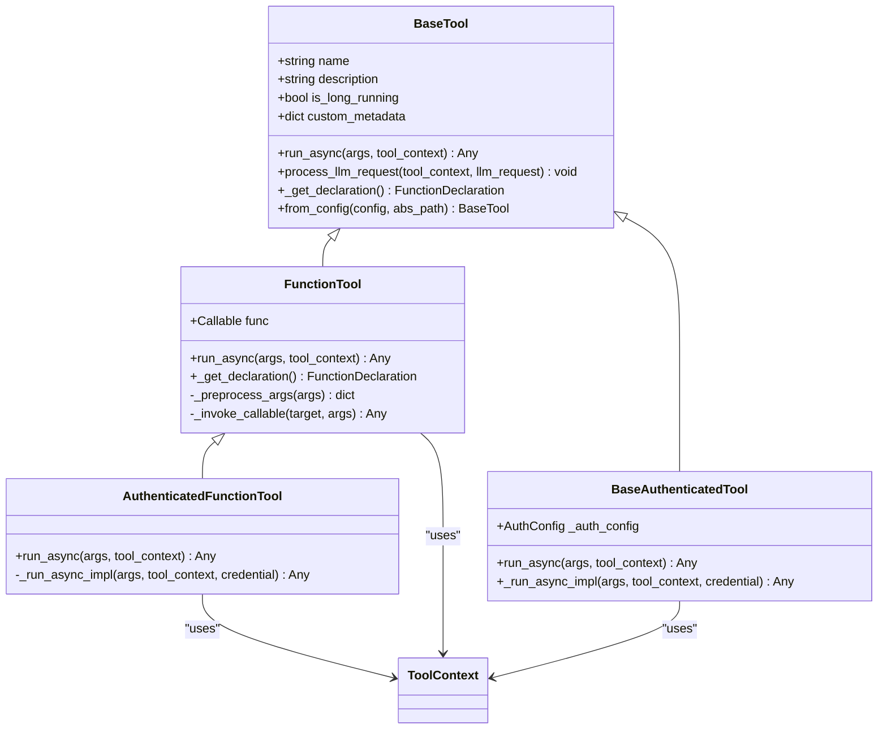
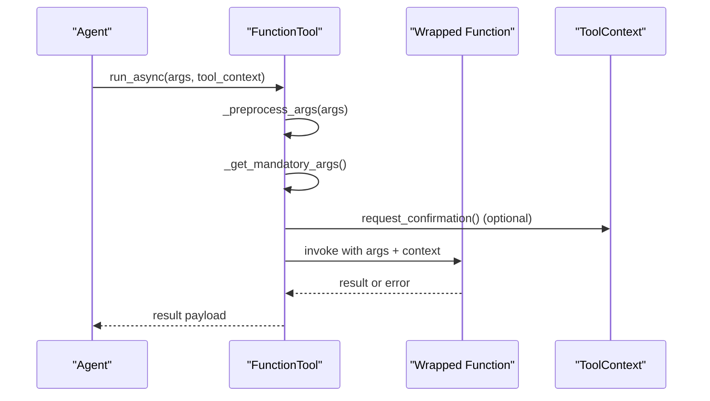
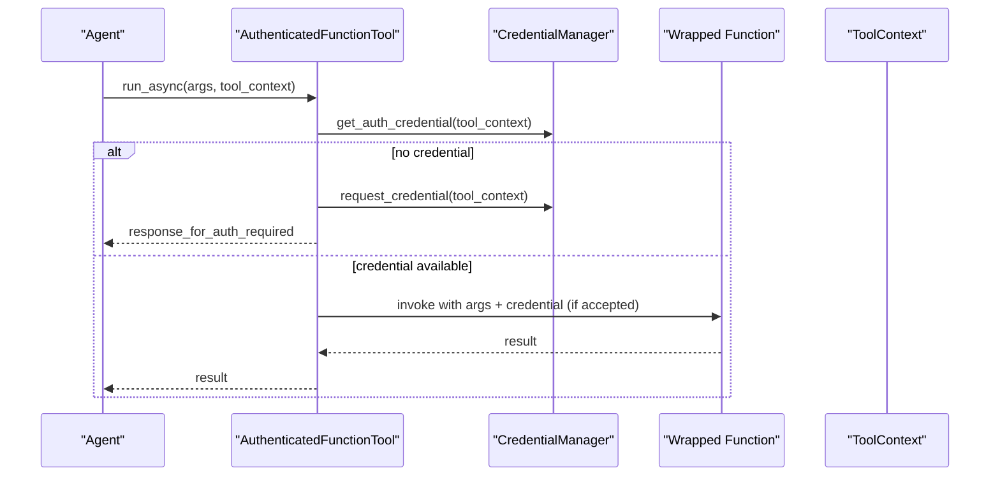
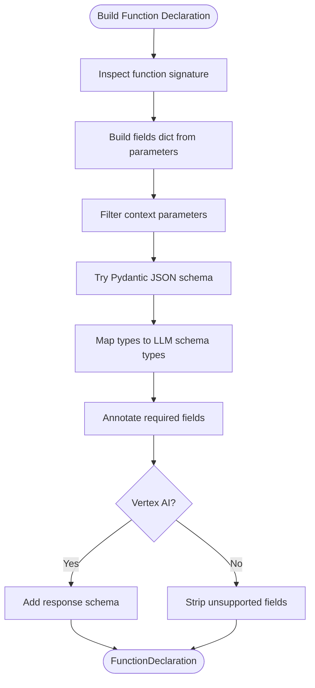
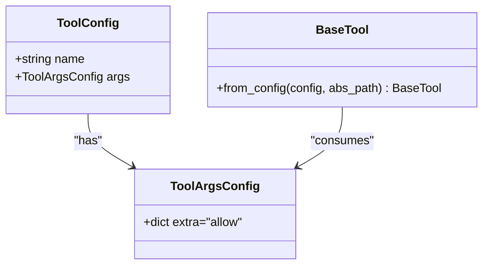
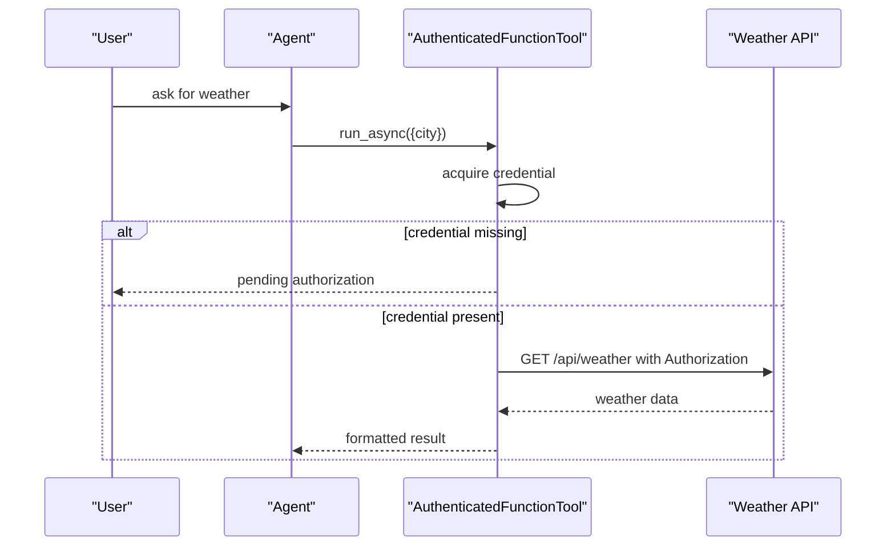
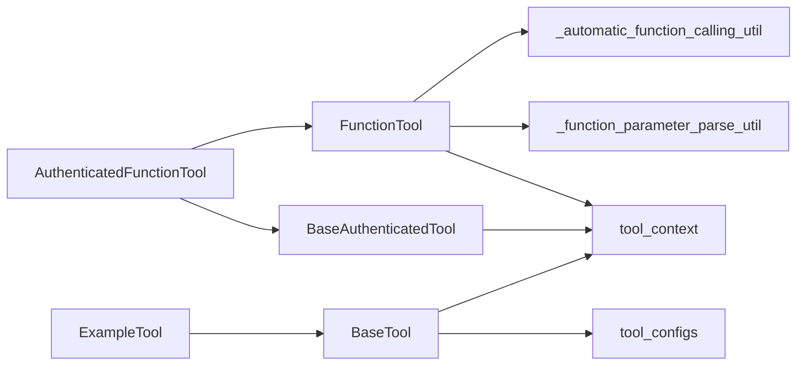

# Custom Tool Development

<cite>
**Referenced Files in This Document**
- [base_tool.py](file://src/google/adk/tools/base_tool.py)
- [function_tool.py](file://src/google/adk/tools/function_tool.py)
- [authenticated_function_tool.py](file://src/google/adk/tools/authenticated_function_tool.py)
- [base_authenticated_tool.py](file://src/google/adk/tools/base_authenticated_tool.py)
- [_automatic_function_calling_util.py](file://src/google/adk/tools/_automatic_function_calling_util.py)
- [_function_parameter_parse_util.py](file://src/google/adk/tools/_function_parameter_parse_util.py)
- [tool_configs.py](file://src/google/adk/tools/tool_configs.py)
- [tool_context.py](file://src/google/adk/tools/tool_context.py)
- [example_tool.py](file://src/google/adk/tools/example_tool.py)
- [agent.py](file://contributing/samples/oauth2_client_credentials/agent.py)
- [test_tools.py](file://tests/integration/test_tools.py)
</cite>

## Table of Contents
1. [Introduction](#introduction)
2. [Project Structure](#project-structure)
3. [Core Components](#core-components)
4. [Architecture Overview](#architecture-overview)
5. [Detailed Component Analysis](#detailed-component-analysis)
6. [Dependency Analysis](#dependency-analysis)
7. [Performance Considerations](#performance-considerations)
8. [Troubleshooting Guide](#troubleshooting-guide)
9. [Conclusion](#conclusion)
10. [Appendices](#appendices)

## Introduction
This document explains how to develop custom tools in the ADK framework. It covers the tool architecture, base classes, authentication patterns, automatic function calling utilities, parameter parsing, configuration, serialization, integration with agent workflows, testing strategies, debugging techniques, and performance optimization. The goal is to enable developers to build robust, secure, and reusable tools that integrate seamlessly with agents and LLMs.

## Project Structure
The tool system is centered in the tools package. Key areas:
- Base abstractions: BaseTool, FunctionTool, BaseAuthenticatedTool, AuthenticatedFunctionTool
- Automatic function calling and schema generation: _automatic_function_calling_util.py, _function_parameter_parse_util.py
- Tool configuration: tool_configs.py
- Tool context and integration: tool_context.py
- Examples and authentication patterns: example_tool.py, oauth2_client_credentials agent sample

**Diagram sources**
- [base_tool.py](file://src/google/adk/tools/base_tool.py#L47-L213)
- [function_tool.py](file://src/google/adk/tools/function_tool.py#L39-L292)
- [base_authenticated_tool.py](file://src/google/adk/tools/base_authenticated_tool.py#L37-L109)
- [authenticated_function_tool.py](file://src/google/adk/tools/authenticated_function_tool.py#L38-L108)
- [_automatic_function_calling_util.py](file://src/google/adk/tools/_automatic_function_calling_util.py#L204-L490)
- [_function_parameter_parse_util.py](file://src/google/adk/tools/_function_parameter_parse_util.py#L214-L434)
- [tool_configs.py](file://src/google/adk/tools/tool_configs.py#L42-L130)
- [tool_context.py](file://src/google/adk/tools/tool_context.py#L15-L31)
- [example_tool.py](file://src/google/adk/tools/example_tool.py#L37-L104)

**Section sources**
- [base_tool.py](file://src/google/adk/tools/base_tool.py#L47-L213)
- [function_tool.py](file://src/google/adk/tools/function_tool.py#L39-L292)
- [_automatic_function_calling_util.py](file://src/google/adk/tools/_automatic_function_calling_util.py#L204-L490)
- [_function_parameter_parse_util.py](file://src/google/adk/tools/_function_parameter_parse_util.py#L214-L434)
- [tool_configs.py](file://src/google/adk/tools/tool_configs.py#L42-L130)
- [tool_context.py](file://src/google/adk/tools/tool_context.py#L15-L31)
- [example_tool.py](file://src/google/adk/tools/example_tool.py#L37-L104)

## Core Components
- BaseTool: Defines the contract for all tools, including name, description, long-running flag, custom metadata, declaration retrieval, LLM request processing hook, and configuration-driven instantiation.
- FunctionTool: Wraps user-defined functions, auto-generates function declarations, validates and converts arguments, supports confirmation gating, and invokes both sync and async callables.
- BaseAuthenticatedTool: Provides a base for authenticated tools, managing credential acquisition and injection via a CredentialManager.
- AuthenticatedFunctionTool: Extends FunctionTool with authentication, injecting a credential into the function if accepted by the function signature.

Key capabilities:
- Automatic function declaration generation from function signatures and Pydantic models
- Parameter preprocessing and Pydantic model conversion
- Mandatory parameter detection and error feedback
- Confirmation gating for sensitive tools
- Authentication lifecycle and credential injection

**Section sources**
- [base_tool.py](file://src/google/adk/tools/base_tool.py#L47-L213)
- [function_tool.py](file://src/google/adk/tools/function_tool.py#L39-L292)
- [base_authenticated_tool.py](file://src/google/adk/tools/base_authenticated_tool.py#L37-L109)
- [authenticated_function_tool.py](file://src/google/adk/tools/authenticated_function_tool.py#L38-L108)

## Architecture Overview
The tool architecture integrates function wrapping, automatic schema generation, authentication, and agent integration.

**Diagram sources**
- [base_tool.py](file://src/google/adk/tools/base_tool.py#L47-L213)
- [function_tool.py](file://src/google/adk/tools/function_tool.py#L39-L292)
- [base_authenticated_tool.py](file://src/google/adk/tools/base_authenticated_tool.py#L37-L109)
- [authenticated_function_tool.py](file://src/google/adk/tools/authenticated_function_tool.py#L38-L108)
- [tool_context.py](file://src/google/adk/tools/tool_context.py#L15-L31)

## Detailed Component Analysis

### BaseTool
Responsibilities:
- Standardized identity (name, description)
- Long-running operation flag
- Custom metadata storage (must be JSON serializable)
- Function declaration retrieval hook
- LLM request processing hook (default delegates to LLM request tool appending)
- Configuration-driven construction via type hints and Pydantic models

Notable behaviors:
- Uses inspect and type hints to map configuration values to constructor arguments
- Supports resolving fully qualified names for callable fields
- Supports nested Pydantic model construction and list conversions

Integration points:
- ToolContext for runtime context
- LlmRequest for function declaration injection

**Section sources**
- [base_tool.py](file://src/google/adk/tools/base_tool.py#L47-L213)

### FunctionTool
Responsibilities:
- Wrap arbitrary callables (sync or async)
- Auto-generate FunctionDeclaration from function signatures and Pydantic models
- Preprocess arguments, including Pydantic model conversion
- Enforce mandatory parameters and return structured errors
- Support user confirmation gating via ToolContext
- Invoke callables with appropriate context and parameters

Processing logic highlights:
- Parameter filtering and context injection
- Mandatory parameter detection using inspect
- Confirmation gating with ToolContext actions
- Async/sync callable invocation

**Diagram sources**
- [function_tool.py](file://src/google/adk/tools/function_tool.py#L159-L222)

**Section sources**
- [function_tool.py](file://src/google/adk/tools/function_tool.py#L39-L292)

### BaseAuthenticatedTool and AuthenticatedFunctionTool
Responsibilities:
- Manage authentication lifecycle via CredentialManager
- Inject credentials into tool execution when available
- Request user-initiated credentials when missing or insufficient
- Provide a hook for subclasses to implement authenticated logic

Patterns:
- Credential acquisition and fallback to user authorization
- Conditional credential injection based on function signature presence
- Experimental feature markers for stability tracking

**Diagram sources**
- [authenticated_function_tool.py](file://src/google/adk/tools/authenticated_function_tool.py#L80-L108)
- [base_authenticated_tool.py](file://src/google/adk/tools/base_authenticated_tool.py#L82-L108)

**Section sources**
- [base_authenticated_tool.py](file://src/google/adk/tools/base_authenticated_tool.py#L37-L109)
- [authenticated_function_tool.py](file://src/google/adk/tools/authenticated_function_tool.py#L38-L108)

### Automatic Function Calling Utilities and Parameter Parsing
Capabilities:
- Build FunctionDeclaration from function signatures
- Infer parameter schemas from type hints and Pydantic models
- Map Python types to LLM schema types
- Handle complex generics, unions, enums, and defaults
- Generate response schemas for Vertex AI variants
- Support streaming return types by inferring yield types

Key helpers:
- build_function_declaration: orchestrates schema generation and variant handling
- _parse_schema_from_parameter: converts type annotations to Schema
- _generate_json_schema_for_parameter: fallback to Pydantic TypeAdapter
- _get_required_fields: computes required parameters

**Diagram sources**
- [_automatic_function_calling_util.py](file://src/google/adk/tools/_automatic_function_calling_util.py#L204-L315)
- [_function_parameter_parse_util.py](file://src/google/adk/tools/_function_parameter_parse_util.py#L214-L434)

**Section sources**
- [_automatic_function_calling_util.py](file://src/google/adk/tools/_automatic_function_calling_util.py#L204-L490)
- [_function_parameter_parse_util.py](file://src/google/adk/tools/_function_parameter_parse_util.py#L214-L434)

### Tool Configuration and Serialization
ToolConfig supports multiple ways to declare tools:
- Built-in tool instances or classes
- User-defined tool instances (fully qualified path)
- User-defined tool classes with args
- Functions generating tool instances
- Direct function tools

BaseTool.from_config leverages type hints and Pydantic models to construct tools from ToolArgsConfig.

**Diagram sources**
- [tool_configs.py](file://src/google/adk/tools/tool_configs.py#L42-L130)
- [base_tool.py](file://src/google/adk/tools/base_tool.py#L136-L213)

**Section sources**
- [tool_configs.py](file://src/google/adk/tools/tool_configs.py#L42-L130)
- [base_tool.py](file://src/google/adk/tools/base_tool.py#L136-L213)

### Tool Context and Integration
ToolContext is unified into Context and provides:
- Access to user content and actions
- Confirmation gating for sensitive tools
- Integration hooks for tool execution

**Section sources**
- [tool_context.py](file://src/google/adk/tools/tool_context.py#L15-L31)

### Example Tool: ExampleTool
ExampleTool demonstrates:
- Modifying LLM requests (instructions augmentation)
- Using ToolContext to access user content
- Custom from_config implementation for flexible configuration

**Section sources**
- [example_tool.py](file://src/google/adk/tools/example_tool.py#L37-L104)

### Authentication Patterns: OAuth2 Client Credentials Sample
The sample agent illustrates:
- Creating AuthConfig with OAuth2 client credentials flow
- Defining a function that accepts a credential parameter
- Constructing an AuthenticatedFunctionTool with the function and auth config
- Using the tool in an Agent’s tool list

**Diagram sources**
- [agent.py](file://contributing/samples/oauth2_client_credentials/agent.py#L67-L134)

**Section sources**
- [agent.py](file://contributing/samples/oauth2_client_credentials/agent.py#L35-L134)

## Dependency Analysis
High-level dependencies among core components:

**Diagram sources**
- [function_tool.py](file://src/google/adk/tools/function_tool.py#L39-L292)
- [_automatic_function_calling_util.py](file://src/google/adk/tools/_automatic_function_calling_util.py#L204-L490)
- [_function_parameter_parse_util.py](file://src/google/adk/tools/_function_parameter_parse_util.py#L214-L434)
- [tool_context.py](file://src/google/adk/tools/tool_context.py#L15-L31)
- [authenticated_function_tool.py](file://src/google/adk/tools/authenticated_function_tool.py#L38-L108)
- [base_authenticated_tool.py](file://src/google/adk/tools/base_authenticated_tool.py#L37-L109)
- [base_tool.py](file://src/google/adk/tools/base_tool.py#L47-L213)
- [tool_configs.py](file://src/google/adk/tools/tool_configs.py#L42-L130)
- [example_tool.py](file://src/google/adk/tools/example_tool.py#L37-L104)

**Section sources**
- [function_tool.py](file://src/google/adk/tools/function_tool.py#L39-L292)
- [authenticated_function_tool.py](file://src/google/adk/tools/authenticated_function_tool.py#L38-L108)
- [base_authenticated_tool.py](file://src/google/adk/tools/base_authenticated_tool.py#L37-L109)
- [_automatic_function_calling_util.py](file://src/google/adk/tools/_automatic_function_calling_util.py#L204-L490)
- [_function_parameter_parse_util.py](file://src/google/adk/tools/_function_parameter_parse_util.py#L214-L434)
- [tool_context.py](file://src/google/adk/tools/tool_context.py#L15-L31)
- [base_tool.py](file://src/google/adk/tools/base_tool.py#L47-L213)
- [tool_configs.py](file://src/google/adk/tools/tool_configs.py#L42-L130)
- [example_tool.py](file://src/google/adk/tools/example_tool.py#L37-L104)

## Performance Considerations
- Prefer synchronous functions when I/O is minimal to reduce overhead
- Use Pydantic models for complex parameters to leverage efficient validation and serialization
- Avoid excessive reflection by limiting dynamic schema generation to startup or configuration time
- Minimize unnecessary conversions; FunctionTool pre-processing is optimized but still adds overhead
- For streaming tools, ensure generators are properly typed to avoid expensive fallback schema generation
- Cache credentials when feasible and rely on CredentialManager to manage refresh cycles

## Troubleshooting Guide
Common issues and resolutions:
- Missing mandatory parameters: FunctionTool detects and returns structured errors listing missing arguments; ensure callers provide all required parameters
- Unsupported parameter types: Automatic function calling prefers simple signatures; fall back to manual declaration or simplify types
- Default value compatibility: Defaults must match annotated types; mismatches raise errors during schema generation
- Confirmation gating: Tools requiring confirmation must be approved by ToolContext; otherwise they return rejection messages
- Authentication failures: AuthenticatedFunctionTool requests user authorization when credentials are missing; ensure AuthConfig is correctly configured

**Section sources**
- [function_tool.py](file://src/google/adk/tools/function_tool.py#L179-L221)
- [_function_parameter_parse_util.py](file://src/google/adk/tools/_function_parameter_parse_util.py#L109-L106)
- [_function_parameter_parse_util.py](file://src/google/adk/tools/_function_parameter_parse_util.py#L168-L211)
- [authenticated_function_tool.py](file://src/google/adk/tools/authenticated_function_tool.py#L84-L94)

## Conclusion
ADK provides a robust, extensible framework for building custom tools. BaseTool establishes the foundation, FunctionTool enables seamless function wrapping with automatic schema generation, and AuthenticatedFunctionTool adds secure authentication flows. With configuration-driven instantiation, strong parameter parsing, and integration hooks, developers can create powerful tools that enhance agent capabilities while maintaining reliability and security.

## Appendices

### Step-by-Step: Building a Function-Based Tool
1. Define a function with clear type hints and docstrings
2. Wrap it with FunctionTool to auto-generate the function declaration
3. Optionally enable confirmation gating for sensitive operations
4. Integrate the tool into an Agent’s tool list
5. Test parameter passing and error handling

**Section sources**
- [function_tool.py](file://src/google/adk/tools/function_tool.py#L39-L102)
- [agent.py](file://contributing/samples/oauth2_client_credentials/agent.py#L129-L134)

### Step-by-Step: Building an Authenticated Tool
1. Create an AuthConfig with the desired authentication scheme and raw credentials
2. Define a function that accepts a credential parameter
3. Wrap the function with AuthenticatedFunctionTool and pass the AuthConfig
4. Use the tool in an Agent; the tool will inject the credential when available
5. Handle pending authorization responses gracefully

**Section sources**
- [authenticated_function_tool.py](file://src/google/adk/tools/authenticated_function_tool.py#L44-L78)
- [agent.py](file://contributing/samples/oauth2_client_credentials/agent.py#L35-L64)
- [agent.py](file://contributing/samples/oauth2_client_credentials/agent.py#L129-L134)

### Testing Strategies
- Unit tests for function signatures and schema generation
- Integration tests validating tool execution and LLM request modifications
- Authentication tests verifying credential acquisition and injection
- Confirmatory tool tests ensuring proper gating and user approval flows

**Section sources**
- [test_tools.py](file://tests/integration/test_tools.py)

### Debugging Techniques
- Enable logging for tool execution and schema generation
- Inspect ToolContext actions and confirmations
- Validate function signatures and type hints
- Use minimal reproducible examples to isolate parameter parsing issues

### Templates and Best Practices
- Keep function signatures simple for automatic schema generation
- Use Pydantic models for complex inputs and outputs
- Clearly document tool purpose and parameters via docstrings
- Implement from_config for flexible instantiation from YAML/JSON configs
- Prefer explicit error messages for missing mandatory parameters
- Use confirmation gating for tools that modify state or access sensitive data