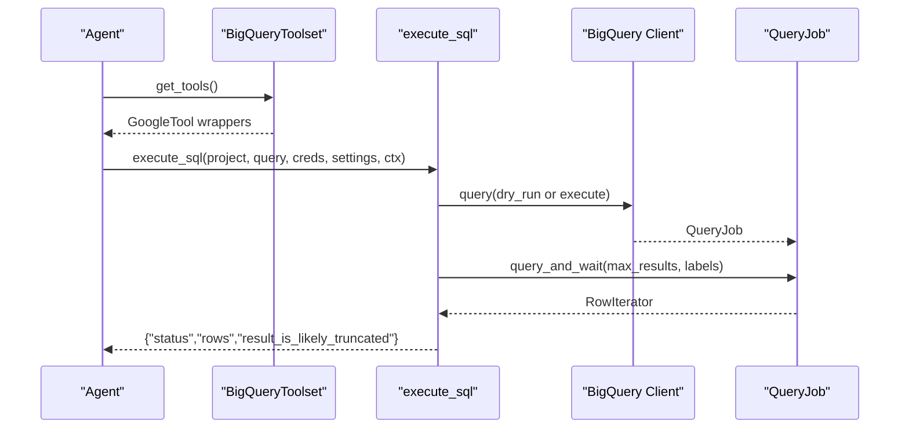
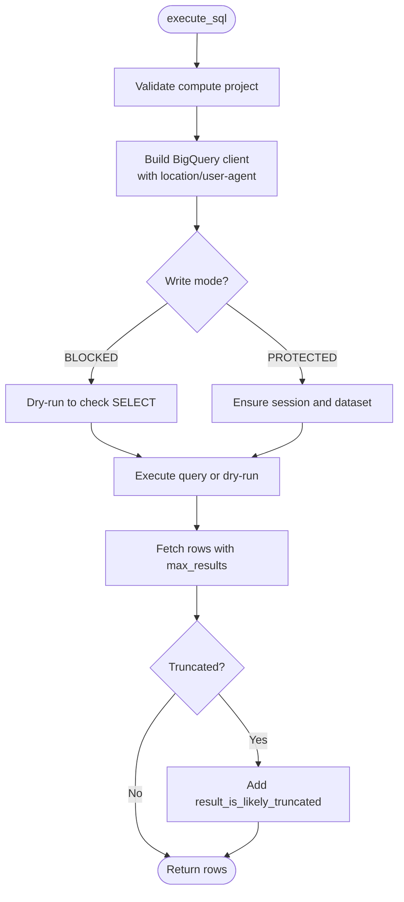
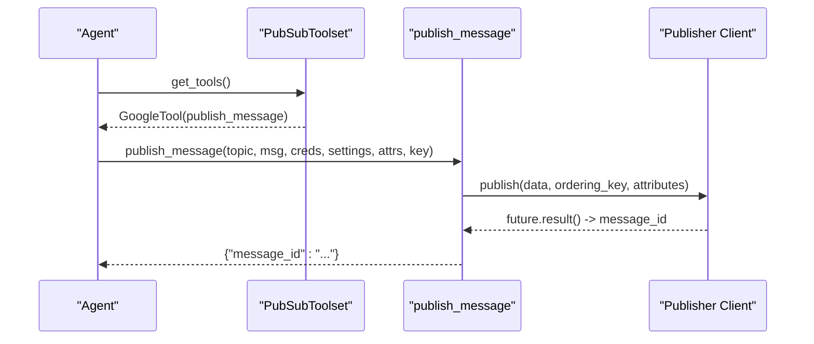
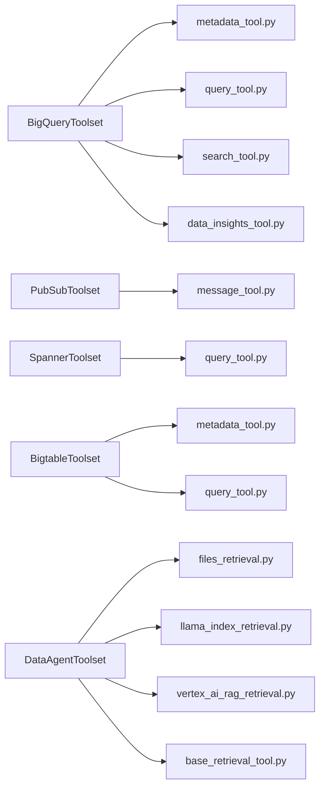

# Data Retrieval and Storage Tools

<cite>
**Referenced Files in This Document**
- [bigquery_toolset.py](file://src/google/adk/tools/bigquery/bigquery_toolset.py)
- [query_tool.py](file://src/google/adk/tools/bigquery/query_tool.py)
- [data_insights_tool.py](file://src/google/adk/tools/bigquery/data_insights_tool.py)
- [metadata_tool.py](file://src/google/adk/tools/bigquery/metadata_tool.py)
- [search_tool.py](file://src/google/adk/tools/bigquery/search_tool.py)
- [pubsub_toolset.py](file://src/google/adk/tools/pubsub/pubsub_toolset.py)
- [message_tool.py](file://src/google/adk/tools/pubsub/message_tool.py)
- [spanner_toolset.py](file://src/google/adk/tools/spanner/spanner_toolset.py)
- [query_tool.py](file://src/google/adk/tools/spanner/query_tool.py)
- [bigtable_toolset.py](file://src/google/adk/tools/bigtable/bigtable_toolset.py)
- [data_agent_toolset.py](file://src/google/adk/tools/data_agent/data_agent_toolset.py)
- [files_retrieval.py](file://src/google/adk/tools/retrieval/files_retrieval.py)
- [llama_index_retrieval.py](file://src/google/adk/tools/retrieval/llama_index_retrieval.py)
- [vertex_ai_rag_retrieval.py](file://src/google/adk/tools/retrieval/vertex_ai_rag_retrieval.py)
- [base_retrieval_tool.py](file://src/google/adk/tools/retrieval/base_retrieval_tool.py)
</cite>

## Table of Contents
1. [Introduction](#introduction)
2. [Project Structure](#project-structure)
3. [Core Components](#core-components)
4. [Architecture Overview](#architecture-overview)
5. [Detailed Component Analysis](#detailed-component-analysis)
6. [Dependency Analysis](#dependency-analysis)
7. [Performance Considerations](#performance-considerations)
8. [Troubleshooting Guide](#troubleshooting-guide)
9. [Conclusion](#conclusion)

## Introduction
This document explains the data retrieval and storage tools in ADK, focusing on:
- BigQuery tools for query execution, metadata operations, and data insights
- Pub/Sub tools for message publishing and subscription handling
- Spanner tools for relational database operations and Spanner-specific features
- BigTable tools for NoSQL operations and column-family management
- Data Agent tools for unified data access patterns
- Retrieval tools covering file-based retrieval, LlamaIndex integration, and Vertex AI RAG retrieval

It covers configuration, authentication, query patterns, performance optimization, transformation, filtering, aggregation, security, and practical examples of combining retrieval tools with agent workflows.

## Project Structure
The relevant tool modules are organized by technology domain under src/google/adk/tools/. Each toolset exposes a collection of tools that wrap Google Cloud SDKs and provide guardrails and convenience features.

```mermaid
graph TB
subgraph "BigQuery"
BQTS["BigQueryToolset"]
BQExec["execute_sql"]
BQF["forecast"]
BQA["analyze_contribution"]
BQD["detect_anomalies"]
BQDI["ask_data_insights"]
end
subgraph "Pub/Sub"
PSTS["PubSubToolset"]
PSM["publish_message"]
PSP["pull_messages"]
PSA["acknowledge_messages"]
end
subgraph "Spanner"
SPTS["SpannerToolset"]
SQ["execute_sql"]
end
subgraph "BigTable"
BTS["BigtableToolset"]
end
subgraph "Data Agent"
DATS["DataAgentToolset"]
end
subgraph "Retrieval"
FR["FilesRetrieval"]
LR["LlamaIndexRetrieval"]
VR["VertexAIRAGRetrieval"]
BR["BaseRetrievalTool"]
end
BQTS --> BQExec
BQTS --> BQF
BQTS --> BQA
BQTS --> BQD
BQTS --> BQDI
PSTS --> PSM
PSTS --> PSP
PSTS --> PSA
SPTS --> SQ
DATS --> FR
DATS --> LR
DATS --> VR
DATS --> BR
```

**Diagram sources**
- [bigquery_toolset.py](file://src/google/adk/tools/bigquery/bigquery_toolset.py#L38-L104)
- [query_tool.py](file://src/google/adk/tools/bigquery/query_tool.py#L198-L292)
- [data_insights_tool.py](file://src/google/adk/tools/bigquery/data_insights_tool.py#L31-L166)
- [pubsub_toolset.py](file://src/google/adk/tools/pubsub/pubsub_toolset.py#L32-L100)
- [message_tool.py](file://src/google/adk/tools/pubsub/message_tool.py#L27-L188)
- [spanner_toolset.py](file://src/google/adk/tools/spanner/spanner_toolset.py#L40-L147)
- [query_tool.py](file://src/google/adk/tools/spanner/query_tool.py#L30-L192)
- [bigtable_toolset.py](file://src/google/adk/tools/bigtable/bigtable_toolset.py#L38-L110)
- [data_agent_toolset.py](file://src/google/adk/tools/data_agent/data_agent_toolset.py)
- [files_retrieval.py](file://src/google/adk/tools/retrieval/files_retrieval.py)
- [llama_index_retrieval.py](file://src/google/adk/tools/retrieval/llama_index_retrieval.py)
- [vertex_ai_rag_retrieval.py](file://src/google/adk/tools/retrieval/vertex_ai_rag_retrieval.py)
- [base_retrieval_tool.py](file://src/google/adk/tools/retrieval/base_retrieval_tool.py)

**Section sources**
- [bigquery_toolset.py](file://src/google/adk/tools/bigquery/bigquery_toolset.py#L38-L104)
- [pubsub_toolset.py](file://src/google/adk/tools/pubsub/pubsub_toolset.py#L32-L100)
- [spanner_toolset.py](file://src/google/adk/tools/spanner/spanner_toolset.py#L40-L147)
- [bigtable_toolset.py](file://src/google/adk/tools/bigtable/bigtable_toolset.py#L38-L110)
- [data_agent_toolset.py](file://src/google/adk/tools/data_agent/data_agent_toolset.py)
- [files_retrieval.py](file://src/google/adk/tools/retrieval/files_retrieval.py)
- [llama_index_retrieval.py](file://src/google/adk/tools/retrieval/llama_index_retrieval.py)
- [vertex_ai_rag_retrieval.py](file://src/google/adk/tools/retrieval/vertex_ai_rag_retrieval.py)
- [base_retrieval_tool.py](file://src/google/adk/tools/retrieval/base_retrieval_tool.py)

## Core Components
- BigQueryToolset: Aggregates metadata, query, forecasting, anomaly detection, contribution analysis, and data insights tools. Provides guarded execution modes (blocked, protected) and session-aware writes.
- PubSubToolset: Provides publish, pull, and acknowledge operations with ordering and attributes support.
- SpannerToolset: Exposes metadata and query tools, plus similarity/vector search depending on capabilities and settings.
- BigtableToolset: Exposes metadata and SQL execution tools for BigTable.
- DataAgentToolset: Unified access patterns for data operations across retrieval tools.
- Retrieval tools: Files, LlamaIndex, and Vertex AI RAG retrieval abstractions.

Key configuration and security features:
- Write-mode guardrails (BigQuery): BLOCKED prevents DML/DDL; PROTECTED restricts to temporary artifacts within a session.
- Job labels and user-agent tagging for observability.
- Maximum bytes billed limits and result truncation warnings.
- Access token validation for BigQuery data insights.

**Section sources**
- [bigquery_toolset.py](file://src/google/adk/tools/bigquery/bigquery_toolset.py#L38-L104)
- [query_tool.py](file://src/google/adk/tools/bigquery/query_tool.py#L35-L196)
- [data_insights_tool.py](file://src/google/adk/tools/bigquery/data_insights_tool.py#L31-L166)
- [pubsub_toolset.py](file://src/google/adk/tools/pubsub/pubsub_toolset.py#L32-L100)
- [message_tool.py](file://src/google/adk/tools/pubsub/message_tool.py#L27-L188)
- [spanner_toolset.py](file://src/google/adk/tools/spanner/spanner_toolset.py#L40-L147)
- [query_tool.py](file://src/google/adk/tools/spanner/query_tool.py#L30-L192)
- [bigtable_toolset.py](file://src/google/adk/tools/bigtable/bigtable_toolset.py#L38-L110)
- [data_agent_toolset.py](file://src/google/adk/tools/data_agent/data_agent_toolset.py)
- [files_retrieval.py](file://src/google/adk/tools/retrieval/files_retrieval.py)
- [llama_index_retrieval.py](file://src/google/adk/tools/retrieval/llama_index_retrieval.py)
- [vertex_ai_rag_retrieval.py](file://src/google/adk/tools/retrieval/vertex_ai_rag_retrieval.py)
- [base_retrieval_tool.py](file://src/google/adk/tools/retrieval/base_retrieval_tool.py)

## Architecture Overview
The toolsets are layered abstractions over Google Cloud SDKs. Each tool receives credentials, settings, and optional tool context. Guardrails and session management are enforced centrally in BigQuery.

**Diagram sources**
- [bigquery_toolset.py](file://src/google/adk/tools/bigquery/bigquery_toolset.py#L70-L99)
- [query_tool.py](file://src/google/adk/tools/bigquery/query_tool.py#L35-L196)

## Detailed Component Analysis

### BigQuery Tools
- Query execution
  - execute_sql: Supports dry-run, job labels, maximum bytes billed, and result truncation warnings. Enforces write-mode restrictions and session-aware temporary artifacts.
  - get_execute_sql: Returns a wrapper with adjusted docstrings for PROTECTED vs BLOCKED modes.
- Analytics and insights
  - forecast: Uses AI.FORECAST with configurable horizon and id_cols.
  - detect_anomalies: Trains ARIMA_PLUS models and detects anomalies with thresholds.
  - analyze_contribution: Creates temporary contribution analysis models and retrieves insights.
- Data insights
  - ask_data_insights: Streams a GenAI-powered chat with BigQuery context, returning a step-by-step log of SQL generation, retrieval, and answers.
- Metadata and catalog
  - Metadata tools: Dataset/table info, listing, and job info.
  - Catalog search: Search across BigQuery data catalog.

Security and configuration highlights:
- WriteMode.BLOCKED: SELECT only; rejects DML/DDL.
- WriteMode.PROTECTED: Allows SELECT and writes only to session-scoped anonymous datasets; persists session info in tool context.
- Job labels and application name tagging for cost tracking.
- Access token requirement for data insights.

Practical patterns:
- Dry-run before execution to validate and estimate costs.
- Use session-aware writes for temporary artifacts in PROTECTED mode.
- Limit result sets via max_query_result_rows to avoid truncation surprises.

**Section sources**
- [query_tool.py](file://src/google/adk/tools/bigquery/query_tool.py#L35-L196)
- [query_tool.py](file://src/google/adk/tools/bigquery/query_tool.py#L767-L938)
- [query_tool.py](file://src/google/adk/tools/bigquery/query_tool.py#L941-L1138)
- [query_tool.py](file://src/google/adk/tools/bigquery/query_tool.py#L1141-L1372)
- [data_insights_tool.py](file://src/google/adk/tools/bigquery/data_insights_tool.py#L31-L166)
- [bigquery_toolset.py](file://src/google/adk/tools/bigquery/bigquery_toolset.py#L70-L99)

#### BigQuery Execution Flow

**Diagram sources**
- [query_tool.py](file://src/google/adk/tools/bigquery/query_tool.py#L35-L196)

### Pub/Sub Tools
- publish_message: Encodes UTF-8 or falls back to base64; supports ordering keys and attributes.
- pull_messages: Pulls up to N messages; optionally auto-acknowledges; decodes data safely.
- acknowledge_messages: Acknowledges messages by ack_ids.

Operational tips:
- Use ordering_key for message ordering.
- Auto-ack only when appropriate to avoid message loss.
- Handle decoding gracefully for binary payloads.

**Section sources**
- [pubsub_toolset.py](file://src/google/adk/tools/pubsub/pubsub_toolset.py#L72-L94)
- [message_tool.py](file://src/google/adk/tools/pubsub/message_tool.py#L27-L188)

#### Pub/Sub Message Flow

**Diagram sources**
- [pubsub_toolset.py](file://src/google/adk/tools/pubsub/pubsub_toolset.py#L72-L94)
- [message_tool.py](file://src/google/adk/tools/pubsub/message_tool.py#L27-L74)

### Spanner Tools
- SpannerToolset: Exposes metadata tools and conditionally adds query and similarity/vector search tools based on capabilities and settings.
- execute_sql: Runs read-only queries asynchronously; supports dict-list result mode via wrapper.

Best practices:
- Use read-only transactions for analytics queries.
- Configure query result mode to match downstream expectations.
- Gate advanced features behind capability flags.

**Section sources**
- [spanner_toolset.py](file://src/google/adk/tools/spanner/spanner_toolset.py#L40-L147)
- [query_tool.py](file://src/google/adk/tools/spanner/query_tool.py#L30-L192)

### BigTable Tools
- BigtableToolset: Exposes metadata tools (instances, tables, clusters) and SQL execution.

Usage:
- Use metadata tools to discover instances/tables/clusters.
- Execute SQL for ad-hoc analytics.

**Section sources**
- [bigtable_toolset.py](file://src/google/adk/tools/bigtable/bigtable_toolset.py#L38-L110)

### Data Agent Tools
- DataAgentToolset: Unified toolset for data access patterns across retrieval tools.

Integration:
- Compose with retrieval tools to provide a cohesive data access layer.

**Section sources**
- [data_agent_toolset.py](file://src/google/adk/tools/data_agent/data_agent_toolset.py)

### Retrieval Tools
- FilesRetrieval: File-based retrieval utilities.
- LlamaIndexRetrieval: Integration with LlamaIndex for retrieval.
- VertexAIRAGRetrieval: Vertex AI RAG retrieval.
- BaseRetrievalTool: Shared base for retrieval tools.

Patterns:
- Normalize retrieval results for downstream consumption.
- Support transformation and filtering at retrieval boundaries.
- Aggregate results across multiple retrievers.

**Section sources**
- [files_retrieval.py](file://src/google/adk/tools/retrieval/files_retrieval.py)
- [llama_index_retrieval.py](file://src/google/adk/tools/retrieval/llama_index_retrieval.py)
- [vertex_ai_rag_retrieval.py](file://src/google/adk/tools/retrieval/vertex_ai_rag_retrieval.py)
- [base_retrieval_tool.py](file://src/google/adk/tools/retrieval/base_retrieval_tool.py)

## Dependency Analysis
- BigQueryToolset depends on metadata, query, search, and data-insights modules; orchestrates guarded execution.
- PubSubToolset depends on message_tool and client utilities.
- SpannerToolset conditionally includes query and search tools based on capabilities.
- BigtableToolset depends on metadata and query modules.
- DataAgentToolset composes retrieval tools for unified access.
- Retrieval tools depend on base retrieval abstractions.

**Diagram sources**
- [bigquery_toolset.py](file://src/google/adk/tools/bigquery/bigquery_toolset.py#L24-L27)
- [pubsub_toolset.py](file://src/google/adk/tools/pubsub/pubsub_toolset.py#L20-L21)
- [spanner_toolset.py](file://src/google/adk/tools/spanner/spanner_toolset.py#L22-L24)
- [bigtable_toolset.py](file://src/google/adk/tools/bigtable/bigtable_toolset.py#L24-L25)
- [data_agent_toolset.py](file://src/google/adk/tools/data_agent/data_agent_toolset.py)
- [files_retrieval.py](file://src/google/adk/tools/retrieval/files_retrieval.py)
- [llama_index_retrieval.py](file://src/google/adk/tools/retrieval/llama_index_retrieval.py)
- [vertex_ai_rag_retrieval.py](file://src/google/adk/tools/retrieval/vertex_ai_rag_retrieval.py)
- [base_retrieval_tool.py](file://src/google/adk/tools/retrieval/base_retrieval_tool.py)

**Section sources**
- [bigquery_toolset.py](file://src/google/adk/tools/bigquery/bigquery_toolset.py#L24-L27)
- [pubsub_toolset.py](file://src/google/adk/tools/pubsub/pubsub_toolset.py#L20-L21)
- [spanner_toolset.py](file://src/google/adk/tools/spanner/spanner_toolset.py#L22-L24)
- [bigtable_toolset.py](file://src/google/adk/tools/bigtable/bigtable_toolset.py#L24-L25)
- [data_agent_toolset.py](file://src/google/adk/tools/data_agent/data_agent_toolset.py)
- [files_retrieval.py](file://src/google/adk/tools/retrieval/files_retrieval.py)
- [llama_index_retrieval.py](file://src/google/adk/tools/retrieval/llama_index_retrieval.py)
- [vertex_ai_rag_retrieval.py](file://src/google/adk/tools/retrieval/vertex_ai_rag_retrieval.py)
- [base_retrieval_tool.py](file://src/google/adk/tools/retrieval/base_retrieval_tool.py)

## Performance Considerations
- BigQuery
  - Use dry-run to estimate costs and plan queries.
  - Set maximum_bytes_billed to cap spend.
  - Limit max_query_result_rows to reduce payload sizes.
  - Prefer session-aware writes (PROTECTED) for temporary artifacts to keep workloads efficient.
- Pub/Sub
  - Tune max_messages per pull to balance throughput and latency.
  - Use ordering_key only when necessary to preserve ordering overhead.
- Spanner
  - Use read-only transactions for analytics.
  - Choose dict-list result mode for structured downstream processing.
- BigTable
  - Use metadata tools to discover optimal table layouts and indexes.
- Retrieval
  - Normalize and truncate results early to minimize downstream processing.
  - Combine multiple retrievers and aggregate scores to improve recall.

[No sources needed since this section provides general guidance]

## Troubleshooting Guide
- BigQuery
  - Write-mode errors: BLOCKED rejects DML/DDL; PROTECTED requires session-scoped anonymous datasets.
  - Access token errors for data insights: Ensure valid access token in credentials.
  - Cost overrun: Set maximum_bytes_billed and monitor job labels.
- Pub/Sub
  - Publish failures: Inspect error details and retry with proper attributes/ordering.
  - Pull failures: Verify subscription exists and credentials have required scopes.
- Spanner
  - Query timeouts: Use smaller result sets or optimize queries.
  - Capability gating: Ensure capabilities include DATA_READ for query tools.
- BigTable
  - Metadata lookup failures: Confirm instance/table identifiers.
- Retrieval
  - Normalization issues: Ensure consistent schema across retrievers.
  - Filtering/aggregation: Validate filters and aggregation logic.

**Section sources**
- [query_tool.py](file://src/google/adk/tools/bigquery/query_tool.py#L35-L196)
- [data_insights_tool.py](file://src/google/adk/tools/bigquery/data_insights_tool.py#L117-L166)
- [message_tool.py](file://src/google/adk/tools/pubsub/message_tool.py#L49-L74)
- [spanner_toolset.py](file://src/google/adk/tools/spanner/spanner_toolset.py#L109-L136)
- [bigtable_toolset.py](file://src/google/adk/tools/bigtable/bigtable_toolset.py#L84-L110)

## Conclusion
ADK’s retrieval and storage tools provide a secure, configurable, and high-level interface to Google Cloud data services. Guardrails, session-aware operations, and unified toolsets streamline agent-driven data workflows. By leveraging dry-run, cost caps, and capability flags, teams can build robust, scalable data-driven agents that transform, filter, and aggregate insights efficiently.