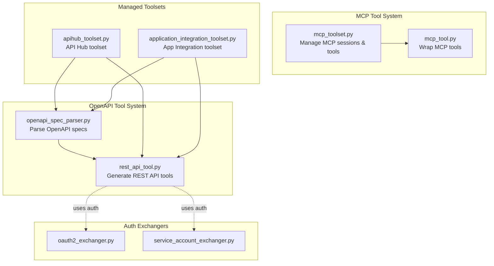
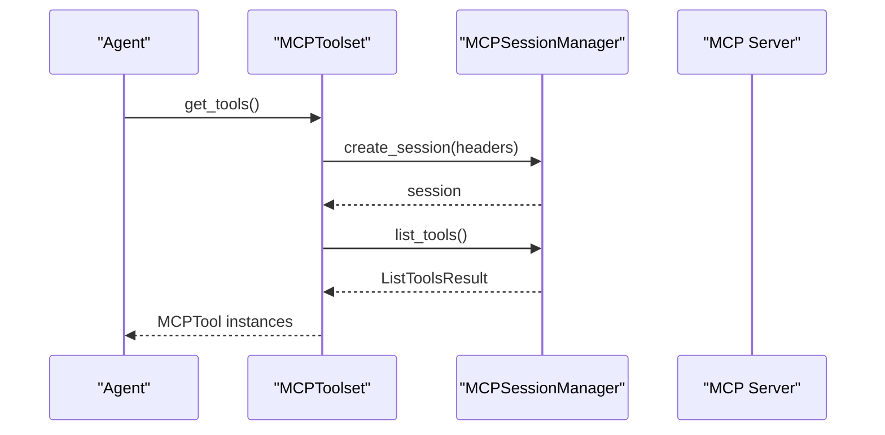
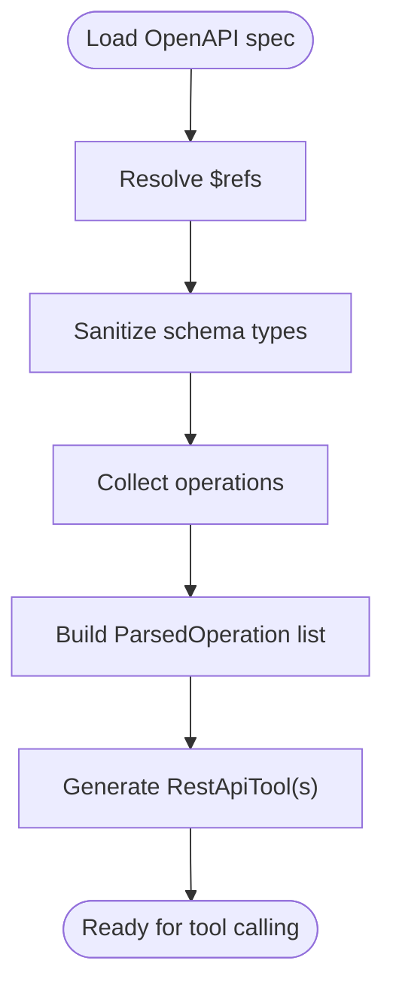
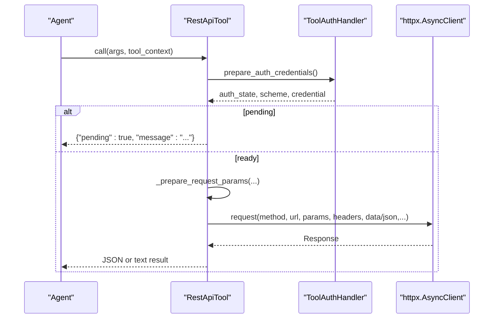
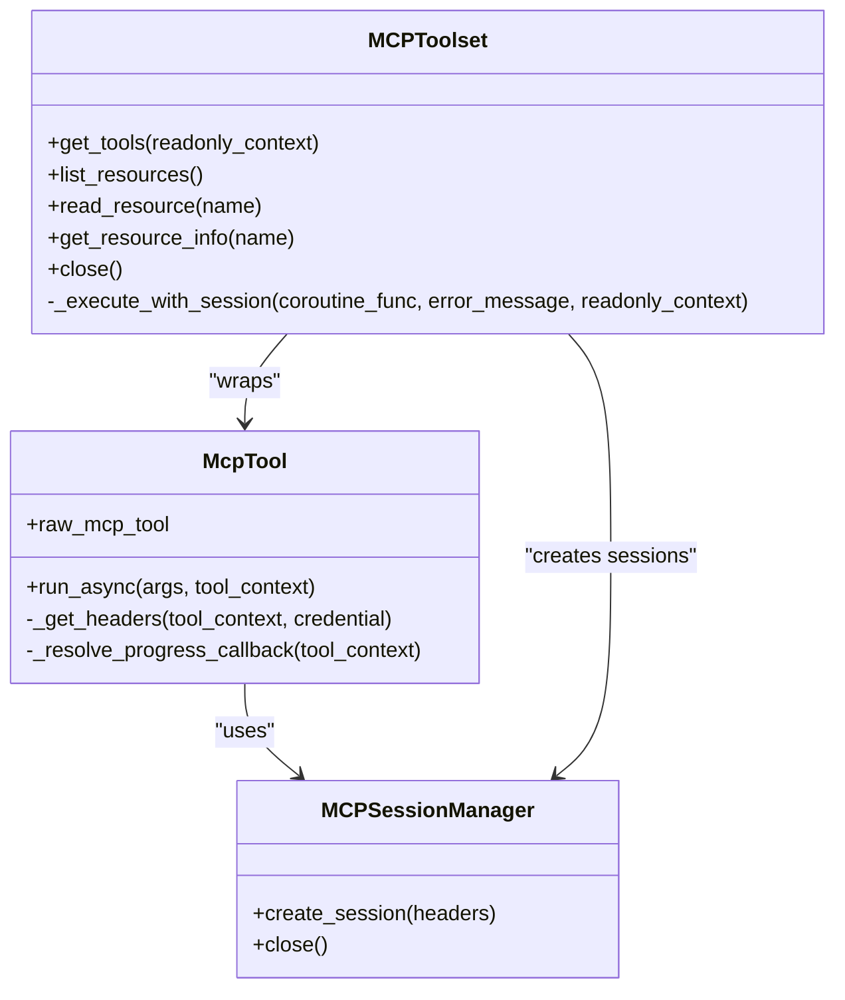
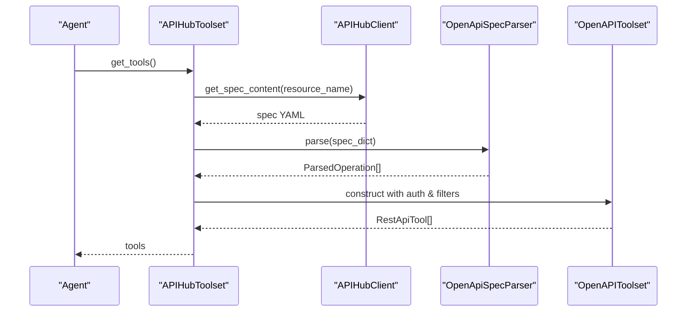
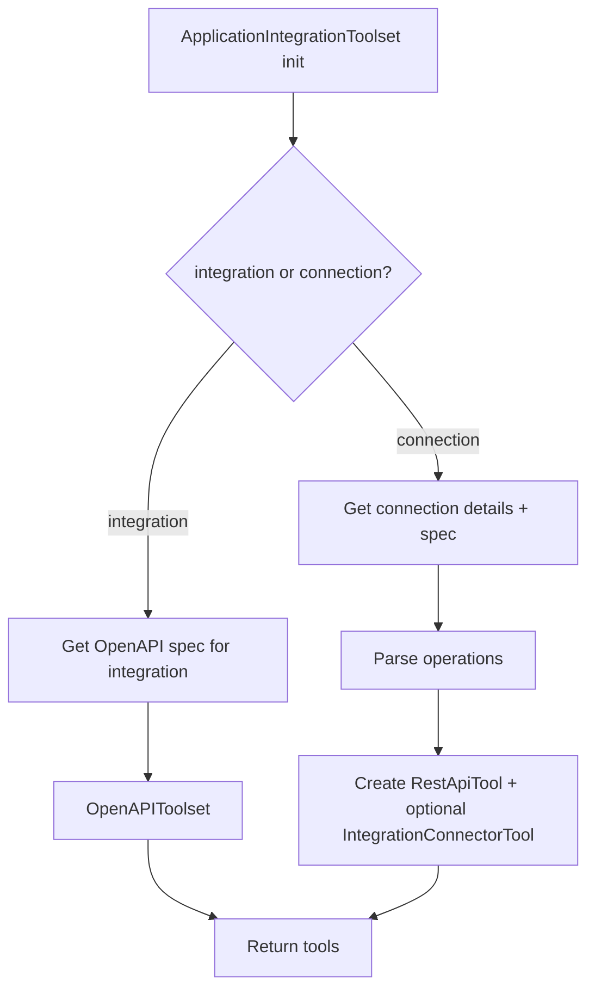
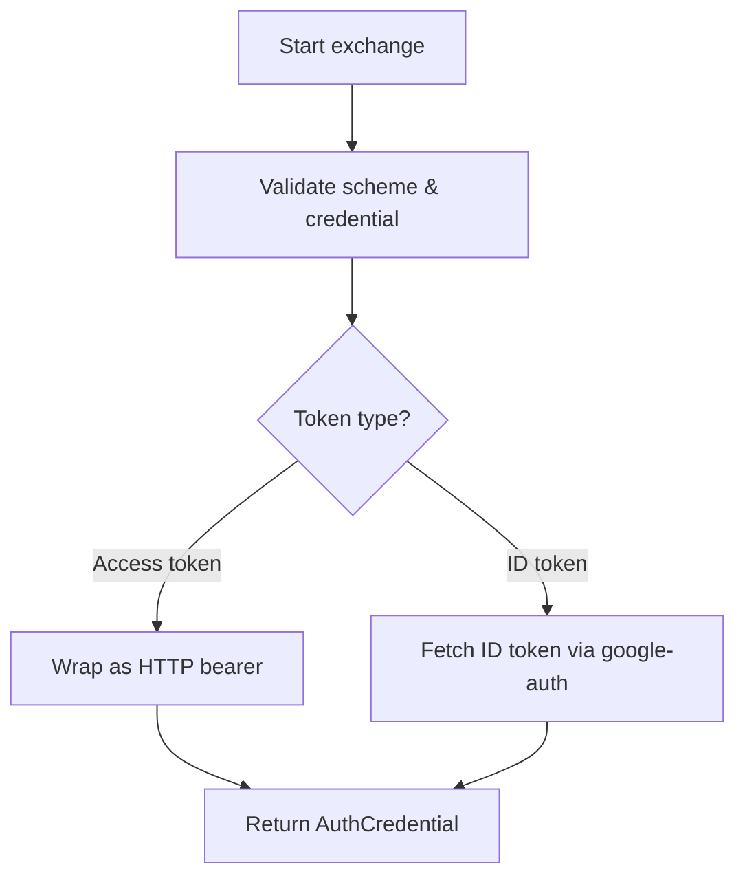
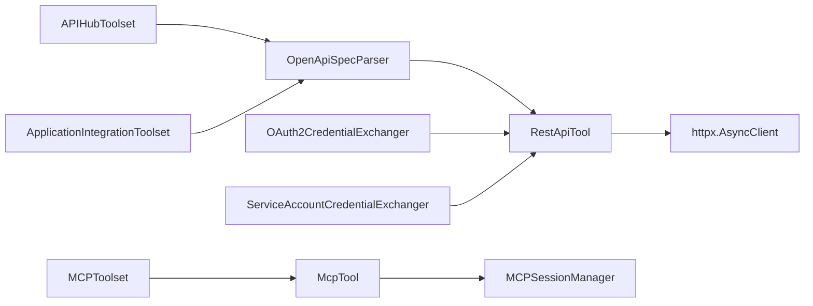

# OpenAPI and MCP Integration

<cite>
**Referenced Files in This Document**
- [openapi_spec_parser.py](file://src/google/adk/tools/openapi_tool/openapi_spec_parser/openapi_spec_parser.py)
- [rest_api_tool.py](file://src/google/adk/tools/openapi_tool/openapi_spec_parser/rest_api_tool.py)
- [mcp_tool.py](file://src/google/adk/tools/mcp_tool/mcp_tool.py)
- [mcp_toolset.py](file://src/google/adk/tools/mcp_tool/mcp_toolset.py)
- [apihub_toolset.py](file://src/google/adk/tools/apihub_tool/apihub_toolset.py)
- [application_integration_toolset.py](file://src/google/adk/tools/application_integration_tool/application_integration_toolset.py)
- [oauth2_exchanger.py](file://src/google/adk/tools/openapi_tool/auth/credential_exchangers/oauth2_exchanger.py)
- [service_account_exchanger.py](file://src/google/adk/tools/openapi_tool/auth/credential_exchangers/service_account_exchanger.py)
- [__init__.py (OpenAPI)](file://src/google/adk/tools/openapi_tool/__init__.py)
- [__init__.py (MCP)](file://src/google/adk/tools/mcp_tool/__init__.py)
- [__init__.py (API Hub)](file://src/google/adk/tools/apihub_tool/__init__.py)
- [__init__.py (Application Integration)](file://src/google/adk/tools/application_integration_tool/__init__.py)
</cite>

## Table of Contents
1. [Introduction](#introduction)
2. [Project Structure](#project-structure)
3. [Core Components](#core-components)
4. [Architecture Overview](#architecture-overview)
5. [Detailed Component Analysis](#detailed-component-analysis)
6. [Dependency Analysis](#dependency-analysis)
7. [Performance Considerations](#performance-considerations)
8. [Troubleshooting Guide](#troubleshooting-guide)
9. [Conclusion](#conclusion)
10. [Appendices](#appendices)

## Introduction
This document explains how the ADK tools integrate OpenAPI specifications and the Model Context Protocol (MCP). It covers:
- OpenAPI tool system: spec parsing, operation extraction, and dynamic tool generation into REST API tools
- MCP tool integration: session management, resource loading, and progress callbacks
- API Hub integration for managed API toolsets
- Application Integration toolsets for connecting to external applications
- Authentication flows for OpenAPI tools: OAuth2, service accounts, and custom schemes
- Practical examples and guidance for configuration, parameter mapping, response handling, error management, streaming, progress callbacks, and server-sent events
- Debugging tips and performance optimization strategies

## Project Structure
The OpenAPI and MCP integration lives primarily under the tools package:
- OpenAPI tool system: parsing, operation extraction, and REST API tool generation
- MCP tool system: tool wrapping, session management, and resource loading
- API Hub and Application Integration toolsets that produce OpenAPI-backed tools
- Credential exchange utilities for OAuth2 and service accounts

**Diagram sources**
- [openapi_spec_parser.py](file://src/google/adk/tools/openapi_tool/openapi_spec_parser/openapi_spec_parser.py#L67-L327)
- [rest_api_tool.py](file://src/google/adk/tools/openapi_tool/openapi_spec_parser/rest_api_tool.py#L79-L577)
- [mcp_tool.py](file://src/google/adk/tools/mcp_tool/mcp_tool.py#L116-L471)
- [mcp_toolset.py](file://src/google/adk/tools/mcp_tool/mcp_toolset.py#L64-L488)
- [apihub_toolset.py](file://src/google/adk/tools/apihub_tool/apihub_toolset.py#L36-L212)
- [application_integration_toolset.py](file://src/google/adk/tools/application_integration_tool/application_integration_toolset.py#L46-L302)
- [oauth2_exchanger.py](file://src/google/adk/tools/openapi_tool/auth/credential_exchangers/oauth2_exchanger.py#L30-L120)
- [service_account_exchanger.py](file://src/google/adk/tools/openapi_tool/auth/credential_exchangers/service_account_exchanger.py#L37-L196)

**Section sources**
- [__init__.py (OpenAPI)](file://src/google/adk/tools/openapi_tool/__init__.py#L15-L22)
- [__init__.py (MCP)](file://src/google/adk/tools/mcp_tool/__init__.py#L17-L38)
- [__init__.py (API Hub)](file://src/google/adk/tools/apihub_tool/__init__.py#L15-L20)
- [__init__.py (Application Integration)](file://src/google/adk/tools/application_integration_tool/__init__.py#L15-L22)

## Core Components
- OpenAPI Spec Parser: Resolves references, sanitizes schemas, collects operations, and produces parsed operation objects with endpoint, parameters, and auth metadata.
- REST API Tool: Wraps a parsed operation into a callable tool that builds request parameters, attaches auth, and executes HTTP calls.
- MCP Tool and Toolset: Wrap MCP tools, manage sessions, inject headers, support progress callbacks, and optionally load MCP resources.
- API Hub Toolset: Fetches managed API specs from API Hub and generates OpenAPI-backed tools.
- Application Integration Toolset: Builds tools from Integration Connector or Integration API specs, optionally using service account credentials.
- Auth Exchangers: Convert OAuth2 and service account credentials into bearer tokens suitable for HTTP calls.

**Section sources**
- [openapi_spec_parser.py](file://src/google/adk/tools/openapi_tool/openapi_spec_parser/openapi_spec_parser.py#L67-L327)
- [rest_api_tool.py](file://src/google/adk/tools/openapi_tool/openapi_spec_parser/rest_api_tool.py#L79-L577)
- [mcp_tool.py](file://src/google/adk/tools/mcp_tool/mcp_tool.py#L116-L471)
- [mcp_toolset.py](file://src/google/adk/tools/mcp_tool/mcp_toolset.py#L64-L488)
- [apihub_toolset.py](file://src/google/adk/tools/apihub_tool/apihub_toolset.py#L36-L212)
- [application_integration_toolset.py](file://src/google/adk/tools/application_integration_tool/application_integration_toolset.py#L46-L302)
- [oauth2_exchanger.py](file://src/google/adk/tools/openapi_tool/auth/credential_exchangers/oauth2_exchanger.py#L30-L120)
- [service_account_exchanger.py](file://src/google/adk/tools/openapi_tool/auth/credential_exchangers/service_account_exchanger.py#L37-L196)

## Architecture Overview
The integration centers around two primary pathways:
- OpenAPI-first: Parse an OpenAPI spec into operation objects, then generate REST API tools with authentication and parameter mapping.
- MCP-first: Connect to an MCP server, list tools, wrap them into ADK tools, and optionally load resources and handle progress callbacks.

**Diagram sources**
- [mcp_toolset.py](file://src/google/adk/tools/mcp_tool/mcp_toolset.py#L290-L334)
- [mcp_tool.py](file://src/google/adk/tools/mcp_tool/mcp_tool.py#L290-L338)

## Detailed Component Analysis

### OpenAPI Spec Parsing and Tool Generation
- Spec parsing:
  - Resolves internal $ref references safely, handling cycles
  - Sanitizes schema types to Pydantic-compatible types
  - Collects operations across HTTP methods, merges path-level parameters, and normalizes operation IDs
  - Extracts global and operation-scoped security schemes
- Tool generation:
  - Converts parsed operations into RestApiTool instances
  - Builds function declarations and JSON schemas for tool calling
  - Supports SSL verification customization and dynamic header injection

**Diagram sources**
- [openapi_spec_parser.py](file://src/google/adk/tools/openapi_tool/openapi_spec_parser/openapi_spec_parser.py#L76-L91)
- [openapi_spec_parser.py](file://src/google/adk/tools/openapi_tool/openapi_spec_parser/openapi_spec_parser.py#L164-L239)

**Section sources**
- [openapi_spec_parser.py](file://src/google/adk/tools/openapi_tool/openapi_spec_parser/openapi_spec_parser.py#L67-L327)
- [rest_api_tool.py](file://src/google/adk/tools/openapi_tool/openapi_spec_parser/rest_api_tool.py#L79-L577)

### REST API Tool Invocation and Authentication
- Parameter mapping:
  - Maps function arguments to path, query, header, cookie, and body parameters
  - Supports multiple content types (JSON, form, multipart, octet-stream, plain)
  - Applies default headers and optional dynamic header provider
- Authentication:
  - Supports OAuth2 bearer tokens, HTTP Basic/Bearer, and API key headers
  - Integrates with credential exchangers for OAuth2 and service accounts
- Response handling:
  - Validates and parses JSON responses
  - Falls back to text responses for non-JSON bodies
  - Logs structured errors with status codes and messages

**Diagram sources**
- [rest_api_tool.py](file://src/google/adk/tools/openapi_tool/openapi_spec_parser/rest_api_tool.py#L457-L556)
- [oauth2_exchanger.py](file://src/google/adk/tools/openapi_tool/auth/credential_exchangers/oauth2_exchanger.py#L89-L119)
- [service_account_exchanger.py](file://src/google/adk/tools/openapi_tool/auth/credential_exchangers/service_account_exchanger.py#L50-L84)

**Section sources**
- [rest_api_tool.py](file://src/google/adk/tools/openapi_tool/openapi_spec_parser/rest_api_tool.py#L314-L449)
- [rest_api_tool.py](file://src/google/adk/tools/openapi_tool/openapi_spec_parser/rest_api_tool.py#L457-L556)
- [oauth2_exchanger.py](file://src/google/adk/tools/openapi_tool/auth/credential_exchangers/oauth2_exchanger.py#L30-L120)
- [service_account_exchanger.py](file://src/google/adk/tools/openapi_tool/auth/credential_exchangers/service_account_exchanger.py#L37-L196)

### MCP Tool Integration and Session Management
- Tool wrapping:
  - Wraps MCP tools into ADK tools with function declarations
  - Supports confirmation gating and dynamic header providers
- Session management:
  - Manages connection parameters (stdio, SSE, streamable HTTP)
  - Creates sessions with optional auth headers and timeouts
  - Provides resource listing and reading
- Progress callbacks:
  - Supports per-tool or shared progress callbacks
  - Propagates trace context via the MCP meta field

**Diagram sources**
- [mcp_tool.py](file://src/google/adk/tools/mcp_tool/mcp_tool.py#L116-L471)
- [mcp_toolset.py](file://src/google/adk/tools/mcp_tool/mcp_toolset.py#L64-L488)

**Section sources**
- [mcp_tool.py](file://src/google/adk/tools/mcp_tool/mcp_tool.py#L116-L471)
- [mcp_toolset.py](file://src/google/adk/tools/mcp_tool/mcp_toolset.py#L64-L488)

### API Hub Integration
- Fetches managed API specs from API Hub
- Loads YAML specs, infers toolset metadata, and delegates to OpenAPIToolset
- Supports lazy loading and tool filtering

**Diagram sources**
- [apihub_toolset.py](file://src/google/adk/tools/apihub_tool/apihub_toolset.py#L163-L176)
- [apihub_toolset.py](file://src/google/adk/tools/apihub_tool/apihub_toolset.py#L177-L196)

**Section sources**
- [apihub_toolset.py](file://src/google/adk/tools/apihub_tool/apihub_toolset.py#L36-L212)

### Application Integration Toolsets
- Builds tools from Integration Connector or Integration API specs
- Supports service account-based authentication and optional overrides
- Generates either OpenAPIToolset-backed tools or specialized IntegrationConnectorTool wrappers

**Diagram sources**
- [application_integration_toolset.py](file://src/google/adk/tools/application_integration_tool/application_integration_toolset.py#L103-L187)
- [application_integration_toolset.py](file://src/google/adk/tools/application_integration_tool/application_integration_toolset.py#L189-L271)

**Section sources**
- [application_integration_toolset.py](file://src/google/adk/tools/application_integration_tool/application_integration_toolset.py#L46-L302)

### Authentication Flows
- OAuth2:
  - Validates scheme type and credential presence
  - Converts access tokens into HTTP bearer credentials
- Service Accounts:
  - Supports ID token and access token exchanges
  - Honors default credentials and explicit scopes
  - Adds x-goog-user-project header for quota when available

**Diagram sources**
- [oauth2_exchanger.py](file://src/google/adk/tools/openapi_tool/auth/credential_exchangers/oauth2_exchanger.py#L89-L119)
- [service_account_exchanger.py](file://src/google/adk/tools/openapi_tool/auth/credential_exchangers/service_account_exchanger.py#L134-L188)

**Section sources**
- [oauth2_exchanger.py](file://src/google/adk/tools/openapi_tool/auth/credential_exchangers/oauth2_exchanger.py#L30-L120)
- [service_account_exchanger.py](file://src/google/adk/tools/openapi_tool/auth/credential_exchangers/service_account_exchanger.py#L37-L196)

## Dependency Analysis
- OpenAPI tool generation depends on FastAPI Operation models and Pydantic schemas
- REST API Tool depends on httpx for HTTP calls and integrates with auth helpers and exchangers
- MCP Tool depends on mcp libraries for session management and progress callbacks
- API Hub and Application Integration toolsets depend on OpenAPIToolset for tool generation

**Diagram sources**
- [openapi_spec_parser.py](file://src/google/adk/tools/openapi_tool/openapi_spec_parser/openapi_spec_parser.py#L24-L31)
- [rest_api_tool.py](file://src/google/adk/tools/openapi_tool/openapi_spec_parser/rest_api_tool.py#L31-L46)
- [mcp_tool.py](file://src/google/adk/tools/mcp_tool/mcp_tool.py#L30-L48)
- [apihub_toolset.py](file://src/google/adk/tools/apihub_tool/apihub_toolset.py#L31-L33)
- [application_integration_toolset.py](file://src/google/adk/tools/application_integration_tool/application_integration_toolset.py#L34-L37)

**Section sources**
- [openapi_spec_parser.py](file://src/google/adk/tools/openapi_tool/openapi_spec_parser/openapi_spec_parser.py#L24-L31)
- [rest_api_tool.py](file://src/google/adk/tools/openapi_tool/openapi_spec_parser/rest_api_tool.py#L31-L46)
- [mcp_tool.py](file://src/google/adk/tools/mcp_tool/mcp_tool.py#L30-L48)
- [apihub_toolset.py](file://src/google/adk/tools/apihub_tool/apihub_toolset.py#L31-L33)
- [application_integration_toolset.py](file://src/google/adk/tools/application_integration_tool/application_integration_toolset.py#L34-L37)

## Performance Considerations
- Lazy loading: API Hub and Application Integration toolsets support lazy spec loading to defer parsing until needed.
- Session reuse: MCPToolset maintains a session manager to pool connections and reduce overhead.
- SSL verification: Configure SSL verification appropriately to balance security and performance in enterprise environments.
- Filtering: Use tool_filter to limit the number of tools exposed to the agent, reducing planning and invocation overhead.
- Streaming and progress: For long-running MCP tools, leverage progress callbacks to provide feedback and enable cancellation strategies.

[No sources needed since this section provides general guidance]

## Troubleshooting Guide
- OpenAPI spec parsing errors:
  - Ensure references are internal ($ref within the same document)
  - Confirm schema types conform to Pydantic expectations; the parser sanitizes non-standard types
- REST API tool failures:
  - Check HTTP status codes and error payloads; the tool logs warnings with response details
  - Verify parameter mapping matches operation definitions (path/query/header/body)
  - Confirm SSL verification settings match enterprise proxy requirements
- MCP tool issues:
  - Validate connection parameters (stdio, SSE, streamable HTTP) and timeouts
  - Ensure progress callback signatures match expected types
  - Confirm auth headers are applied; API key locations must be header-based for MCP tools
- Authentication problems:
  - OAuth2: Ensure access tokens are present and scheme types match
  - Service accounts: Provide scopes for explicit credentials or rely on default credentials; confirm audience for ID tokens

**Section sources**
- [openapi_spec_parser.py](file://src/google/adk/tools/openapi_tool/openapi_spec_parser/openapi_spec_parser.py#L241-L327)
- [rest_api_tool.py](file://src/google/adk/tools/openapi_tool/openapi_spec_parser/rest_api_tool.py#L534-L555)
- [mcp_tool.py](file://src/google/adk/tools/mcp_tool/mcp_tool.py#L423-L450)
- [mcp_toolset.py](file://src/google/adk/tools/mcp_tool/mcp_toolset.py#L231-L249)

## Conclusion
ADK’s OpenAPI and MCP integrations provide a robust foundation for building agent tools from REST APIs and MCP servers. The OpenAPI tool system offers flexible spec parsing, parameter mapping, and authentication, while the MCP tool system delivers session management, resource loading, and progress reporting. Managed toolsets from API Hub and Application Integration streamline tool generation from curated specs and connectors. With proper configuration, authentication, and monitoring, these components enable scalable and maintainable agent workflows.

[No sources needed since this section summarizes without analyzing specific files]

## Appendices

### Practical Examples and Guidance
- Integrating REST APIs via OpenAPI:
  - Parse an OpenAPI spec into ParsedOperation objects and generate RestApiTool instances
  - Configure SSL verification and dynamic headers as needed
  - Use credential exchangers for OAuth2 or service accounts
- Integrating MCP servers:
  - Choose connection parameters (stdio, SSE, streamable HTTP) and supply auth headers
  - Enable progress callbacks for long-running tools
  - Optionally load MCP resources and include them in agent context
- API Hub and Application Integration:
  - Fetch managed specs from API Hub or derive specs from Integration Connector configurations
  - Apply tool filters and lazy loading to optimize startup and runtime performance

[No sources needed since this section provides general guidance]