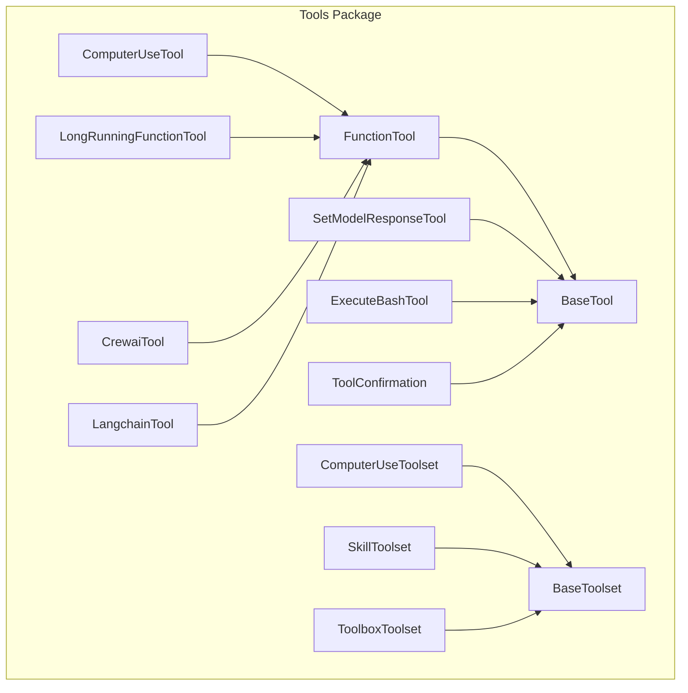
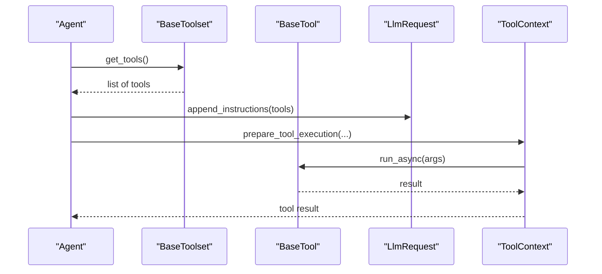
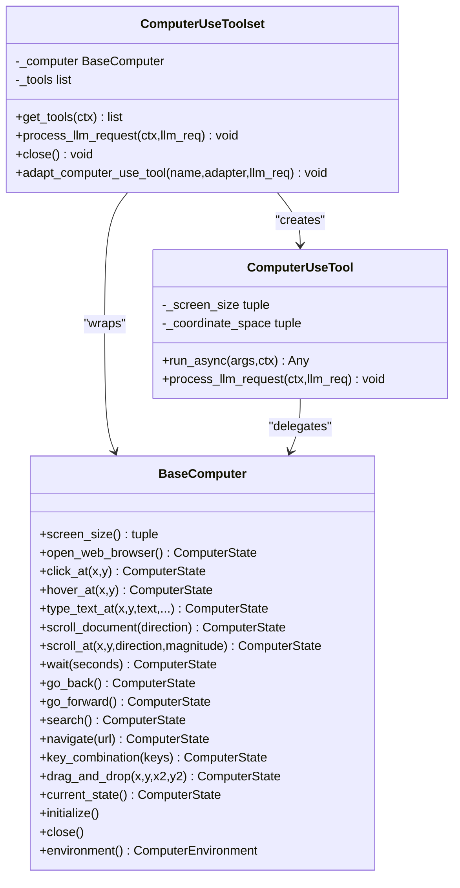
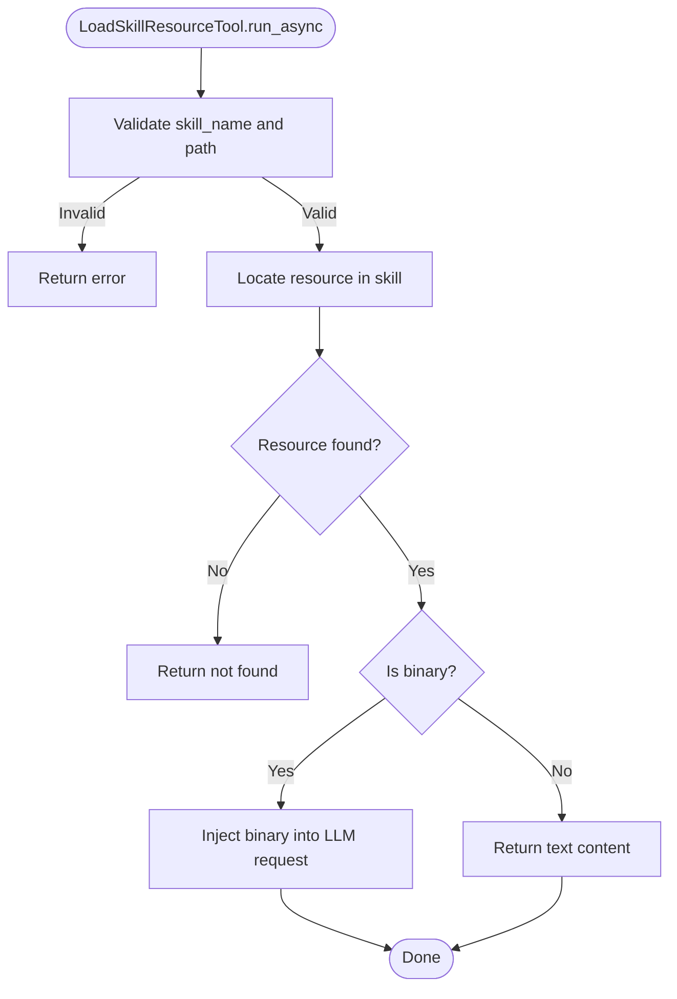
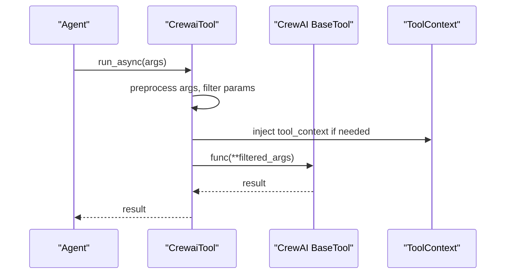
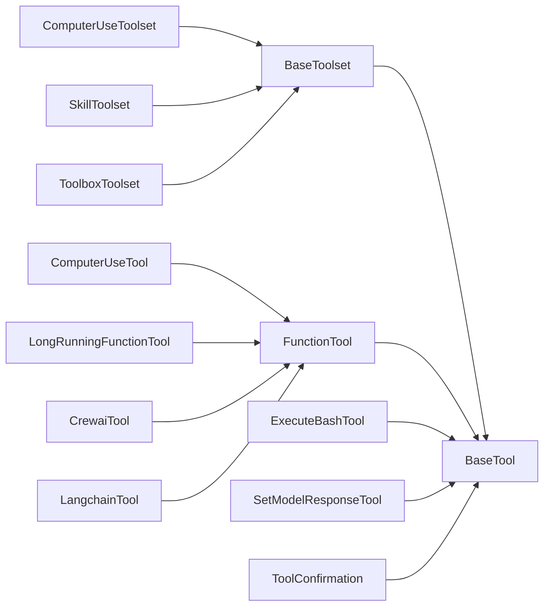

# Specialized Tools

<cite>
**Referenced Files in This Document**
- [computer_use_toolset.py](file://src/google/adk/tools/computer_use/computer_use_toolset.py)
- [computer_use_tool.py](file://src/google/adk/tools/computer_use/computer_use_tool.py)
- [base_computer.py](file://src/google/adk/tools/computer_use/base_computer.py)
- [skill_toolset.py](file://src/google/adk/tools/skill_toolset.py)
- [toolbox_toolset.py](file://src/google/adk/tools/toolbox_toolset.py)
- [bash_tool.py](file://src/google/adk/tools/bash_tool.py)
- [long_running_tool.py](file://src/google/adk/tools/long_running_tool.py)
- [tool_confirmation.py](file://src/google/adk/tools/tool_confirmation.py)
- [set_model_response_tool.py](file://src/google/adk/tools/set_model_response_tool.py)
- [crewai_tool.py](file://src/google/adk/tools/crewai_tool.py)
- [langchain_tool.py](file://src/google/adk/tools/langchain_tool.py)
- [__init__.py](file://src/google/adk/tools/__init__.py)
</cite>

## Table of Contents
1. [Introduction](#introduction)
2. [Project Structure](#project-structure)
3. [Core Components](#core-components)
4. [Architecture Overview](#architecture-overview)
5. [Detailed Component Analysis](#detailed-component-analysis)
6. [Dependency Analysis](#dependency-analysis)
7. [Performance Considerations](#performance-considerations)
8. [Troubleshooting Guide](#troubleshooting-guide)
9. [Conclusion](#conclusion)
10. [Appendices](#appendices)

## Introduction
This document explains specialized tools in the ADK toolkit suite designed to extend agent capabilities for complex tasks. It covers:
- Computer Use tools for GUI automation and web interaction
- Skill Toolset for prompt engineering and capability extension via skills
- Toolbox Toolset for composing tools from external toolboxes
- Integration tools for CrewAI and LangChain
- Bash tools for safe command execution
- Long Running tools for asynchronous operations
- Tool Confirmation for user approval flows
- Set Model Response tools for structured output control

For each category, we describe purpose, configuration, security, performance, and integration patterns, with diagrams and practical selection guidance.

## Project Structure
The specialized tools are implemented as modules under the tools package. They share common abstractions (BaseTool, BaseToolset) and integrate with agent runtime contexts (ToolContext, LlmRequest).

**Diagram sources**
- [computer_use_tool.py](file://src/google/adk/tools/computer_use/computer_use_tool.py#L34-L167)
- [computer_use_toolset.py](file://src/google/adk/tools/computer_use/computer_use_toolset.py#L42-L218)
- [skill_toolset.py](file://src/google/adk/tools/skill_toolset.py#L670-L800)
- [toolbox_toolset.py](file://src/google/adk/tools/toolbox_toolset.py#L35-L112)
- [bash_tool.py](file://src/google/adk/tools/bash_tool.py#L61-L151)
- [long_running_tool.py](file://src/google/adk/tools/long_running_tool.py#L26-L61)
- [tool_confirmation.py](file://src/google/adk/tools/tool_confirmation.py#L28-L46)
- [set_model_response_tool.py](file://src/google/adk/tools/set_model_response_tool.py#L36-L154)
- [crewai_tool.py](file://src/google/adk/tools/crewai_tool.py#L38-L159)
- [langchain_tool.py](file://src/google/adk/tools/langchain_tool.py#L32-L181)

**Section sources**
- [__init__.py](file://src/google/adk/tools/__init__.py#L1-L112)

## Core Components
- Computer Use Toolset: Dynamically exposes GUI/web control actions as tools, normalizes coordinates, and configures LLM requests for computer use.
- Skill Toolset: Manages skills (instruction sets and optional scripts), supports listing, loading instructions/resources, and executing scripts with timeouts and safety checks.
- Toolbox Toolset: Loads tools from external toolboxes via a server endpoint with optional authentication and parameter binding.
- CrewAI/LangChain Adapters: Wrap external tool ecosystems for use with ADK’s function calling interface.
- Bash Tool: Executes shell commands with policy-based allow-listing and user confirmation.
- Long Running Tool: Marks tools as long-running and communicates expected asynchronous completion semantics.
- Tool Confirmation: Captures user approvals and optional payloads for sensitive flows.
- Set Model Response Tool: Validates and returns structured responses conforming to a configured output schema.

**Section sources**
- [computer_use_toolset.py](file://src/google/adk/tools/computer_use/computer_use_toolset.py#L42-L218)
- [skill_toolset.py](file://src/google/adk/tools/skill_toolset.py#L670-L800)
- [toolbox_toolset.py](file://src/google/adk/tools/toolbox_toolset.py#L35-L112)
- [crewai_tool.py](file://src/google/adk/tools/crewai_tool.py#L38-L159)
- [langchain_tool.py](file://src/google/adk/tools/langchain_tool.py#L32-L181)
- [bash_tool.py](file://src/google/adk/tools/bash_tool.py#L61-L151)
- [long_running_tool.py](file://src/google/adk/tools/long_running_tool.py#L26-L61)
- [tool_confirmation.py](file://src/google/adk/tools/tool_confirmation.py#L28-L46)
- [set_model_response_tool.py](file://src/google/adk/tools/set_model_response_tool.py#L36-L154)

## Architecture Overview
The specialized tools integrate with agent workflows through a shared tool abstraction and runtime context. Toolsets populate LLM requests with tool declarations and configuration, while individual tools enforce policies and confirmations.

**Diagram sources**
- [computer_use_toolset.py](file://src/google/adk/tools/computer_use/computer_use_toolset.py#L177-L218)
- [skill_toolset.py](file://src/google/adk/tools/skill_toolset.py#L780-L790)
- [set_model_response_tool.py](file://src/google/adk/tools/set_model_response_tool.py#L124-L154)

## Detailed Component Analysis

### Computer Use Tools (GUI Automation)
Purpose:
- Enable agents to control browsers and interact with UIs programmatically.
- Normalize coordinates to match actual screen sizes for consistent behavior.

Key behaviors:
- Coordinate normalization for x/y and drag-and-drop destinations.
- Automatic injection of computer use configuration into LLM requests.
- Toolset adapts BaseComputer methods into executable tools and supports runtime adaptation.

**Diagram sources**
- [base_computer.py](file://src/google/adk/tools/computer_use/base_computer.py#L55-L267)
- [computer_use_tool.py](file://src/google/adk/tools/computer_use/computer_use_tool.py#L34-L167)
- [computer_use_toolset.py](file://src/google/adk/tools/computer_use/computer_use_toolset.py#L42-L218)

Practical use cases:
- Automating form filling, clicking buttons, and navigating pages.
- Performing UI-driven data extraction or screenshots.
- Integrating with LLMs that receive computer-use-enabled model responses.

Security and performance:
- Coordinate normalization prevents off-screen errors.
- Toolset initializes and closes the underlying computer environment.
- Use environment selection (browser) and consider timeouts for long operations.

**Section sources**
- [computer_use_tool.py](file://src/google/adk/tools/computer_use/computer_use_tool.py#L34-L167)
- [computer_use_toolset.py](file://src/google/adk/tools/computer_use/computer_use_toolset.py#L42-L218)
- [base_computer.py](file://src/google/adk/tools/computer_use/base_computer.py#L28-L267)

### Skill Toolset (Prompt Engineering and Script Execution)
Purpose:
- Provide a structured way to discover, load, and execute skills that extend agent capabilities.
- Support resource loading (references/assets/scripts) and controlled script execution.

Key behaviors:
- Lists available skills and loads instructions/resources.
- Executes scripts with a sandboxed wrapper, timeouts for shell scripts, and payload size limits.
- Resolves additional tools activated by skills from agent state.

**Diagram sources**
- [skill_toolset.py](file://src/google/adk/tools/skill_toolset.py#L167-L334)

Configuration and safety:
- Script execution uses a wrapper that materializes files into a temporary directory and runs either Python or shell scripts with timeouts.
- Payload size capped to prevent excessive memory usage.
- Binary resources are injected into the LLM request as blobs when accessed.

Use cases:
- Onboarding agents with domain-specific instructions.
- Running setup or data preparation scripts.
- Composing additional tools dynamically based on activated skills.

**Section sources**
- [skill_toolset.py](file://src/google/adk/tools/skill_toolset.py#L670-L800)

### Toolbox Toolset (External Tool Composition)
Purpose:
- Load tools from external toolboxes via a server, with optional authentication and parameter binding.

Key behaviors:
- Delegates to an external SDK (toolbox-adk) to fetch and instantiate tools.
- Supports selective loading by toolset name or specific tool names.
- Accepts additional headers and credentials for secure access.

Security and configuration:
- Authentication token getters and credentials enable secure access to toolboxes.
- Bound parameters allow pre-binding values or callables for dynamic values.

**Section sources**
- [toolbox_toolset.py](file://src/google/adk/tools/toolbox_toolset.py#L35-L112)

### Integration Tools (CrewAI and LangChain)
Purpose:
- Bridge external tool ecosystems into ADK’s function calling interface.

CrewAI integration:
- Wraps CrewAI tools, handles **kwargs signatures, filters reserved parameters, and injects ToolContext when required.
- Builds function declarations from CrewAI args_schema.

LangChain integration:
- Adapts LangChain tools (BaseTool or tools with run/_run) to ADK’s function calling format.
- Preserves names and descriptions, and adds schema when available.

**Diagram sources**
- [crewai_tool.py](file://src/google/adk/tools/crewai_tool.py#L63-L121)

**Section sources**
- [crewai_tool.py](file://src/google/adk/tools/crewai_tool.py#L38-L159)
- [langchain_tool.py](file://src/google/adk/tools/langchain_tool.py#L32-L181)

### Bash Tools (Safe Command Execution)
Purpose:
- Execute bash commands within a workspace directory with policy enforcement and user confirmation.

Key behaviors:
- Validates commands against allowed prefixes (wildcard or explicit list).
- Requires user confirmation before execution.
- Enforces a timeout for command execution.

Security and configuration:
- Policy controls which commands are permitted.
- Confirmation ensures explicit consent for potentially risky operations.
- Workspace scoping confines execution to a designated directory.

**Section sources**
- [bash_tool.py](file://src/google/adk/tools/bash_tool.py#L33-L151)

### Long Running Tools (Asynchronous Operations)
Purpose:
- Mark tools as long-running to signal the framework that results will be delivered asynchronously.

Key behaviors:
- Adds a long-running indicator to the tool declaration.
- Prevents repeated invocation until completion is indicated by the framework.

**Section sources**
- [long_running_tool.py](file://src/google/adk/tools/long_running_tool.py#L26-L61)

### Tool Confirmation (User Approval Flows)
Purpose:
- Capture user approvals and optional payloads for sensitive tool calls.

Key behaviors:
- Stores a hint explaining why confirmation is needed.
- Tracks whether the action was confirmed.
- Carries a JSON-serializable payload for additional context.

**Section sources**
- [tool_confirmation.py](file://src/google/adk/tools/tool_confirmation.py#L28-L46)

### Set Model Response Tools (Structured Output Control)
Purpose:
- Allow the model to set its final structured response when output_schema is configured alongside other tools.

Key behaviors:
- Dynamically builds function parameters based on the output schema (BaseModel, list[BaseModel], or primitive collections/dicts).
- Validates and returns the response according to schema type.

**Section sources**
- [set_model_response_tool.py](file://src/google/adk/tools/set_model_response_tool.py#L36-L154)

## Dependency Analysis
Specialized tools depend on shared abstractions and runtime context. Toolsets contribute tool declarations and configuration to LLM requests, while individual tools enforce policies and confirmations.

**Diagram sources**
- [computer_use_toolset.py](file://src/google/adk/tools/computer_use/computer_use_toolset.py#L42-L218)
- [computer_use_tool.py](file://src/google/adk/tools/computer_use/computer_use_tool.py#L34-L167)
- [skill_toolset.py](file://src/google/adk/tools/skill_toolset.py#L670-L800)
- [toolbox_toolset.py](file://src/google/adk/tools/toolbox_toolset.py#L35-L112)
- [bash_tool.py](file://src/google/adk/tools/bash_tool.py#L61-L151)
- [long_running_tool.py](file://src/google/adk/tools/long_running_tool.py#L26-L61)
- [tool_confirmation.py](file://src/google/adk/tools/tool_confirmation.py#L28-L46)
- [set_model_response_tool.py](file://src/google/adk/tools/set_model_response_tool.py#L36-L154)
- [crewai_tool.py](file://src/google/adk/tools/crewai_tool.py#L38-L159)
- [langchain_tool.py](file://src/google/adk/tools/langchain_tool.py#L32-L181)

**Section sources**
- [__init__.py](file://src/google/adk/tools/__init__.py#L49-L112)

## Performance Considerations
- Computer Use: Coordinate normalization is O(1); ensure screen size queries are cached where possible. Consider batching UI operations to reduce overhead.
- Skill Toolset: Script execution timeouts protect against long-running operations; payload size limits prevent memory pressure.
- Toolbox Toolset: Network latency and server-side filtering impact responsiveness; consider caching and selective loading.
- CrewAI/LangChain: Parameter filtering and schema generation add minimal overhead; ensure tool initialization avoids heavy operations during get_tools.
- Bash Tool: Subprocess execution has OS-level overhead; keep command lists minimal and leverage policy allow-lists.
- Long Running Tools: Avoid redundant invocations; rely on asynchronous completion signals.
- Set Model Response: Validation cost scales with schema complexity; prefer simpler schemas when feasible.

[No sources needed since this section provides general guidance]

## Troubleshooting Guide
Common issues and remedies:
- Computer Use Toolset fails to configure: Verify environment detection and that tools are added to the LLM request configuration.
- Skill Toolset resource not found: Confirm resource path starts with references/, assets/, or scripts/ and the skill name is correct.
- Script execution errors: Check script type support (.py, .sh, .bash), argument types, and timeout settings.
- Toolbox Toolset import error: Install the toolbox-adk package per the error message.
- CrewAI/LangChain tool schema errors: Ensure args_schema compatibility and that required parameters are provided.
- Bash Tool blocked: Adjust allowed_command_prefixes or request confirmation explicitly.
- Long Running Tool repeated invocation: Do not call again after initial asynchronous submission.
- Tool Confirmation not applied: Ensure ToolContext includes a ToolConfirmation instance and that the tool requests confirmation.

**Section sources**
- [computer_use_toolset.py](file://src/google/adk/tools/computer_use/computer_use_toolset.py#L177-L218)
- [skill_toolset.py](file://src/google/adk/tools/skill_toolset.py#L336-L445)
- [toolbox_toolset.py](file://src/google/adk/tools/toolbox_toolset.py#L82-L88)
- [crewai_tool.py](file://src/google/adk/tools/crewai_tool.py#L123-L132)
- [langchain_tool.py](file://src/google/adk/tools/langchain_tool.py#L149-L152)
- [bash_tool.py](file://src/google/adk/tools/bash_tool.py#L116-L134)
- [long_running_tool.py](file://src/google/adk/tools/long_running_tool.py#L47-L60)
- [tool_confirmation.py](file://src/google/adk/tools/tool_confirmation.py#L28-L46)

## Conclusion
The specialized tools in ADK provide robust extensions for GUI automation, skill-based prompt engineering, external tool composition, and integration with CrewAI and LangChain. They emphasize safety (confirmation, policy enforcement, timeouts), configurability (toolsets, adapters, schema), and performance (coordinate normalization, payload limits, async patterns). Selecting the right tool depends on the task: use Computer Use for UI automation, Skill Toolset for capability extension, Toolbox Toolset for composition, CrewAI/LangChain adapters for ecosystem integration, Bash Tool for safe command execution, Long Running Tool for async operations, Tool Confirmation for sensitive flows, and Set Model Response for structured outputs.

[No sources needed since this section summarizes without analyzing specific files]

## Appendices

### Practical Selection Guide
- GUI automation and web interaction → Computer Use Toolset
- Prompt engineering and capability extension via skills → Skill Toolset
- External tool composition → Toolbox Toolset
- CrewAI integration → CrewaiTool
- LangChain integration → LangchainTool
- Safe command execution → ExecuteBashTool
- Long-running operations → LongRunningFunctionTool
- Sensitive flows requiring user approval → ToolConfirmation
- Structured output control → SetModelResponseTool

[No sources needed since this section provides general guidance]