# Tool Ecosystem

<cite>
**Referenced Files in This Document**
- [tools/__init__.py](file://src/google/adk/tools/__init__.py)
- [base_tool.py](file://src/google/adk/tools/base_tool.py)
- [function_tool.py](file://src/google/adk/tools/function_tool.py)
- [authenticated_function_tool.py](file://src/google/adk/tools/authenticated_function_tool.py)
- [base_authenticated_tool.py](file://src/google/adk/tools/base_authenticated_tool.py)
- [google_search_tool.py](file://src/google/adk/tools/google_search_tool.py)
- [tool_configs.py](file://src/google/adk/tools/tool_configs.py)
- [base_toolset.py](file://src/google/adk/tools/base_toolset.py)
- [mcp_tool/__init__.py](file://src/google/adk/tools/mcp_tool/__init__.py)
- [bigquery/__init__.py](file://src/google/adk/tools/bigquery/__init__.py)
- [pubsub/__init__.py](file://src/google/adk/tools/pubsub/__init__.py)
- [openapi_tool/__init__.py](file://src/google/adk/tools/openapi_tool/__init__.py)
- [auth/__init__.py](file://src/google/adk/auth/__init__.py)
- [auth_tool.py](file://src/google/adk/auth/auth_tool.py)
</cite>

## Table of Contents
1. [Introduction](#introduction)
2. [Project Structure](#project-structure)
3. [Core Components](#core-components)
4. [Architecture Overview](#architecture-overview)
5. [Detailed Component Analysis](#detailed-component-analysis)
6. [Dependency Analysis](#dependency-analysis)
7. [Performance Considerations](#performance-considerations)
8. [Troubleshooting Guide](#troubleshooting-guide)
9. [Conclusion](#conclusion)
10. [Appendices](#appendices)

## Introduction
This document describes the ADK tool ecosystem: its architecture, built-in tools, authentication and authorization patterns, OpenAPI and MCP integration, configuration and validation, error handling, and practical development guidance. It targets both developers building tools and integrators configuring agents with tools.

## Project Structure
The tool ecosystem is organized around a core abstraction (BaseTool) and specialized implementations for function wrapping, authentication, data retrieval, and protocol integrations (MCP, OpenAPI). Toolsets aggregate tools and optionally manage authentication and filtering. Authentication primitives are centralized under the auth package.

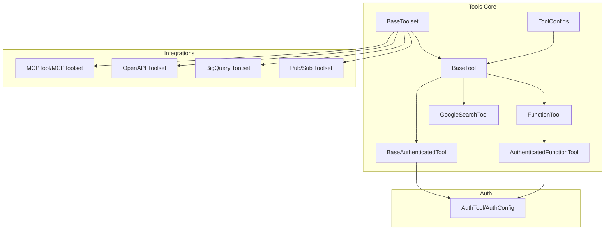

**Diagram sources**
- [base_tool.py](file://src/google/adk/tools/base_tool.py#L47-L213)
- [function_tool.py](file://src/google/adk/tools/function_tool.py#L39-L292)
- [authenticated_function_tool.py](file://src/google/adk/tools/authenticated_function_tool.py#L38-L108)
- [base_authenticated_tool.py](file://src/google/adk/tools/base_authenticated_tool.py#L37-L109)
- [google_search_tool.py](file://src/google/adk/tools/google_search_tool.py#L32-L93)
- [tool_configs.py](file://src/google/adk/tools/tool_configs.py#L27-L130)
- [base_toolset.py](file://src/google/adk/tools/base_toolset.py#L63-L226)
- [mcp_tool/__init__.py](file://src/google/adk/tools/mcp_tool/__init__.py#L17-L46)
- [openapi_tool/__init__.py](file://src/google/adk/tools/openapi_tool/__init__.py#L15-L22)
- [bigquery/__init__.py](file://src/google/adk/tools/bigquery/__init__.py#L15-L37)
- [pubsub/__init__.py](file://src/google/adk/tools/pubsub/__init__.py#L15-L31)
- [auth_tool.py](file://src/google/adk/auth/auth_tool.py#L51-L146)

**Section sources**
- [tools/__init__.py](file://src/google/adk/tools/__init__.py#L49-L112)
- [auth/__init__.py](file://src/google/adk/auth/__init__.py#L15-L23)

## Core Components
- BaseTool: Abstract base for all tools. Provides lifecycle hooks (declaration, LLM request processing, async execution), configuration-driven construction, and metadata.
- FunctionTool: Wraps user-defined functions, auto-generates OpenAPI-style declarations, validates and converts arguments, supports confirmation gating, and handles sync/async invocation.
- AuthenticatedFunctionTool and BaseAuthenticatedTool: Add authentication orchestration via CredentialManager and AuthConfig, injecting credentials into tool calls.
- GoogleSearchTool: Model-integrated search tool for Gemini 1.x and newer models, automatically enriches LLM requests with appropriate tool configuration.
- ToolConfigs: Declarative configuration for tools, supporting built-ins, classes, instances, factories, and function tools.
- BaseToolset: Aggregates tools, supports filtering/prefixing, LLM request preprocessing, and optional authentication exposure.

**Section sources**
- [base_tool.py](file://src/google/adk/tools/base_tool.py#L47-L213)
- [function_tool.py](file://src/google/adk/tools/function_tool.py#L39-L292)
- [authenticated_function_tool.py](file://src/google/adk/tools/authenticated_function_tool.py#L38-L108)
- [base_authenticated_tool.py](file://src/google/adk/tools/base_authenticated_tool.py#L37-L109)
- [google_search_tool.py](file://src/google/adk/tools/google_search_tool.py#L32-L93)
- [tool_configs.py](file://src/google/adk/tools/tool_configs.py#L27-L130)
- [base_toolset.py](file://src/google/adk/tools/base_toolset.py#L63-L226)

## Architecture Overview
The tool architecture separates concerns:
- Tool definition and execution: BaseTool and derived types encapsulate behavior and invocation.
- LLM integration: Tools declare themselves via FunctionDeclaration and augment LlmRequest in process_llm_request.
- Authentication: Tools can request credentials via CredentialManager and AuthConfig; toolsets may expose shared auth configuration.
- Integrations: Toolsets for MCP, OpenAPI, BigQuery, and Pub/Sub provide domain-specific capabilities.

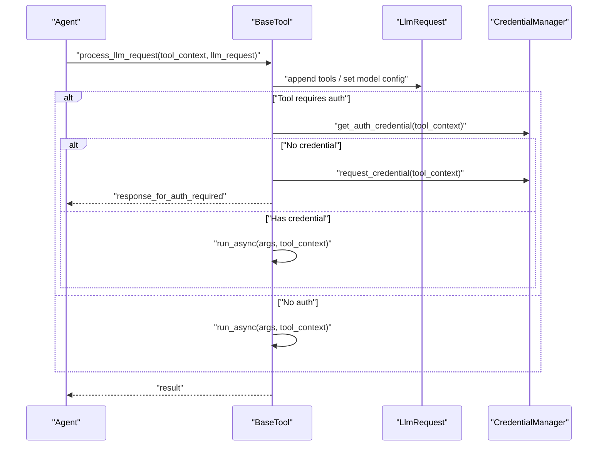

**Diagram sources**
- [base_tool.py](file://src/google/adk/tools/base_tool.py#L115-L130)
- [base_authenticated_tool.py](file://src/google/adk/tools/base_authenticated_tool.py#L82-L98)
- [authenticated_function_tool.py](file://src/google/adk/tools/authenticated_function_tool.py#L80-L94)

## Detailed Component Analysis

### Built-in Tools

#### Google Search Tool
- Purpose: Automatic retrieval integration for Gemini models.
- Behavior: Selects appropriate tool configuration per model family and augments LlmRequest accordingly.
- Constraints: Gemini 1.x disallows combining with other tools; other models enable GoogleSearch.

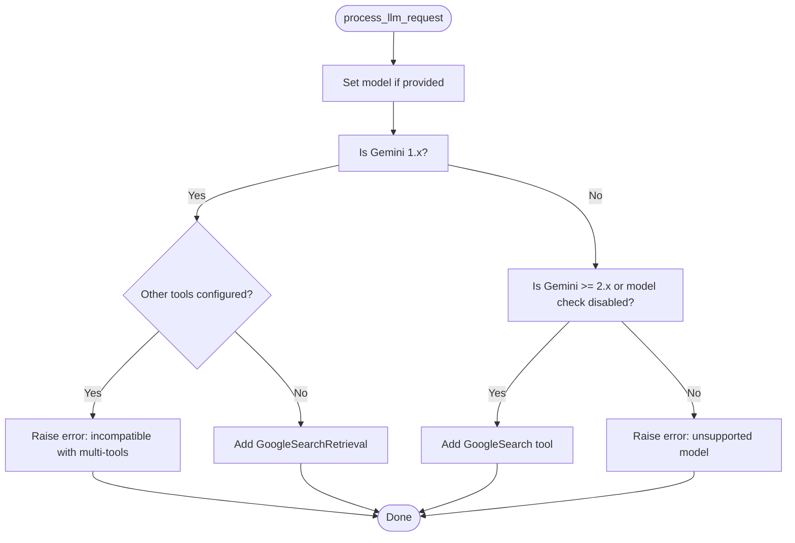

**Diagram sources**
- [google_search_tool.py](file://src/google/adk/tools/google_search_tool.py#L61-L90)

**Section sources**
- [google_search_tool.py](file://src/google/adk/tools/google_search_tool.py#L32-L93)

### Function Tools

#### FunctionTool
- Declaration generation: Builds FunctionDeclaration from function signatures and docstrings.
- Argument preprocessing: Converts JSON dicts to Pydantic models where annotated.
- Invocation: Supports sync/async callables, injects ToolContext and optional credential parameters, enforces mandatory args, and supports user confirmation gating.

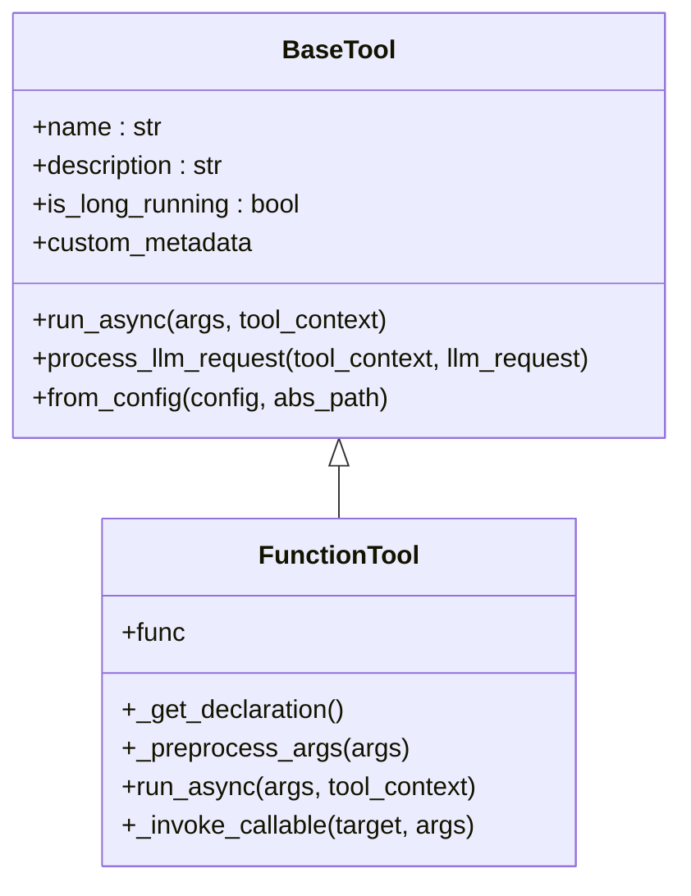

**Diagram sources**
- [base_tool.py](file://src/google/adk/tools/base_tool.py#L47-L213)
- [function_tool.py](file://src/google/adk/tools/function_tool.py#L39-L292)

**Section sources**
- [function_tool.py](file://src/google/adk/tools/function_tool.py#L39-L292)

#### AuthenticatedFunctionTool and BaseAuthenticatedTool
- Orchestrate authentication via CredentialManager and AuthConfig.
- Inject credential into tool call if accepted by function signature.
- Support user-approval flows and customizable responses when credentials are missing or insufficient.

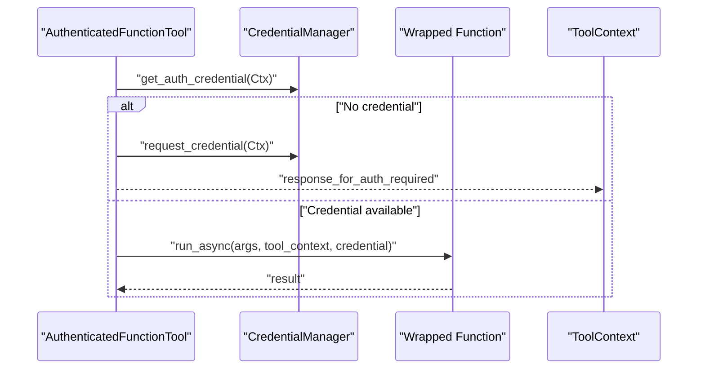

**Diagram sources**
- [authenticated_function_tool.py](file://src/google/adk/tools/authenticated_function_tool.py#L80-L107)
- [base_authenticated_tool.py](file://src/google/adk/tools/base_authenticated_tool.py#L82-L108)

**Section sources**
- [authenticated_function_tool.py](file://src/google/adk/tools/authenticated_function_tool.py#L38-L108)
- [base_authenticated_tool.py](file://src/google/adk/tools/base_authenticated_tool.py#L37-L109)

### Tool Configuration and Validation
- ToolConfig supports multiple ways to define tools: built-ins, classes, instances, factories, and function tools.
- ToolArgsConfig allows arbitrary key-value arguments for tools.
- BaseTool.from_config uses type hints to map configuration to constructor parameters, including Pydantic model validation and callable resolution.

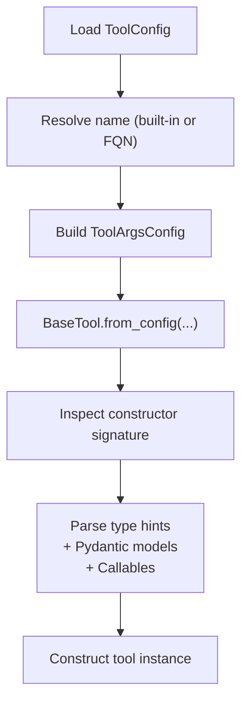

**Diagram sources**
- [tool_configs.py](file://src/google/adk/tools/tool_configs.py#L42-L130)
- [base_tool.py](file://src/google/adk/tools/base_tool.py#L136-L213)

**Section sources**
- [tool_configs.py](file://src/google/adk/tools/tool_configs.py#L27-L130)
- [base_tool.py](file://src/google/adk/tools/base_tool.py#L136-L213)

### Toolsets
- BaseToolset defines the contract for collections of tools, including filtering, prefixing, LLM request preprocessing, and optional authentication exposure.
- Tool predicates and name prefixes enable dynamic composition and namespace isolation.

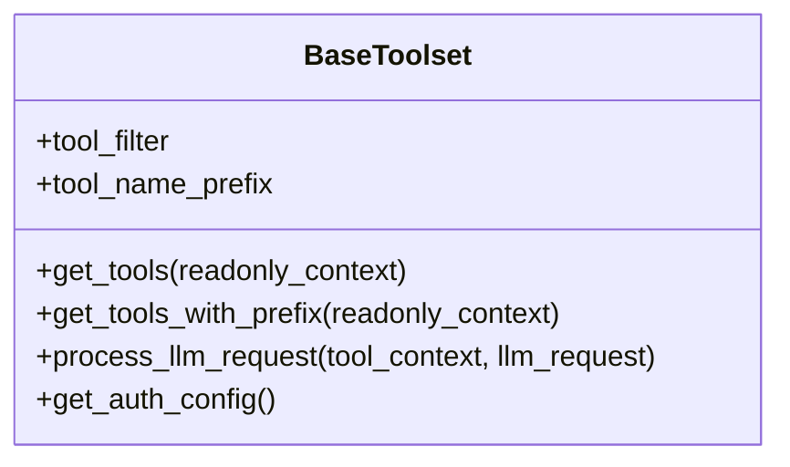

**Diagram sources**
- [base_toolset.py](file://src/google/adk/tools/base_toolset.py#L63-L226)

**Section sources**
- [base_toolset.py](file://src/google/adk/tools/base_toolset.py#L63-L226)

### OpenAPI Specification Support
- OpenAPI Toolset parses OpenAPI specs and generates tools for REST endpoints.
- Provides RestApiTool for endpoint invocation and OpenAPIToolset for tool aggregation.

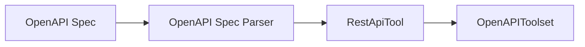

**Diagram sources**
- [openapi_tool/__init__.py](file://src/google/adk/tools/openapi_tool/__init__.py#L15-L22)

**Section sources**
- [openapi_tool/__init__.py](file://src/google/adk/tools/openapi_tool/__init__.py#L15-L22)

### MCP (Model Context Protocol) Integration
- MCPTool and MCPToolset enable tool discovery and invocation via MCP transports (stdio, SSE, Streamable HTTP).
- Session managers handle connection parameters and lifecycle.

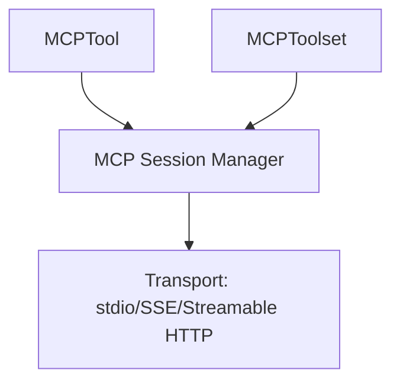

**Diagram sources**
- [mcp_tool/__init__.py](file://src/google/adk/tools/mcp_tool/__init__.py#L17-L46)

**Section sources**
- [mcp_tool/__init__.py](file://src/google/adk/tools/mcp_tool/__init__.py#L17-L46)

### Domain-Specific Toolsets
- BigQuery Toolset: Handcrafted tools for higher-level analytics with guardrails and simplified UX.
- Pub/Sub Toolset: Rich subscribe/pull APIs and improved message handling.

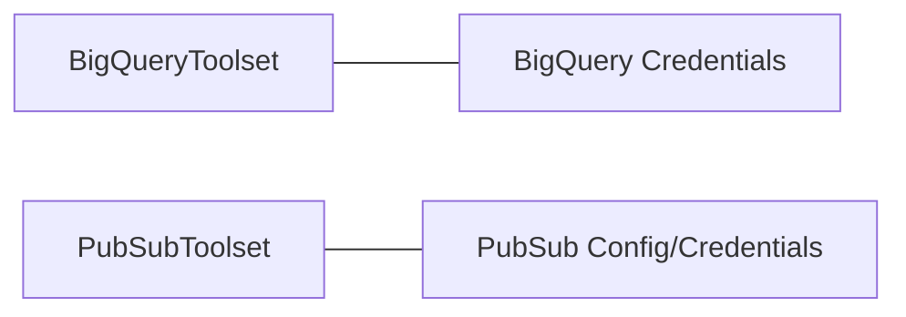

**Diagram sources**
- [bigquery/__init__.py](file://src/google/adk/tools/bigquery/__init__.py#L15-L37)
- [pubsub/__init__.py](file://src/google/adk/tools/pubsub/__init__.py#L15-L31)

**Section sources**
- [bigquery/__init__.py](file://src/google/adk/tools/bigquery/__init__.py#L15-L37)
- [pubsub/__init__.py](file://src/google/adk/tools/pubsub/__init__.py#L15-L31)

## Dependency Analysis
- Lazy loading: tools/__init__.py uses a lazy mapping to avoid expensive imports until tools are accessed.
- Tool-to-auth coupling: Authenticated tools depend on CredentialManager and AuthConfig; BaseToolset may expose shared AuthConfig.
- Tool-to-LLM coupling: Tools augment LlmRequest via process_llm_request and declare themselves via FunctionDeclaration.

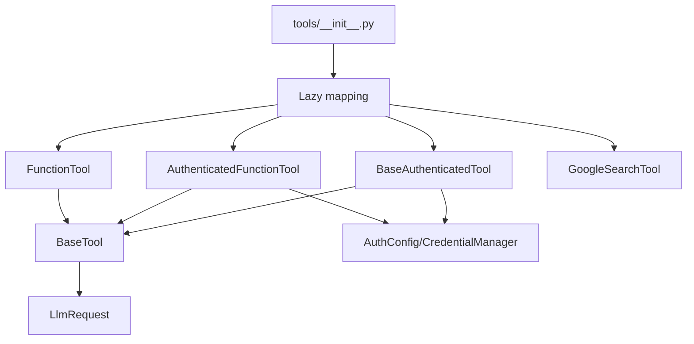

**Diagram sources**
- [tools/__init__.py](file://src/google/adk/tools/__init__.py#L49-L112)
- [base_tool.py](file://src/google/adk/tools/base_tool.py#L115-L130)
- [authenticated_function_tool.py](file://src/google/adk/tools/authenticated_function_tool.py#L68-L77)
- [base_authenticated_tool.py](file://src/google/adk/tools/base_authenticated_tool.py#L71-L79)

**Section sources**
- [tools/__init__.py](file://src/google/adk/tools/__init__.py#L49-L112)
- [base_tool.py](file://src/google/adk/tools/base_tool.py#L115-L130)
- [authenticated_function_tool.py](file://src/google/adk/tools/authenticated_function_tool.py#L68-L77)
- [base_authenticated_tool.py](file://src/google/adk/tools/base_authenticated_tool.py#L71-L79)

## Performance Considerations
- Lazy loading of tools reduces startup overhead.
- FunctionTool argument preprocessing avoids repeated conversions and improves reliability.
- Toolsets can centralize LLM request preprocessing to minimize per-tool duplication.
- Streaming tools support incremental results; ensure proper resource cleanup.

[No sources needed since this section provides general guidance]

## Troubleshooting Guide
Common issues and resolutions:
- Missing mandatory arguments in FunctionTool: The tool returns a structured error listing missing parameters to guide retries.
- Authentication required: Tools return a pending authorization response; the client should fulfill the credential request and retry.
- Model compatibility for GoogleSearchTool: Gemini 1.x cannot combine with other tools; select a compatible model or adjust tool selection.

**Section sources**
- [function_tool.py](file://src/google/adk/tools/function_tool.py#L184-L190)
- [authenticated_function_tool.py](file://src/google/adk/tools/authenticated_function_tool.py#L88-L94)
- [google_search_tool.py](file://src/google/adk/tools/google_search_tool.py#L74-L81)

## Conclusion
The ADK tool ecosystem provides a robust, extensible foundation for building and integrating tools with agents. Its abstractions support declarative configuration, strong typing, authentication orchestration, and protocol integrations. Developers can extend the system with custom function tools, authenticated tools, and toolsets tailored to domain needs.

[No sources needed since this section summarizes without analyzing specific files]

## Appendices

### Authentication and Authorization Patterns
- AuthConfig: Encapsulates the requested auth scheme, raw/exchanged credentials, and a stable credential key.
- CredentialManager: Resolves and requests credentials based on tool context.
- Tool-level vs. Toolset-level auth: Tools can request credentials individually; toolsets can expose shared auth configuration.

**Section sources**
- [auth_tool.py](file://src/google/adk/auth/auth_tool.py#L51-L146)
- [auth/__init__.py](file://src/google/adk/auth/__init__.py#L15-L23)
- [base_toolset.py](file://src/google/adk/tools/base_toolset.py#L209-L225)

### Developing Custom Tools
- Function tools: Wrap functions with automatic declaration and argument conversion.
- Authenticated tools: Extend AuthenticatedFunctionTool or BaseAuthenticatedTool to inject credentials.
- Toolsets: Aggregate tools, apply filters/prefixes, and optionally expose shared auth configuration.

**Section sources**
- [function_tool.py](file://src/google/adk/tools/function_tool.py#L39-L292)
- [authenticated_function_tool.py](file://src/google/adk/tools/authenticated_function_tool.py#L38-L108)
- [base_authenticated_tool.py](file://src/google/adk/tools/base_authenticated_tool.py#L37-L109)
- [base_toolset.py](file://src/google/adk/tools/base_toolset.py#L63-L226)