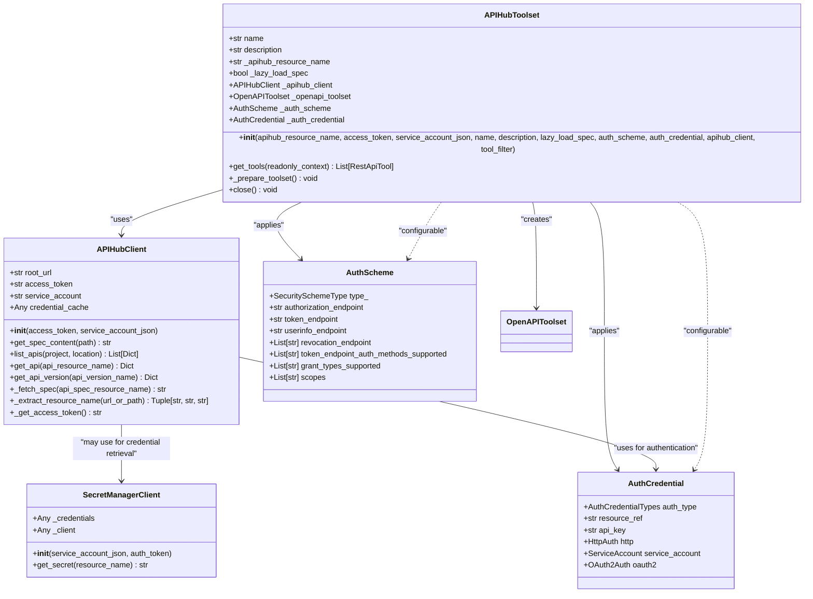
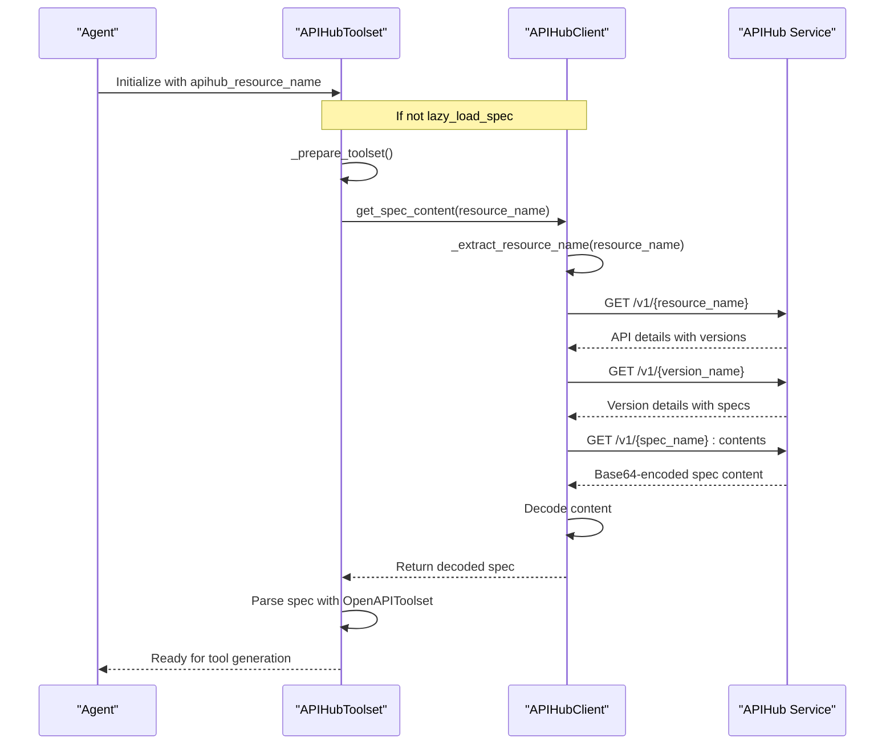
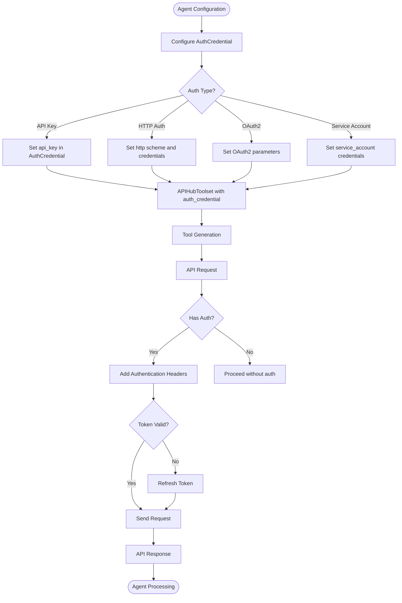
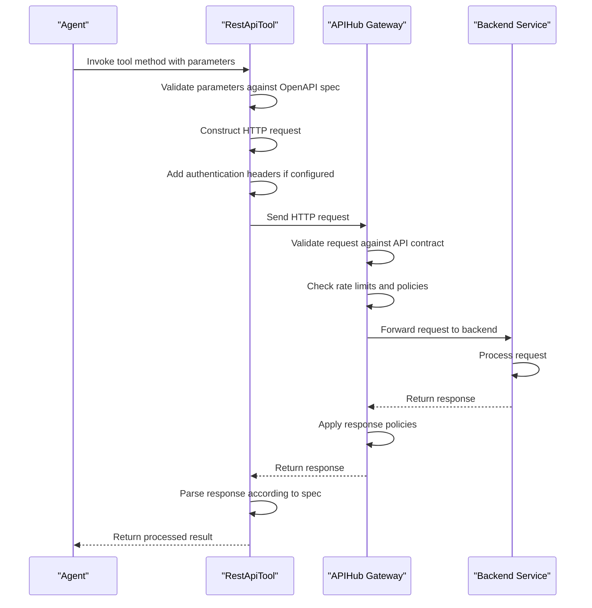
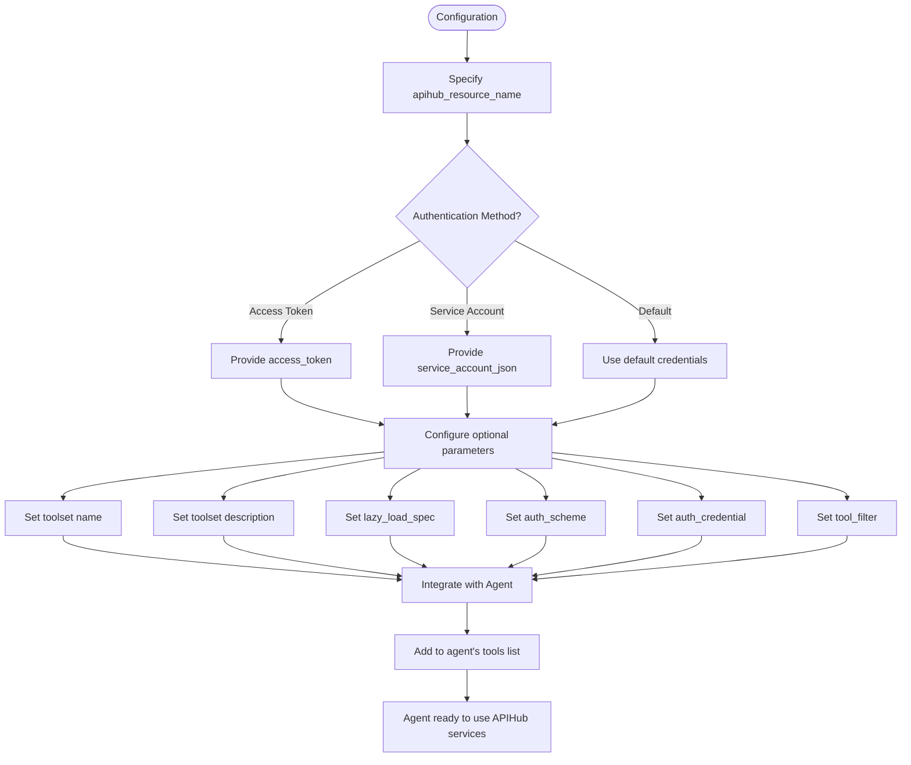
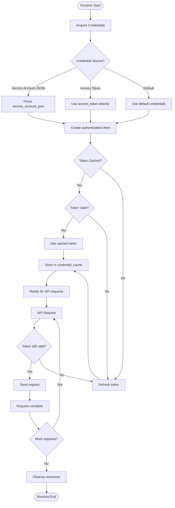
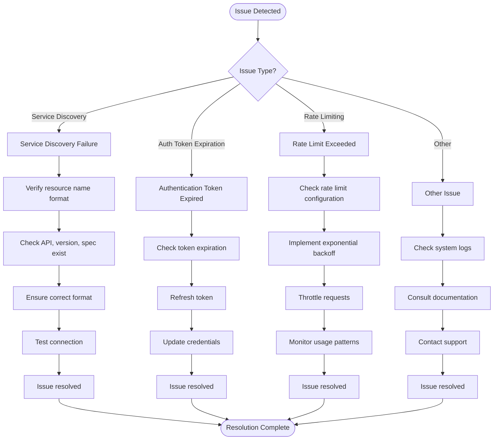

# APIHub Integration

<cite>
**Referenced Files in This Document**   
- [apihub_toolset.py](file://src/google/adk/tools/apihub_tool/apihub_toolset.py)
- [apihub_client.py](file://src/google/adk/tools/apihub_tool/clients/apihub_client.py)
- [secret_client.py](file://src/google/adk/tools/apihub_tool/clients/secret_client.py)
- [auth_credential.py](file://src/google/adk/auth/auth_credential.py)
- [auth_schemes.py](file://src/google/adk/auth/auth_schemes.py)
</cite>

## Table of Contents
1. [Introduction](#introduction)
2. [APIHub Tool System Architecture](#apihub-tool-system-architecture)
3. [Service Discovery and API Specification Retrieval](#service-discovery-and-api-specification-retrieval)
4. [Authentication Delegation and Credential Management](#authentication-delegation-and-credential-management)
5. [Request Routing Through APIHub](#request-routing-through-apihub)
6. [Configuration and Invocation Examples](#configuration-and-invocation-examples)
7. [Credential Management and Runtime Execution](#credential-management-and-runtime-execution)
8. [Common Issues and Troubleshooting](#common-issues-and-troubleshooting)
9. [Best Practices](#best-practices)
10. [Conclusion](#conclusion)

## Introduction

The APIHub Integration system provides a comprehensive framework for connecting agents to APIHub-managed services. This documentation details the architecture, implementation, and operational aspects of the APIHub tool system, focusing on the APIHubToolset and its client components. The system enables agents to discover, authenticate, and interact with managed APIs through a standardized interface that handles service discovery, authentication delegation, and request routing. This integration simplifies the process of connecting agents to various services while maintaining security and scalability.

**Section sources**
- [apihub_toolset.py](file://src/google/adk/tools/apihub_tool/apihub_toolset.py#L1-L191)

## APIHub Tool System Architecture

The APIHub tool system consists of several interconnected components that work together to provide seamless integration between agents and APIHub-managed services. At the core of this architecture is the `APIHubToolset` class, which serves as the primary interface for agents to access APIHub services. The toolset leverages the `APIHubClient` to retrieve API specifications and the `SecretManagerClient` for secure credential management.

The architecture follows a layered approach where the `APIHubToolset` abstracts the complexity of API discovery and authentication, providing a simplified interface for agents. When an agent requires access to an APIHub-managed service, the `APIHubToolset` retrieves the appropriate OpenAPI specification, processes it, and generates the necessary tools for interaction. This design enables dynamic tool generation based on the current API specifications, ensuring that agents always have access to up-to-date service interfaces.

**Diagram sources **
- [apihub_toolset.py](file://src/google/adk/tools/apihub_tool/apihub_toolset.py#L35-L191)
- [apihub_client.py](file://src/google/adk/tools/apihub_tool/clients/apihub_client.py#L44-L344)
- [secret_client.py](file://src/google/adk/tools/apihub_tool/clients/secret_client.py#L27-L121)
- [auth_credential.py](file://src/google/adk/auth/auth_credential.py#L167-L233)
- [auth_schemes.py](file://src/google/adk/auth/auth_schemes.py#L27-L68)

**Section sources**
- [apihub_toolset.py](file://src/google/adk/tools/apihub_tool/apihub_toolset.py#L35-L191)
- [apihub_client.py](file://src/google/adk/tools/apihub_tool/clients/apihub_client.py#L44-L344)

## Service Discovery and API Specification Retrieval

The service discovery mechanism in the APIHub system enables agents to dynamically discover and access API specifications based on resource identifiers. The `APIHubClient` class provides the core functionality for retrieving API specifications from APIHub, supporting various resource identification formats including direct resource names and UI URLs.

Service discovery operates through a hierarchical resolution process that begins with the provided resource identifier and progressively resolves to the specific API specification. When a resource name includes only the API component (e.g., `projects/test-project/locations/us-central1/apis/test-api`), the system automatically selects the first version and the first specification of that API. If the resource name includes a version component, the system uses the first specification of that specific version. When the resource name includes a specification component, that exact specification is retrieved.

The `get_spec_content` method in the `APIHubClient` class implements this resolution logic, handling both direct API Hub resource names and UI URLs. The method first extracts the relevant components (project, location, API, version, specification) from the input path using the `_extract_resource_name` method, then makes the appropriate API calls to retrieve the specification content. This content is returned as a decoded string, ready for processing by the `APIHubToolset`.

**Diagram sources **
- [apihub_client.py](file://src/google/adk/tools/apihub_tool/clients/apihub_client.py#L73-L118)
- [apihub_toolset.py](file://src/google/adk/tools/apihub_tool/apihub_toolset.py#L166-L185)

**Section sources**
- [apihub_client.py](file://src/google/adk/tools/apihub_tool/clients/apihub_client.py#L73-L306)
- [apihub_toolset.py](file://src/google/adk/tools/apihub_tool/apihub_toolset.py#L166-L185)

## Authentication Delegation and Credential Management

The APIHub integration system implements a comprehensive authentication delegation framework that enables secure access to managed services while maintaining proper credential isolation. The system supports multiple authentication methods through the `AuthCredential` class, which can represent API keys, HTTP authentication, OAuth2 credentials, and Google service accounts.

Authentication delegation occurs at the toolset level, where the `APIHubToolset` can be configured with a default authentication scheme and credential that apply to all tools generated from the API specification. This configuration is passed to the underlying `OpenAPIToolset`, which ensures that the appropriate authentication headers are included in all API requests. The system supports both static credentials (such as API keys) and dynamic credentials (such as OAuth2 tokens that require refresh).

The credential management system integrates with Google Cloud Secret Manager through the `SecretManagerClient` class, allowing credentials to be securely stored and retrieved. This client supports authentication via service account JSON, authorization tokens, or default credentials, providing flexibility for different deployment scenarios. When using service account credentials, the system automatically handles token refresh and caching, minimizing the overhead of authentication operations.

**Diagram sources **
- [auth_credential.py](file://src/google/adk/auth/auth_credential.py#L167-L233)
- [secret_client.py](file://src/google/adk/tools/apihub_tool/clients/secret_client.py#L27-L121)
- [apihub_client.py](file://src/google/adk/tools/apihub_tool/clients/apihub_client.py#L307-L343)

**Section sources**
- [auth_credential.py](file://src/google/adk/auth/auth_credential.py#L167-L233)
- [secret_client.py](file://src/google/adk/tools/apihub_tool/clients/secret_client.py#L27-L121)
- [apihub_client.py](file://src/google/adk/tools/apihub_tool/clients/apihub_client.py#L307-L343)

## Request Routing Through APIHub

The request routing mechanism in the APIHub system provides a seamless interface between agents and APIHub-managed services, abstracting the underlying API complexity. When an agent invokes a tool generated from an API specification, the request is routed through the APIHub infrastructure, which handles authentication, rate limiting, and request validation.

The routing process begins when the agent calls a method on a tool generated by the `APIHubToolset`. The tool, implemented as a `RestApiTool`, processes the request parameters according to the OpenAPI specification and constructs an HTTP request with the appropriate method, URL, headers, and body. If authentication is configured, the necessary authentication headers are added to the request.

The request is then sent to the API endpoint specified in the API specification, which is typically hosted on the APIHub infrastructure. APIHub acts as a gateway, validating the request against the API contract, enforcing rate limits, and applying any configured policies before forwarding the request to the backend service. The response from the backend service is returned through APIHub to the agent, completing the request cycle.

This routing architecture provides several benefits, including centralized API management, consistent security policies, and comprehensive monitoring and analytics. Agents can interact with multiple services through a uniform interface, while API providers maintain control over their APIs through the APIHub management console.

**Diagram sources **
- [apihub_toolset.py](file://src/google/adk/tools/apihub_tool/apihub_toolset.py#L151-L165)
- [openapi_toolset.py](file://src/google/adk/tools/openapi_tool/openapi_spec_parser/openapi_toolset.py)

**Section sources**
- [apihub_toolset.py](file://src/google/adk/tools/apihub_tool/apihub_toolset.py#L151-L165)

## Configuration and Invocation Examples

Configuring and invoking APIHub-connected services follows a standardized pattern that emphasizes simplicity and security. The `APIHubToolset` can be configured with various parameters to control its behavior, including the API resource name, authentication credentials, and tool filtering options.

For basic configuration, the toolset requires the API resource name and authentication credentials. The resource name can be specified as a full API Hub resource identifier or as a UI URL, providing flexibility in how APIs are referenced. Authentication can be provided through an access token, service account JSON, or by using default credentials.

**Diagram sources **
- [apihub_toolset.py](file://src/google/adk/tools/apihub_tool/apihub_toolset.py#L59-L133)

**Section sources**
- [apihub_toolset.py](file://src/google/adk/tools/apihub_tool/apihub_toolset.py#L59-L133)

## Credential Management and Runtime Execution

The credential management system in the APIHub integration ensures secure handling of authentication credentials throughout the runtime execution lifecycle. Credentials are never stored in plaintext within the application code but are instead managed through secure channels and encrypted storage.

During runtime, the system follows a credential lifecycle that begins with credential acquisition and ends with proper cleanup. When the `APIHubToolset` is initialized, it establishes a connection to the APIHub service using the provided credentials. If a service account JSON is provided, it is parsed and used to create authenticated credentials. If an access token is provided, it is used directly for authentication.

The system implements credential caching to improve performance and reduce the overhead of authentication operations. When using service account credentials or default credentials, the system caches the generated access token and reuses it until it expires. Before each API request, the system checks if the cached token is still valid and refreshes it if necessary.

For enhanced security, the system supports integration with Google Cloud Secret Manager, allowing credentials to be stored securely and retrieved only when needed. This approach minimizes the risk of credential exposure and enables centralized credential management across multiple agents and services.

**Diagram sources **
- [apihub_client.py](file://src/google/adk/tools/apihub_tool/clients/apihub_client.py#L307-L343)
- [secret_client.py](file://src/google/adk/tools/apihub_tool/clients/secret_client.py#L40-L97)

**Section sources**
- [apihub_client.py](file://src/google/adk/tools/apihub_tool/clients/apihub_client.py#L307-L343)
- [secret_client.py](file://src/google/adk/tools/apihub_tool/clients/secret_client.py#L40-L97)

## Common Issues and Troubleshooting

Several common issues may arise when working with the APIHub integration system, particularly related to service discovery, authentication, and rate limiting. Understanding these issues and their solutions is essential for maintaining reliable agent operations.

Service discovery failures typically occur when the provided resource name is invalid or when the specified API, version, or specification does not exist. These failures manifest as `ValueError` exceptions with descriptive messages indicating the missing component. To resolve these issues, verify that the resource name is correctly formatted and that the specified components exist in APIHub.

Authentication token expiration is another common issue, particularly with OAuth2 tokens that have limited lifetimes. The system automatically handles token refresh when using service account credentials or default credentials, but for access tokens provided directly, the application must implement token refresh logic. Monitoring token expiration times and proactively refreshing tokens can prevent service interruptions.

Rate limiting issues occur when an agent exceeds the allowed number of requests to an API within a specified time period. APIHub enforces rate limits to protect backend services from overload. When rate limits are exceeded, API requests return HTTP 429 (Too Many Requests) status codes. Implementing exponential backoff strategies and request throttling can help mitigate rate limiting issues.

**Diagram sources **
- [apihub_client.py](file://src/google/adk/tools/apihub_tool/clients/apihub_client.py#L96-L118)
- [apihub_client.py](file://src/google/adk/tools/apihub_tool/clients/apihub_client.py#L307-L343)

**Section sources**
- [apihub_client.py](file://src/google/adk/tools/apihub_tool/clients/apihub_client.py#L96-L118)
- [apihub_client.py](file://src/google/adk/tools/apihub_tool/clients/apihub_client.py#L307-L343)

## Best Practices

Implementing the APIHub integration effectively requires adherence to several best practices that ensure security, reliability, and maintainability. These practices cover credential management, API versioning, error handling, and performance optimization.

For securing API credentials, always use Google Cloud Secret Manager to store sensitive information rather than embedding credentials in code or configuration files. When using service accounts, follow the principle of least privilege by granting only the minimum permissions required for the agent's operations. Regularly rotate credentials and implement monitoring to detect unauthorized access attempts.

API versioning in agent workflows should follow a consistent strategy to ensure compatibility and enable smooth transitions between API versions. When possible, use specific version identifiers in resource names rather than relying on the default version, which may change unexpectedly. Implement version compatibility checks and maintain backward compatibility in agent logic when possible.

Error handling should be comprehensive, with proper retry mechanisms for transient failures and clear error reporting for debugging. Implement circuit breakers to prevent cascading failures when a service is unavailable, and include detailed logging to facilitate troubleshooting.

Performance optimization can be achieved through lazy loading of API specifications, caching of frequently accessed data, and batching of related requests. Monitor API usage patterns and adjust rate limiting and throttling parameters accordingly to balance performance and reliability.

```mermaid
flowchart TD
Practices([Best Practices]) --> Security["Security Practices"]
Practices --> Versioning["API Versioning"]
Practices --> ErrorHandling["Error Handling"]
Practices --> Performance["Performance Optimization"]
Security --> SecretManager["Use Secret Manager for credentials"]
Security --> LeastPrivilege["Apply least privilege principle"]
Security --> RotateCredentials["Regularly rotate credentials"]
Security --> MonitorAccess["Monitor access patterns"]
Versioning --> SpecificVersions["Use specific version identifiers"]
Versioning --> Compatibility["Maintain backward compatibility"]
Versioning --> VersionChecks["Implement version compatibility checks"]
Versioning --> Documentation["Document version dependencies"]
ErrorHandling --> RetryMechanisms["Implement retry mechanisms"]
ErrorHandling --> CircuitBreakers["Use circuit breakers"]
ErrorHandling --> ComprehensiveLogging["Include comprehensive logging"]
ErrorHandling --> ClearErrorMessages["Provide clear error messages"]
Performance --> LazyLoading["Use lazy loading for specs"]
Performance --> DataCaching["Cache frequently accessed data"]
Performance --> RequestBatching["Batch related requests"]
Performance --> MonitorUsage["Monitor API usage patterns"]
Security --> Review
Versioning --> Review
ErrorHandling --> Review
Performance --> Review
Review([Regular Review]) --> Practices
```

**Diagram sources **
- [apihub_toolset.py](file://src/google/adk/tools/apihub_tool/apihub_toolset.py#L70-L75)
- [apihub_client.py](file://src/google/adk/tools/apihub_tool/clients/apihub_client.py#L64-L72)

**Section sources**
- [apihub_toolset.py](file://src/google/adk/tools/apihub_tool/apihub_toolset.py#L70-L75)
- [apihub_client.py](file://src/google/adk/tools/apihub_tool/clients/apihub_client.py#L64-L72)

## Conclusion

The APIHub integration system provides a robust and secure framework for connecting agents to APIHub-managed services. By leveraging the `APIHubToolset` and its associated components, agents can seamlessly discover, authenticate, and interact with a wide range of services through a standardized interface. The architecture emphasizes security through proper credential management, reliability through comprehensive error handling, and flexibility through support for various authentication methods and configuration options.

Key aspects of the system include dynamic service discovery, authentication delegation, and request routing through the APIHub infrastructure. These features enable agents to access managed services without requiring detailed knowledge of the underlying API implementations. The integration with Google Cloud Secret Manager further enhances security by providing a centralized and encrypted storage solution for sensitive credentials.

By following the best practices outlined in this documentation, developers can implement reliable and secure APIHub integrations that meet the needs of their applications while maintaining high performance and availability. The combination of comprehensive tooling, clear error handling, and flexible configuration options makes the APIHub integration system a powerful solution for agent-to-service communication.

**Section sources**
- [apihub_toolset.py](file://src/google/adk/tools/apihub_tool/apihub_toolset.py#L1-L191)
- [apihub_client.py](file://src/google/adk/tools/apihub_tool/clients/apihub_client.py#L1-L344)