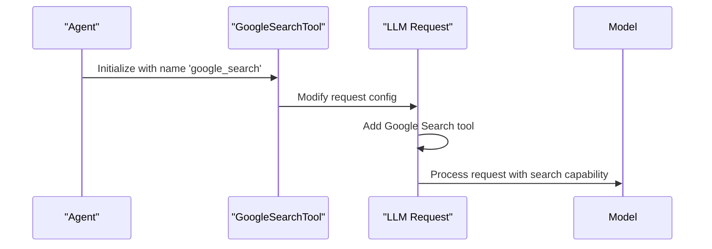
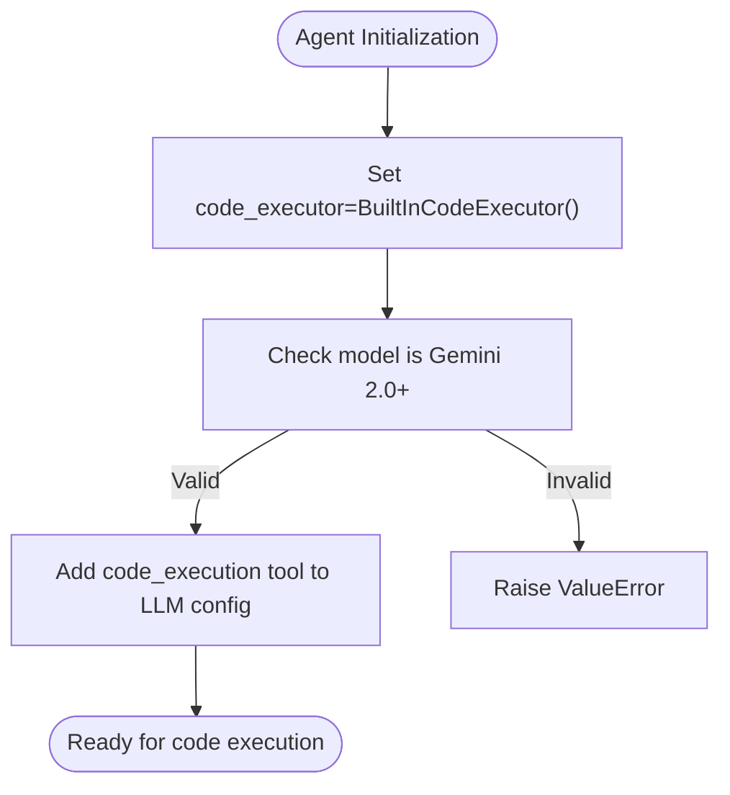
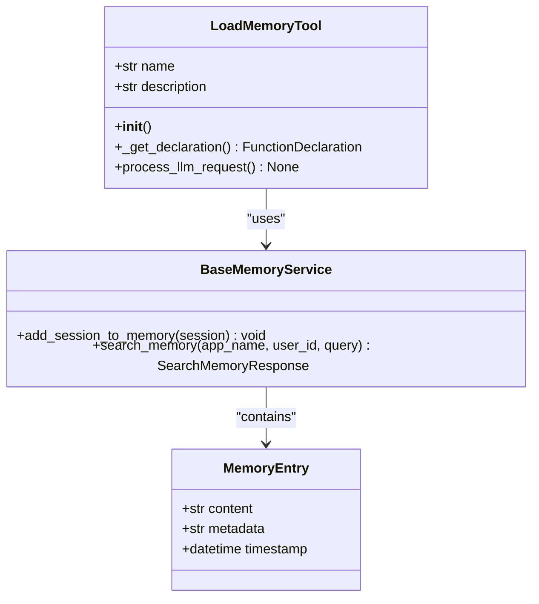
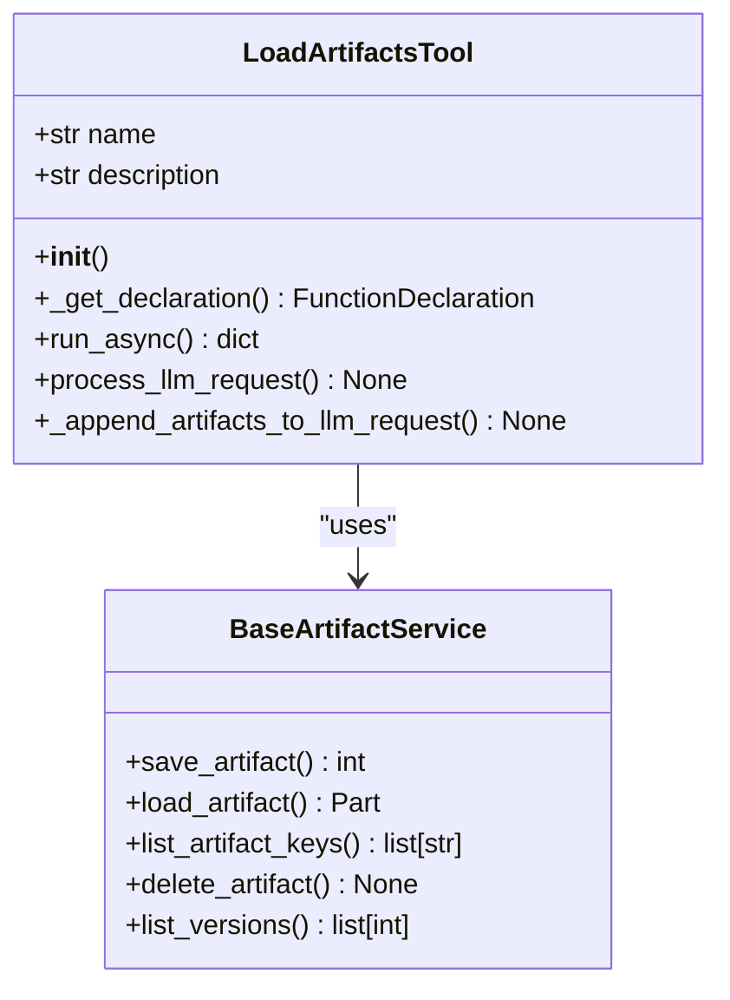
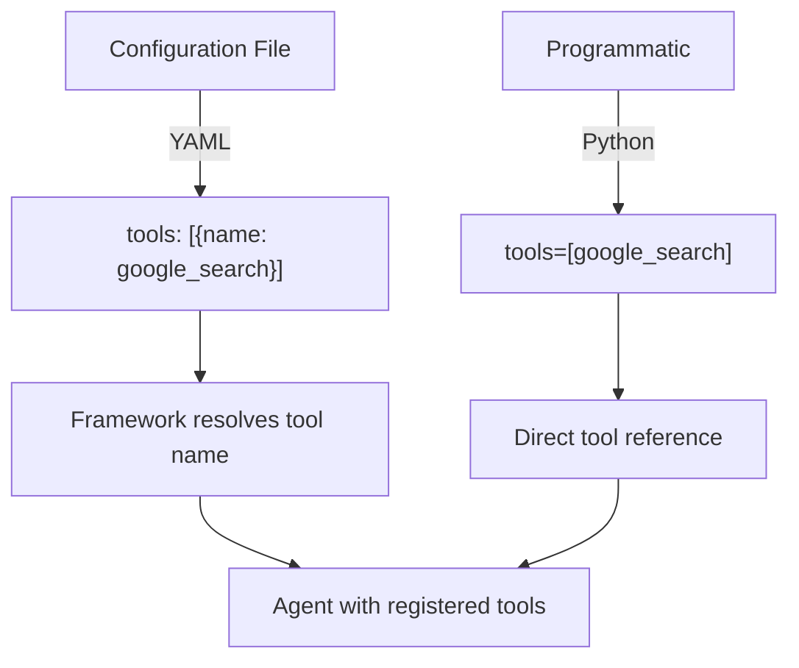

# Built-in Tools

<cite>
**Referenced Files in This Document**   
- [google_search_tool.py](file://src/google/adk/tools/google_search_tool.py)
- [built_in_code_executor.py](file://src/google/adk/code_executors/built_in_code_executor.py)
- [load_artifacts_tool.py](file://src/google/adk/tools/load_artifacts_tool.py)
- [load_memory_tool.py](file://src/google/adk/tools/load_memory_tool.py)
- [base_memory_service.py](file://src/google/adk/memory/base_memory_service.py)
- [base_artifact_service.py](file://src/google/adk/artifacts/base_artifact_service.py)
- [tool_configs.py](file://src/google/adk/tools/tool_configs.py)
- [root_agent.yaml](file://contributing/samples/tool_builtin_config/root_agent.yaml)
- [agent.py](file://contributing/samples/google_search_agent/agent.py)
- [code_execution/agent.py](file://contributing/samples/code_execution/agent.py)
- [memory/agent.py](file://contributing/samples/memory/agent.py)
- [artifact_save_text/agent.py](file://contributing/samples/artifact_save_text/agent.py)
</cite>

## Table of Contents
1. [Introduction](#introduction)
2. [Google Search Tool](#google-search-tool)
3. [Code Execution Tool](#code-execution-tool)
4. [Memory Tools](#memory-tools)
5. [Artifact Tools](#artifact-tools)
6. [Tool Configuration and Registration](#tool-configuration-and-registration)
7. [Security Considerations](#security-considerations)
8. [Built-in vs Custom Tools](#built-in-vs-custom-tools)

## Introduction
The ADK framework provides a suite of built-in tools that enable agents to perform common operations such as web search, code execution, memory retrieval, and artifact handling. These tools are designed to integrate seamlessly with agent workflows, providing standardized interfaces for extending agent capabilities without requiring custom implementations for common use cases. The built-in tools leverage the framework's underlying services and are optimized for performance, security, and ease of use.

## Google Search Tool

The Google Search tool enables agents to retrieve up-to-date information from the web through Google Search integration. This tool is specifically designed to work with Gemini models and is implemented as a model-level feature rather than a separate code execution process.

The tool operates by modifying the LLM request configuration to include Google Search capabilities. When enabled, it appends the appropriate tool configuration to the request based on the model version. For Gemini 1.x models, it uses `GoogleSearchRetrieval`, while for newer Gemini models, it uses the enhanced `GoogleSearch` functionality.

The tool enforces model compatibility requirements, raising errors when used with unsupported models. It also prevents conflicts with other tools in Gemini 1.x models, as these versions do not support multiple tool usage simultaneously.

**Diagram sources**
- [google_search_tool.py](file://src/google/adk/tools/google_search_tool.py#L31-L69)

**Section sources**
- [google_search_tool.py](file://src/google/adk/tools/google_search_tool.py#L31-L69)
- [root_agent.yaml](file://contributing/samples/tool_builtin_config/root_agent.yaml#L1-L8)
- [agent.py](file://contributing/samples/google_search_agent/agent.py#L1-L26)

## Code Execution Tool

The Code Execution tool enables safe evaluation of code within agent workflows using the model's built-in code execution capabilities. This tool is specifically designed for Gemini 2.0+ models and leverages the model's native code interpreter functionality.

The `BuiltInCodeExecutor` class implements the code execution functionality by modifying the LLM request to include the code execution tool configuration. When processing a request, it validates that the model supports code execution and appends the appropriate tool configuration to the request.

The tool operates at the request preprocessing level, ensuring that code execution capabilities are available throughout the agent's interaction. It raises explicit errors when used with unsupported models, providing clear guidance about version requirements.

**Diagram sources**
- [built_in_code_executor.py](file://src/google/adk/code_executors/built_in_code_executor.py#L28-L55)

**Section sources**
- [built_in_code_executor.py](file://src/google/adk/code_executors/built_in_code_executor.py#L28-L55)
- [code_execution/agent.py](file://contributing/samples/code_execution/agent.py#L1-L101)

## Memory Tools

The ADK framework provides memory tools that enable agents to retrieve and utilize stored context from previous interactions. These tools facilitate stateful conversations by allowing agents to access relevant historical information.

The primary memory tool is `load_memory_tool`, which implements a function tool that searches for relevant memories based on a query. The tool integrates with the framework's memory service, which stores and retrieves memory entries associated with user sessions.

When configured in an agent, the memory tool automatically appends instructions to the LLM request, informing the model about the availability of memory and when to invoke the memory retrieval function. This creates a seamless experience where the model can request memory retrieval when needed to answer user queries.

**Diagram sources**
- [load_memory_tool.py](file://src/google/adk/tools/load_memory_tool.py#L51-L93)
- [base_memory_service.py](file://src/google/adk/memory/base_memory_service.py#L41-L78)

**Section sources**
- [load_memory_tool.py](file://src/google/adk/tools/load_memory_tool.py#L36-L93)
- [base_memory_service.py](file://src/google/adk/memory/base_memory_service.py#L31-L78)
- [memory/agent.py](file://contributing/samples/memory/agent.py#L1-L43)

## Artifact Tools

Artifact tools enable agents to handle file-based data through the framework's artifact storage system. The primary artifact tool is `load_artifacts_tool`, which allows agents to retrieve previously stored artifacts and incorporate them into the conversation context.

The artifact system provides a structured way to manage files associated with user sessions. Agents can save, load, list, and delete artifacts through the tool context interface. The `load_artifacts_tool` specifically enables the model to request the loading of specific artifacts when responding to user queries.

When an artifact is requested, the tool retrieves the content and appends it to the LLM request as additional context. This allows the model to incorporate file contents into its responses without requiring the user to re-upload or re-provide the information.

**Diagram sources**
- [load_artifacts_tool.py](file://src/google/adk/tools/load_artifacts_tool.py#L31-L113)
- [base_artifact_service.py](file://src/google/adk/artifacts/base_artifact_service.py#L23-L123)

**Section sources**
- [load_artifacts_tool.py](file://src/google/adk/tools/load_artifacts_tool.py#L31-L113)
- [base_artifact_service.py](file://src/google/adk/artifacts/base_artifact_service.py#L23-L123)
- [artifact_save_text/agent.py](file://contributing/samples/artifact_save_text/agent.py#L1-L46)

## Tool Configuration and Registration

Built-in tools are registered with agents through configuration files or direct instantiation. The framework supports multiple methods for tool registration, including direct import, configuration-based specification, and programmatic assignment.

In configuration files (YAML), tools are specified by their name, which corresponds to the built-in tool identifier. For example, the Google Search tool is registered by including `google_search` in the tools list. The framework automatically resolves these names to their corresponding implementations.

Programmatically, tools can be imported and assigned directly to the agent's tools list. This approach provides more control and enables type checking. Each built-in tool is exposed as a singleton instance that can be imported and used across multiple agents.

The `ToolConfig` class defines the schema for tool configuration, supporting various tool types including built-in tools, user-defined tool instances, tool classes, and functions that generate tool instances. This flexible configuration system allows for consistent tool management across different use cases.

**Section sources**
- [tool_configs.py](file://src/google/adk/tools/tool_configs.py#L26-L128)
- [root_agent.yaml](file://contributing/samples/tool_builtin_config/root_agent.yaml#L1-L8)
- [agent.py](file://contributing/samples/google_search_agent/agent.py#L1-L26)

## Security Considerations

The ADK framework's built-in tools incorporate several security measures to protect against potential risks associated with code execution and user input handling.

For code execution, the framework uses the model's built-in code interpreter rather than executing code in the local environment. This sandboxed approach prevents direct access to the host system and limits the potential impact of malicious code. The code execution tool is also restricted to specific model versions that provide secure execution environments.

User input is handled through validated interfaces that enforce type checking and parameter validation. The framework uses Pydantic models and schema validation to ensure that tool inputs conform to expected formats and constraints. This prevents injection attacks and ensures data integrity.

Memory and artifact tools implement access controls based on application name, user ID, and session ID, preventing unauthorized access to sensitive information. The framework also provides configurable safety settings that can be applied to limit potentially harmful content generation.

## Built-in vs Custom Tools

The ADK framework provides built-in tools for common use cases, but also supports custom tool development for specialized requirements. Built-in tools offer several advantages, including optimized performance, comprehensive error handling, and seamless integration with the framework's services.

Built-in tools should be used when the functionality matches the provided capabilities, such as web search, code execution, memory retrieval, and artifact handling. They reduce development effort and ensure consistency across agents.

Custom tools should be created when specific business logic, integration with external systems, or unique data processing requirements are needed. The framework provides extension points through the `BaseTool` class and function tool decorators, allowing developers to implement custom functionality while maintaining compatibility with the agent workflow.

The decision to use built-in versus custom tools should consider factors such as development time, maintenance requirements, performance needs, and security implications. In many cases, a combination of both approaches provides the optimal solution, leveraging built-in tools for common operations and custom tools for domain-specific functionality.