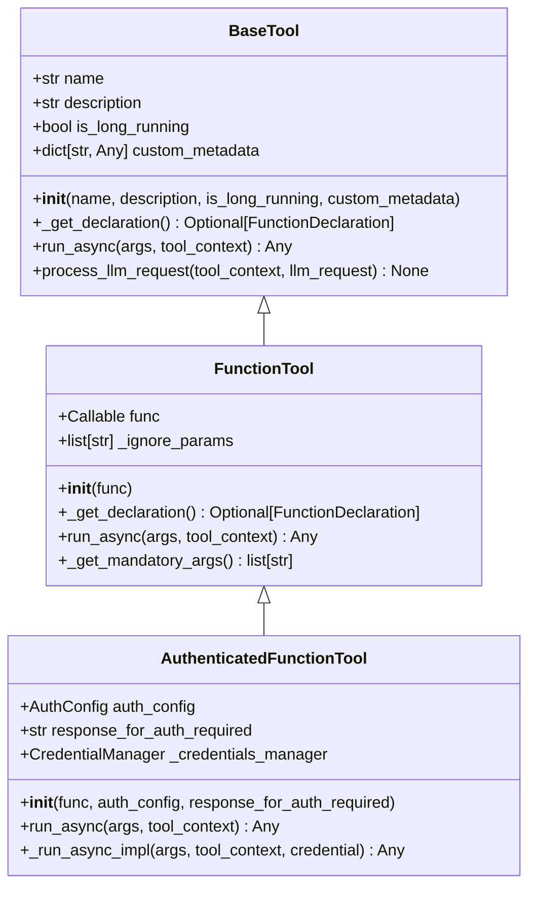
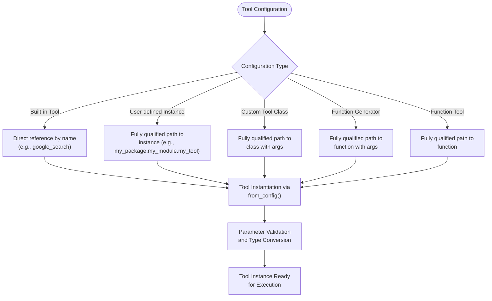
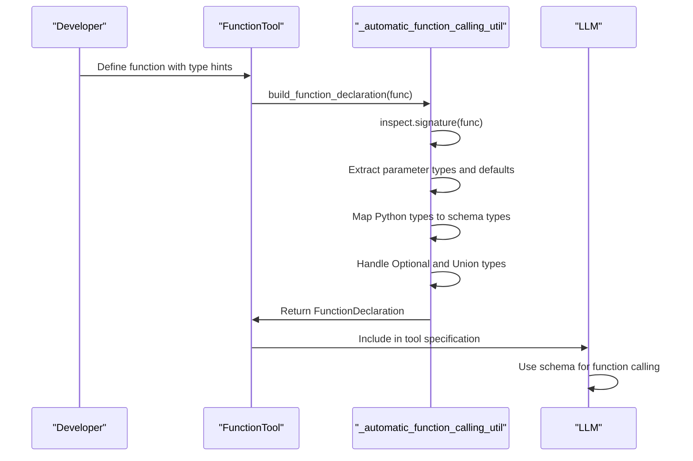
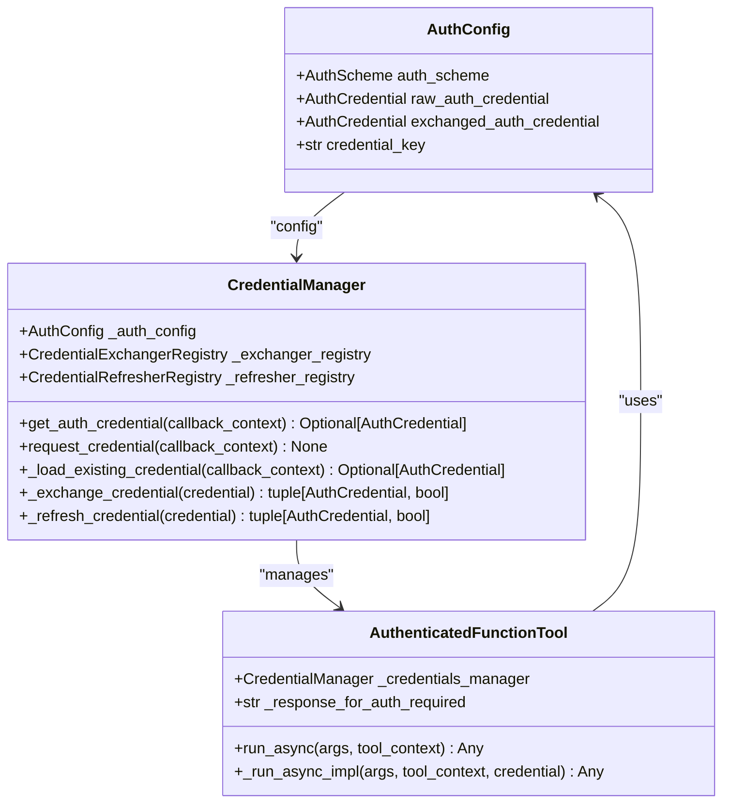
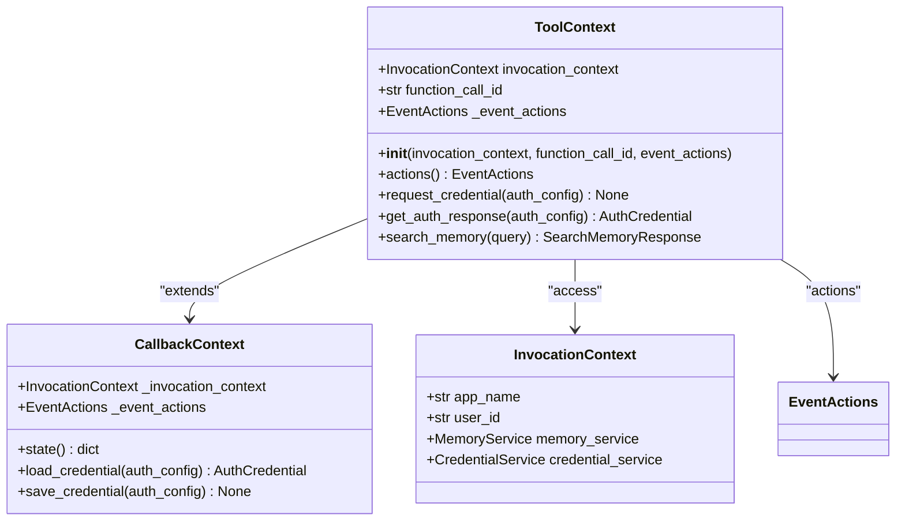
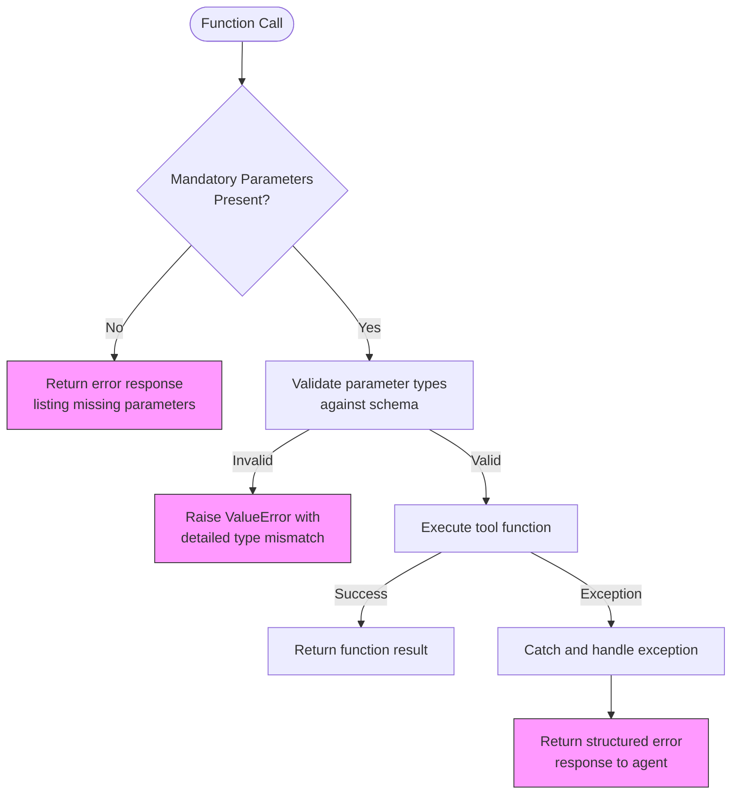

# Creating Custom Tools

<cite>
**Referenced Files in This Document**   
- [base_tool.py](file://src/google/adk/tools/base_tool.py)
- [authenticated_function_tool.py](file://src/google/adk/tools/authenticated_function_tool.py)
- [function_tool.py](file://src/google/adk/tools/function_tool.py)
- [tool_context.py](file://src/google/adk/tools/tool_context.py)
- [tool_configs.py](file://src/google/adk/tools/tool_configs.py)
- [auth_tool.py](file://src/google/adk/auth/auth_tool.py)
- [credential_manager.py](file://src/google/adk/auth/credential_manager.py)
- [tools.py](file://contributing/samples/tool_functions_config/tools.py)
- [json_analysis_tools.py](file://contributing/samples/openspec_integration/json_analysis_tools.py)
- [_automatic_function_calling_util.py](file://src/google/adk/tools/_automatic_function_calling_util.py)
- [_function_parameter_parse_util.py](file://src/google/adk/tools/_function_parameter_parse_util.py)
- [_gemini_schema_util.py](file://src/google/adk/tools/_gemini_schema_util.py)
</cite>

## Table of Contents
1. [Introduction](#introduction)
2. [Core Tool Classes](#core-tool-classes)
3. [Tool Configuration and Instantiation](#tool-configuration-and-instantiation)
4. [Function Parameter Parsing and Schema Generation](#function-parameter-parsing-and-schema-generation)
5. [Authentication Handling](#authentication-handling)
6. [Tool Context and Execution Environment](#tool-context-and-execution-environment)
7. [Error Handling and Validation](#error-handling-and-validation)
8. [Best Practices](#best-practices)
9. [Conclusion](#conclusion)

## Introduction
The ADK (Agent Development Kit) framework provides a robust system for extending agent capabilities through custom tools. This document details the process of creating custom tools by extending the `BaseTool` or `AuthenticatedFunctionTool` classes, covering implementation details such as function parameter parsing, schema generation for LLM compatibility, and authentication handling. The framework enables developers to define tool functions, configure parameters, and handle responses in a structured manner that integrates seamlessly with the agent's execution environment.

**Section sources**
- [base_tool.py](file://src/google/adk/tools/base_tool.py#L1-L213)

## Core Tool Classes
The ADK framework provides a hierarchical class structure for tool creation, with `BaseTool` serving as the foundation for all tool implementations. The `FunctionTool` class extends `BaseTool` to wrap user-defined Python functions, automatically extracting metadata and generating appropriate schema declarations for LLM interaction. For tools requiring authentication, `AuthenticatedFunctionTool` extends `FunctionTool` to handle credential management before executing the core tool logic.

**Diagram sources **
- [base_tool.py](file://src/google/adk/tools/base_tool.py#L47-L213)
- [function_tool.py](file://src/google/adk/tools/function_tool.py#L31-L168)
- [authenticated_function_tool.py](file://src/google/adk/tools/authenticated_function_tool.py#L38-L108)

**Section sources**
- [base_tool.py](file://src/google/adk/tools/base_tool.py#L47-L213)
- [function_tool.py](file://src/google/adk/tools/function_tool.py#L31-L168)
- [authenticated_function_tool.py](file://src/google/adk/tools/authenticated_function_tool.py#L38-L108)

## Tool Configuration and Instantiation
Tools in the ADK framework can be configured through various mechanisms, including direct instantiation, configuration files, and dynamic creation from functions. The `ToolConfig` class supports multiple tool types, including ADK built-in tools, user-defined tool instances, user-defined tool classes, and functions that generate tool instances. The `from_config` method in `BaseTool` uses type hint introspection to automatically map configuration values to constructor arguments, enabling flexible tool instantiation from configuration data.

**Diagram sources **
- [tool_configs.py](file://src/google/adk/tools/tool_configs.py#L26-L129)
- [base_tool.py](file://src/google/adk/tools/base_tool.py#L136-L213)

**Section sources**
- [tool_configs.py](file://src/google/adk/tools/tool_configs.py#L26-L129)
- [base_tool.py](file://src/google/adk/tools/base_tool.py#L136-L213)

## Function Parameter Parsing and Schema Generation
The ADK framework automatically generates schema declarations for tool functions to ensure LLM compatibility. The `_automatic_function_calling_util.py` module contains utilities for converting Python function signatures into OpenAPI-compatible schema definitions. The `build_function_declaration` function analyzes a callable's signature, extracts parameter types and documentation, and constructs a `FunctionDeclaration` object that describes the tool's interface to the LLM. This process involves mapping Python types to schema types, handling optional parameters, and generating appropriate validation rules.

**Diagram sources **
- [_automatic_function_calling_util.py](file://src/google/adk/tools/_automatic_function_calling_util.py#L1-L389)
- [function_tool.py](file://src/google/adk/tools/function_tool.py#L65-L77)

**Section sources**
- [_automatic_function_calling_util.py](file://src/google/adk/tools/_automatic_function_calling_util.py#L1-L389)
- [_function_parameter_parse_util.py](file://src/google/adk/tools/_function_parameter_parse_util.py#L1-L326)
- [_gemini_schema_util.py](file://src/google/adk/tools/_gemini_schema_util.py#L1-L159)

## Authentication Handling
For tools requiring authentication, the ADK framework provides a comprehensive system through the `AuthenticatedFunctionTool` and related classes. The authentication process is managed by the `CredentialManager`, which handles credential loading, exchange, and refreshing according to the specified `AuthConfig`. When a tool requires authentication, the `run_async` method first attempts to obtain valid credentials through the `CredentialManager`. If credentials are not available or insufficient, the tool can request user authorization by returning a specified response.

**Diagram sources **
- [authenticated_function_tool.py](file://src/google/adk/tools/authenticated_function_tool.py#L38-L108)
- [credential_manager.py](file://src/google/adk/auth/credential_manager.py#L32-L262)
- [auth_tool.py](file://src/google/adk/auth/auth_tool.py#L26-L101)

**Section sources**
- [authenticated_function_tool.py](file://src/google/adk/tools/authenticated_function_tool.py#L38-L108)
- [credential_manager.py](file://src/google/adk/auth/credential_manager.py#L32-L262)
- [auth_tool.py](file://src/google/adk/auth/auth_tool.py#L26-L101)

## Tool Context and Execution Environment
The `ToolContext` class provides essential information and services to tools during execution. It serves as the execution environment, offering access to the invocation context, function call ID, event actions, and authentication mechanisms. Tools can use the context to interact with the agent's state, perform memory searches, and request credentials when needed. The context also facilitates communication between the tool and the agent framework, enabling features like human-in-the-loop interactions and state management.

**Diagram sources **
- [tool_context.py](file://src/google/adk/tools/tool_context.py#L31-L81)
- [agents/callback_context.py](file://src/google/adk/agents/callback_context.py)
- [agents/invocation_context.py](file://src/google/adk/agents/invocation_context.py)

**Section sources**
- [tool_context.py](file://src/google/adk/tools/tool_context.py#L31-L81)

## Error Handling and Validation
The ADK framework implements comprehensive error handling and validation mechanisms to ensure robust tool execution. The `FunctionTool` class includes built-in validation that checks for missing mandatory parameters before invoking the underlying function, preventing runtime errors due to incomplete input. The parameter parsing utilities perform type validation and compatibility checks, raising descriptive errors when default values do not match their annotations. Authentication-related operations include validation of credential configurations and proper error handling for missing or expired credentials.

**Diagram sources **
- [function_tool.py](file://src/google/adk/tools/function_tool.py#L97-L107)
- [_function_parameter_parse_util.py](file://src/google/adk/tools/_function_parameter_parse_util.py#L127-L315)

**Section sources**
- [function_tool.py](file://src/google/adk/tools/function_tool.py#L97-L107)
- [_function_parameter_parse_util.py](file://src/google/adk/tools/_function_parameter_parse_util.py#L127-L315)

## Best Practices
When implementing custom tools in the ADK framework, several best practices should be followed to ensure reliability, maintainability, and optimal performance. These include using clear and descriptive function names and docstrings, implementing proper type hints for all parameters, and handling asynchronous operations appropriately. For tools requiring authentication, it's recommended to provide meaningful responses when credentials are missing or insufficient. Performance optimization can be achieved by minimizing external dependencies, implementing caching where appropriate, and ensuring efficient error handling.

**Section sources**
- [tools.py](file://contributing/samples/tool_functions_config/tools.py#L20-L63)
- [json_analysis_tools.py](file://contributing/samples/openspec_integration/json_analysis_tools.py#L482-L679)

## Conclusion
The ADK framework provides a comprehensive and flexible system for creating custom tools that extend agent capabilities. By understanding the core tool classes, configuration mechanisms, parameter parsing, authentication handling, and execution context, developers can create powerful tools that integrate seamlessly with the agent framework. The combination of automatic schema generation, robust authentication management, and comprehensive error handling enables the creation of reliable and maintainable tools that enhance the agent's functionality while maintaining compatibility with LLM systems.