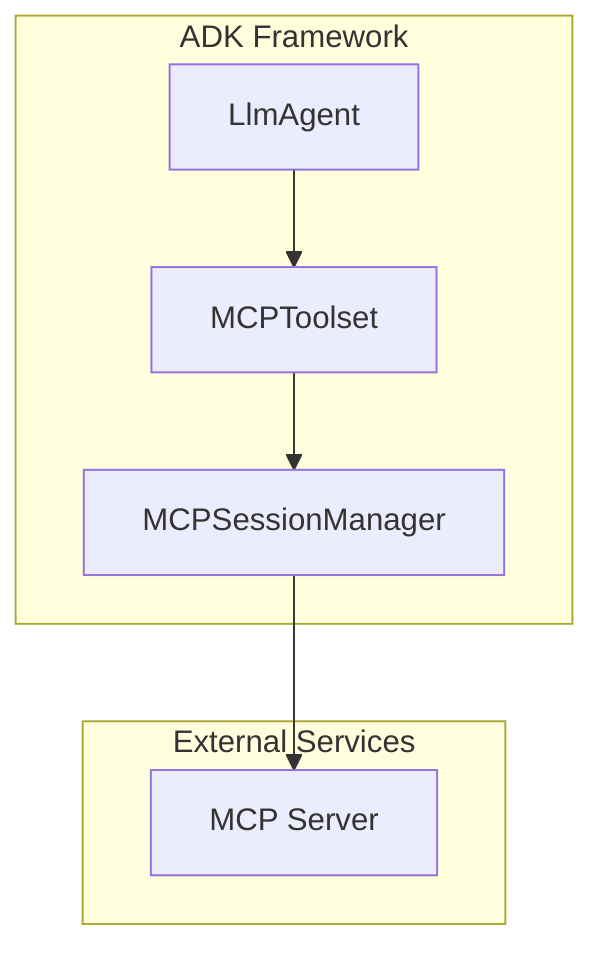
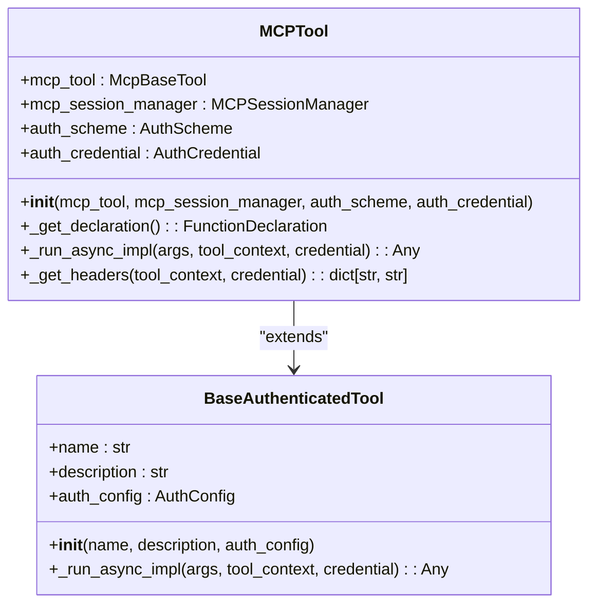
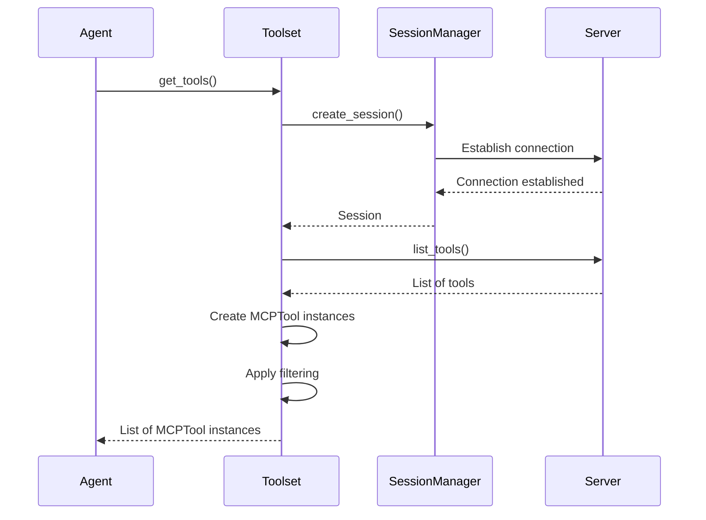
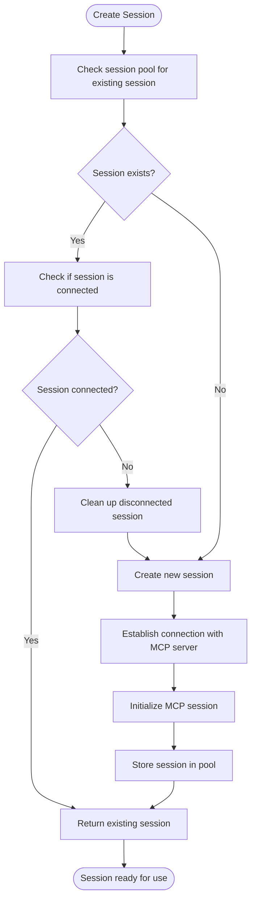
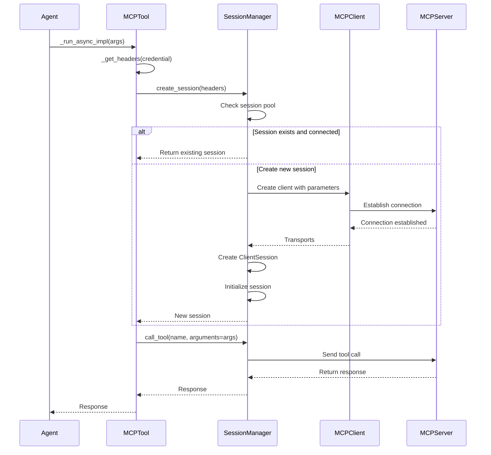
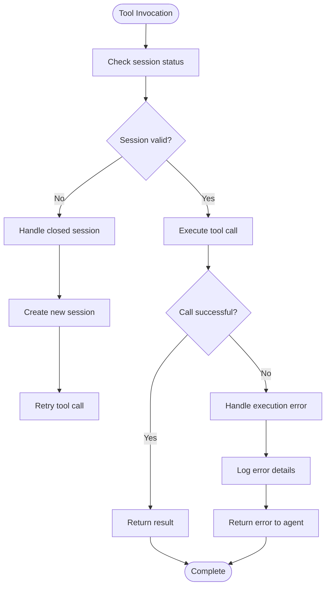

# MCP (Model Context Protocol) Integration

<cite>
**Referenced Files in This Document**   
- [mcp_tool.py](file://src/google/adk/tools/mcp_tool/mcp_tool.py)
- [mcp_toolset.py](file://src/google/adk/tools/mcp_tool/mcp_toolset.py)
- [mcp_session_manager.py](file://src/google/adk/tools/mcp_tool/mcp_session_manager.py)
- [conversion_utils.py](file://src/google/adk/tools/mcp_tool/conversion_utils.py)
- [agent.py](file://contributing/samples/mcp_sse_agent/agent.py)
- [agent.py](file://contributing/samples/mcp_stdio_server_agent/agent.py)
- [agent.py](file://contributing/samples/mcp_streamablehttp_agent/agent.py)
- [README_MCP_INTEGRATION.md](file://contributing/samples/spec_kit_integration/README_MCP_INTEGRATION.md)
</cite>

## Table of Contents
1. [Introduction](#introduction)
2. [Core Components](#core-components)
3. [Architecture Overview](#architecture-overview)
4. [MCPTool Class Implementation](#mcptool-class-implementation)
5. [MCPToolset and Tool Management](#mcptoolset-and-tool-management)
6. [Session Management System](#session-management-system)
7. [Data Flow and Communication](#data-flow-and-communication)
8. [Connection Types and Configuration](#connection-types-and-configuration)
9. [Error Handling and Reliability](#error-handling-and-reliability)
10. [Best Practices](#best-practices)

## Introduction

The Model Context Protocol (MCP) integration enables bidirectional communication between agents and external services through a standardized protocol. This system allows agents to discover, invoke, and manage tools hosted on external MCP servers, facilitating seamless interaction with various services and capabilities. The MCP integration in ADK provides a robust framework for connecting to MCP servers using different transport mechanisms, managing sessions, and handling tool execution with proper error handling and connection management.

## Core Components

The MCP integration system consists of several core components that work together to enable communication between agents and external services. These components include the MCPTool class for individual tool representation, the MCPToolset for managing collections of tools from an MCP server, and the MCPSessionManager for handling connections and session lifecycle. The system also includes conversion utilities for translating between ADK and MCP data formats, ensuring compatibility between the agent framework and external MCP servers.

**Section sources**
- [mcp_tool.py](file://src/google/adk/tools/mcp_tool/mcp_tool.py#L1-L219)
- [mcp_toolset.py](file://src/google/adk/tools/mcp_tool/mcp_toolset.py#L1-L250)
- [mcp_session_manager.py](file://src/google/adk/tools/mcp_tool/mcp_session_manager.py#L1-L396)

## Architecture Overview

The MCP integration architecture follows a layered approach with clear separation of concerns between tool representation, toolset management, and session handling. The agent interacts with MCPTool instances through the MCPToolset, which acts as a bridge between the agent framework and the external MCP server. The MCPSessionManager handles the underlying connection and session management, abstracting the transport-specific details from the higher-level components.



**Diagram sources **
- [mcp_toolset.py](file://src/google/adk/tools/mcp_tool/mcp_toolset.py#L62-L90)
- [mcp_session_manager.py](file://src/google/adk/tools/mcp_tool/mcp_session_manager.py#L138-L186)

## MCPTool Class Implementation

The MCPTool class serves as a wrapper that transforms an MCP tool into an ADK-compatible tool. It inherits from BaseAuthenticatedTool and provides the necessary interface for integration with the ADK agent framework. The class handles authentication, request conversion, and response handling for individual MCP tools.

The MCPTool initialization requires an MCP tool definition and a session manager for communication. It extracts the tool's name and description from the MCP tool and sets up authentication configuration if provided. The _get_declaration method converts the MCP tool's input schema to a Gemini function declaration, enabling the agent to understand and invoke the tool.



**Diagram sources **
- [mcp_tool.py](file://src/google/adk/tools/mcp_tool/mcp_tool.py#L55-L219)

## MCPToolset and Tool Management

The MCPToolset class manages the connection to an MCP server and provides tools that can be used by an agent. It implements the BaseToolset interface, allowing it to be seamlessly integrated into the agent framework. The toolset handles tool discovery, filtering, and instantiation, creating MCPTool instances for each available tool on the server.

The MCPToolset supports various connection parameters for different transport mechanisms, including Stdio, SSE, and Streamable HTTP. It allows for optional tool filtering to include only specific tools or apply custom filtering logic. The get_tools method retrieves available tools from the MCP server, applies filtering based on context and configuration, and returns a list of MCPTool instances.



**Diagram sources **
- [mcp_toolset.py](file://src/google/adk/tools/mcp_tool/mcp_toolset.py#L62-L172)

## Session Management System

The MCPSessionManager class is responsible for managing MCP client sessions, handling connection lifecycle, and providing session pooling capabilities. It supports different connection types through specific parameter classes (StdioConnectionParams, SseConnectionParams, StreamableHTTPConnectionParams) and handles the creation and cleanup of sessions.

The session manager implements connection pooling based on authentication headers, allowing multiple sessions with different authentication contexts to be maintained simultaneously. It includes retry logic for handling closed resources, automatically attempting to recreate sessions when connections are lost. The manager uses an async lock to prevent race conditions during session creation and maintains a dictionary of active sessions with their corresponding exit stacks for proper resource cleanup.



**Diagram sources **
- [mcp_session_manager.py](file://src/google/adk/tools/mcp_tool/mcp_session_manager.py#L138-L396)

## Data Flow and Communication

The data flow in the MCP integration system follows a structured pattern from agent request to external service response. When an agent needs to invoke a tool, it calls the _run_async_impl method on the MCPTool instance, which coordinates with the MCPSessionManager to obtain a session and make the actual tool call.

The communication flow involves several key steps: authentication header extraction, session acquisition, tool invocation, and response handling. The MCPTool extracts authentication headers from credentials and passes them to the session manager, which either reuses an existing session or creates a new one. The tool call is then forwarded through the session to the MCP server, with the response being returned to the agent.



**Diagram sources **
- [mcp_tool.py](file://src/google/adk/tools/mcp_tool/mcp_tool.py#L113-L134)
- [mcp_session_manager.py](file://src/google/adk/tools/mcp_tool/mcp_session_manager.py#L297-L367)

## Connection Types and Configuration

The MCP integration supports multiple connection types to accommodate different deployment scenarios and transport mechanisms. Each connection type has specific parameters and use cases, allowing flexibility in how agents connect to MCP servers.

### STDIO Connection
The STDIO connection type is used for local MCP servers that communicate through standard input/output streams. It's typically used for servers launched as subprocesses with commands like `npx`. The StdioConnectionParams class configures the command and arguments for launching the server, along with a timeout for connection establishment.

```python
MCPToolset(
    connection_params=StdioConnectionParams(
        server_params=StdioServerParameters(
            command='npx',
            args=['-y', '@modelcontextprotocol/server-filesystem'],
        ),
        timeout=5,
    )
)
```

### SSE Connection
The SSE (Server-Sent Events) connection type enables communication with MCP servers over HTTP using server-sent events. This is useful for remote servers or when a persistent HTTP connection is preferred. The SseConnectionParams class configures the server URL, headers, and timeouts for both connection and data reading.

```python
MCPToolset(
    connection_params=SseConnectionParams(
        url='http://localhost:3000/sse',
        headers={'Accept': 'text/event-stream'},
        timeout=5.0,
        sse_read_timeout=300.0,
    )
)
```

### Streamable HTTP Connection
The Streamable HTTP connection type provides an HTTP-based transport for MCP communication. It supports standard HTTP requests and responses, making it compatible with traditional web servers. The StreamableHTTPConnectionParams class configures the server URL, headers, timeouts, and whether to terminate the server when the connection closes.

```python
MCPToolset(
    connection_params=StreamableHTTPConnectionParams(
        url='http://localhost:3000/mcp',
        headers={'Content-Type': 'application/json'},
        timeout=5.0,
        sse_read_timeout=300.0,
        terminate_on_close=True,
    )
)
```

**Section sources**
- [mcp_session_manager.py](file://src/google/adk/tools/mcp_tool/mcp_session_manager.py#L53-L109)
- [agent.py](file://contributing/samples/mcp_sse_agent/agent.py#L24-L58)
- [agent.py](file://contributing/samples/mcp_stdio_server_agent/agent.py#L25-L67)
- [agent.py](file://contributing/samples/mcp_streamablehttp_agent/agent.py#L24-L58)

## Error Handling and Reliability

The MCP integration system includes comprehensive error handling and reliability features to ensure robust operation in various scenarios. The system handles connection failures, session disruptions, and tool execution errors gracefully, allowing agents to continue functioning even when some MCP servers are unavailable.

The retry_on_closed_resource decorator automatically retries operations when a session is closed, improving resilience to transient connection issues. The session manager detects disconnected sessions and cleans them up before creating new ones, preventing resource leaks and ensuring fresh connections. The MCPToolset implementation includes graceful fallback mechanisms, allowing agents to continue with available tools even if some MCP servers cannot be reached.

Error handling also extends to authentication, with specific validation for API key locations (only header-based API keys are supported) and proper processing of different authentication schemes (OAuth2, HTTP authentication, API keys). The system logs warnings and errors appropriately, providing visibility into issues without blocking application shutdown.



**Diagram sources **
- [mcp_session_manager.py](file://src/google/adk/tools/mcp_tool/mcp_session_manager.py#L111-L135)
- [mcp_tool.py](file://src/google/adk/tools/mcp_tool/mcp_tool.py#L113-L134)

## Best Practices

Implementing reliable MCP integrations requires following several best practices for configuration, error handling, and connection management. These practices ensure robust operation and optimal performance in production environments.

### Configuration Best Practices
- Use specific tool filtering to limit the tools available to agents, reducing complexity and potential security risks
- Configure appropriate timeouts for connections and data reading based on expected server response times
- Use StdioConnectionParams instead of StdioServerParameters for better configurability, including timeout settings
- Implement proper authentication headers for secure server access

### Error Handling Best Practices
- Implement graceful fallback mechanisms that allow agents to continue functioning when MCP servers are unavailable
- Monitor and log connection and tool execution errors for troubleshooting and performance analysis
- Handle authentication errors appropriately, ensuring credentials are properly validated before use
- Use the retry_on_closed_resource decorator to automatically handle transient connection issues

### Connection Management Best Practices
- Leverage session pooling to reduce connection overhead and improve performance
- Ensure proper cleanup of resources by calling close() on toolsets when they are no longer needed
- Monitor server load and adjust connection parameters accordingly to prevent overloading
- Implement health checks for MCP servers to detect availability before attempting connections

### Performance Optimization
- Cache tool definitions when possible to reduce discovery overhead
- Filter tools to only those needed for specific use cases, reducing the agent's cognitive load
- Use connection pooling with appropriate session keys based on authentication contexts
- Optimize timeout values based on actual server performance characteristics

**Section sources**
- [README_MCP_INTEGRATION.md](file://contributing/samples/spec_kit_integration/README_MCP_INTEGRATION.md#L1-L238)
- [mcp_toolset.py](file://src/google/adk/tools/mcp_tool/mcp_toolset.py#L174-L186)
- [mcp_session_manager.py](file://src/google/adk/tools/mcp_tool/mcp_session_manager.py#L375-L391)