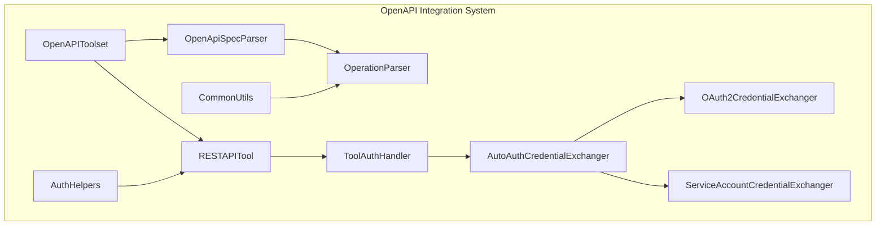
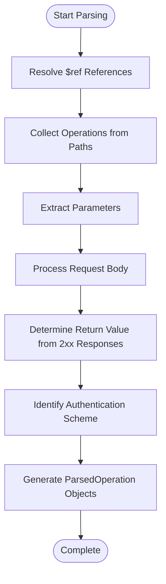
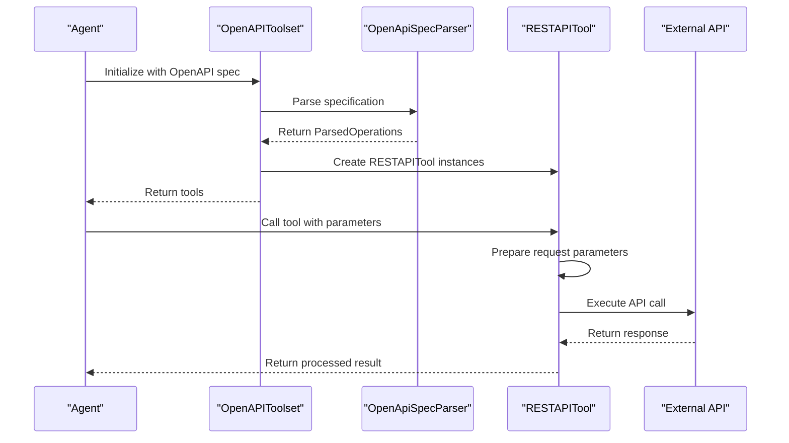
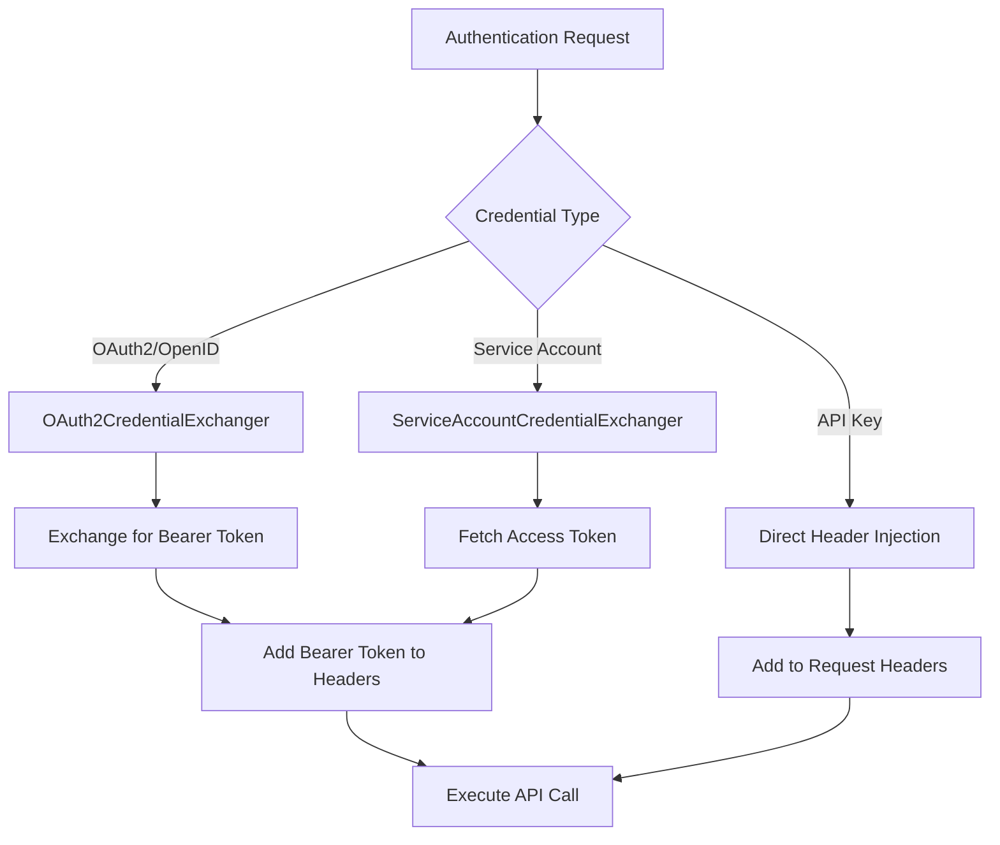
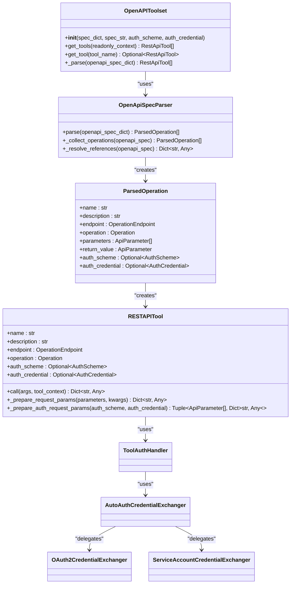

# OpenAPI Integration

<cite>
**Referenced Files in This Document**   
- [openapi_spec_parser.py](file://src/google/adk/tools/openapi_tool/openapi_spec_parser/openapi_spec_parser.py)
- [rest_api_tool.py](file://src/google/adk/tools/openapi_tool/openapi_spec_parser/rest_api_tool.py)
- [openapi_toolset.py](file://src/google/adk/tools/openapi_tool/openapi_spec_parser/openapi_toolset.py)
- [operation_parser.py](file://src/google/adk/tools/openapi_tool/openapi_spec_parser/operation_parser.py)
- [oauth2_exchanger.py](file://src/google/adk/tools/openapi_tool/auth/credential_exchangers/oauth2_exchanger.py)
- [service_account_exchanger.py](file://src/google/adk/tools/openapi_tool/auth/credential_exchangers/service_account_exchanger.py)
- [auth_helpers.py](file://src/google/adk/tools/openapi_tool/auth/auth_helpers.py)
- [common.py](file://src/google/adk/tools/openapi_tool/common/common.py)
</cite>

## Table of Contents
1. [Introduction](#introduction)
2. [OpenAPI Tool System Architecture](#openapi-tool-system-architecture)
3. [Specification Parsing](#specification-parsing)
4. [Operation Routing](#operation-routing)
5. [Authentication Handling](#authentication-handling)
6. [Implementation Details](#implementation-details)
7. [Usage Examples](#usage-examples)
8. [Common Issues and Troubleshooting](#common-issues-and-troubleshooting)
9. [Best Practices](#best-practices)
10. [Conclusion](#conclusion)

## Introduction

The OpenAPI Integration system enables agents to connect with external services through OpenAPI specifications. This framework provides a comprehensive solution for parsing OpenAPI specs, routing operations, and handling authentication mechanisms. The system is designed to seamlessly integrate RESTful APIs into agent workflows, supporting both OAuth2 and service account credential exchange mechanisms. This document details the architecture, implementation, and best practices for using the OpenAPI tool system within the ADK framework.

## OpenAPI Tool System Architecture

The OpenAPI integration system follows a modular architecture with distinct components responsible for different aspects of API integration. The core components include the OpenAPIToolset, RESTAPITool, OpenApiSpecParser, and various authentication handlers. These components work together to transform OpenAPI specifications into callable tools that agents can use to interact with external services.



**Diagram sources**
- [openapi_toolset.py](file://src/google/adk/tools/openapi_tool/openapi_spec_parser/openapi_toolset.py#L41-L165)
- [openapi_spec_parser.py](file://src/google/adk/tools/openapi_tool/openapi_spec_parser/openapi_spec_parser.py#L51-L239)
- [rest_api_tool.py](file://src/google/adk/tools/openapi_tool/openapi_spec_parser/rest_api_tool.py#L67-L430)
- [auth_helpers.py](file://src/google/adk/tools/openapi_tool/auth/auth_helpers.py#L46-L499)

**Section sources**
- [openapi_toolset.py](file://src/google/adk/tools/openapi_tool/openapi_spec_parser/openapi_toolset.py#L41-L165)
- [openapi_spec_parser.py](file://src/google/adk/tools/openapi_tool/openapi_spec_parser/openapi_spec_parser.py#L51-L239)

## Specification Parsing

The OpenApiSpecParser component is responsible for processing OpenAPI specifications and extracting operations. It handles JSON and YAML formats, resolves $ref references, and processes the entire specification to create ParsedOperation objects. The parser supports recursive reference resolution with circular reference detection, ensuring that complex specifications with interdependent components are properly handled.

The parsing process involves several key steps:
1. Reference resolution to expand all $ref references
2. Operation collection from paths and methods
3. Parameter extraction from path, query, header, and body locations
4. Return value determination from 2xx responses
5. Authentication scheme identification



**Diagram sources**
- [openapi_spec_parser.py](file://src/google/adk/tools/openapi_tool/openapi_spec_parser/openapi_spec_parser.py#L153-L238)
- [operation_parser.py](file://src/google/adk/tools/openapi_tool/openapi_spec_parser/operation_parser.py#L80-L152)

**Section sources**
- [openapi_spec_parser.py](file://src/google/adk/tools/openapi_tool/openapi_spec_parser/openapi_spec_parser.py#L60-L239)
- [operation_parser.py](file://src/google/adk/tools/openapi_tool/openapi_spec_parser/operation_parser.py#L80-L270)

## Operation Routing

The operation routing system converts parsed OpenAPI operations into executable tools. Each operation in the specification becomes a RESTAPITool instance with a unique name derived from the operationId. The system handles parameter mapping, URL construction, and request preparation to ensure proper routing of API calls.

Key aspects of operation routing include:
- OperationId to snake_case name conversion
- Parameter location handling (path, query, header, cookie)
- Path parameter substitution in URLs
- Content-type specific body handling
- User-Agent header injection with version information



**Diagram sources**
- [openapi_toolset.py](file://src/google/adk/tools/openapi_tool/openapi_spec_parser/openapi_toolset.py#L151-L160)
- [rest_api_tool.py](file://src/google/adk/tools/openapi_tool/openapi_spec_parser/rest_api_tool.py#L230-L347)

**Section sources**
- [openapi_toolset.py](file://src/google/adk/tools/openapi_tool/openapi_spec_parser/openapi_toolset.py#L151-L160)
- [rest_api_tool.py](file://src/google/adk/tools/openapi_tool/openapi_spec_parser/rest_api_tool.py#L230-L430)

## Authentication Handling

The authentication system provides comprehensive support for various credential types including OAuth2, OpenID Connect, service accounts, and API keys. The AutoAuthCredentialExchanger automatically selects the appropriate credential exchanger based on the authentication scheme and credential type.

The authentication flow involves:
1. Authentication scheme identification from the OpenAPI spec
2. Credential preparation using the appropriate exchanger
3. Token exchange or direct credential usage
4. Request header injection with authentication tokens



**Diagram sources**
- [auto_auth_credential_exchanger.py](file://src/google/adk/tools/openapi_tool/auth/credential_exchangers/auto_auth_credential_exchanger.py#L27-L106)
- [oauth2_exchanger.py](file://src/google/adk/tools/openapi_tool/auth/credential_exchangers/oauth2_exchanger.py#L28-L118)
- [service_account_exchanger.py](file://src/google/adk/tools/openapi_tool/auth/credential_exchangers/service_account_exchanger.py#L35-L101)

**Section sources**
- [auto_auth_credential_exchanger.py](file://src/google/adk/tools/openapi_tool/auth/credential_exchangers/auto_auth_credential_exchanger.py#L27-L106)
- [oauth2_exchanger.py](file://src/google/adk/tools/openapi_tool/auth/credential_exchangers/oauth2_exchanger.py#L28-L118)
- [service_account_exchanger.py](file://src/google/adk/tools/openapi_tool/auth/credential_exchangers/service_account_exchanger.py#L35-L101)

## Implementation Details

### OpenAPISpecParser

The OpenApiSpecParser class is the foundation of the OpenAPI integration system. It takes an OpenAPI specification dictionary and processes it to extract operations. The parser handles reference resolution, operation collection, and parameter extraction. It returns a list of ParsedOperation objects that contain all necessary information to create RESTAPITool instances.

Key methods include:
- `_resolve_references`: Recursively resolves $ref references with circular reference detection
- `_collect_operations`: Extracts operations from paths and methods
- `parse`: Main entry point that orchestrates the parsing process

### RESTAPITool

The RESTAPITool class represents a single API operation as a callable tool. It handles request preparation, authentication, and response processing. Each tool is created from a ParsedOperation and can be invoked with parameters that match the operation's defined parameters.

Key features:
- Automatic parameter mapping to request components
- Authentication token handling
- Error response processing
- User-Agent header with version information
- Support for various content types (JSON, form data, etc.)

### Credential Exchange Mechanisms

The system implements two primary credential exchange mechanisms:

#### OAuth2 Exchange
The OAuth2CredentialExchanger handles OAuth2 and OpenID Connect flows. It validates the authentication scheme and credential, then generates a Bearer token for API calls. The exchanger supports both pre-exchanged access tokens and authorization flows.

#### Service Account Exchange
The ServiceAccountCredentialExchanger handles Google Service Account credentials. It can use either provided service account credentials or default credentials from the environment. The exchanger fetches an access token and returns it as a Bearer token for API calls.



**Diagram sources**
- [openapi_spec_parser.py](file://src/google/adk/tools/openapi_tool/openapi_spec_parser/openapi_spec_parser.py#L51-L239)
- [rest_api_tool.py](file://src/google/adk/tools/openapi_tool/openapi_spec_parser/rest_api_tool.py#L67-L430)
- [openapi_toolset.py](file://src/google/adk/tools/openapi_tool/openapi_spec_parser/openapi_toolset.py#L41-L165)

**Section sources**
- [openapi_spec_parser.py](file://src/google/adk/tools/openapi_tool/openapi_spec_parser/openapi_spec_parser.py#L51-L239)
- [rest_api_tool.py](file://src/google/adk/tools/openapi_tool/openapi_spec_parser/rest_api_tool.py#L67-L430)
- [openapi_toolset.py](file://src/google/adk/tools/openapi_tool/openapi_spec_parser/openapi_toolset.py#L41-L165)

## Usage Examples

### Loading OpenAPI Specifications

OpenAPI specifications can be loaded from either a dictionary or a string in JSON or YAML format. The OpenAPIToolset handles the parsing and tool creation automatically.

```python
# Load from JSON string
toolset = OpenAPIToolset(spec_str=openapi_json, spec_str_type="json")

# Load from YAML string
toolset = OpenAPIToolset(spec_str=openapi_yaml, spec_str_type="yaml")

# Load from dictionary
toolset = OpenAPIToolset(spec_dict=openapi_dict)
```

### Configuring Authentication

Authentication can be configured at the toolset level, applying to all tools, or at the individual tool level.

```python
# Configure OAuth2 authentication
auth_scheme, auth_credential = openid_url_to_scheme_credential(
    openid_url="https://accounts.google.com/.well-known/openid-configuration",
    scopes=["https://www.googleapis.com/auth/cloud-platform"],
    credential_dict={
        "client_id": "your_client_id",
        "client_secret": "your_client_secret"
    }
)
toolset = OpenAPIToolset(
    spec_dict=spec,
    auth_scheme=auth_scheme,
    auth_credential=auth_credential
)

# Configure Service Account authentication
service_account_config = {
    "type": "service_account",
    "project_id": "your-project-id",
    "private_key_id": "your-key-id",
    "private_key": "your-private-key",
    "client_email": "your-service-account@your-project.iam.gserviceaccount.com",
    "client_id": "your-client-id",
    "auth_uri": "https://accounts.google.com/o/oauth2/auth",
    "token_uri": "https://oauth2.googleapis.com/token"
}
auth_scheme, auth_credential = service_account_dict_to_scheme_credential(
    config=service_account_config,
    scopes=["https://www.googleapis.com/auth/cloud-platform"]
)
toolset = OpenAPIToolset(
    spec_dict=spec,
    auth_scheme=auth_scheme,
    auth_credential=auth_credential
)
```

### Invoking API Operations

Once configured, API operations can be invoked through the agent system.

```python
# Get all tools from the toolset
tools = await toolset.get_tools()

# Or get a specific tool by name
tool = toolset.get_tool("create_user")

# Invoke the tool
result = await tool.call(
    args={"name": "John Doe", "email": "john@example.com"},
    tool_context=tool_context
)
```

**Section sources**
- [openapi_toolset.py](file://src/google/adk/tools/openapi_tool/openapi_spec_parser/openapi_toolset.py#L62-L112)
- [auth_helpers.py](file://src/google/adk/tools/openapi_tool/auth/auth_helpers.py#L72-L202)
- [rest_api_tool.py](file://src/google/adk/tools/openapi_tool/openapi_spec_parser/rest_api_tool.py#L355-L416)

## Common Issues and Troubleshooting

### Specification Parsing Errors

Common parsing issues include:
- Invalid JSON or YAML syntax
- Unresolved $ref references
- Missing operationId fields
- Circular references in the specification

**Solutions:**
- Validate the OpenAPI specification using standard tools before loading
- Ensure all $ref references point to valid locations
- Provide operationId for all operations
- Use the _resolve_references method to handle complex reference structures

### Authentication Configuration

Common authentication issues:
- Missing or invalid credentials
- Incorrect scopes
- Expired tokens
- Misconfigured authentication schemes

**Solutions:**
- Verify credential format and required fields
- Ensure proper scopes are included
- Implement token refresh mechanisms
- Validate authentication scheme against OpenAPI spec

### Response Schema Mismatches

Issues with response handling:
- Unexpected response formats
- Missing required fields
- Type mismatches between spec and actual response

**Solutions:**
- Implement robust error handling for non-JSON responses
- Use flexible parsing for response data
- Validate responses against the expected schema
- Handle both successful and error responses appropriately

**Section sources**
- [openapi_spec_parser.py](file://src/google/adk/tools/openapi_tool/openapi_spec_parser/openapi_spec_parser.py#L153-L238)
- [rest_api_tool.py](file://src/google/adk/tools/openapi_tool/openapi_spec_parser/rest_api_tool.py#L400-L415)
- [auth_helpers.py](file://src/google/adk/tools/openapi_tool/auth/auth_helpers.py#L316-L424)

## Best Practices

### API Versioning

When working with versioned APIs:
- Use specific versioned endpoints in the OpenAPI specification
- Include version information in tool names
- Handle version deprecation gracefully
- Maintain backward compatibility when possible

### Error Response Handling

Implement comprehensive error handling:
- Distinguish between client and server errors
- Provide meaningful error messages to users
- Implement retry logic with exponential backoff
- Log errors for debugging and monitoring

```python
async def call(self, *, args: dict[str, Any], tool_context: Optional[ToolContext]) -> Dict[str, Any]:
    # ... request execution ...
    try:
        response.raise_for_status()
        return response.json()
    except requests.exceptions.HTTPError:
        error_details = response.content.decode("utf-8")
        return {
            "error": f"Tool {self.name} execution failed. Analyze this execution error "
                    "and your inputs. Retry with adjustments if applicable. But "
                    "make sure don't retry more than 3 times. Execution Error: "
                    f"{error_details}"
        }
```

### Rate Limiting

Handle rate limiting in agent workflows:
- Implement rate limit awareness in tool design
- Use exponential backoff for retry attempts
- Cache responses when appropriate
- Monitor API usage and adjust behavior accordingly

### Security Considerations

Follow security best practices:
- Never expose sensitive credentials in logs
- Use secure credential storage
- Implement proper authentication flows
- Validate all inputs and outputs

**Section sources**
- [rest_api_tool.py](file://src/google/adk/tools/openapi_tool/openapi_spec_parser/rest_api_tool.py#L400-L415)
- [auth_helpers.py](file://src/google/adk/tools/openapi_tool/auth/auth_helpers.py#L316-L424)
- [common.py](file://src/google/adk/tools/openapi_tool/common/common.py#L33-L52)

## Conclusion

The OpenAPI Integration system provides a robust framework for connecting agents to external services through OpenAPI specifications. By leveraging the OpenAPIToolset, RESTAPITool, and comprehensive authentication handling, developers can seamlessly integrate RESTful APIs into agent workflows. The system's modular architecture, comprehensive error handling, and support for various authentication mechanisms make it suitable for a wide range of integration scenarios. Following the best practices outlined in this document will ensure reliable and secure API integrations within the ADK framework.