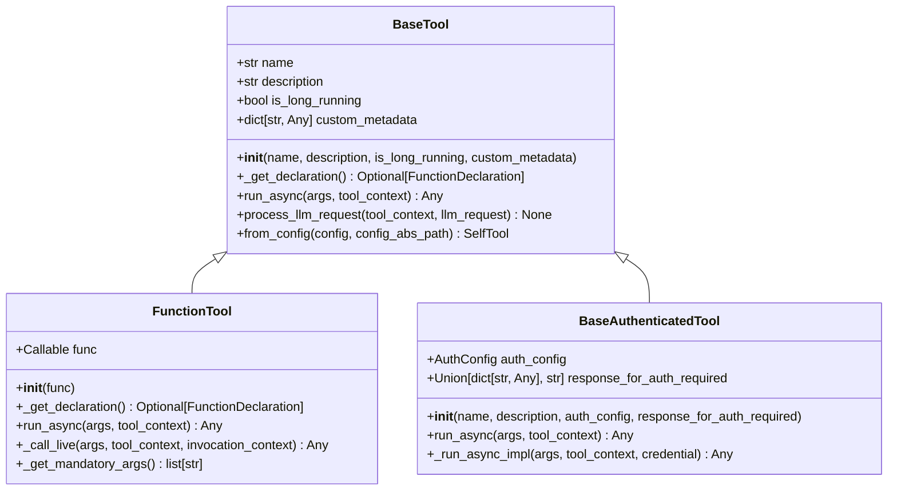
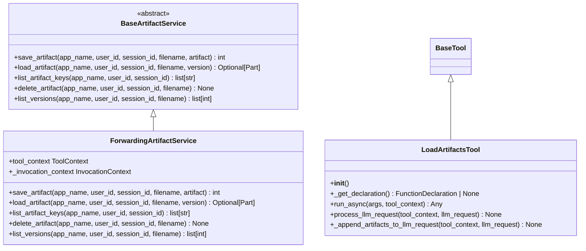

# Tools System

<cite>
**Referenced Files in This Document**   
- [base_tool.py](file://src/google/adk/tools/base_tool.py)
- [function_tool.py](file://src/google/adk/tools/function_tool.py)
- [google_search_tool.py](file://src/google/adk/tools/google_search_tool.py)
- [load_artifacts_tool.py](file://src/google/adk/tools/load_artifacts_tool.py)
- [load_memory_tool.py](file://src/google/adk/tools/load_memory_tool.py)
- [built_in_code_executor.py](file://src/google/adk/code_executors/built_in_code_executor.py)
- [apihub_toolset.py](file://src/google/adk/tools/apihub_tool/apihub_toolset.py)
- [mcp_toolset.py](file://src/google/adk/tools/mcp_tool/mcp_toolset.py)
- [openapi_toolset.py](file://src/google/adk/tools/openapi_tool/openapi_spec_parser/openapi_toolset.py)
- [toolbox_toolset.py](file://src/google/adk/tools/toolbox_toolset.py)
- [base_artifact_service.py](file://src/google/adk/artifacts/base_artifact_service.py)
- [base_authenticated_tool.py](file://src/google/adk/tools/base_authenticated_tool.py)
</cite>

## Table of Contents
1. [Introduction](#introduction)
2. [Core Components](#core-components)
3. [Built-in Tools](#built-in-tools)
4. [External Service Integration](#external-service-integration)
5. [Custom Tool Development](#custom-tool-development)
6. [Tool Composition and Chaining](#tool-composition-and-chaining)
7. [Security Considerations](#security-considerations)
8. [Conclusion](#conclusion)

## Introduction
The Tools System in the ADK framework provides an extensible ecosystem that enables agents to interact with external systems and perform specialized tasks through modular capabilities. Tools serve as the bridge between agents and external resources, allowing them to extend their functionality beyond basic language processing. This system supports various types of tools including built-in capabilities like Google Search and Code Execution, as well as integrations with external services through APIHub, MCP (Model Context Protocol), and OpenAPI specifications. The architecture is designed to be flexible, secure, and easy to extend, enabling developers to create custom tools with proper authentication, error handling, and parameter validation.

## Core Components

The foundation of the Tools System is built upon several key components that provide the infrastructure for tool creation, management, and execution. At the core is the `BaseTool` class, which serves as the abstract base class for all tools in the framework. This class defines essential properties such as name, description, and execution behavior, while providing hooks for processing LLM requests and running asynchronous operations. The `FunctionTool` class extends this foundation by wrapping user-defined Python functions, automatically extracting metadata from callable objects and handling parameter validation. For authenticated operations, the `BaseAuthenticatedTool` provides a secure foundation with built-in credential management and authorization workflows.

**Diagram sources**
- [base_tool.py](file://src/google/adk/tools/base_tool.py#L47-L213)
- [function_tool.py](file://src/google/adk/tools/function_tool.py#L31-L168)
- [base_authenticated_tool.py](file://src/google/adk/tools/base_authenticated_tool.py#L36-L108)

**Section sources**
- [base_tool.py](file://src/google/adk/tools/base_tool.py)
- [function_tool.py](file://src/google/adk/tools/function_tool.py)
- [base_authenticated_tool.py](file://src/google/adk/tools/base_authenticated_tool.py)

## Built-in Tools

The ADK framework includes several built-in tools that provide essential capabilities for agent functionality. These tools are seamlessly integrated into the system and can be used without additional configuration. The Google Search tool enables agents to retrieve up-to-date information from the web, while Code Execution allows for running code snippets in secure environments. Memory Management tools facilitate context preservation across interactions, and Artifact Management enables handling of file-based data.

### Google Search Tool
The Google Search tool is a built-in capability that allows Gemini 2 models to automatically retrieve search results from Google Search. This tool operates internally within the model and doesn't require local code execution. It's specifically designed to work with Gemini models, with different implementations for Gemini 1.x and 2.0+ models. The tool modifies the LLM request configuration to include the appropriate search retrieval mechanism based on the model version being used.

**Section sources**
- [google_search_tool.py](file://src/google/adk/tools/google_search_tool.py)

### Code Execution Tool
The Code Execution tool enables agents to run code in secure environments using the model's built-in code executor. Currently supporting Gemini 2.0+ models, this tool processes LLM requests by adding the code execution capability to the request configuration. The execution occurs within the model's secure environment, ensuring that code runs safely without exposing the host system to potential risks.

**Section sources**
- [built_in_code_executor.py](file://src/google/adk/code_executors/built_in_code_executor.py)

### Memory Management Tool
The Memory Management tool allows agents to store and retrieve contextual information across interactions. Built on the `FunctionTool` class, it provides a `load_memory` function that searches for relevant memory entries based on a query. The tool automatically informs the model about the availability of memory and provides instructions for when to use the memory retrieval capability.

**Section sources**
- [load_memory_tool.py](file://src/google/adk/tools/load_memory_tool.py)

### Artifact Management Tool
The Artifact Management tool enables agents to handle file-based data through a structured artifact service interface. The `LoadArtifactsTool` allows agents to load stored artifacts into the session, while the underlying `BaseArtifactService` defines the contract for artifact storage operations including saving, loading, listing, and deleting artifacts. This system supports versioning and provides a consistent interface for working with file-based data.

**Diagram sources**
- [base_artifact_service.py](file://src/google/adk/artifacts/base_artifact_service.py#L23-L124)
- [_forwarding_artifact_service.py](file://src/google/adk/tools/_forwarding_artifact_service.py#L29-L97)
- [load_artifacts_tool.py](file://src/google/adk/tools/load_artifacts_tool.py#L31-L114)

## External Service Integration

The ADK framework provides multiple mechanisms for integrating with external services, enabling agents to interact with a wide range of APIs and systems. These integration methods include APIHub for Google Cloud services, MCP (Model Context Protocol) for standardized tool communication, OpenAPI for REST API integration, and Toolbox for accessing pre-built tool collections.

### APIHub Integration
APIHub provides a seamless way to integrate Google Cloud services into agents by automatically generating tools from API Hub resources. The `APIHubToolset` class fetches OpenAPI specifications from API Hub and converts them into executable tools. This approach supports various authentication schemes and allows for filtering specific tools from larger API collections. The integration handles the entire process of specification retrieval, parsing, and tool generation, making it easy to incorporate Google Cloud services into agent workflows.

**Section sources**
- [apihub_toolset.py](file://src/google/adk/tools/apihub_tool/apihub_toolset.py)

### MCP (Model Context Protocol) Integration
MCP provides a standardized protocol for connecting agents with external tools and services. The `MCPToolset` manages connections to MCP servers and retrieves available tools, supporting various connection types including STDIO, SSE, and Streamable HTTP. This integration allows agents to access a wide range of external capabilities while maintaining a consistent interface. The toolset handles session management, error recovery, and resource cleanup, ensuring reliable operation.

**Section sources**
- [mcp_toolset.py](file://src/google/adk/tools/mcp_tool/mcp_toolset.py)

### OpenAPI Integration
The OpenAPI integration enables agents to work with REST APIs by converting OpenAPI specifications into executable tools. The `OpenAPIToolset` class can parse OpenAPI specifications from JSON or YAML format and generate `RestApiTool` instances for each operation. This approach supports both inline specification strings and external specification files, providing flexibility in how APIs are integrated. The system handles authentication configuration and tool filtering, making it easy to incorporate third-party APIs into agent workflows.

**Section sources**
- [openapi_toolset.py](file://src/google/adk/tools/openapi_tool/openapi_spec_parser/openapi_toolset.py)

### Toolbox Integration
The Toolbox integration provides access to pre-built collections of tools through the Toolbox SDK. The `ToolboxToolset` connects to a Toolbox server and loads specified toolsets or individual tools. This approach supports authentication token management and parameter binding, allowing for secure and customized tool usage. The integration makes it easy to leverage existing tool collections without having to implement them from scratch.

**Section sources**
- [toolbox_toolset.py](file://src/google/adk/tools/toolbox_toolset.py)

## Custom Tool Development

Creating custom tools in the ADK framework follows a structured approach that ensures consistency, security, and ease of integration. Developers can extend the base tool classes to create specialized capabilities tailored to specific use cases. The framework provides comprehensive support for authentication, error handling, and parameter validation, making it straightforward to build robust and secure tools.

### Tool Creation Process
To create a custom tool, developers should extend the appropriate base class (`BaseTool`, `FunctionTool`, or `BaseAuthenticatedTool`) and implement the required methods. The tool should define its name, description, and execution logic, with proper handling of input parameters and error conditions. For tools that require authentication, the `BaseAuthenticatedTool` provides a secure foundation with built-in credential management.

### Authentication Implementation
For tools requiring authentication, developers should use the `BaseAuthenticatedTool` class and configure the appropriate authentication scheme and credentials. The framework supports various authentication methods including OAuth2, service accounts, and custom credential exchangers. The authentication system handles credential retrieval, refresh, and error handling, ensuring secure access to protected resources.

### Error Handling and Validation
Custom tools should implement comprehensive error handling and parameter validation to ensure reliable operation. The framework provides utilities for validating function parameters and handling missing mandatory arguments. Tools should return meaningful error messages that help the agent understand and recover from failures, rather than exposing implementation details to the end user.

## Tool Composition and Chaining

The ADK framework supports sophisticated workflows through tool composition and chaining, allowing multiple tools to be combined in sequence or parallel to accomplish complex tasks. This capability enables agents to break down complex problems into smaller steps, using different tools for different aspects of the solution. The system handles the coordination between tools, managing data flow and error propagation across the workflow.

### Sequential Execution
Tools can be chained together in a sequential workflow where the output of one tool serves as the input to the next. This approach is useful for multi-step processes such as data retrieval, processing, and presentation. The framework ensures that each tool in the chain receives the appropriate context and parameters, with proper error handling if any step fails.

### Parallel Execution
For tasks that can be performed independently, tools can be executed in parallel to improve efficiency. The framework manages concurrent execution, aggregating results from multiple tools and handling any synchronization requirements. This approach is particularly effective for gathering information from multiple sources simultaneously.

### Conditional Workflows
The system supports conditional workflows where the choice of tools depends on intermediate results or user input. This enables dynamic behavior where the agent can adapt its approach based on the situation, using different tools for different scenarios. The framework provides mechanisms for handling user choices and branching logic within tool workflows.

## Security Considerations

Security is a critical aspect of the Tools System, particularly for operations involving code execution and external API calls. The framework implements multiple layers of protection to ensure safe operation while maintaining functionality.

### Code Execution Security
Code execution is performed in secure, isolated environments that prevent access to sensitive system resources. The built-in code executor for Gemini models runs code in a sandboxed environment with strict resource limits and monitoring. This approach minimizes the risk of malicious code execution while allowing legitimate code to run safely.

### API Call Security
External API calls are protected through comprehensive authentication and authorization mechanisms. The framework supports various authentication schemes including OAuth2, service accounts, and API keys, with secure credential storage and management. All API calls are logged and monitored for suspicious activity, with rate limiting and quota enforcement to prevent abuse.

### Data Protection
The system implements strict data protection measures for handling sensitive information. Artifacts and memory entries are stored securely with appropriate access controls, and data transmission is encrypted in transit. The framework follows the principle of least privilege, ensuring that tools only have access to the resources they need to perform their functions.

## Conclusion

The Tools System in the ADK framework provides a comprehensive and extensible ecosystem for building intelligent agents with specialized capabilities. By combining built-in tools, external service integrations, and custom tool development, developers can create powerful agents that can interact with a wide range of systems and perform complex tasks. The architecture emphasizes security, reliability, and ease of use, making it possible to build sophisticated agent workflows while maintaining control and safety. With support for tool composition, authentication, and error handling, the system provides a solid foundation for creating next-generation AI applications.