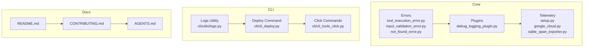
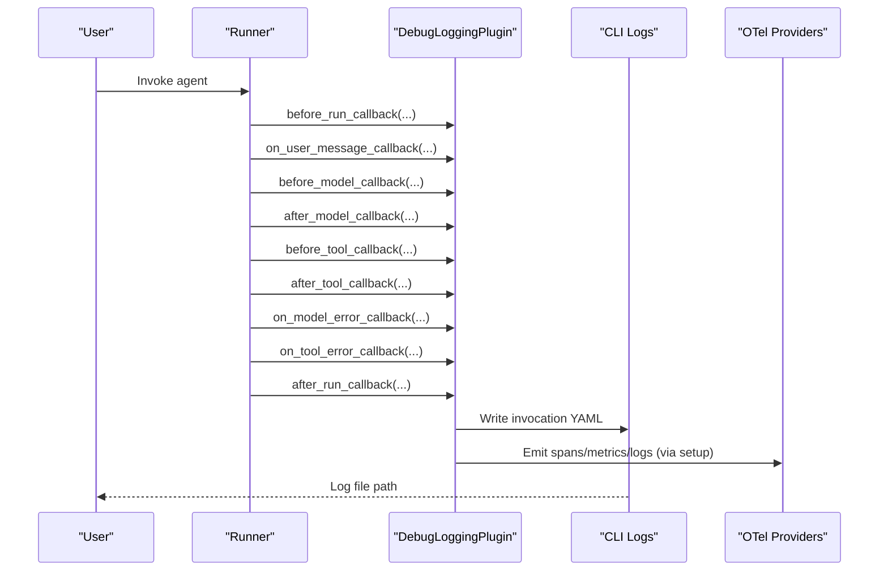
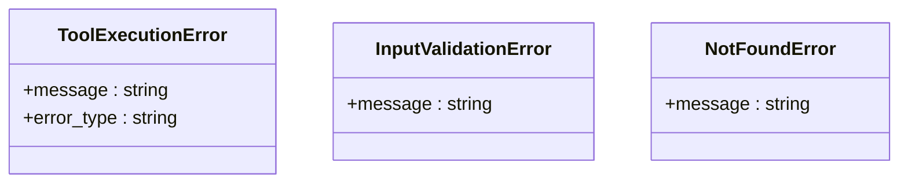
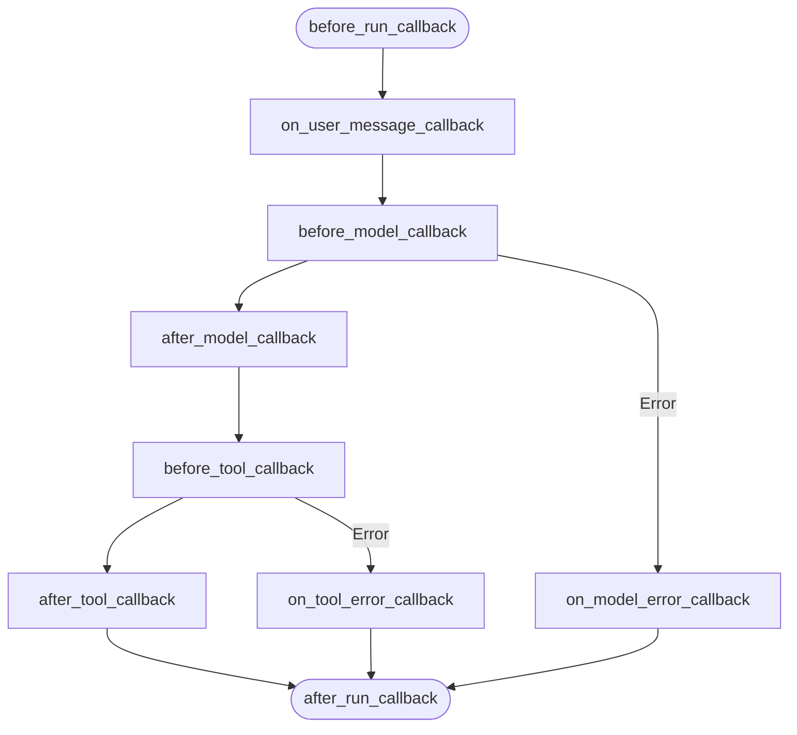
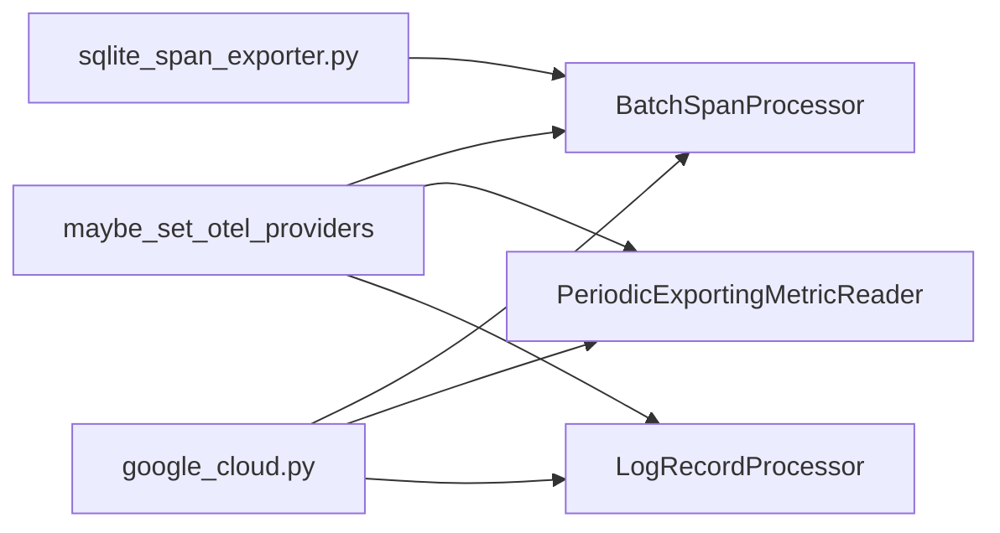
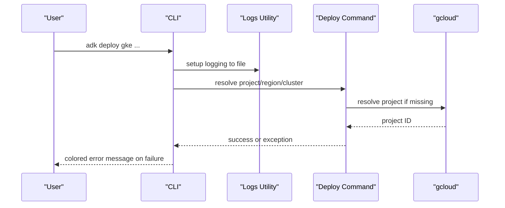
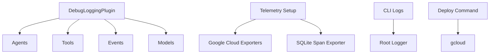

# Troubleshooting and FAQ

<cite>
**Referenced Files in This Document**
- [README.md](file://README.md)
- [CONTRIBUTING.md](file://CONTRIBUTING.md)
- [AGENTS.md](file://AGENTS.md)
- [src/google/adk/errors/tool_execution_error.py](file://src/google/adk/errors/tool_execution_error.py)
- [src/google/adk/errors/input_validation_error.py](file://src/google/adk/errors/input_validation_error.py)
- [src/google/adk/errors/not_found_error.py](file://src/google/adk/errors/not_found_error.py)
- [src/google/adk/plugins/debug_logging_plugin.py](file://src/google/adk/plugins/debug_logging_plugin.py)
- [src/google/adk/cli/utils/logs.py](file://src/google/adk/cli/utils/logs.py)
- [src/google/adk/cli/cli_deploy.py](file://src/google/adk/cli/cli_deploy.py)
- [src/google/adk/cli/cli_tools_click.py](file://src/google/adk/cli/cli_tools_click.py)
- [src/google/adk/telemetry/setup.py](file://src/google/adk/telemetry/setup.py)
- [src/google/adk/telemetry/google_cloud.py](file://src/google/adk/telemetry/google_cloud.py)
- [src/google/adk/telemetry/sqlite_span_exporter.py](file://src/google/adk/telemetry/sqlite_span_exporter.py)
- [tests/unittests/plugins/test_debug_logging_plugin.py](file://tests/unittests/plugins/test_debug_logging_plugin.py)
- [tests/unittests/cli/utils/test_cli_deploy.py](file://tests/unittests/cli/utils/test_cli_deploy.py)
- [contributing/samples/cache_analysis/agent.py](file://contributing/samples/cache_analysis/agent.py)
</cite>

## Table of Contents
1. [Introduction](#introduction)
2. [Project Structure](#project-structure)
3. [Core Components](#core-components)
4. [Architecture Overview](#architecture-overview)
5. [Detailed Component Analysis](#detailed-component-analysis)
6. [Dependency Analysis](#dependency-analysis)
7. [Performance Considerations](#performance-considerations)
8. [Troubleshooting Guide](#troubleshooting-guide)
9. [FAQ](#faq)
10. [Conclusion](#conclusion)
11. [Appendices](#appendices)

## Introduction
This document provides a comprehensive troubleshooting and FAQ guide for the Agent Development Kit (ADK). It covers common error types, error handling patterns, debugging techniques, diagnostics, and workflows for installation, configuration, runtime, and deployment issues. It also includes guidance on logging, telemetry, performance tuning, memory, and scalability, along with escalation and community resources.

## Project Structure
ADK is organized around modular components:
- Agents and orchestrators
- Tools and toolsets
- Sessions and memory
- CLI and deployment utilities
- Plugins for logging and analytics
- Telemetry and observability
- Error types and validation helpers

**Diagram sources**
- [src/google/adk/errors/tool_execution_error.py](file://src/google/adk/errors/tool_execution_error.py#L34-L54)
- [src/google/adk/errors/input_validation_error.py](file://src/google/adk/errors/input_validation_error.py#L18-L29)
- [src/google/adk/errors/not_found_error.py](file://src/google/adk/errors/not_found_error.py#L18-L29)
- [src/google/adk/plugins/debug_logging_plugin.py](file://src/google/adk/plugins/debug_logging_plugin.py#L67-L573)
- [src/google/adk/telemetry/setup.py](file://src/google/adk/telemetry/setup.py#L48-L67)
- [src/google/adk/telemetry/google_cloud.py](file://src/google/adk/telemetry/google_cloud.py#L70-L113)
- [src/google/adk/telemetry/sqlite_span_exporter.py](file://src/google/adk/telemetry/sqlite_span_exporter.py#L1-L40)
- [src/google/adk/cli/utils/logs.py](file://src/google/adk/cli/utils/logs.py#L83-L105)
- [src/google/adk/cli/cli_deploy.py](file://src/google/adk/cli/cli_deploy.py#L1182-L1245)
- [src/google/adk/cli/cli_tools_click.py](file://src/google/adk/cli/cli_tools_click.py#L1996-L2046)
- [README.md](file://README.md#L1-L180)
- [CONTRIBUTING.md](file://CONTRIBUTING.md#L1-L256)
- [AGENTS.md](file://AGENTS.md#L373-L597)

**Section sources**
- [README.md](file://README.md#L1-L180)
- [CONTRIBUTING.md](file://CONTRIBUTING.md#L132-L256)
- [AGENTS.md](file://AGENTS.md#L373-L597)

## Core Components
- Error types: Structured exceptions for tool execution, input validation, and not-found scenarios.
- Debug logging plugin: Captures invocation lifecycle, LLM requests/responses, tool calls/results, and session snapshots.
- Telemetry: OTel setup, Google Cloud exporters, and SQLite span exporter for local testing.
- CLI logging: Centralized logging to file for CLI operations.
- Deploy utilities: GKE deployment command and helper functions with robust error reporting.

Key responsibilities:
- Provide actionable diagnostics for runtime issues
- Enable structured logging and tracing
- Support reproducible troubleshooting via captured invocations
- Offer clear feedback for CLI and deployment failures

**Section sources**
- [src/google/adk/errors/tool_execution_error.py](file://src/google/adk/errors/tool_execution_error.py#L20-L54)
- [src/google/adk/errors/input_validation_error.py](file://src/google/adk/errors/input_validation_error.py#L18-L29)
- [src/google/adk/errors/not_found_error.py](file://src/google/adk/errors/not_found_error.py#L18-L29)
- [src/google/adk/plugins/debug_logging_plugin.py](file://src/google/adk/plugins/debug_logging_plugin.py#L67-L120)
- [src/google/adk/telemetry/setup.py](file://src/google/adk/telemetry/setup.py#L48-L67)
- [src/google/adk/telemetry/google_cloud.py](file://src/google/adk/telemetry/google_cloud.py#L70-L113)
- [src/google/adk/telemetry/sqlite_span_exporter.py](file://src/google/adk/telemetry/sqlite_span_exporter.py#L1-L40)
- [src/google/adk/cli/utils/logs.py](file://src/google/adk/cli/utils/logs.py#L83-L105)
- [src/google/adk/cli/cli_deploy.py](file://src/google/adk/cli/cli_deploy.py#L1182-L1245)

## Architecture Overview
The troubleshooting architecture centers on:
- Diagnostic capture (debug logging plugin)
- Logging pipeline (CLI logs)
- Observability (OTel setup and exporters)
- Deployment feedback (CLI commands)

**Diagram sources**
- [src/google/adk/plugins/debug_logging_plugin.py](file://src/google/adk/plugins/debug_logging_plugin.py#L236-L372)
- [src/google/adk/cli/utils/logs.py](file://src/google/adk/cli/utils/logs.py#L83-L105)
- [src/google/adk/telemetry/setup.py](file://src/google/adk/telemetry/setup.py#L48-L67)

## Detailed Component Analysis

### Error Types and Handling Patterns
- ToolExecutionError: Encapsulates tool execution failures with semantic error types suitable for OTel spans.
- InputValidationError: Signals invalid user input.
- NotFoundError: Signals missing entities.

Best practices:
- Catch and convert to domain-specific exceptions
- Attach error types for observability
- Preserve context for debugging

**Diagram sources**
- [src/google/adk/errors/tool_execution_error.py](file://src/google/adk/errors/tool_execution_error.py#L20-L54)
- [src/google/adk/errors/input_validation_error.py](file://src/google/adk/errors/input_validation_error.py#L18-L29)
- [src/google/adk/errors/not_found_error.py](file://src/google/adk/errors/not_found_error.py#L18-L29)

**Section sources**
- [src/google/adk/errors/tool_execution_error.py](file://src/google/adk/errors/tool_execution_error.py#L20-L54)
- [src/google/adk/errors/input_validation_error.py](file://src/google/adk/errors/input_validation_error.py#L18-L29)
- [src/google/adk/errors/not_found_error.py](file://src/google/adk/errors/not_found_error.py#L18-L29)

### Debug Logging Plugin
- Captures invocation lifecycle, LLM requests/responses, tool calls/results, events, and session snapshots.
- Emits YAML documents per invocation for easy sharing and analysis.
- Provides callbacks for model/tool errors to record error types and messages.

**Diagram sources**
- [src/google/adk/plugins/debug_logging_plugin.py](file://src/google/adk/plugins/debug_logging_plugin.py#L236-L372)
- [src/google/adk/plugins/debug_logging_plugin.py](file://src/google/adk/plugins/debug_logging_plugin.py#L495-L572)

**Section sources**
- [src/google/adk/plugins/debug_logging_plugin.py](file://src/google/adk/plugins/debug_logging_plugin.py#L67-L120)
- [src/google/adk/plugins/debug_logging_plugin.py](file://src/google/adk/plugins/debug_logging_plugin.py#L236-L372)
- [src/google/adk/plugins/debug_logging_plugin.py](file://src/google/adk/plugins/debug_logging_plugin.py#L495-L572)
- [tests/unittests/plugins/test_debug_logging_plugin.py](file://tests/unittests/plugins/test_debug_logging_plugin.py#L310-L346)

### Telemetry and Observability
- OTel setup: Conditionally registers providers/exporters/log processors based on environment variables and configuration.
- Google Cloud exporters: Spans, metrics, and logs export to Google Cloud.
- SQLite span exporter: Local testing and offline inspection.

**Diagram sources**
- [src/google/adk/telemetry/setup.py](file://src/google/adk/telemetry/setup.py#L48-L67)
- [src/google/adk/telemetry/google_cloud.py](file://src/google/adk/telemetry/google_cloud.py#L70-L113)
- [src/google/adk/telemetry/sqlite_span_exporter.py](file://src/google/adk/telemetry/sqlite_span_exporter.py#L1-L40)

**Section sources**
- [src/google/adk/telemetry/setup.py](file://src/google/adk/telemetry/setup.py#L48-L67)
- [src/google/adk/telemetry/google_cloud.py](file://src/google/adk/telemetry/google_cloud.py#L70-L113)
- [src/google/adk/telemetry/sqlite_span_exporter.py](file://src/google/adk/telemetry/sqlite_span_exporter.py#L1-L40)

### CLI Logging and Deployment
- CLI logs: Redirects root logger to a file with timestamped name and symlink to latest.
- Deploy command: GKE deployment with project/region/cluster resolution and Dockerfile generation; wraps exceptions and prints red error messages.

**Diagram sources**
- [src/google/adk/cli/utils/logs.py](file://src/google/adk/cli/utils/logs.py#L83-L105)
- [src/google/adk/cli/cli_deploy.py](file://src/google/adk/cli/cli_deploy.py#L1182-L1245)
- [src/google/adk/cli/cli_tools_click.py](file://src/google/adk/cli/cli_tools_click.py#L1996-L2046)
- [tests/unittests/cli/utils/test_cli_deploy.py](file://tests/unittests/cli/utils/test_cli_deploy.py#L98-L126)

**Section sources**
- [src/google/adk/cli/utils/logs.py](file://src/google/adk/cli/utils/logs.py#L83-L105)
- [src/google/adk/cli/cli_deploy.py](file://src/google/adk/cli/cli_deploy.py#L1182-L1245)
- [src/google/adk/cli/cli_tools_click.py](file://src/google/adk/cli/cli_tools_click.py#L1996-L2046)
- [tests/unittests/cli/utils/test_cli_deploy.py](file://tests/unittests/cli/utils/test_cli_deploy.py#L98-L126)

## Dependency Analysis
- Debug logging plugin depends on agents, tools, events, and models for capturing rich context.
- Telemetry setup composes OTel components and integrates with Google Cloud exporters.
- CLI logging depends on standard logging and click for user feedback.
- Deploy utilities depend on environment resolution and subprocess execution.

**Diagram sources**
- [src/google/adk/plugins/debug_logging_plugin.py](file://src/google/adk/plugins/debug_logging_plugin.py#L31-L37)
- [src/google/adk/telemetry/setup.py](file://src/google/adk/telemetry/setup.py#L48-L67)
- [src/google/adk/telemetry/google_cloud.py](file://src/google/adk/telemetry/google_cloud.py#L70-L113)
- [src/google/adk/telemetry/sqlite_span_exporter.py](file://src/google/adk/telemetry/sqlite_span_exporter.py#L1-L40)
- [src/google/adk/cli/utils/logs.py](file://src/google/adk/cli/utils/logs.py#L83-L105)
- [src/google/adk/cli/cli_deploy.py](file://src/google/adk/cli/cli_deploy.py#L1182-L1245)

**Section sources**
- [src/google/adk/plugins/debug_logging_plugin.py](file://src/google/adk/plugins/debug_logging_plugin.py#L31-L37)
- [src/google/adk/telemetry/setup.py](file://src/google/adk/telemetry/setup.py#L48-L67)
- [src/google/adk/telemetry/google_cloud.py](file://src/google/adk/telemetry/google_cloud.py#L70-L113)
- [src/google/adk/telemetry/sqlite_span_exporter.py](file://src/google/adk/telemetry/sqlite_span_exporter.py#L1-L40)
- [src/google/adk/cli/utils/logs.py](file://src/google/adk/cli/utils/logs.py#L83-L105)
- [src/google/adk/cli/cli_deploy.py](file://src/google/adk/cli/cli_deploy.py#L1182-L1245)

## Performance Considerations
- Use the cache analysis sample to benchmark and optimize system performance, including latency, throughput, CPU, memory, disk, network, scalability, and stability.
- Apply the recommendations from the sample to adjust infrastructure, architecture, code, and configuration.
- Monitor performance using telemetry and logs to detect regressions and bottlenecks.

**Section sources**
- [contributing/samples/cache_analysis/agent.py](file://contributing/samples/cache_analysis/agent.py#L268-L799)

## Troubleshooting Guide

### Installation Issues
Symptoms:
- Pip install fails or installs incompatible versions
- Virtual environment activation issues
- Missing dependencies

Checklist:
- Confirm Python version meets requirements
- Verify virtual environment is activated
- Reinstall using the documented stable or development installation steps
- Ensure network access for package installation

Resolution:
- Use the stable release installation path for production
- Use the development installation path for latest features/fixes
- Rebuild environment if dependency conflicts occur

**Section sources**
- [README.md](file://README.md#L62-L84)
- [CONTRIBUTING.md](file://CONTRIBUTING.md#L132-L202)

### Configuration Problems
Symptoms:
- Invalid agent configuration
- Missing environment variables
- Tool configuration errors

Checklist:
- Validate agent definition files and tool configurations
- Confirm environment variables are present and correct
- Review configuration schemas and defaults

Resolution:
- Use configuration validation patterns and error types
- Log configuration state for debugging
- Align configuration with supported schemas

**Section sources**
- [src/google/adk/errors/input_validation_error.py](file://src/google/adk/errors/input_validation_error.py#L18-L29)
- [src/google/adk/plugins/debug_logging_plugin.py](file://src/google/adk/plugins/debug_logging_plugin.py#L335-L372)

### Runtime Errors
Symptoms:
- Tool execution failures
- LLM model errors
- Unexpected crashes

Checklist:
- Capture invocation with the debug logging plugin
- Inspect LLM request/response logs
- Record tool call arguments and results
- Capture error types and messages

Resolution:
- Use ToolExecutionError with semantic error types
- Log model/tool errors via plugin callbacks
- Reproduce with minimal configuration and share captured logs

**Section sources**
- [src/google/adk/errors/tool_execution_error.py](file://src/google/adk/errors/tool_execution_error.py#L20-L54)
- [src/google/adk/plugins/debug_logging_plugin.py](file://src/google/adk/plugins/debug_logging_plugin.py#L495-L572)
- [tests/unittests/plugins/test_debug_logging_plugin.py](file://tests/unittests/plugins/test_debug_logging_plugin.py#L310-L346)

### Deployment Failures (GKE)
Symptoms:
- Project/region/cluster resolution failures
- Dockerfile generation issues
- Container build or push failures

Checklist:
- Verify gcloud configuration and permissions
- Confirm project/region/cluster values
- Review generated Dockerfile and build logs
- Check CLI error messages and log file location

Resolution:
- Use explicit project/region/cluster flags
- Ensure gcloud is installed and configured
- Inspect CLI log file for detailed error context
- Retry with corrected parameters

**Section sources**
- [src/google/adk/cli/cli_deploy.py](file://src/google/adk/cli/cli_deploy.py#L1182-L1245)
- [src/google/adk/cli/cli_tools_click.py](file://src/google/adk/cli/cli_tools_click.py#L1996-L2046)
- [src/google/adk/cli/utils/logs.py](file://src/google/adk/cli/utils/logs.py#L83-L105)
- [tests/unittests/cli/utils/test_cli_deploy.py](file://tests/unittests/cli/utils/test_cli_deploy.py#L98-L126)

### Logging and Diagnostics
- Enable CLI logging to file for reproducible runs
- Use DebugLoggingPlugin to capture end-to-end invocation data
- Configure OTel providers for traces/metrics/logs
- Export spans to Google Cloud or SQLite for local analysis

**Section sources**
- [src/google/adk/cli/utils/logs.py](file://src/google/adk/cli/utils/logs.py#L83-L105)
- [src/google/adk/plugins/debug_logging_plugin.py](file://src/google/adk/plugins/debug_logging_plugin.py#L67-L120)
- [src/google/adk/telemetry/setup.py](file://src/google/adk/telemetry/setup.py#L48-L67)
- [src/google/adk/telemetry/google_cloud.py](file://src/google/adk/telemetry/google_cloud.py#L70-L113)
- [src/google/adk/telemetry/sqlite_span_exporter.py](file://src/google/adk/telemetry/sqlite_span_exporter.py#L1-L40)

### Performance, Memory, and Scalability
- Use the cache analysis sample to benchmark and optimize performance
- Monitor resource utilization and adjust infrastructure accordingly
- Scale horizontally and tune configurations based on recommendations

**Section sources**
- [contributing/samples/cache_analysis/agent.py](file://contributing/samples/cache_analysis/agent.py#L268-L799)

### Escalation and Community Support
- Report issues with logs and reproduction steps
- Engage with community channels for support
- Follow contribution guidelines for bug reports and feature requests

**Section sources**
- [README.md](file://README.md#L153-L176)
- [CONTRIBUTING.md](file://CONTRIBUTING.md#L50-L78)

## FAQ

Q1: How do I capture a full invocation for debugging?
- Use the DebugLoggingPlugin to record user messages, LLM requests/responses, tool calls/results, events, and session snapshots to a YAML file.

Q2: How do I enable CLI logging for deployments?
- CLI automatically sets up logging to a timestamped file; confirm the path printed by the CLI and inspect the file for errors.

Q3: What error types should I use for tool failures?
- Use ToolExecutionError with a semantic error type to annotate OTel spans and improve observability.

Q4: How do I troubleshoot deployment failures?
- Verify project/region/cluster resolution, inspect the generated Dockerfile, and check the CLI log file for detailed error context.

Q5: How can I monitor performance and memory usage?
- Use the cache analysis sample to benchmark and optimize performance; monitor resource utilization and adjust infrastructure and configurations accordingly.

Q6: Where can I get help or report issues?
- Use community channels and follow contribution guidelines to report issues with logs and reproduction steps.

**Section sources**
- [src/google/adk/plugins/debug_logging_plugin.py](file://src/google/adk/plugins/debug_logging_plugin.py#L67-L120)
- [src/google/adk/cli/utils/logs.py](file://src/google/adk/cli/utils/logs.py#L83-L105)
- [src/google/adk/errors/tool_execution_error.py](file://src/google/adk/errors/tool_execution_error.py#L20-L54)
- [src/google/adk/cli/cli_deploy.py](file://src/google/adk/cli/cli_deploy.py#L1182-L1245)
- [contributing/samples/cache_analysis/agent.py](file://contributing/samples/cache_analysis/agent.py#L268-L799)
- [README.md](file://README.md#L153-L176)
- [CONTRIBUTING.md](file://CONTRIBUTING.md#L50-L78)

## Conclusion
This guide consolidates troubleshooting workflows, error handling patterns, and diagnostic strategies across ADK’s components. By leveraging the debug logging plugin, CLI logging, and telemetry, you can quickly isolate and resolve issues across installation, configuration, runtime, and deployment. For performance and scalability, use the provided benchmarking guidance and monitor with logs and traces. When needed, escalate via community channels with reproducible logs and clear problem statements.

## Appendices

### Quick Reference: Common Commands and Paths
- Stable install: [README.md](file://README.md#L62-L84)
- Development install: [README.md](file://README.md#L62-L84)
- Unit tests: [CONTRIBUTING.md](file://CONTRIBUTING.md#L177-L202)
- CLI logs: [src/google/adk/cli/utils/logs.py](file://src/google/adk/cli/utils/logs.py#L83-L105)
- Debug logging plugin: [src/google/adk/plugins/debug_logging_plugin.py](file://src/google/adk/plugins/debug_logging_plugin.py#L67-L120)
- Telemetry setup: [src/google/adk/telemetry/setup.py](file://src/google/adk/telemetry/setup.py#L48-L67)
- GKE deploy: [src/google/adk/cli/cli_deploy.py](file://src/google/adk/cli/cli_deploy.py#L1182-L1245)