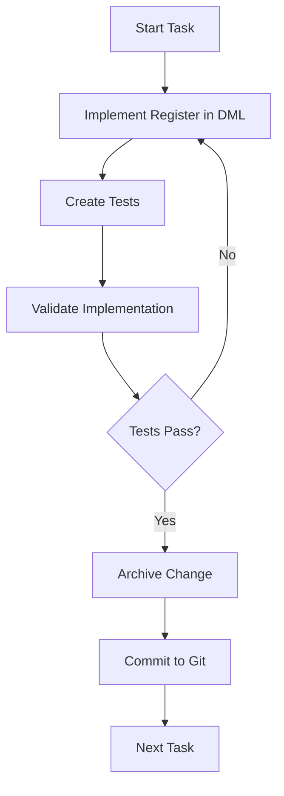

# OpenSpec DDM Orchestrator - Git & Archiving Features

## Overview

The OpenSpec DDM Orchestrator now includes **automatic Git integration** and **OpenSpec archiving** to provide complete version control and clean workspace management for your DDM projects.

## Key Features Added

### 1. Git Repository Management

#### Automatic Initialization
When you run the orchestrator, it automatically:
- Checks if `.git/` directory exists
- Initializes Git repository if missing
- Creates a comprehensive `.gitignore` file
- Makes an initial commit with all project files

**Generated .gitignore includes:**
```gitignore
# Build artifacts
*.o
*.so
*.pyc
__pycache__/
.venv/
*.egg-info/

# IDE
.vscode/
.idea/

# Simics specific
linux64/
*.d

# Temporary files
*.log
*.tmp
```

#### Automatic Commits
After each task completion:
- All changes are staged (`git add .`)
- Descriptive commit message is generated
- Commit includes change ID and task title
- Clean, traceable Git history

**Example commit message:**
```
✅ Completed: implement watchdog load

Change ID: implement-watchdog-load
Task completed and archived by OpenSpec orchestrator.
```

### 2. OpenSpec Archiving

#### What is Archiving?
OpenSpec archiving moves completed change proposals from active to archived state:
- Proposal moves from `openspec/changes/<id>/` to `openspec/changes/archive/<id>/`
- OpenSpec updates project specifications
- Change marked as deployed/completed
- Clean separation between active and completed work

#### When to Archive
Archive a change when:
1. Implementation is complete
2. Tests are passing
3. Code has been reviewed
4. Change is ready to be marked as "done"

#### How to Archive
```bash
openspec archive <change-id> --message "Completed: description"
```

The orchestrator does this automatically in the workflow scripts.

### 3. Integrated Workflow

The complete workflow for each task:



**In practice:**
1. AI agent implements the register
2. AI agent creates tests
3. You validate it works
4. Run: `openspec archive <change-id>`
5. Run: `git commit` (or use automated script)
6. Move to next register

## Usage Examples

### Manual Workflow

```bash
# 1. Generate proposals (includes Git init)
python3 run_openspec_from_ddm.py --project . --dml ... --spec ...

# 2. Implement first register (using OpenSpec or manually)
# ... implementation happens ...

# 3. Archive the change
source ~/wp5/ai_agents/adk-openspec/OpenSpec/python_port/.venv/bin/activate
openspec archive implement-watchdog-load --message "Completed WDOGLOAD register"

# 4. Commit to Git
git add .
git commit -m "✅ Completed: implement watchdog load

Change ID: implement-watchdog-load
Implemented WDOGLOAD register with read/write logic, side effects, and tests."

# 5. Check progress
git log --oneline
ls openspec/changes/         # Active proposals
ls openspec/changes/archive/ # Completed proposals

# 6. Repeat for next register
```

### Automated Workflow (Interactive Script)

```bash
# Run the interactive helper
./run_openspec_interactive.sh

# Git is initialized automatically
# When you complete a task, the script asks:
"Was the task completed successfully? (y/n): y"

# Then it automatically:
# - Archives the change
# - Commits to Git
# - Shows you the commit
```

### Batch Workflow (Orchestration Script)

```bash
# The generated run_all_openspec_tasks.sh includes
# archive_and_commit() function that does both

# Edit the script to uncomment the execution lines
vim run_all_openspec_tasks.sh

# Run it
bash run_all_openspec_tasks.sh

# Each task will be:
# - Implemented by AI
# - Archived automatically  
# - Committed to Git
```

## Benefits

### For Individual Developers

1. **Version Control**: Every change is tracked in Git
2. **Easy Rollback**: Can revert specific register implementations
3. **Clear History**: See exactly what changed for each register
4. **No Setup**: Git initialized automatically
5. **Clean Workspace**: Completed proposals archived away

### For Teams

1. **Collaboration**: Team members see progression clearly
2. **Code Review**: Each register is a separate commit
3. **Audit Trail**: Full history of who did what when
4. **Easy Handoff**: New developer can follow Git history
5. **Traceability**: Link implementations to proposals

### For Project Management

1. **Progress Tracking**: Count commits to measure progress
2. **Time Tracking**: Git timestamps show when each task completed
3. **Quality Control**: Archived proposals show what was reviewed
4. **Documentation**: Git log serves as project journal
5. **Compliance**: Full audit trail for certifications

## Git Commands Reference

### View Progress

```bash
# See commit history
git log --oneline

# See detailed history
git log --stat

# See what changed in last commit
git show HEAD

# See commit graph
git log --graph --oneline --all

# See commits for specific file
git log --follow modules/demo_watchdog/demo_watchdog.dml
```

### Compare Implementations

```bash
# Compare current vs. previous
git diff HEAD~1 HEAD

# Compare specific commits
git diff a1b2c3d d4e5f6g

# See what changed in a specific commit
git show a1b2c3d

# See only modified files
git diff --name-only HEAD~3 HEAD
```

### Work with Branches

```bash
# Create experimental branch
git checkout -b experiment-new-feature

# Return to main
git checkout main

# Merge experiment if successful
git merge experiment-new-feature

# Delete experiment if not needed
git branch -d experiment-new-feature
```

### Rollback Changes

```bash
# Undo last commit but keep changes
git reset HEAD~1

# Undo last commit and discard changes
git reset --hard HEAD~1

# Revert a specific commit (safe for shared repos)
git revert a1b2c3d

# Create new branch from specific commit
git checkout -b restore-from-here a1b2c3d
```

## OpenSpec Archive Commands

### Basic Archiving

```bash
# Archive a change
openspec archive <change-id> --message "Completed description"

# Archive with additional notes
openspec archive implement-watchdog-load \\
    --message "Completed WDOGLOAD with all side effects" \\
    --notes "Tested on hardware simulator"
```

### View Archived Changes

```bash
# List archived changes
ls openspec/changes/archive/

# View archived proposal
cat openspec/changes/archive/implement-watchdog-load/proposal.md

# Search archived changes
grep -r "interrupt" openspec/changes/archive/
```

### Unarchive (If Needed)

```bash
# If you need to reopen a change
openspec unarchive <change-id>

# Make changes
# Then re-archive when done
openspec archive <change-id> --message "Updated implementation"
```

## Troubleshooting

### Issue: Git not initialized

**Symptom**: No `.git/` directory

**Solution**: Run the orchestrator script again, it will initialize Git:
```bash
python3 run_openspec_from_ddm.py --project . --dml ... --spec ...
```

### Issue: Archive command not found

**Symptom**: `openspec: command not found`

**Solution**: Activate the OpenSpec virtual environment:
```bash
source ~/wp5/ai_agents/adk-openspec/OpenSpec/python_port/.venv/bin/activate
```

### Issue: Nothing to commit

**Symptom**: `git commit` says "nothing to commit"

**Solution**: Check if changes were already committed or if files are in .gitignore:
```bash
git status
git diff
cat .gitignore
```

### Issue: Merge conflicts

**Symptom**: Git shows merge conflicts when working in team

**Solution**: Resolve conflicts manually:
```bash
# Edit conflicting files
vim modules/demo_watchdog/demo_watchdog.dml

# Mark as resolved
git add modules/demo_watchdog/demo_watchdog.dml

# Complete the commit
git commit
```

## Best Practices

### Commit Messages

✅ **Good commit messages:**
```
✅ Completed: implement watchdog control

Change ID: implement-watchdog-control
Implemented WDOGCONTROL register with:
- Step value configuration (1-16)
- Reset enable (RESEN) bit
- Interrupt enable (INTEN) bit
- Counter reload on enable
```

❌ **Poor commit messages:**
```
updated code
fixed stuff
WIP
```

### Archiving Strategy

1. **Archive Only When Complete**: Don't archive partial implementations
2. **Add Meaningful Messages**: Explain what was accomplished
3. **Keep Related Changes Together**: Archive implementation and tests together
4. **Review Before Archive**: Make sure tests pass before archiving

### Git Workflow

1. **Commit Often**: One commit per register/feature
2. **Write Descriptive Messages**: Include change ID and details
3. **Review Before Commit**: Use `git diff` to verify changes
4. **Keep History Clean**: Don't commit temporary files
5. **Use Branches for Experiments**: Create branches for risky changes

## Integration with CI/CD

### GitHub Actions Example

```yaml
name: Validate DDM Implementation

on: [push]

jobs:
  test:
    runs-on: ubuntu-latest
    steps:
      - uses: actions/checkout@v2
      
      - name: Check OpenSpec validation
        run: |
          source ~/openspec/.venv/bin/activate
          openspec validate --all
      
      - name: Run tests
        run: |
          make test
      
      - name: Build device model
        run: |
          make
```

### GitLab CI Example

```yaml
stages:
  - validate
  - test
  - build

validate:
  stage: validate
  script:
    - source ~/openspec/.venv/bin/activate
    - openspec validate --all

test:
  stage: test
  script:
    - cd modules/demo_watchdog/test
    - python3 -m pytest

build:
  stage: build
  script:
    - make
```

## Summary

The Git and OpenSpec archiving features provide:

✅ **Automatic Setup**: Git initialized on first run  
✅ **Clean History**: One commit per task  
✅ **Traceability**: Every change is tracked  
✅ **Clean Workspace**: Active vs. archived proposals  
✅ **Team Collaboration**: Easy to review and merge  
✅ **Quality Control**: Archive only when tests pass  
✅ **Documentation**: Git log as project journal  

**Start using it now:**
```bash
cd /nfs/site/disks/ssm_yongzhuo_001/ai_agents/tests/adk-mcp-rag/q3_openspec/demo_wdog_proj
./run_openspec_interactive.sh
```

Git and archiving happen automatically! 🎉
